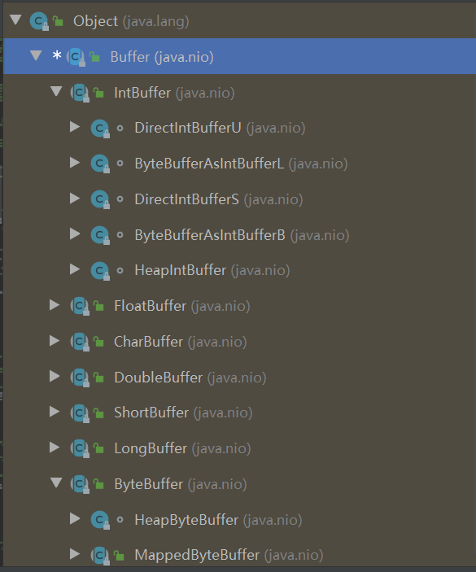

# Netty学习笔记

## 1、Netty是什么

   1)、Netty是由JBOSS提供的一个java开源框架，现为Github上的独立项目名

   2)、Netty是一个异步的，基于事件驱动的网络应用框架，用以快速开发高性能、高可靠性的网络IO程序

   3)、Netty主要针对在TCP协议下，面向Clients端的高并发应用，或者Peer-to-Peer场景下的大量数据持续传输的应用。

   4)、Netty本质是一个NIO框架，适用于服务器通讯相关的多种应用场景。

   5)、要透彻理解Netty，首先要学习NIO, 才能读懂源码

 Netty框架是在这个一层一层的底层演变出来的。


### 1.2、Netty的应用场景

 1)、互联网行业：在分布式系统中，各个节点之间需要远程服务调用，高性能的RPC框架必不可少,Netty作为异步高性能的通信框架，往往作为集成通信组件被这些RPC框架使用。

2)、典型的应用有：阿里分布式框架Dubbo的RPC框架使用Dubbo协议进行节点间的通信，Dubbo协议默认使用Netty作为基础通信组件，用于实现进程节点之间的内部通信。

3)、游戏行业：

​       a.无论是手游服务端还是大型的网络游戏，java语言得到了越来越广泛的应用

​       b.netty作为高性能的基础通信组件，提供了TCP/UDP和HTTP协议栈，方便定制和开发私有协议栈，账号登录服务器。

​      c.地图服务器之间可以方便的通过Netty进行高性能的通信。

4)、大数据领域：

​      a.经典的Hadoop的高性能和序列化组件(AVRO 实现数据文件共享)的RPC框架，默认采用Netty进行跨界点通信

​      b.它的Netty Service基于Netty框架进行二次封装实现


## 2、java BIO模型

###   2.1 I/O模型

1)、I/O模型简单的理解：就是用什么样的通道进行数据的发送和接收，很大程度上决定了程序通信的性能

2)、JAVA共支持3中网络编程模型I/O模型：BIO、NIO、AIO

3)、Java BIO：同步并阻塞(传统阻塞型)，服务器实现模式为一个连接一个线程，即客户端有连接请求时服务器端就需要启动一个线程进行处理，如果这个连接不做任何事情会造成不必要的线程开销 【简单示意图】


下图展示的是一个简单的BIO模型，当一个请求过来服务器端就会产生一个线程，这个线程就会和服务端进行通讯。底层有socket，

通过这个socket进行读或者写。


这种模型的缺点：就是当客户端非常多情况下，就会创建很多线程，而线程的创建是有开销，并且服务器端的压力非常大。这些连接也并不是时时刻刻的在进行读写，这就造成了不必要的开销，同时在读的时候会造成阻塞。


4) Java NIO: 同步非阻塞，服务器实现模式为一个线程处理多个请求(连接)，即客户端发送的连接请求都会注册到多路复用器上，多路复用器轮询到连接有I/O请求就进行处理。【简单示意图如下】


服务器启动一个线程，这个线程会去维护一个selector(选择器)，这个selector去维护多个通道。通过去轮询监听事件的发生。


5)、Java AIO(NIO.2): 异步非阻塞，AIO引入异步通道的概念，采用了Proactor模式，简化了程序编写，有效的请求才启动线程，它的特点是由操作系统完成后才通知服务端程序启动线程去处理，一般适用于连接数较多且较长的应用

### 2.2、BIO、NIO、AIO适用场景分析

 1)、BIO方式适用于连接数目比较小且固定的架构，这种方式对服务器资源要求比较高，并发局限 于 应用中，JDK1.4以前的唯一选择，但是程序简单易理解。

2)、NIO方式适用于连接数目多且连接比较短(轻操作)的架构，比如聊天服务器，弹幕系统，服务器间通讯等。编程比较复杂，JDK1.4开始支持。

3)、AIO方式适用连接数目多且连接比较长(重操作)的架构，比如相册服务器，充分调用OS参与并发操作，编程比较复杂, JDK7开始支持。

### 2.3 Java BIO 基本介绍

 1)、Java BIO就是传统的Java io 编程，其相关的类和接口在 java.io包下面

 2)、BIO(blocking I/O): 同步阻塞，服务器实现模型为一个连接一个线程，即客户端有连接请求时服务器端就需要启动一个线程进行处理，如果这个连接不做任何事情会造成不必要的线程开销，可以通过线程池机制改善(实现多个客户连接服务器)

3)、BIO方式适用于连接数目比较小且固定的架构，这种方式对服务器资源要求比较高，并发局限 于 应用中，JDK1.4以前的唯一选择，但是程序简单易理解。

### 2.4、Java BIO 工作机制


BIO编程简单流程

1)、服务器端启动一个ServerSocket

2)、客户端启动Socket对服务器进行通信，默认情况下服务器端需要对每个客户建立一个线程与之通讯

3)、客户端发出请求后，先询问服务器是否有线程响应，如果没有则会等待，或者被拒绝

4)、如果有响应，客户端线程会等待请求结束后，在继续执行

### 2.5、 java BIO应用实例

1）使用BIO模型编写一个服务器，监听6666端口，当有客户端连接时，就启动一个线程与之通讯。

2）要求使用线程池机制改善，可以连接多个客户端

3）服务器可以接收客户端发送的数据(telnet方式 即可)

4）代码示例：

```java
package com.learn.simple.bio;

import com.learn.simple.DefaultThreadFactory;

import java.io.IOException;
import java.io.InputStream;
import java.net.ServerSocket;
import java.net.Socket;
import java.util.concurrent.*;

/**
 * @ClassName: BioServer
 * @Description:
 * @Author: lin
 * @Date: 2020/10/12 8:35
 * History:
 * @<version> 1.0
 */
public class BioServer {
    public static void main(String[] args) throws IOException {
        // 思路：
        //1、使用线程池改善
        //2、如果有客户端连接了，那么就创建一个线程，与之通讯(单独写一个方法)
        ExecutorService poolExecutor = new ThreadPoolExecutor(5, 10,
                1L, TimeUnit.SECONDS,new LinkedBlockingQueue<Runnable>(3),
                Executors.defaultThreadFactory(),new ThreadPoolExecutor.AbortPolicy());

       //3、创建ServerSocket
        ServerSocket serverSocket = new ServerSocket(6666);

        System.out.println("服务器启动了");

        while (true){
            System.out.println("线程信息 id= " + Thread.currentThread().getId() + " 名字=" +
                    Thread.currentThread().getName());

            //监听，等待客户端连接
             System.out.println("等待连接......");
            final  Socket socket = serverSocket.accept();
            System.out.println("连接到一个客户端了");

            //就创建一个线程，与之通讯(单独写一个方法)
            poolExecutor.execute(new Runnable() {
                @Override
                public void run() {
                   handler(socket);
                }
            });
        }
    }

    /**
     * 编写一个handler方法，和客户端通讯
     */
    public static void handler(Socket socket){
       try {
           //打印线程id，以此来区别启动不同的客户端，线程id是否相同
           System.out.println("线程信息 id= " + Thread.currentThread().getId() + " 名字=" +
                   Thread.currentThread().getName());


           //接收数据
           byte[] bytes = new byte[1024];
           //通过socket获取输入流
           InputStream inputStream = socket.getInputStream();
           //输入流就可以获取到管道里面的数据
           //循环的读取客户端发送的数据
           while (true){
               System.out.println("线程信息 id= " + Thread.currentThread().getId() + " 名字=" +
                       Thread.currentThread().getName());
               //将数据读取到 byte数组中数据
                System.out.println("read......");
               int read = inputStream.read(bytes);

               //如果read不等于-1，那么就还没有读取完
               if(read != -1){
                   //输出客户端发送的数据
                   // 将byte转换成字符串，从0开始转换。
                   System.out.println(new String(bytes, 0, read));
               }else {
                   //如果读取完了，就退出循环
                   break;
               }
           }

       } catch (IOException e) {
           e.printStackTrace();
       }finally {
           System.out.println("关闭和client的连接");
           try {
               socket.close();
           } catch (IOException e) {
               e.printStackTrace();
           }
       }

    }


}

```

使用cmd，然后输入telnet 127.0.0.1 6666 来开启一个客户端，然后输入ctrl+] 进行数据的发送测试


执行结果,可以看到在启动两个不同的客户端时，会创建两个不同的线程，这个和上面说流程一致。并且如果没有得到客户端连接，那么服务端 serverSocket.accept(); 就会一直阻塞，一直等待有客户端进来。 inputStream.read(bytes); 这里没有读取到数据，也会阻塞


注意：在这个示例中，没有一个客户端连接，那么就会进行阻塞等待，直到有客户端连接


同样，如果没有数据，同样也会阻塞


这里为什么等待连接打印了两次？ 这也是因为在创建了线程id=19的线程后，然后又回到了main线程 去监听。这种情况就像是，在服务端有一个线程一直监听是否又客户端连接过来，如果有客户端连接过来那么就会创建一个子线程去进行通讯，然后主线程又回到服务端去监听，当有客户端连接进来，又会产生一个子线程去执行。。。。


### 2.6、 java BIO 问题分析

1)、每个请求需要创建独立的线程，与对应的客户端进行数据的Read，业务处理，数据Write。

2)、当并发数较大时，需要创建大量线程来处理连接，系统资源占用较大。

3)、连接建立后，如果当前线程暂时没有数据可读，则线程就阻塞在Read操作上，造成资源浪费。


## 3、Java NIO 编程

### 3.1、Java NIO基本介绍

 1)、Java NIO全称java no-blocking IO，是指JDk提供的新的API。从JDK1.4开始，Java提供了一系列改进的输入/输出的新特性,被统称为NIO(New IO)，是$\textcolor{Red}{同步非阻塞的}$。

 2)、NIO相关类都被放在java.nio包以子包下，并且对原java.io包中的很多类进行改写。

 3)、NIO有三大核心部分：$\textcolor{Red}{Channel(通道)}$，$\textcolor{Red}{Buffer(缓存区)}$，$\textcolor{Red}{Selector(选择器)}$


4)、$\textcolor{Red}{NIO是面向缓冲区，或者面向块编程的}$。数据读取到一个它稍后处理的缓冲区，需要时可在缓冲区中前后移动，这就增加了处理过程中 的灵活性，使用它可以提供非阻塞是的高伸缩性网络

5)、Java NIO的非阻塞模式，使一个线程从某通道发送请求 或者读取数据，但是它仅能得到目前可用的数据，如果目前没有数据可用时，就什么都不会获取，$\textcolor{Red}{而不是保持线程阻塞}$，所以直至数据变的可以读取之前，该线程可以继续做其它的事情。非阻塞写也是如此，一个线程请求写入一些数据到某通道，但不需要等待它完全写入，这个线程同时可以去做别的事情。

6)、同事理解：NIO是可以做到用一个线程处理多个操作的，假设有10000个请求过来，根据实际情况，可以分配50或者100线程来处理。不想之前的阻塞IO那样，非得分配1000个。

7)、HTTP2.0使用了多路复用的技术，做到同一连接并发处理多个请求，而且并发请求的数量比HTTP1.1大了好几个数量级。

8)、案例NIO的 Buffer

```java
package com.learn.simple.nio;

import java.nio.IntBuffer;

/**
 * @ClassName: BasicBuffer
 * @Description:
 * @Author: lin
 * @Date: 2020/10/12 11:12
 * History:
 * @<version> 1.0
 */
public class BasicBuffer {
    public static void main(String[] args) {

        //举例说明Buffer的使用(简单说明)
        //创建一个buffer，大小为5，可以存放5个int
        IntBuffer intBuffer = IntBuffer.allocate(6);

//        intBuffer.put(10);
//        intBuffer.put(11);
//        intBuffer.put(12);
//        intBuffer.put(13);
//        intBuffer.put(14);


        //项buffer，存放数据。
        for (int i = 0; i < intBuffer.capacity() ; i++) {
            intBuffer.put(i * 2);
        }

        //如何从Buffer中读取数据
        //将buffer转换，读写切换
        intBuffer.flip();

        //是否有剩余的
        while (intBuffer.hasRemaining()){
            System.out.println(intBuffer.get());
        }

    }


}

```


在NIO模型中，selector选择channle，channle(通道)和buffer进行数据的交互，而程序不再和channle进行交互，程序是和buffer进行数据交互。这样就可以实现一个非阻塞的机制


### 3.2、NIO和BIO的比较

1)、BIO以流的方式处理数据，而NIO以块 方式处理数据，块I/O的效率比流I/O高很多。

2)、BIO是阻塞的，NIO则是非阻塞的

3)、BIO基于字节流和字符流进行操作，而NIO基于Channel(通道)和Buffer(缓冲区)进行操作，数据总是从通道读取到缓冲区中，或者从缓冲区写入到通道中。Selector(选择器)用于监听多个通道的事件(比如：连接请求，数据到达等)，因此使用单个线程就可以监听多个客户端通道。


### 3.3、NIO三大核心原理示意图

一张图描述NIO的Selector、Channel和 Buffer的关系。


Selector、Channel和Buffer的关系说明：

1)、每个Channel都会对应一个Buffer

2)、Selector对应一个线程，一个线程对应多个Channel(可以理解为一个连接)。

3)、该图反应了有三个channel注册到 Selector上

4)、程序切换到那个channel上，是由事件决定的，Event是一个非常重要的概念。

5)、Selecto会根据不同的事件，在各个通道上切换。

6)、Buffer就是一个内存块，底层是一个数组

7)、数据的读取写入是通过Buffer，这个是和BIO的区别，BIO中要么是输入流，或者是输出流，不能双向，

但是NIO的Buffer是可以读也可以写，需要fli配方法切换。

8)、channel是双向的，可以反应底层操作系统的情况，比如linux，底层的操作系统通道就是双向的。


### 3.4、缓冲区(Buffer)

#### 3.4.1、基本介绍

 缓冲区：缓冲区本质上是一个可以读写数据的内存块，可以理解成是一个容器对象(含数组)，该对象提供了一组方法，可以更轻松地使用内存块，缓冲区对象内置了一些机制，能够跟踪和记录缓冲区的状态变化情况。Channel提供从文件、网络读取数据的渠道，但是读取或写入的数据都必须由Buffer来完成。


#### 3.4.2、Buffer类及其子类

1)、在NIO中，Buffer是一个顶层父类，它是一个抽象类，类的层级关系图如下。

在这些类中，都维护了一个数组，这个数组就是用来存放数据的。




常用Buffer子类一览

```
1、ByteBuffer，存储字节数据到缓冲区
2、ShortBuffer,存储字符串数据到缓冲区
3、CharBuffer，存储字符数据到缓冲区
4、IntBuffer，存储整数数据到缓冲区
5、LongBuffer，存储长整型数据到缓冲区
6、DoubleBuffer,存储小数到缓冲区
7、FloatBuffer，存储小数到缓冲区

注意：这里是没有Boolean 缓冲区的。
```


2)、Buffer类定义了所有的缓冲区都具有的四个属性来提供关于其所包含的数据元素的信息：

```
   // Invariants: mark <= position <= limit <= capacity
    private int mark = -1;
    private int position = 0;
    private int limit;
    private int capacity;
```

| 属性     | 描述                                                         |
| -------- | ------------------------------------------------------------ |
| capacity | 容量，即可以容纳的最大数据量；在缓冲区创建时被设定并且不能改变 |
| limit    | 表示缓冲区的当前终点，不能对缓冲区超过极限的位置进行读写操作。且极限是可以修改的 |
| position | 位置，下一个要被读或写的元素的索引，每次读写缓存区数据都会改变值， |
| mark     | 标记                                                         |

我们debug来看上面几个变量的变化,开始时的position=0.  这里的容量是6，也就是说limit不能超过6.


当上面的代码执行完 循环之后，可以看到这个position=6


当执行到flip时，进行读写切换。进行读操作, flip方法会将position的值赋值给limit。然后将0赋值给position。这样就开始从0读取数据。

```
   public final Buffer flip() {
        limit = position;
        position = 0;
        mark = -1;
        return this;
    }
```

可以看到这个position=0，那么就从数组的0开始读取数。


数据读取完了,可以看到position=6 了。


3)、Buffer类相关方法

```
public abstract class Buffer{
  //jdk1.4时，引入的api
  public final int capacity()//返回此缓冲区的容量
  public final int position()//返回此缓冲区的位置
  public final Buffer position(int newPosition)//设置此缓冲区的位置
  public final int limit()//返回此缓冲区的限制
  public final Buffer limit(int newLimit)//设置此缓冲区的限制
  public final Buffer mark()//在此缓冲区的位置设置标记
  public final Buffer reset()//将此缓冲区的位置重置为以前标记的位置
  public final Buffer clear()//清除缓冲区，即将各个标记恢复到初始状态，但数据并没有正真清除
  public final Buffer flip()//反转此缓冲区
  public final Buffer rewind()//重绕此缓冲区
  public final int remaining()//返回当前位置与限制之间的元素数
  public final boolean hasRemaining()//告知当前位置与限制之间是否元素
  public final boolean isReadOnly()//告知此缓冲区是否为只读缓冲区
  
  //jdk1.6引入的api
   public abstract boolean hasArray()//告知此缓冲区是否具有可访问的底层实现数组
   public abstract Object array()//返回此缓冲区的底层实现数组
   public abstract int arrayOffset()//返回此缓冲区的底层实现数组中第一个缓冲区元素的偏移量
   public abstract boolean isDirect()//返回此缓冲区是否为直接缓冲区
}
```

#### 3.4.3、ByteBuffer(使用最多)

 从前面可以看出对于java中的基本数据类型(boolean除外)，都有一个buffer类型与之相对应，最常用的自然是ByteBuffer类(二级制数据)，该类的主要方法如下：

```
public abstract class ByteBuffer{
  //缓冲区创建相关api
  public static ByteBuffer allocateDirect(int capacity)//创建直接缓冲区
  public static ByteBuffer allocate(int capacity)//设置缓冲区的初始容量
  public static ByteBuffer wrap(byte[] array)//把一个数组放到缓冲区中使用
  public static ByteBuffer wrap(byte[] arry,int offset,int length)//构造初始化位置offset和上界lenght的缓冲区
  
  //缓存区存取相关API
  public abstract byte get()//当前位置position上get，get之后，position会自动+1
  public abstract byte get(int index)//从绝对位置get
  public abstract ByteBuffer put(byte b)//从当前位置上添加, put之后，position会自动+1
  public abstract ByteBuffer put(int index, byte b)//从绝对位置上put
  
 
}
```

### 3.5、通道(Channel)

####  3.5.1 基本介绍

  1)、NIO的通道类似于流，但是和流有区别

​       a、通道可以同时进行读写，而流只能读或者只能写

​       b、通道可以实现异步读写数据

​       c、通道可以从缓冲读数据，也可以写数据到缓冲区


2)、BIO中 的strem是单向的，例如FileInputStream对象只能进行读取数据的操作，而NIO中的通道(Channel)是双向的，可以读操作，也可以写操作。

3)、Channel在NIO中是一个接口

```
public interface Channel extendx Closeable{}
```

4)、常用的Channel类有：FileChannel、DatagramChannel、ServerSocketChannel和SocketChannel。【ServerSocketChannel类似 ServerSocket, SocketChannel类似 Socket】

5)、FileChannel用于文件的数据读写，DatagramChannel用于UDP的数据读写，ServerSocketChannel和SocketChannel用于TCP的数据读写。


当一个连接来连接 server的时候，有ServerSocketChannel (真实的类型是 ServerSocketChannelImpl)产生一个 与该客户端对应的一个通道，这个通道就是SocketChannel，而这个真实的实现类型是SocketChannelImpl。 然后再通过这个通道和服务端进行通讯


#### 3.5.2 FileChannel类

FileChannel主要用来对本地文件进行IO操作，常见的方法有

```
public int read(ByteBuffer dst), 从通道读取数据并放到缓冲区中
public int write(ByteBuffer src)，把缓冲区的数据写到通道中
public long transferFrom(ReadableByteChannel src, long position, long count) 从目标通道中复制数据到当前通道
public long transferTo(long position, long count, WritableByteChannel traget) 把数据从当前通道复制给目标通道
```


#### 3.5.3、应用案例1-本地文件写数据

  实例要求：

1)、使用前面学习后的ByteBuffer(缓冲)和FileChannel(通道)，将"hello，world"写入到file01.txt文件中

2)、文件不存在就创建

3)、代码示例如下

```java
package com.learn.simple.nio;

import java.io.FileOutputStream;
import java.nio.ByteBuffer;
import java.nio.channels.FileChannel;

/**
 * 使用ByteBuffer和FileChannel,将数据写入文件中去
 *
 * @ClassName: NioFileChannel01
 * @Description:
 * @Author: lin
 * @Date: 2020/10/12 16:03
 * History:
 * @<version> 1.0
 */
public class NioFileChannel01 {
    public static void main(String[] args) throws Exception {
        String str = "Hello, 世界";
        //创建一个输出流，为什么要创建输出流呢？FileOutputStream 中包裹了Channel。通过这个来获取channel.
        // 因此还是会用到 原生io的知识
        FileOutputStream fileOutputStream = new FileOutputStream("d:\\file01.txt");

        // 通过fileOutputStream 获取对应的FileChannel
        // 这个FileChannel真实的类型是FileChannelImpl
        FileChannel fileChannel = fileOutputStream.getChannel();

        //创建一个ByteBuffer
        ByteBuffer byteBuffer = ByteBuffer.allocate(1024);
    // 创建ByteBuffer用来存放 str， 一个中文 按照UTF-8,一个中文对应三个字节
        byteBuffer.put(str.getBytes());

        //当数据存放到 byteBuffer后，这时就需要 反转，将数据从ByteBuffer 写入到channel中
        byteBuffer.flip();

        //将ByteBuffer中的数据，写入到channel中
        fileChannel.write(byteBuffer);
        fileOutputStream.close();
    }
}

```


简单示意图：


可以看到已经将数据输出到文件file01.txt中


一个中文，按照UTF-8来，一个中文对应三个字节，这里数据占用的字节是12, 所以 到了12后面就是0了。


这时 position=13


当进行反转后，这个limit=13, position=0,   将数据从0开始 写道channlee中，并且不超过 limit限制。也是说从buffer中读数据不能超过这个限制。


#### 3.5.4、应用案例2-本地文件读数据

实例要求：

1)、使用前面学习后的ByteBuffer(缓冲)和FileChannel(通道)，将file01.txt文件中数据读入到程序，并显示台屏幕

2)、假定文件已经存在。

3)、代码示例如下

```java
package com.learn.simple.nio;

import java.io.File;
import java.io.FileInputStream;
import java.nio.ByteBuffer;
import java.nio.channels.FileChannel;

/**
 * 使用ByteBuffer和FileChannel,将文件的数据读取出来
 *
 * @ClassName: NioFileChannel01
 * @Description:
 * @Author: lin
 * @Date: 2020/10/12 16:03
 * History:
 * @<version> 1.0
 */
public class NioFileChannel02 {
    public static void main(String[] args) throws Exception {

       //创建文件的输入流
        File file = new File("d:\\file01.txt");

        // 输入流
        FileInputStream fileInputStream = new FileInputStream(file);

        //获取channel， 通过fileInputStream获取对应的FileeChannel--->实际类型 FileChannelImpl
        FileChannel channel = fileInputStream.getChannel();

        //分配一个缓冲区, 这里根据文件的大小来分配缓冲区大小
        ByteBuffer byteBuffer = ByteBuffer.allocate((int) file.length());

        //然后 从通道读取数据并放到缓冲区中
        channel.read(byteBuffer);

        //打印出数据
        System.out.println(new String(byteBuffer.array()));

        //关闭输入流
        fileInputStream.close();

    }
}

```

执行结果如下，可以看到已经将文件中的数据读取出来了。


#### 3.5.5、应用案例3---使用一个Buffer完成文件读取

实例要求：

1)、使用FileChannel(通道)和方法 read, write 完成文件的拷贝

2)、拷贝一个文本文件1.txt，放在目录下即可

3)、代码示例如下

```java
package com.learn.simple.nio;

import java.io.FileInputStream;
import java.io.FileOutputStream;
import java.nio.ByteBuffer;
import java.nio.channels.FileChannel;

/**
 * 使用一个Buffer完成文件读取
 *
 * @ClassName: NioFileChannel03
 * @Description:
 * @Author: lin
 * @Date: 2020/10/12 16:03
 * History:
 * @<version> 1.0
 */
public class NioFileChannel03 {
    public static void main(String[] args) throws Exception {

      //输入流，这里假定文件已经存在了
      FileInputStream fileInputStream = new FileInputStream("1.txt");
      //获取channel
      FileChannel fileChannel01 = fileInputStream.getChannel();

      //文件的拷贝，从1.txt---->2.txt
      FileOutputStream fileOutputStream = new FileOutputStream("2.txt");
      FileChannel fileChannel02 = fileOutputStream.getChannel();

      //创建一个byteBuffer用来存放数据
        ByteBuffer byteBuffer = ByteBuffer.allocate(512);

        //循环读取数据，因为不知道文件中有多少数据
      while (true){
          //这里注意 很重要，不要忘记写这个
          //清空byteBuffer。如果不清空byteBuffer，那么在执行最后的写入操作后，
          // position的值和limit值相对，那么就会造成read=-1 不会进入，也不会退出循环
          // 从而造成了死循环

          /**
           * public final Buffer clear() {
           *         position = 0;
           *         limit = capacity;
           *         mark = -1;
           *         return this;
           *     }
           */
          byteBuffer.clear();

          //将通道中的数据读取到 byteBuffer中
          int read = fileChannel01.read(byteBuffer);
          System.out.println("read=:" + read);
          if(read == -1){
              //表示读取完
              break;
          }

          //反转，这里将position的值和limit的值进行处理
          byteBuffer.flip();
          // 然后将buffer中数据写入到另外的一个channel中， fileChannel02---->2.txt中
          fileChannel02.write(byteBuffer);

      }
      // 关闭相关流
        fileOutputStream.close();
        fileInputStream.close();
    }
}

```

可以看到这个文件已经拷贝了


注意：在上述代码中要注意循环中的  byteBuffer.clear();方法 如果忘记了写，就会造成死循环，一直无法退出循环。在执行fileChannel02.write(byteBuffer); 过后 这个position就会更新 为和 limit相同的值。


#### 3.5.6、应用案例4---拷贝文件transferFrom方法

实例要求：

1)、使用FileChannel(通道)和方法transferForm，完成文件的拷贝

2)、拷贝一张图片

3)、代码示例如下

```java
package com.learn.simple.nio;

import java.io.File;
import java.io.FileInputStream;
import java.io.FileOutputStream;
import java.nio.channels.FileChannel;

/**
 * 使用一个transferFrom来拷贝文件
 *
 * @ClassName: NioFileChannel04
 * @Description:
 * @Author: lin
 * @Date: 2020/10/12 16:03
 * History:
 * @<version> 1.0
 */
public class NioFileChannel04 {
    public static void main(String[] args) throws Exception {

      //创建相关流
      FileInputStream fileInputStream = new FileInputStream("d:\\a.jpg");
      File file;
      FileOutputStream fileOutputStream = new FileOutputStream("d:\\a2.jpg");

      //获取channel
      FileChannel sourceCh = fileInputStream.getChannel();
      FileChannel destCh = fileOutputStream.getChannel();

      //使用transferForm完成拷贝, 将sourceCh的数据 从0开始拷贝 destCh中
      destCh.transferFrom(sourceCh, 0, sourceCh.size());

      //关闭通道和相关流
      sourceCh.close();
      destCh.close();
      fileInputStream.close();
      fileOutputStream.close();
    }
}

```


#### 3.5.7、关于Buffer和Channel的注意事项和细节

1)、ByteBuffer支持类型化的put和get，put放入的是什么数据类型，get就应该使用相应的数据类型来取出，否则可能有BufferUnderflowException异常。 【示例】

```java
package com.learn.simple.nio;

import java.nio.ByteBuffer;

/**
 * ByteBuffer支持类型化的put和get，put放入的是什么数据类型，get就应该使用相应的数据类型来取出，
 * 否则可能有BufferUnderflowException异常。
 * @ClassName: NioByteBufferPutGet
 * @Description:
 * @Author: lin
 * @Date: 2020/10/12 22:56
 * History:
 * @<version> 1.0
 */
public class NioByteBufferPutGet {
    public static void main(String[] args) {
        ByteBuffer byteBuffer = ByteBuffer.allocate(64);
        //类型化方式放入数据
        byteBuffer.putInt(100);
        byteBuffer.putLong(9);
        byteBuffer.putChar('你');
        byteBuffer.putShort((short) 6);

        byteBuffer.flip();

        System.out.println("========");

        //更加放入的类型方式正确的获取
        //System.out.println(byteBuffer.getInt());
        //System.out.println(byteBuffer.getLong());
        //System.out.println(byteBuffer.getChar());
        //System.out.println(byteBuffer.getShort());


        /**
         * 打印结果
         * ========
         * 100
         * 9
         * 你
         * 6
         */


        // 每一个根据方式类型方式，获取数据
        //取数据的时候，没有根据放入的类型方式类，那么就会报错报错。
        System.out.println(byteBuffer.getShort());
        System.out.println(byteBuffer.getInt());
        System.out.println(byteBuffer.getLong());
        System.out.println(byteBuffer.getLong());

        /**
         * 打印结果
         * 就会报 这个错误。
         * Exception in thread "main" java.nio.BufferUnderflowException
         * 	at java.nio.Buffer.nextGetIndex(Buffer.java:506)
         * 	at java.nio.HeapByteBuffer.getLong(HeapByteBuffer.java:415)
         * 	at com.learn.netty.nio.NioByteBufferPutGet.main(NioByteBufferPutGet.java:50)
         */
    }
}

```

2)、可以将一个普通Buffer转成只读Buffer， 【举例说明】

```java
package com.learn.simple.nio;

import java.nio.ByteBuffer;

/**
 * @ClassName: ReadOnlyBuffer
 * @Description: 只读Buffer
 * @Author: lin
 * @Date: 2020/10/12 23:06
 * History:
 * @<version> 1.0
 */
public class ReadOnlyBuffer {
    public static void main(String[] args) {
        ByteBuffer buffer = ByteBuffer.allocate(64);

        int count = 64;
        for (int i = 0; i < count; i++) {
            buffer.put((byte) i);
        }

        //转换
        buffer.flip();

        //得到一个只读的buffer
        ByteBuffer readOnlyBuffer = buffer.asReadOnlyBuffer();
        System.out.println(readOnlyBuffer.getClass());

        while (readOnlyBuffer.hasRemaining()){
            System.out.println(readOnlyBuffer.get());
        }

        //一个只读buffer，不能再往里面写入数据

        //readOnlyBuffer.put((byte) 100);
        /**
         * 再往里面写入数据，就会报错
         * Exception in thread "main" java.nio.ReadOnlyBufferException
         * 	at java.nio.HeapByteBufferR.put(HeapByteBufferR.java:175)
         * 	at com.learn.netty.nio.ReadOnlyBuffer.main(ReadOnlyBuffer.java:35)
         */
    }
}

```


3)、NIO还提供了MappedByteBuffer,可以让文件直接在内存(堆外的内存)中进行修改，而如何同步到文件则有NIO来完成, 【举例说明】

```java
package com.learn.simple.nio;

import java.io.RandomAccessFile;
import java.nio.MappedByteBuffer;
import java.nio.channels.FileChannel;

/**
 * MappedByteBuffer,可以让文件直接在内存(堆外的内存)中进行修改, 操作系统不需要拷贝一次
 * @ClassName: MappedByteBufferTest
 * @Description:
 * @Author: lin
 * @Date: 2020/10/13 9:02
 * History:
 * @<version> 1.0
 */
public class MappedByteBufferTest {

    public static void main(String[] args) throws Exception {
        // 使用RandomAccessFile , 指定对那个文件进行操作，
        // 第二个参数表示 模式, 这里rw 表示读写模式
        RandomAccessFile randomAccessFile = new RandomAccessFile("1.txt", "rw");

        //获取通道
        FileChannel fileChannel = randomAccessFile.getChannel();

        /**
         * 参数含义：
         * 参数1： FileChannel.MapMode.READ_WRITE：表示使用的读写模式
         * 参数2： 0 表示可以直接修改的起始位置
         * 参数3: 5 是映射到内存的大小(不是索引位置)，即将 1.txt的多少给字节映射到内存
         *
         */
        MappedByteBuffer mappedByteBuffer = fileChannel.map(FileChannel.MapMode.READ_WRITE, 0, 5);

        //将第一个索引位置的值改为 小写的h
        mappedByteBuffer.put(0, (byte) 'h');
        // 将索引为3的位置的值改为 7
        mappedByteBuffer.put(3, (byte)'7');

        //这里修改的是索引为5下标的数据，但是上面mappedByteBuffer中 size表示的是映射到内存的地址，所以能修改
        //的位置是索引下标为4的数据，
        // 因此这里修改下标为5的 数据，会报索引越界异常
//        mappedByteBuffer.put(5, (byte) 'Y');

        randomAccessFile.close();
        System.out.println("修改成功......");
    }

}

```

修改后的结果 如下，可以看已经修改了文件


注意：上述代码中如果修改的位置超过了规定的位置，那么在修改是就会报错索引越界错误

```
   // 因此这里修改下标为5的 数据，会报索引越界异常
        mappedByteBuffer.put(5, (byte) 'Y');
```

错误信息

```
Exception in thread "main" java.lang.IndexOutOfBoundsException
	at java.nio.Buffer.checkIndex(Buffer.java:540)
	at java.nio.DirectByteBuffer.put(DirectByteBuffer.java:305)
	at com.learn.netty.nio.MappedByteBufferTest.main(MappedByteBufferTest.java:44)

```


4)、前面的读写操作，都是通过一个Buffer完成的，NIO还支持 通过多个Buffer(即Buffer数组)完成读写操作，即Scattering和Gathering (分散和聚集)【举例说明】

 ```java
package com.learn.simple.nio;

import java.net.InetSocketAddress;
import java.nio.ByteBuffer;
import java.nio.channels.ServerSocketChannel;
import java.nio.channels.SocketChannel;
import java.util.Arrays;

/**
 * Scattering：将数据写入到buffer时，可以采用buffer数组，依次写入[分散]
 * Gathering：从buffer读取数据时，可以采用buffer数组，依次读
 *
 * @ClassName: ScatteringAndGatheringTest
 * @Description:
 * @Author: lin
 * @Date: 2020/10/13 9:39
 * History:
 * @<version> 1.0
 */
public class ScatteringAndGatheringTest {
    public static void main(String[] args)throws  Exception {
      //使用ServerSocketChannel 和SocketChannel 网络
      ServerSocketChannel serverSocketChannel = ServerSocketChannel.open();

      //创建一个server address。
      InetSocketAddress inetSocketAddress = new InetSocketAddress(7000);

      //绑定端口到socket，并启动
      serverSocketChannel.socket().bind(inetSocketAddress);

      //创建buffer数组
      ByteBuffer[] byteBuffers = new ByteBuffer[2];
      //分别创建两个元素，并且分配两个元素的字节，
      // 这样分配是为了 看到buffer是如何依次写入和读取出来的。
      byteBuffers[0] = ByteBuffer.allocate(5);
      byteBuffers[1] = ByteBuffer.allocate(3);

      //等待客户端连接， 这个连接成功了就 得到了SocketChannel,然后这个Channel就和服务器关联起来了。
      SocketChannel socketChannel = serverSocketChannel.accept();
      // 假定从客户端接收8个字节
      int messageLength = 8;

      //因为不知道客户端 发送了多少数据过来，所以循环读取
      while (true){
          //到达读取了多少个字节，记录下来
          int byteRead = 0;

          //如果读取的字节数不够，那么就继续读取。最多不超过8个字节
          // 然后看到这8个字节，是不是先放到 buffer的第一个，再放第二个
          while (byteRead < messageLength){
              // 将数据 放到 buffer中，
              // 注意这里 buffer是一个数组，它会自己去分散的放到 第一个buffer中，还是第二个buffer中
              long l = socketChannel.read(byteBuffers);
              //累计读取的字节数
              byteRead += l;
              System.out.println("byteRead=:" + byteRead);

              //使用流打印，看看当前的这个buffer的position和limit是多少
              Arrays.stream(byteBuffers).map(buffer -> "position=" +
                      buffer.position() + ",limit=" + buffer.limit()).forEach(System.out::println);
          }

          //将所有的buffer进行反转，因为将来可能会进行输出等等
          Arrays.asList(byteBuffers).forEach(buffer -> buffer.flip());

          //反转完后，将数据读出 显示到客户端
          // 定义一个变量，来控制回显的大小
          long byteWrite = 0;

          //当回显的数据小于 定义的字节数，那么就循环来处理
          while (byteWrite < messageLength){
              long l = socketChannel.write(byteBuffers);
              byteWrite +=l;
          }

          //将所有的buffer进行clear操作
          Arrays.asList(byteBuffers).forEach(buffer -> buffer.clear());
          System.out.println("byteRead:=" + byteRead + " byteWrite=" + byteWrite + ",messageLength" + messageLength);
      }

    }
}

 ```


测试发送6个字节


打印结果

```
> Task :ScatteringAndGatheringTest.main()
byteRead=:6
position=5,limit=5
position=1,limit=3

```

发送8个字节


输出结果

```
> Task :ScatteringAndGatheringTest.main()
byteRead=:8
position=5,limit=5
position=3,limit=3
byteRead:=8 byteWrite=8,messageLength8
```

通过这个示例，其实表达是将数据写入或者放入到buffer时，可以采用buffer数组，依次写入(分散)，那么在读取的时候可以从 buffer数组中 依次读取(聚和)。 这个的好处是，以后在使用buffer的时候，如果一个buffer不够用那么可以使用buffer数组形式，让其操作更快捷。


### 3.6、Selector(选择器)

#### 3.6.1、基本介绍

1)、Java的NIO，用非阻塞的IO方式。可以用一个线程，处理多个的客户端连接，就会使用到$\textcolor{red}{Selector(选择器)}$

2)、$\textcolor{red}{Selector能够检测多个注册的通道上是否有事件发生(注意：多个Channel以事件的 方式可以注册到同一个Selector)}$，如果有事件发生，便获取事件然后针对每个事件进行相应的处理。这样就可以只用一个单线程去管理多个通道，也就是管理多个连接和请求

3)、只有在 连接/通道 真正有读写事件发生时，才会进行读写，就大大地减少了系统开销，并且不必为每个连接都创建一个线程，不用去维护多个线程

4)、避免了多个线程之间的上下文切换导致的开销

#### 3.6.2、Selector示意图和特点说明


1)、Netty的IO线程NioEventLoop聚合了Selector(选择器，也叫多路复用器)，可以同时并发处理成百上千个客户端连接。

2)、当线程从某客户端Socket通道进行读写数据时，若没有数据可用时，该线程可用进行其它任务。

3)、线程通常将非阻塞IO的空闲时间用于在其它通道上执行IO操作，所以单独的线程可用管理多个输入和输出通道。

4)、由于读写操作都是非阻塞的，这就可用充分提升IO线程的运行效率，避免由于频繁I/O阻塞导致的线程挂起。

5)、一个I/O线程可以并发处理N个客户端连接和读写操作，这从根本上解决了传统阻塞I/O 一连接 一线程模型，架构的性能、弹性伸缩能力和可靠性都得到了极大的提升。

#### 3.6.3、Selector类相关方法

Selector类是一个抽象方法，常用的方法和说明如下：

```
public abstract class Selector implements Closeable{
  public static Selector open(); //得到一个选择器对象
  public int select(long timeout); //监控所有注册的通道，当其中有IO操作可以进行时，将对应的SelectionKey 加入到内部集合中并返回，参数用来设置超时时间
  
  public Set<SelectionKey> selectionKeys();//从内部集合中得到所有的SelectionKey
}
```

selector结构图：


上述的select(long timeout); 方法返回的是 SelectionKey的集合。 这里在实现类SelectiorImpl中可以看到。


然后进入SelectionKey类中查看, 可以知道这个 类 有一个 channel方法。

```
public abstract class SelectionKey {
/**
     * Constructs an instance of this class.
     */
    protected SelectionKey() { }

    public abstract SelectableChannel channel();

    public abstract Selector selector();
    
    public abstract boolean isValid();
     
    public abstract void cancel(); 
   }
    
```

大至流程是： selector(选择器)是和 一个线程关联的， 关联之后selector调用 select方法， 这个方法返回 就会返回一个集合，返回的集合是SelectionKey的集合  这意味着 集合中有很多的SelectionKey。然后这个SelectionKey, 我们可以通过selector看到底是 那种事件发生了。是读操作、还是写操作、还是连接操作发生了呢？ 因为这个selectionKey已经拿到了，所以通过这个key 取到对应的channel在操作。


#### 3.6.4、注意事项

1)、NIO中的ServerSocketChannel功能类似ServerSocket, SocketChannel功能类似Socket

2)、Selector 相关方法说明

```
selector.select()//阻塞 ， 至少有一个事件发生才会返回，否就阻塞
selector.select(1000)//阻塞1000毫秒，在1000毫秒后返回
selector.wakeup()//唤醒selector
selector.selectNow()//不阻塞，立马返还
```


### 3.7、NIO非阻塞网络编程原理分析图

NIO非阻塞 网络编程相关的(Selector、SelectionKey、ServerSocketChannel和 SocketChannel)关系梳理图


$\textcolor{red}{服务器端，也是有Buffer的}$


对上图的说明：

1)、当客户端连接是，会通过ServerSocketChannel得到SocketChannel

2)、Selector进行监听 select方法，返回有事件发生的通道的个数。

3)、将SocketChannel注册到Selector上， 

```
//这个方法在SelectabelChannel类中
public final SelectionKey  register(Selector sel, int ops)

//ops 有下面这四种， 表示关注的事件
public static final int OP_READ = 1 << 0;

public static final int OP_WRITE = 1 << 2;

//这个表示事件已经建成了。 连接已经创建好了
public static final int OP_CONNECT = 1 << 3;
//这个表示一个新的连接来了。
public static final int OP_ACCEPT = 1 << 4;

```

 一个selector 上可以注册多个SocketChannel

4)、注册后返回一个SelectionKey，会和该Selector关联(集合)

5)、进一步得到各个SelectionKey(有事件发生)

6)、通过SelectionKey 反向获取 SocketChannel，方法channel()

7)、可以通过得到channel 完成业务处理


### 3.8、NIO非阻塞 网络编程快速入门

  实例要求：

1)、编写一个NIO入门案例，实现服务器端和客户端之间的数据简单通讯(非阻塞)

2)、目的：理解NIO非阻塞网络编程机制

3)、代码示例如下

 服务端

```java
package com.learn.simple.nio;

import java.io.IOException;
import java.net.InetSocketAddress;
import java.nio.ByteBuffer;
import java.nio.channels.*;
import java.util.Iterator;
import java.util.Set;

/**
 * 服务端
 * @ClassName: NioServer
 * @Description:
 * @Author: lin
 * @Date: 2020/10/13 15:46
 * History:
 * @<version> 1.0
 */
public class NioServer {
    public static void main(String[] args) throws Exception {
        //1、创建serverSocketChannel
        ServerSocketChannel serverSocketChannel = ServerSocketChannel.open();

        //2、创建selector
        Selector selector = Selector.open();

        //3、绑定一个端口，然后服务端进行监听
        InetSocketAddress socketAddress = new InetSocketAddress(6666);
        serverSocketChannel.socket().bind(socketAddress);

        //设置为非阻塞
        serverSocketChannel.configureBlocking(false);

        //4、把serverSocketChannel 注册到selector ，然后关心的事件为 OP_ACCEPT
        serverSocketChannel.register(selector, SelectionKey.OP_ACCEPT);

        //可以支持多个线程 循环监听
        //循环等待客户端连接，
        while (true) {

            //看看 有哪些事件过来
            // 这里只等待 1秒，如没有时间发生，则返回
            // 如果等待时间过来那么也不会阻塞在这里，
            // 如果等于0，那么表示没有事件发生
            if(selector.select(1000) == 0){
                System.out.println("服务器等待了1s，无连接");
                continue;
            }

            // 如果返回的 大于>0 ，就获取到相关的SelectionKey集合
            // 1.如果大于>0 ,表示已经获取到关注的事件了
            // 2.通过selector.selectedKeys() 返回关注事件的集合
            // 3.通过SelectionKey 反向获取到通道
            Set<SelectionKey> selectionKeys = selector.selectedKeys();

            //遍历Set<SelectionKey>,使用迭代器遍历
            Iterator<SelectionKey> keyIterator = selectionKeys.iterator();

            while (keyIterator.hasNext()){
                 //获取到SelectionKey
                SelectionKey key = keyIterator.next();
                //根据key对应的通道发生的事件做相应的处理, 也就是key关联的通道到底发生的什么事情
                //如果是OP_ACCEPT, 那么就是有新的客户端连接
                if(key.isAcceptable()) {
                    //当一个客户端来连接，那么就应该产生一个新的通道 socketChannel
                    // 使用key为该客户端生成一个SocketChannel,
                    // 这里注意：一般来说accept()是阻塞，但是这里 已经知道了告诉了连接已经发生了
                    // 这里就不会等待了。在传统的方式中accept是不知道有没有连接来进行连接。
                    // 因为这里NIO的事件驱动，到这一步已经知道了连接，所以马上就会执行。
                    SocketChannel socketChannel = serverSocketChannel.accept();
                    
                     System.out.println("客户端连接成 生成了一个 socketChannel " + socketChannel.hashCode());
                    
                    // 因为在创建socketChannel 没有将其设置非阻塞的, 就会报非法的阻塞模型异常
                    //将SocketChannel设置为非阻塞，如果不设置那么就会报异常.
                    socketChannel.configureBlocking(false);


                    //将SocketChannel注册到Selector上, 关注事件为OP_READ( 这个通道里面有读的事件发生了就去读取传过来的数据),
                    // 同时给socketChannel关联一个buffer
                    // 第一参数：选择器
                    // 第二个参数：事件选择器
                    // 第三个参数：给注册通道绑定 一个Buffer
                    socketChannel.register(selector, SelectionKey.OP_READ, ByteBuffer.allocate(1024));
                }

                /**得到一个连接过后，对应客户端来讲第一次连接好，生成好SocketChannel 就可以发生数据了
                 * 发生数据也是这里，因为select返回的事件不只是连接事件，还有其它事件
                 */

                //将通道注册好了之后，下一个就要发生数据
                // 发生数据就会进行下面这个判断， 发生OP_READ事件
                if(key.isReadable()){
                   //通过key 反向获取channel(因为这个通道可能发生了 连接事件也可能发生 读的事件 这是两个不同的业务)
                   // 向下转型
                   SocketChannel channel = (SocketChannel)key.channel();
                   // 然后获取 这个channel关联的buffer, 因为在socketChannel注册到selector时 也设置了一个buffer
                   // 这里通过attachment()获取一个对象 并强制转换。
                   ByteBuffer buffer = (ByteBuffer)key.attachment();

                   // 把当前通道中的数据读入到buffer中去
                    channel.read(buffer);
                    System.out.println("form 客户端 " + new String(buffer.array()));
                }

                //最后特别重要一件事情，要及时的把当前的key删除掉
                // 手动从当前集合中移除 当前的SelectionKey， 防止重复操作。
                // 为什么要移除？ 因为在进行遍历的时候，是一个多线程的问题，如果没有及时删除
                // 就会造成重复操作
                keyIterator.remove();

            }
        }


    }
}

```

客户端示例：

```java
package com.learn.simple.nio;

import java.net.InetSocketAddress;
import java.nio.ByteBuffer;
import java.nio.channels.SocketChannel;

/**
 * @ClassName: NioClient
 * @Description: 客户端
 * @Author: lin
 * @Date: 2020/10/13 16:48
 * History:
 * @<version> 1.0
 */
public class NioClient {
    public static void main(String[] args) throws Exception{
        //得到一个网络通道socketChannel
        SocketChannel socketChannel = SocketChannel.open();
        //设置非阻塞模式
        socketChannel.configureBlocking(false);
        //提供服务器端的ip和端口
        InetSocketAddress inetSocketAddress = new InetSocketAddress("127.0.0.1", 6666);

        //连接服务器

        if(!socketChannel.connect(inetSocketAddress)){
             while (!socketChannel.finishConnect()){
                 System.out.println("因为连接需要时间，客户端不会阻塞，可以做其它工作......");
             }
        }

        // 如果连接成功，就发生数据
        String str = "hi，哈哈哈哈";

        //根据字节数组的大小，来产生一个buffer。不用再指定一个大小了
        ByteBuffer buffer = ByteBuffer.wrap(str.getBytes());

        //发生数据，将buff数据写入到channel
        socketChannel.write(buffer);

        //不让客户的结束，让其客户端停在这里
        System.in.read();  
    }
}

```

测试启动服务端 ，然后再启动客户端, 这里启动了两个客户端，可以看到不同的客户端对应的socketChannel不一样。同时可知每次来一个客户端就会产生一个channel。


注意如果在服务端中，循环中    if(key.isAcceptable())  判断中没有将socketChannel设置为非阻塞，就会异常


### 3.9、SelectionKey

1)、SelectionKey，表示Selector和网络通道的注册关系，共四种：

```
int OP_ACCP:有新的网络连接可以 accept, 值为16
int OP_CONNECT:代表连接已经建立, 值为8
int OP_READ:代表读操作, 值为1
int OP_WRITE:代表写操作, 值为

源码中
public static final int OP_READ = 1 << 0;

public static final int OP_WRITE = 1 << 2;

//这个表示事件已经建成了。 连接已经创建好了
public static final int OP_CONNECT = 1 << 3;
//这个表示一个新的连接来了。
public static final int OP_ACCEPT = 1 << 4;
```

2)、SelectionKey相关方法

```java
public abstract class SelectionKey {
    /**
       得到与之关联的selector对象
     */
     public abstract Selector selector();
   
    /**
       得到与之关联的通道
     */
    public abstract SelectableChannel channel();
   
   /**
       设置或改变监听事件
     */  
    public abstract SelectionKey interestOps(int ops);

  
     /**
       是否可读
     */
    public final boolean isReadable() {
        return (readyOps() & OP_READ) != 0;
    }

    /**
       是否可写
     */
    public final boolean isWritable() {
        return (readyOps() & OP_WRITE) != 0;
    }

    
    public final boolean isConnectable() {
        return (readyOps() & OP_CONNECT) != 0;
    }
     /**
       是否可accept
     */
    public final boolean isAcceptable() {
        return (readyOps() & OP_ACCEPT) != 0;
    }

     /**
       得到与之关联的共享数据
     */
    public final Object attachment() {
        return attachment;
    }

}

```


