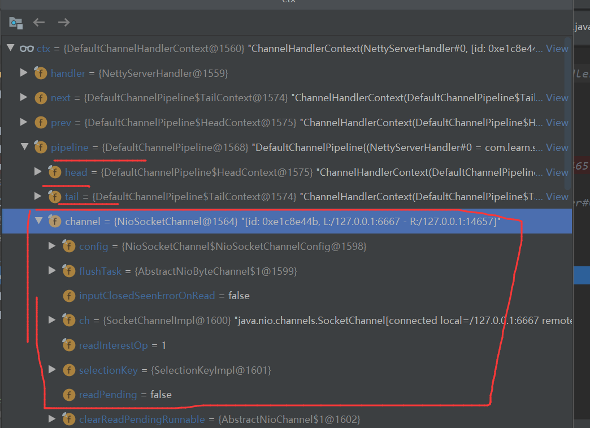
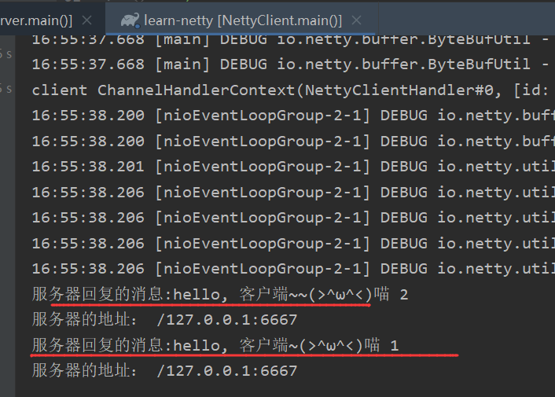
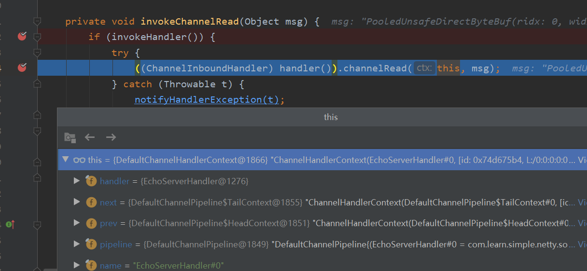
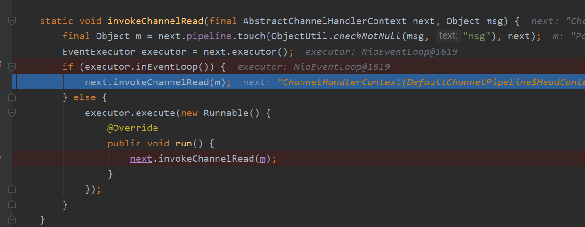

# Netty学习笔记

## 1、Netty是什么

   1)、Netty是由JBOSS提供的一个java开源框架，现为Github上的独立项目名

   2)、Netty是一个异步的，基于事件驱动的网络应用框架，用以快速开发高性能、高可靠性的网络IO程序

   3)、Netty主要针对在TCP协议下，面向Clients端的高并发应用，或者Peer-to-Peer场景下的大量数据持续传输的应用。

   4)、Netty本质是一个NIO框架，适用于服务器通讯相关的多种应用场景。

   5)、要透彻理解Netty，首先要学习NIO, 才能读懂源码

 Netty框架是在这个一层一层的底层演变出来的。


### 1.2、Netty的应用场景

 1)、互联网行业：在分布式系统中，各个节点之间需要远程服务调用，高性能的RPC框架必不可少,Netty作为异步高性能的通信框架，往往作为集成通信组件被这些RPC框架使用。

2)、典型的应用有：阿里分布式框架Dubbo的RPC框架使用Dubbo协议进行节点间的通信，Dubbo协议默认使用Netty作为基础通信组件，用于实现进程节点之间的内部通信。

3)、游戏行业：

​       a.无论是手游服务端还是大型的网络游戏，java语言得到了越来越广泛的应用

​       b.netty作为高性能的基础通信组件，提供了TCP/UDP和HTTP协议栈，方便定制和开发私有协议栈，账号登录服务器。

​      c.地图服务器之间可以方便的通过Netty进行高性能的通信。

4)、大数据领域：

​      a.经典的Hadoop的高性能和序列化组件(AVRO 实现数据文件共享)的RPC框架，默认采用Netty进行跨界点通信

​      b.它的Netty Service基于Netty框架进行二次封装实现


## 2、java BIO模型

###   2.1 I/O模型

1)、I/O模型简单的理解：就是用什么样的通道进行数据的发送和接收，很大程度上决定了程序通信的性能

2)、JAVA共支持3中网络编程模型I/O模型：BIO、NIO、AIO

3)、Java BIO：同步并阻塞(传统阻塞型)，服务器实现模式为一个连接一个线程，即客户端有连接请求时服务器端就需要启动一个线程进行处理，如果这个连接不做任何事情会造成不必要的线程开销 【简单示意图】


下图展示的是一个简单的BIO模型，当一个请求过来服务器端就会产生一个线程，这个线程就会和服务端进行通讯。底层有socket，

通过这个socket进行读或者写。


这种模型的缺点：就是当客户端非常多情况下，就会创建很多线程，而线程的创建是有开销，并且服务器端的压力非常大。这些连接也并不是时时刻刻的在进行读写，这就造成了不必要的开销，同时在读的时候会造成阻塞。


4) Java NIO: 同步非阻塞，服务器实现模式为一个线程处理多个请求(连接)，即客户端发送的连接请求都会注册到多路复用器上，多路复用器轮询到连接有I/O请求就进行处理。【简单示意图如下】


服务器启动一个线程，这个线程会去维护一个selector(选择器)，这个selector去维护多个通道。通过去轮询监听事件的发生。


5)、Java AIO(NIO.2): 异步非阻塞，AIO引入异步通道的概念，采用了Proactor模式，简化了程序编写，有效的请求才启动线程，它的特点是由操作系统完成后才通知服务端程序启动线程去处理，一般适用于连接数较多且较长的应用

### 2.2、BIO、NIO、AIO适用场景分析

 1)、BIO方式适用于连接数目比较小且固定的架构，这种方式对服务器资源要求比较高，并发局限 于 应用中，JDK1.4以前的唯一选择，但是程序简单易理解。

2)、NIO方式适用于连接数目多且连接比较短(轻操作)的架构，比如聊天服务器，弹幕系统，服务器间通讯等。编程比较复杂，JDK1.4开始支持。

3)、AIO方式适用连接数目多且连接比较长(重操作)的架构，比如相册服务器，充分调用OS参与并发操作，编程比较复杂, JDK7开始支持。

### 2.3 Java BIO 基本介绍

 1)、Java BIO就是传统的Java io 编程，其相关的类和接口在 java.io包下面

 2)、BIO(blocking I/O): 同步阻塞，服务器实现模型为一个连接一个线程，即客户端有连接请求时服务器端就需要启动一个线程进行处理，如果这个连接不做任何事情会造成不必要的线程开销，可以通过线程池机制改善(实现多个客户连接服务器)

3)、BIO方式适用于连接数目比较小且固定的架构，这种方式对服务器资源要求比较高，并发局限 于 应用中，JDK1.4以前的唯一选择，但是程序简单易理解。

### 2.4、Java BIO 工作机制


BIO编程简单流程

1)、服务器端启动一个ServerSocket

2)、客户端启动Socket对服务器进行通信，默认情况下服务器端需要对每个客户建立一个线程与之通讯

3)、客户端发出请求后，先询问服务器是否有线程响应，如果没有则会等待，或者被拒绝

4)、如果有响应，客户端线程会等待请求结束后，在继续执行

### 2.5、 java BIO应用实例

1）使用BIO模型编写一个服务器，监听6666端口，当有客户端连接时，就启动一个线程与之通讯。

2）要求使用线程池机制改善，可以连接多个客户端

3）服务器可以接收客户端发送的数据(telnet方式 即可)

4）代码示例：

```java
package com.learn.simple.bio;

import com.learn.simple.DefaultThreadFactory;

import java.io.IOException;
import java.io.InputStream;
import java.net.ServerSocket;
import java.net.Socket;
import java.util.concurrent.*;

/**
 * @ClassName: BioServer
 * @Description:
 * @Author: lin
 * @Date: 2020/10/12 8:35
 * History:
 * @<version> 1.0
 */
public class BioServer {
    public static void main(String[] args) throws IOException {
        // 思路：
        //1、使用线程池改善
        //2、如果有客户端连接了，那么就创建一个线程，与之通讯(单独写一个方法)
        ExecutorService poolExecutor = new ThreadPoolExecutor(5, 10,
                1L, TimeUnit.SECONDS,new LinkedBlockingQueue<Runnable>(3),
                Executors.defaultThreadFactory(),new ThreadPoolExecutor.AbortPolicy());

       //3、创建ServerSocket
        ServerSocket serverSocket = new ServerSocket(6666);

        System.out.println("服务器启动了");

        while (true){
            System.out.println("线程信息 id= " + Thread.currentThread().getId() + " 名字=" +
                    Thread.currentThread().getName());

            //监听，等待客户端连接
             System.out.println("等待连接......");
            final  Socket socket = serverSocket.accept();
            System.out.println("连接到一个客户端了");

            //就创建一个线程，与之通讯(单独写一个方法)
            poolExecutor.execute(new Runnable() {
                @Override
                public void run() {
                   handler(socket);
                }
            });
        }
    }

    /**
     * 编写一个handler方法，和客户端通讯
     */
    public static void handler(Socket socket){
       try {
           //打印线程id，以此来区别启动不同的客户端，线程id是否相同
           System.out.println("线程信息 id= " + Thread.currentThread().getId() + " 名字=" +
                   Thread.currentThread().getName());


           //接收数据
           byte[] bytes = new byte[1024];
           //通过socket获取输入流
           InputStream inputStream = socket.getInputStream();
           //输入流就可以获取到管道里面的数据
           //循环的读取客户端发送的数据
           while (true){
               System.out.println("线程信息 id= " + Thread.currentThread().getId() + " 名字=" +
                       Thread.currentThread().getName());
               //将数据读取到 byte数组中数据
                System.out.println("read......");
               int read = inputStream.read(bytes);

               //如果read不等于-1，那么就还没有读取完
               if(read != -1){
                   //输出客户端发送的数据
                   // 将byte转换成字符串，从0开始转换。
                   System.out.println(new String(bytes, 0, read));
               }else {
                   //如果读取完了，就退出循环
                   break;
               }
           }

       } catch (IOException e) {
           e.printStackTrace();
       }finally {
           System.out.println("关闭和client的连接");
           try {
               socket.close();
           } catch (IOException e) {
               e.printStackTrace();
           }
       }

    }


}

```

使用cmd，然后输入telnet 127.0.0.1 6666 来开启一个客户端，然后输入ctrl+] 进行数据的发送测试


执行结果,可以看到在启动两个不同的客户端时，会创建两个不同的线程，这个和上面说流程一致。并且如果没有得到客户端连接，那么服务端 serverSocket.accept(); 就会一直阻塞，一直等待有客户端进来。 inputStream.read(bytes); 这里没有读取到数据，也会阻塞


注意：在这个示例中，没有一个客户端连接，那么就会进行阻塞等待，直到有客户端连接


同样，如果没有数据，同样也会阻塞


这里为什么等待连接打印了两次？ 这也是因为在创建了线程id=19的线程后，然后又回到了main线程 去监听。这种情况就像是，在服务端有一个线程一直监听是否又客户端连接过来，如果有客户端连接过来那么就会创建一个子线程去进行通讯，然后主线程又回到服务端去监听，当有客户端连接进来，又会产生一个子线程去执行。。。。


### 2.6、 java BIO 问题分析

1)、每个请求需要创建独立的线程，与对应的客户端进行数据的Read，业务处理，数据Write。

2)、当并发数较大时，需要创建大量线程来处理连接，系统资源占用较大。

3)、连接建立后，如果当前线程暂时没有数据可读，则线程就阻塞在Read操作上，造成资源浪费。


## 3、Java NIO 编程

### 3.1、Java NIO基本介绍

 1)、Java NIO全称java no-blocking IO，是指JDk提供的新的API。从JDK1.4开始，Java提供了一系列改进的输入/输出的新特性,被统称为NIO(New IO)，是$\textcolor{Red}{同步非阻塞的}$。

 2)、NIO相关类都被放在java.nio包以子包下，并且对原java.io包中的很多类进行改写。

 3)、NIO有三大核心部分：$\textcolor{Red}{Channel(通道)}$，$\textcolor{Red}{Buffer(缓存区)}$，$\textcolor{Red}{Selector(选择器)}$


4)、$\textcolor{Red}{NIO是面向缓冲区，或者面向块编程的}$。数据读取到一个它稍后处理的缓冲区，需要时可在缓冲区中前后移动，这就增加了处理过程中 的灵活性，使用它可以提供非阻塞是的高伸缩性网络

5)、Java NIO的非阻塞模式，使一个线程从某通道发送请求 或者读取数据，但是它仅能得到目前可用的数据，如果目前没有数据可用时，就什么都不会获取，$\textcolor{Red}{而不是保持线程阻塞}$，所以直至数据变的可以读取之前，该线程可以继续做其它的事情。非阻塞写也是如此，一个线程请求写入一些数据到某通道，但不需要等待它完全写入，这个线程同时可以去做别的事情。

6)、同事理解：NIO是可以做到用一个线程处理多个操作的，假设有10000个请求过来，根据实际情况，可以分配50或者100线程来处理。不想之前的阻塞IO那样，非得分配1000个。

7)、HTTP2.0使用了多路复用的技术，做到同一连接并发处理多个请求，而且并发请求的数量比HTTP1.1大了好几个数量级。

8)、案例NIO的 Buffer

```java
package com.learn.simple.nio;

import java.nio.IntBuffer;

/**
 * @ClassName: BasicBuffer
 * @Description:
 * @Author: lin
 * @Date: 2020/10/12 11:12
 * History:
 * @<version> 1.0
 */
public class BasicBuffer {
    public static void main(String[] args) {

        //举例说明Buffer的使用(简单说明)
        //创建一个buffer，大小为5，可以存放5个int
        IntBuffer intBuffer = IntBuffer.allocate(6);

//        intBuffer.put(10);
//        intBuffer.put(11);
//        intBuffer.put(12);
//        intBuffer.put(13);
//        intBuffer.put(14);


        //项buffer，存放数据。
        for (int i = 0; i < intBuffer.capacity() ; i++) {
            intBuffer.put(i * 2);
        }

        //如何从Buffer中读取数据
        //将buffer转换，读写切换
        intBuffer.flip();

        //是否有剩余的
        while (intBuffer.hasRemaining()){
            System.out.println(intBuffer.get());
        }

    }


}

```


在NIO模型中，selector选择channle，channle(通道)和buffer进行数据的交互，而程序不再和channle进行交互，程序是和buffer进行数据交互。这样就可以实现一个非阻塞的机制


### 3.2、NIO和BIO的比较

1)、BIO以流的方式处理数据，而NIO以块 方式处理数据，块I/O的效率比流I/O高很多。

2)、BIO是阻塞的，NIO则是非阻塞的

3)、BIO基于字节流和字符流进行操作，而NIO基于Channel(通道)和Buffer(缓冲区)进行操作，数据总是从通道读取到缓冲区中，或者从缓冲区写入到通道中。Selector(选择器)用于监听多个通道的事件(比如：连接请求，数据到达等)，因此使用单个线程就可以监听多个客户端通道。


### 3.3、NIO三大核心原理示意图

一张图描述NIO的Selector、Channel和 Buffer的关系。


Selector、Channel和Buffer的关系说明：

1)、每个Channel都会对应一个Buffer

2)、Selector对应一个线程，一个线程对应多个Channel(可以理解为一个连接)。

3)、该图反应了有三个channel注册到 Selector上

4)、程序切换到那个channel上，是由事件决定的，Event是一个非常重要的概念。

5)、Selecto会根据不同的事件，在各个通道上切换。

6)、Buffer就是一个内存块，底层是一个数组

7)、数据的读取写入是通过Buffer，这个是和BIO的区别，BIO中要么是输入流，或者是输出流，不能双向，

但是NIO的Buffer是可以读也可以写，需要fli配方法切换。

8)、channel是双向的，可以反应底层操作系统的情况，比如linux，底层的操作系统通道就是双向的。


### 3.4、缓冲区(Buffer)

#### 3.4.1、基本介绍

 缓冲区：缓冲区本质上是一个可以读写数据的内存块，可以理解成是一个容器对象(含数组)，该对象提供了一组方法，可以更轻松地使用内存块，缓冲区对象内置了一些机制，能够跟踪和记录缓冲区的状态变化情况。Channel提供从文件、网络读取数据的渠道，但是读取或写入的数据都必须由Buffer来完成。


#### 3.4.2、Buffer类及其子类

1)、在NIO中，Buffer是一个顶层父类，它是一个抽象类，类的层级关系图如下。

在这些类中，都维护了一个数组，这个数组就是用来存放数据的。


常用Buffer子类一览

```
1、ByteBuffer，存储字节数据到缓冲区
2、ShortBuffer,存储字符串数据到缓冲区
3、CharBuffer，存储字符数据到缓冲区
4、IntBuffer，存储整数数据到缓冲区
5、LongBuffer，存储长整型数据到缓冲区
6、DoubleBuffer,存储小数到缓冲区
7、FloatBuffer，存储小数到缓冲区

注意：这里是没有Boolean 缓冲区的。
```


2)、Buffer类定义了所有的缓冲区都具有的四个属性来提供关于其所包含的数据元素的信息：

```
   // Invariants: mark <= position <= limit <= capacity
    private int mark = -1;
    private int position = 0;
    private int limit;
    private int capacity;
```

| 属性     | 描述                                                         |
| -------- | ------------------------------------------------------------ |
| capacity | 容量，即可以容纳的最大数据量；在缓冲区创建时被设定并且不能改变 |
| limit    | 表示缓冲区的当前终点，不能对缓冲区超过极限的位置进行读写操作。且极限是可以修改的 |
| position | 位置，下一个要被读或写的元素的索引，每次读写缓存区数据都会改变值， |
| mark     | 标记                                                         |

我们debug来看上面几个变量的变化,开始时的position=0.  这里的容量是6，也就是说limit不能超过6.


当上面的代码执行完 循环之后，可以看到这个position=6


当执行到flip时，进行读写切换。进行读操作, flip方法会将position的值赋值给limit。然后将0赋值给position。这样就开始从0读取数据。

```
   public final Buffer flip() {
        limit = position;
        position = 0;
        mark = -1;
        return this;
    }
```

可以看到这个position=0，那么就从数组的0开始读取数。


数据读取完了,可以看到position=6 了。


3)、Buffer类相关方法

```
public abstract class Buffer{
  //jdk1.4时，引入的api
  public final int capacity()//返回此缓冲区的容量
  public final int position()//返回此缓冲区的位置
  public final Buffer position(int newPosition)//设置此缓冲区的位置
  public final int limit()//返回此缓冲区的限制
  public final Buffer limit(int newLimit)//设置此缓冲区的限制
  public final Buffer mark()//在此缓冲区的位置设置标记
  public final Buffer reset()//将此缓冲区的位置重置为以前标记的位置
  public final Buffer clear()//清除缓冲区，即将各个标记恢复到初始状态，但数据并没有正真清除
  public final Buffer flip()//反转此缓冲区
  public final Buffer rewind()//重绕此缓冲区
  public final int remaining()//返回当前位置与限制之间的元素数
  public final boolean hasRemaining()//告知当前位置与限制之间是否元素
  public final boolean isReadOnly()//告知此缓冲区是否为只读缓冲区
  
  //jdk1.6引入的api
   public abstract boolean hasArray()//告知此缓冲区是否具有可访问的底层实现数组
   public abstract Object array()//返回此缓冲区的底层实现数组
   public abstract int arrayOffset()//返回此缓冲区的底层实现数组中第一个缓冲区元素的偏移量
   public abstract boolean isDirect()//返回此缓冲区是否为直接缓冲区
}
```

#### 3.4.3、ByteBuffer(使用最多)

 从前面可以看出对于java中的基本数据类型(boolean除外)，都有一个buffer类型与之相对应，最常用的自然是ByteBuffer类(二级制数据)，该类的主要方法如下：

```
public abstract class ByteBuffer{
  //缓冲区创建相关api
  public static ByteBuffer allocateDirect(int capacity)//创建直接缓冲区
  public static ByteBuffer allocate(int capacity)//设置缓冲区的初始容量
  public static ByteBuffer wrap(byte[] array)//把一个数组放到缓冲区中使用
  public static ByteBuffer wrap(byte[] arry,int offset,int length)//构造初始化位置offset和上界lenght的缓冲区
  
  //缓存区存取相关API
  public abstract byte get()//当前位置position上get，get之后，position会自动+1
  public abstract byte get(int index)//从绝对位置get
  public abstract ByteBuffer put(byte b)//从当前位置上添加, put之后，position会自动+1
  public abstract ByteBuffer put(int index, byte b)//从绝对位置上put
  
 
}
```

### 3.5、通道(Channel)

####  3.5.1 基本介绍

  1)、NIO的通道类似于流，但是和流有区别

​       a、通道可以同时进行读写，而流只能读或者只能写

​       b、通道可以实现异步读写数据

​       c、通道可以从缓冲读数据，也可以写数据到缓冲区


2)、BIO中 的strem是单向的，例如FileInputStream对象只能进行读取数据的操作，而NIO中的通道(Channel)是双向的，可以读操作，也可以写操作。

3)、Channel在NIO中是一个接口

```
public interface Channel extendx Closeable{}
```

4)、常用的Channel类有：FileChannel、DatagramChannel、ServerSocketChannel和SocketChannel。【ServerSocketChannel类似 ServerSocket, SocketChannel类似 Socket】

5)、FileChannel用于文件的数据读写，DatagramChannel用于UDP的数据读写，ServerSocketChannel和SocketChannel用于TCP的数据读写。


当一个连接来连接 server的时候，有ServerSocketChannel (真实的类型是 ServerSocketChannelImpl)产生一个 与该客户端对应的一个通道，这个通道就是SocketChannel，而这个真实的实现类型是SocketChannelImpl。 然后再通过这个通道和服务端进行通讯


#### 3.5.2 FileChannel类

FileChannel主要用来对本地文件进行IO操作，常见的方法有

```
public int read(ByteBuffer dst), 从通道读取数据并放到缓冲区中
public int write(ByteBuffer src)，把缓冲区的数据写到通道中
public long transferFrom(ReadableByteChannel src, long position, long count) 从目标通道中复制数据到当前通道
public long transferTo(long position, long count, WritableByteChannel traget) 把数据从当前通道复制给目标通道
```


#### 3.5.3、应用案例1-本地文件写数据

  实例要求：

1)、使用前面学习后的ByteBuffer(缓冲)和FileChannel(通道)，将"hello，world"写入到file01.txt文件中

2)、文件不存在就创建

3)、代码示例如下

```java
package com.learn.simple.nio;

import java.io.FileOutputStream;
import java.nio.ByteBuffer;
import java.nio.channels.FileChannel;

/**
 * 使用ByteBuffer和FileChannel,将数据写入文件中去
 *
 * @ClassName: NioFileChannel01
 * @Description:
 * @Author: lin
 * @Date: 2020/10/12 16:03
 * History:
 * @<version> 1.0
 */
public class NioFileChannel01 {
    public static void main(String[] args) throws Exception {
        String str = "Hello, 世界";
        //创建一个输出流，为什么要创建输出流呢？FileOutputStream 中包裹了Channel。通过这个来获取channel.
        // 因此还是会用到 原生io的知识
        FileOutputStream fileOutputStream = new FileOutputStream("d:\\file01.txt");

        // 通过fileOutputStream 获取对应的FileChannel
        // 这个FileChannel真实的类型是FileChannelImpl
        FileChannel fileChannel = fileOutputStream.getChannel();

        //创建一个ByteBuffer
        ByteBuffer byteBuffer = ByteBuffer.allocate(1024);
    // 创建ByteBuffer用来存放 str， 一个中文 按照UTF-8,一个中文对应三个字节
        byteBuffer.put(str.getBytes());

        //当数据存放到 byteBuffer后，这时就需要 反转，将数据从ByteBuffer 写入到channel中
        byteBuffer.flip();

        //将ByteBuffer中的数据，写入到channel中
        fileChannel.write(byteBuffer);
        fileOutputStream.close();
    }
}

```


简单示意图：


可以看到已经将数据输出到文件file01.txt中


一个中文，按照UTF-8来，一个中文对应三个字节，这里数据占用的字节是12, 所以 到了12后面就是0了。


这时 position=13


当进行反转后，这个limit=13, position=0,   将数据从0开始 写道channlee中，并且不超过 limit限制。也是说从buffer中读数据不能超过这个限制。


#### 3.5.4、应用案例2-本地文件读数据

实例要求：

1)、使用前面学习后的ByteBuffer(缓冲)和FileChannel(通道)，将file01.txt文件中数据读入到程序，并显示台屏幕

2)、假定文件已经存在。

3)、代码示例如下

```java
package com.learn.simple.nio;

import java.io.File;
import java.io.FileInputStream;
import java.nio.ByteBuffer;
import java.nio.channels.FileChannel;

/**
 * 使用ByteBuffer和FileChannel,将文件的数据读取出来
 *
 * @ClassName: NioFileChannel01
 * @Description:
 * @Author: lin
 * @Date: 2020/10/12 16:03
 * History:
 * @<version> 1.0
 */
public class NioFileChannel02 {
    public static void main(String[] args) throws Exception {

       //创建文件的输入流
        File file = new File("d:\\file01.txt");

        // 输入流
        FileInputStream fileInputStream = new FileInputStream(file);

        //获取channel， 通过fileInputStream获取对应的FileeChannel--->实际类型 FileChannelImpl
        FileChannel channel = fileInputStream.getChannel();

        //分配一个缓冲区, 这里根据文件的大小来分配缓冲区大小
        ByteBuffer byteBuffer = ByteBuffer.allocate((int) file.length());

        //然后 从通道读取数据并放到缓冲区中
        channel.read(byteBuffer);

        //打印出数据
        System.out.println(new String(byteBuffer.array()));

        //关闭输入流
        fileInputStream.close();

    }
}

```

执行结果如下，可以看到已经将文件中的数据读取出来了。


#### 3.5.5、应用案例3---使用一个Buffer完成文件读取

实例要求：

1)、使用FileChannel(通道)和方法 read, write 完成文件的拷贝

2)、拷贝一个文本文件1.txt，放在目录下即可

3)、代码示例如下

```java
package com.learn.simple.nio;

import java.io.FileInputStream;
import java.io.FileOutputStream;
import java.nio.ByteBuffer;
import java.nio.channels.FileChannel;

/**
 * 使用一个Buffer完成文件读取
 *
 * @ClassName: NioFileChannel03
 * @Description:
 * @Author: lin
 * @Date: 2020/10/12 16:03
 * History:
 * @<version> 1.0
 */
public class NioFileChannel03 {
    public static void main(String[] args) throws Exception {

      //输入流，这里假定文件已经存在了
      FileInputStream fileInputStream = new FileInputStream("1.txt");
      //获取channel
      FileChannel fileChannel01 = fileInputStream.getChannel();

      //文件的拷贝，从1.txt---->2.txt
      FileOutputStream fileOutputStream = new FileOutputStream("2.txt");
      FileChannel fileChannel02 = fileOutputStream.getChannel();

      //创建一个byteBuffer用来存放数据
        ByteBuffer byteBuffer = ByteBuffer.allocate(512);

        //循环读取数据，因为不知道文件中有多少数据
      while (true){
          //这里注意 很重要，不要忘记写这个
          //清空byteBuffer。如果不清空byteBuffer，那么在执行最后的写入操作后，
          // position的值和limit值相对，那么就会造成read=-1 不会进入，也不会退出循环
          // 从而造成了死循环

          /**
           * public final Buffer clear() {
           *         position = 0;
           *         limit = capacity;
           *         mark = -1;
           *         return this;
           *     }
           */
          byteBuffer.clear();

          //将通道中的数据读取到 byteBuffer中
          int read = fileChannel01.read(byteBuffer);
          System.out.println("read=:" + read);
          if(read == -1){
              //表示读取完
              break;
          }

          //反转，这里将position的值和limit的值进行处理
          byteBuffer.flip();
          // 然后将buffer中数据写入到另外的一个channel中， fileChannel02---->2.txt中
          fileChannel02.write(byteBuffer);

      }
      // 关闭相关流
        fileOutputStream.close();
        fileInputStream.close();
    }
}

```

可以看到这个文件已经拷贝了


注意：在上述代码中要注意循环中的  byteBuffer.clear();方法 如果忘记了写，就会造成死循环，一直无法退出循环。在执行fileChannel02.write(byteBuffer); 过后 这个position就会更新 为和 limit相同的值。


#### 3.5.6、应用案例4---拷贝文件transferFrom方法

实例要求：

1)、使用FileChannel(通道)和方法transferForm，完成文件的拷贝

2)、拷贝一张图片

3)、代码示例如下

```java
package com.learn.simple.nio;

import java.io.File;
import java.io.FileInputStream;
import java.io.FileOutputStream;
import java.nio.channels.FileChannel;

/**
 * 使用一个transferFrom来拷贝文件
 *
 * @ClassName: NioFileChannel04
 * @Description:
 * @Author: lin
 * @Date: 2020/10/12 16:03
 * History:
 * @<version> 1.0
 */
public class NioFileChannel04 {
    public static void main(String[] args) throws Exception {

      //创建相关流
      FileInputStream fileInputStream = new FileInputStream("d:\\a.jpg");
      File file;
      FileOutputStream fileOutputStream = new FileOutputStream("d:\\a2.jpg");

      //获取channel
      FileChannel sourceCh = fileInputStream.getChannel();
      FileChannel destCh = fileOutputStream.getChannel();

      //使用transferForm完成拷贝, 将sourceCh的数据 从0开始拷贝 destCh中
      destCh.transferFrom(sourceCh, 0, sourceCh.size());

      //关闭通道和相关流
      sourceCh.close();
      destCh.close();
      fileInputStream.close();
      fileOutputStream.close();
    }
}

```


#### 3.5.7、关于Buffer和Channel的注意事项和细节

1)、ByteBuffer支持类型化的put和get，put放入的是什么数据类型，get就应该使用相应的数据类型来取出，否则可能有BufferUnderflowException异常。 【示例】

```java
package com.learn.simple.nio;

import java.nio.ByteBuffer;

/**
 * ByteBuffer支持类型化的put和get，put放入的是什么数据类型，get就应该使用相应的数据类型来取出，
 * 否则可能有BufferUnderflowException异常。
 * @ClassName: NioByteBufferPutGet
 * @Description:
 * @Author: lin
 * @Date: 2020/10/12 22:56
 * History:
 * @<version> 1.0
 */
public class NioByteBufferPutGet {
    public static void main(String[] args) {
        ByteBuffer byteBuffer = ByteBuffer.allocate(64);
        //类型化方式放入数据
        byteBuffer.putInt(100);
        byteBuffer.putLong(9);
        byteBuffer.putChar('你');
        byteBuffer.putShort((short) 6);

        byteBuffer.flip();

        System.out.println("========");

        //更加放入的类型方式正确的获取
        //System.out.println(byteBuffer.getInt());
        //System.out.println(byteBuffer.getLong());
        //System.out.println(byteBuffer.getChar());
        //System.out.println(byteBuffer.getShort());


        /**
         * 打印结果
         * ========
         * 100
         * 9
         * 你
         * 6
         */


        // 每一个根据方式类型方式，获取数据
        //取数据的时候，没有根据放入的类型方式类，那么就会报错报错。
        System.out.println(byteBuffer.getShort());
        System.out.println(byteBuffer.getInt());
        System.out.println(byteBuffer.getLong());
        System.out.println(byteBuffer.getLong());

        /**
         * 打印结果
         * 就会报 这个错误。
         * Exception in thread "main" java.nio.BufferUnderflowException
         * 	at java.nio.Buffer.nextGetIndex(Buffer.java:506)
         * 	at java.nio.HeapByteBuffer.getLong(HeapByteBuffer.java:415)
         * 	at com.learn.netty.nio.NioByteBufferPutGet.main(NioByteBufferPutGet.java:50)
         */
    }
}

```

2)、可以将一个普通Buffer转成只读Buffer， 【举例说明】

```java
package com.learn.simple.nio;

import java.nio.ByteBuffer;

/**
 * @ClassName: ReadOnlyBuffer
 * @Description: 只读Buffer
 * @Author: lin
 * @Date: 2020/10/12 23:06
 * History:
 * @<version> 1.0
 */
public class ReadOnlyBuffer {
    public static void main(String[] args) {
        ByteBuffer buffer = ByteBuffer.allocate(64);

        int count = 64;
        for (int i = 0; i < count; i++) {
            buffer.put((byte) i);
        }

        //转换
        buffer.flip();

        //得到一个只读的buffer
        ByteBuffer readOnlyBuffer = buffer.asReadOnlyBuffer();
        System.out.println(readOnlyBuffer.getClass());

        while (readOnlyBuffer.hasRemaining()){
            System.out.println(readOnlyBuffer.get());
        }

        //一个只读buffer，不能再往里面写入数据

        //readOnlyBuffer.put((byte) 100);
        /**
         * 再往里面写入数据，就会报错
         * Exception in thread "main" java.nio.ReadOnlyBufferException
         * 	at java.nio.HeapByteBufferR.put(HeapByteBufferR.java:175)
         * 	at com.learn.netty.nio.ReadOnlyBuffer.main(ReadOnlyBuffer.java:35)
         */
    }
}

```


3)、NIO还提供了MappedByteBuffer,可以让文件直接在内存(堆外的内存)中进行修改，而如何同步到文件则有NIO来完成, 【举例说明】

```java
package com.learn.simple.nio;

import java.io.RandomAccessFile;
import java.nio.MappedByteBuffer;
import java.nio.channels.FileChannel;

/**
 * MappedByteBuffer,可以让文件直接在内存(堆外的内存)中进行修改, 操作系统不需要拷贝一次
 * @ClassName: MappedByteBufferTest
 * @Description:
 * @Author: lin
 * @Date: 2020/10/13 9:02
 * History:
 * @<version> 1.0
 */
public class MappedByteBufferTest {

    public static void main(String[] args) throws Exception {
        // 使用RandomAccessFile , 指定对那个文件进行操作，
        // 第二个参数表示 模式, 这里rw 表示读写模式
        RandomAccessFile randomAccessFile = new RandomAccessFile("1.txt", "rw");

        //获取通道
        FileChannel fileChannel = randomAccessFile.getChannel();

        /**
         * 参数含义：
         * 参数1： FileChannel.MapMode.READ_WRITE：表示使用的读写模式
         * 参数2： 0 表示可以直接修改的起始位置
         * 参数3: 5 是映射到内存的大小(不是索引位置)，即将 1.txt的多少给字节映射到内存
         *
         */
        MappedByteBuffer mappedByteBuffer = fileChannel.map(FileChannel.MapMode.READ_WRITE, 0, 5);

        //将第一个索引位置的值改为 小写的h
        mappedByteBuffer.put(0, (byte) 'h');
        // 将索引为3的位置的值改为 7
        mappedByteBuffer.put(3, (byte)'7');

        //这里修改的是索引为5下标的数据，但是上面mappedByteBuffer中 size表示的是映射到内存的地址，所以能修改
        //的位置是索引下标为4的数据，
        // 因此这里修改下标为5的 数据，会报索引越界异常
//        mappedByteBuffer.put(5, (byte) 'Y');

        randomAccessFile.close();
        System.out.println("修改成功......");
    }

}

```

修改后的结果 如下，可以看已经修改了文件


注意：上述代码中如果修改的位置超过了规定的位置，那么在修改是就会报错索引越界错误

```
   // 因此这里修改下标为5的 数据，会报索引越界异常
        mappedByteBuffer.put(5, (byte) 'Y');
```

错误信息

```
Exception in thread "main" java.lang.IndexOutOfBoundsException
	at java.nio.Buffer.checkIndex(Buffer.java:540)
	at java.nio.DirectByteBuffer.put(DirectByteBuffer.java:305)
	at com.learn.netty.nio.MappedByteBufferTest.main(MappedByteBufferTest.java:44)

```


4)、前面的读写操作，都是通过一个Buffer完成的，NIO还支持 通过多个Buffer(即Buffer数组)完成读写操作，即Scattering和Gathering (分散和聚集)【举例说明】

 ```java
package com.learn.simple.nio;

import java.net.InetSocketAddress;
import java.nio.ByteBuffer;
import java.nio.channels.ServerSocketChannel;
import java.nio.channels.SocketChannel;
import java.util.Arrays;

/**
 * Scattering：将数据写入到buffer时，可以采用buffer数组，依次写入[分散]
 * Gathering：从buffer读取数据时，可以采用buffer数组，依次读
 *
 * @ClassName: ScatteringAndGatheringTest
 * @Description:
 * @Author: lin
 * @Date: 2020/10/13 9:39
 * History:
 * @<version> 1.0
 */
public class ScatteringAndGatheringTest {
    public static void main(String[] args)throws  Exception {
      //使用ServerSocketChannel 和SocketChannel 网络
      ServerSocketChannel serverSocketChannel = ServerSocketChannel.open();

      //创建一个server address。
      InetSocketAddress inetSocketAddress = new InetSocketAddress(7000);

      //绑定端口到socket，并启动
      serverSocketChannel.socket().bind(inetSocketAddress);

      //创建buffer数组
      ByteBuffer[] byteBuffers = new ByteBuffer[2];
      //分别创建两个元素，并且分配两个元素的字节，
      // 这样分配是为了 看到buffer是如何依次写入和读取出来的。
      byteBuffers[0] = ByteBuffer.allocate(5);
      byteBuffers[1] = ByteBuffer.allocate(3);

      //等待客户端连接， 这个连接成功了就 得到了SocketChannel,然后这个Channel就和服务器关联起来了。
      SocketChannel socketChannel = serverSocketChannel.accept();
      // 假定从客户端接收8个字节
      int messageLength = 8;

      //因为不知道客户端 发送了多少数据过来，所以循环读取
      while (true){
          //到达读取了多少个字节，记录下来
          int byteRead = 0;

          //如果读取的字节数不够，那么就继续读取。最多不超过8个字节
          // 然后看到这8个字节，是不是先放到 buffer的第一个，再放第二个
          while (byteRead < messageLength){
              // 将数据 放到 buffer中，
              // 注意这里 buffer是一个数组，它会自己去分散的放到 第一个buffer中，还是第二个buffer中
              long l = socketChannel.read(byteBuffers);
              //累计读取的字节数
              byteRead += l;
              System.out.println("byteRead=:" + byteRead);

              //使用流打印，看看当前的这个buffer的position和limit是多少
              Arrays.stream(byteBuffers).map(buffer -> "position=" +
                      buffer.position() + ",limit=" + buffer.limit()).forEach(System.out::println);
          }

          //将所有的buffer进行反转，因为将来可能会进行输出等等
          Arrays.asList(byteBuffers).forEach(buffer -> buffer.flip());

          //反转完后，将数据读出 显示到客户端
          // 定义一个变量，来控制回显的大小
          long byteWrite = 0;

          //当回显的数据小于 定义的字节数，那么就循环来处理
          while (byteWrite < messageLength){
              long l = socketChannel.write(byteBuffers);
              byteWrite +=l;
          }

          //将所有的buffer进行clear操作
          Arrays.asList(byteBuffers).forEach(buffer -> buffer.clear());
          System.out.println("byteRead:=" + byteRead + " byteWrite=" + byteWrite + ",messageLength" + messageLength);
      }

    }
}

 ```


测试发送6个字节


打印结果

```
> Task :ScatteringAndGatheringTest.main()
byteRead=:6
position=5,limit=5
position=1,limit=3

```

发送8个字节


输出结果

```
> Task :ScatteringAndGatheringTest.main()
byteRead=:8
position=5,limit=5
position=3,limit=3
byteRead:=8 byteWrite=8,messageLength8
```

通过这个示例，其实表达是将数据写入或者放入到buffer时，可以采用buffer数组，依次写入(分散)，那么在读取的时候可以从 buffer数组中 依次读取(聚和)。 这个的好处是，以后在使用buffer的时候，如果一个buffer不够用那么可以使用buffer数组形式，让其操作更快捷。


### 3.6、Selector(选择器)

#### 3.6.1、基本介绍

1)、Java的NIO，用非阻塞的IO方式。可以用一个线程，处理多个的客户端连接，就会使用到$\textcolor{red}{Selector(选择器)}$

2)、$\textcolor{red}{Selector能够检测多个注册的通道上是否有事件发生(注意：多个Channel以事件的 方式可以注册到同一个Selector)}$，如果有事件发生，便获取事件然后针对每个事件进行相应的处理。这样就可以只用一个单线程去管理多个通道，也就是管理多个连接和请求

3)、只有在 连接/通道 真正有读写事件发生时，才会进行读写，就大大地减少了系统开销，并且不必为每个连接都创建一个线程，不用去维护多个线程

4)、避免了多个线程之间的上下文切换导致的开销

#### 3.6.2、Selector示意图和特点说明


1)、Netty的IO线程NioEventLoop聚合了Selector(选择器，也叫多路复用器)，可以同时并发处理成百上千个客户端连接。

2)、当线程从某客户端Socket通道进行读写数据时，若没有数据可用时，该线程可用进行其它任务。

3)、线程通常将非阻塞IO的空闲时间用于在其它通道上执行IO操作，所以单独的线程可用管理多个输入和输出通道。

4)、由于读写操作都是非阻塞的，这就可用充分提升IO线程的运行效率，避免由于频繁I/O阻塞导致的线程挂起。

5)、一个I/O线程可以并发处理N个客户端连接和读写操作，这从根本上解决了传统阻塞I/O 一连接 一线程模型，架构的性能、弹性伸缩能力和可靠性都得到了极大的提升。

#### 3.6.3、Selector类相关方法

Selector类是一个抽象方法，常用的方法和说明如下：

```
public abstract class Selector implements Closeable{
  public static Selector open(); //得到一个选择器对象
  public int select(long timeout); //监控所有注册的通道，当其中有IO操作可以进行时，将对应的SelectionKey 加入到内部集合中并返回，参数用来设置超时时间
  
  public Set<SelectionKey> selectionKeys();//从内部集合中得到所有的SelectionKey
}
```

selector结构图：


上述的select(long timeout); 方法返回的是 SelectionKey的集合。 这里在实现类SelectiorImpl中可以看到。


然后进入SelectionKey类中查看, 可以知道这个 类 有一个 channel方法。

```
public abstract class SelectionKey {
/**
     * Constructs an instance of this class.
     */
    protected SelectionKey() { }

    public abstract SelectableChannel channel();

    public abstract Selector selector();
    
    public abstract boolean isValid();
     
    public abstract void cancel(); 
   }
    
```

#####   简单流程是： 

selector(选择器)是和 一个线程关联的， 关联之后selector调用 select方法， 这个方法返回 就会返回一个集合，返回的集合是SelectionKey的集合  这意味着 集合中有很多的SelectionKey。然后这个SelectionKey, 我们可以通过selector看到底是 那种事件发生了。是读操作、还是写操作、还是连接操作发生了呢？ 因为这个selectionKey已经拿到了，所以通过这个key 取到对应的channel在操作。


#### 3.6.4、注意事项

1)、NIO中的ServerSocketChannel功能类似ServerSocket, SocketChannel功能类似Socket

NioSocketChannel 在实例化过程中，会先实例化 JDK 底层的 SocketChannel，NioServerSocketChannel 也一样，会先实例化 ServerSocketChannel 实例：


2)、Selector 相关方法说明

```
selector.select()//阻塞 ， 至少有一个事件发生才会返回，否就阻塞
selector.select(1000)//阻塞1000毫秒，在1000毫秒后返回
selector.wakeup()//唤醒selector
selector.selectNow()//不阻塞，立马返还
```


### 3.7、NIO非阻塞网络编程原理分析图

NIO非阻塞 网络编程相关的(Selector、SelectionKey、ServerSocketChannel和 SocketChannel)关系梳理图


$\textcolor{red}{服务器端，也是有Buffer的}$


对上图的说明：

1)、当客户端连接是，会通过ServerSocketChannel得到SocketChannel

2)、Selector进行监听 select方法，返回有事件发生的通道的个数。

3)、将SocketChannel注册到Selector上， 

```
//这个方法在SelectabelChannel类中
public final SelectionKey  register(Selector sel, int ops)

//ops 有下面这四种， 表示关注的事件
public static final int OP_READ = 1 << 0;

public static final int OP_WRITE = 1 << 2;

//这个表示事件已经建成了。 连接已经创建好了
public static final int OP_CONNECT = 1 << 3;
//这个表示一个新的连接来了。
public static final int OP_ACCEPT = 1 << 4;

```

 一个selector 上可以注册多个SocketChannel

4)、注册后返回一个SelectionKey，会和该Selector关联(集合)

5)、进一步得到各个SelectionKey(有事件发生)

6)、通过SelectionKey 反向获取 SocketChannel，方法channel()

7)、可以通过得到channel 完成业务处理


### 3.8、NIO非阻塞 网络编程快速入门

  实例要求：

1)、编写一个NIO入门案例，实现服务器端和客户端之间的数据简单通讯(非阻塞)

2)、目的：理解NIO非阻塞网络编程机制

3)、代码示例如下

 服务端

```java
package com.learn.simple.nio;

import java.io.IOException;
import java.net.InetSocketAddress;
import java.nio.ByteBuffer;
import java.nio.channels.*;
import java.util.Iterator;
import java.util.Set;

/**
 * 服务端
 * @ClassName: NioServer
 * @Description:
 * @Author: lin
 * @Date: 2020/10/13 15:46
 * History:
 * @<version> 1.0
 */
public class NioServer {
    public static void main(String[] args) throws Exception {
        //1、创建serverSocketChannel
        ServerSocketChannel serverSocketChannel = ServerSocketChannel.open();

        //2、创建selector
        Selector selector = Selector.open();

        //3、绑定一个端口，然后服务端进行监听
        InetSocketAddress socketAddress = new InetSocketAddress(6666);
        serverSocketChannel.socket().bind(socketAddress);

        //设置为非阻塞
        serverSocketChannel.configureBlocking(false);

        //4、把serverSocketChannel 注册到selector ，然后关心的事件为 OP_ACCEPT
        serverSocketChannel.register(selector, SelectionKey.OP_ACCEPT);

        //可以支持多个线程 循环监听
        //循环等待客户端连接，
        while (true) {

            //看看 有哪些事件过来
            // 这里只等待 1秒，如没有时间发生，则返回
            // 如果等待时间过来那么也不会阻塞在这里，
            // 如果等于0，那么表示没有事件发生
            if(selector.select(1000) == 0){
                System.out.println("服务器等待了1s，无连接");
                continue;
            }

            // 如果返回的 大于>0 ，就获取到相关的SelectionKey集合
            // 1.如果大于>0 ,表示已经获取到关注的事件了
            // 2.通过selector.selectedKeys() 返回关注事件的集合
            // 3.通过SelectionKey 反向获取到通道
            Set<SelectionKey> selectionKeys = selector.selectedKeys();

            //遍历Set<SelectionKey>,使用迭代器遍历
            Iterator<SelectionKey> keyIterator = selectionKeys.iterator();

            while (keyIterator.hasNext()){
                 //获取到SelectionKey
                SelectionKey key = keyIterator.next();
                //根据key对应的通道发生的事件做相应的处理, 也就是key关联的通道到底发生的什么事情
                //如果是OP_ACCEPT, 那么就是有新的客户端连接
                if(key.isAcceptable()) {
                    //当一个客户端来连接，那么就应该产生一个新的通道 socketChannel
                    // 使用key为该客户端生成一个SocketChannel,
                    // 这里注意：一般来说accept()是阻塞，但是这里 已经知道了告诉了连接已经发生了
                    // 这里就不会等待了。在传统的方式中accept是不知道有没有连接来进行连接。
                    // 因为这里NIO的事件驱动，到这一步已经知道了连接，所以马上就会执行。
                    SocketChannel socketChannel = serverSocketChannel.accept();
                    
                     System.out.println("客户端连接成 生成了一个 socketChannel " + socketChannel.hashCode());
                    
                    // 因为在创建socketChannel 没有将其设置非阻塞的, 就会报非法的阻塞模型异常
                    //将SocketChannel设置为非阻塞，如果不设置那么就会报异常.
                    socketChannel.configureBlocking(false);


                    //将SocketChannel注册到Selector上, 关注事件为OP_READ( 这个通道里面有读的事件发生了就去读取传过来的数据),
                    // 同时给socketChannel关联一个buffer
                    // 第一参数：选择器
                    // 第二个参数：事件选择器
                    // 第三个参数：给注册通道绑定 一个Buffer
                    socketChannel.register(selector, SelectionKey.OP_READ, ByteBuffer.allocate(1024));
                }

                /**得到一个连接过后，对应客户端来讲第一次连接好，生成好SocketChannel 就可以发生数据了
                 * 发生数据也是这里，因为select返回的事件不只是连接事件，还有其它事件
                 */

                //将通道注册好了之后，下一个就要发生数据
                // 发生数据就会进行下面这个判断， 发生OP_READ事件
                if(key.isReadable()){
                   //通过key 反向获取channel(因为这个通道可能发生了 连接事件也可能发生 读的事件 这是两个不同的业务)
                   // 向下转型
                   SocketChannel channel = (SocketChannel)key.channel();
                   // 然后获取 这个channel关联的buffer, 因为在socketChannel注册到selector时 也设置了一个buffer
                   // 这里通过attachment()获取一个对象 并强制转换。
                   ByteBuffer buffer = (ByteBuffer)key.attachment();

                   // 把当前通道中的数据读入到buffer中去
                    channel.read(buffer);
                    System.out.println("form 客户端 " + new String(buffer.array()));
                }

                //最后特别重要一件事情，要及时的把当前的key删除掉
                // 手动从当前集合中移除 当前的SelectionKey， 防止重复操作。
                // 为什么要移除？ 因为在进行遍历的时候，是一个多线程的问题，如果没有及时删除
                // 就会造成重复操作
                keyIterator.remove();

            }
        }


    }
}

```

客户端示例：

```java
package com.learn.simple.nio;

import java.net.InetSocketAddress;
import java.nio.ByteBuffer;
import java.nio.channels.SocketChannel;

/**
 * @ClassName: NioClient
 * @Description: 客户端
 * @Author: lin
 * @Date: 2020/10/13 16:48
 * History:
 * @<version> 1.0
 */
public class NioClient {
    public static void main(String[] args) throws Exception{
        //得到一个网络通道socketChannel
        SocketChannel socketChannel = SocketChannel.open();
        //设置非阻塞模式
        socketChannel.configureBlocking(false);
        //提供服务器端的ip和端口
        InetSocketAddress inetSocketAddress = new InetSocketAddress("127.0.0.1", 6666);

        //连接服务器

        if(!socketChannel.connect(inetSocketAddress)){
             while (!socketChannel.finishConnect()){
                 System.out.println("因为连接需要时间，客户端不会阻塞，可以做其它工作......");
             }
        }

        // 如果连接成功，就发生数据
        String str = "hi，哈哈哈哈";

        //根据字节数组的大小，来产生一个buffer。不用再指定一个大小了
        ByteBuffer buffer = ByteBuffer.wrap(str.getBytes());

        //发生数据，将buff数据写入到channel
        socketChannel.write(buffer);

        //不让客户的结束，让其客户端停在这里
        System.in.read();  
    }
}

```

测试启动服务端 ，然后再启动客户端, 这里启动了两个客户端，可以看到不同的客户端对应的socketChannel不一样。同时可知每次来一个客户端就会产生一个channel。


注意如果在服务端中，循环中    if(key.isAcceptable())  判断中没有将socketChannel设置为非阻塞，就会异常


### 3.9、SelectionKey

1)、SelectionKey，表示Selector和网络通道的注册关系，共四种：

```
int OP_ACCP:有新的网络连接可以 accept, 值为16
int OP_CONNECT:代表连接已经建立, 值为8
int OP_READ:代表读操作, 值为1
int OP_WRITE:代表写操作, 值为

源码中
public static final int OP_READ = 1 << 0;

public static final int OP_WRITE = 1 << 2;

//这个表示事件已经建成了。 连接已经创建好了
public static final int OP_CONNECT = 1 << 3;
//这个表示一个新的连接来了。
public static final int OP_ACCEPT = 1 << 4;
```

2)、SelectionKey相关方法

```java
public abstract class SelectionKey {
    /**
       得到与之关联的selector对象
     */
     public abstract Selector selector();
   
    /**
       得到与之关联的通道
     */
    public abstract SelectableChannel channel();
   
   /**
       设置或改变监听事件
     */  
    public abstract SelectionKey interestOps(int ops);

  
     /**
       是否可读
     */
    public final boolean isReadable() {
        return (readyOps() & OP_READ) != 0;
    }

    /**
       是否可写
     */
    public final boolean isWritable() {
        return (readyOps() & OP_WRITE) != 0;
    }

    
    public final boolean isConnectable() {
        return (readyOps() & OP_CONNECT) != 0;
    }
     /**
       是否可accept
     */
    public final boolean isAcceptable() {
        return (readyOps() & OP_ACCEPT) != 0;
    }

     /**
       得到与之关联的共享数据
     */
    public final Object attachment() {
        return attachment;
    }

}

```


### 3.10、ServerSocketChannel

1)、ServerSocketChannel在服务器端监听新的客户端Socket连接

2)、相关方法如下

```java
public abstract class ServerSocketChannel
    extends AbstractSelectableChannel
    implements NetworkChannel
{
    //得到一个ServerSocketChannel通道
    public static ServerSocketChannel open() throws IOException {
        return SelectorProvider.provider().openServerSocketChannel();
    }
    
    //设置服务器端口号
    public final ServerSocketChannel bind(SocketAddress local)
        throws IOException
    {
        return bind(local, 0);
    }
    
    
    //设置阻塞或非阻塞模式，取值false表示采用非阻塞模式
    public final SelectableChannel configureBlocking(boolean block);
    
    //注册一个选择器并设置监听事件
    public final SelectionKey register(Selector sel, int ops);
}
```


ServerSocketChannel和SocketChannel 同样继承了AbstractSelectableChannel 和实现了 NetworkChannel接口。但是SocketChannel 实现了更多的接口类。

```java
public abstract class ServerSocketChannel extends AbstractSelectableChannel
    implements NetworkChannel{}


public abstract class SocketChannel
    extends AbstractSelectableChannel
    implements ByteChannel, ScatteringByteChannel, GatheringByteChannel, NetworkChannel
{}
```

### 3.11、SocketChannel

1)、 SocketChannel，网络IO通道，具体负责进行读写操作。NIO把缓冲区的数据写入通道，或者把通道里的数据读到缓冲区。

2)、相关方法如下

```java
public abstract class SocketChannel
    extends AbstractSelectableChannel
    implements ByteChannel, ScatteringByteChannel, GatheringByteChannel, NetworkChannel
{
    //得到一个SocketChannel通道
    public static SocketChannel open();
 
    //设置阻塞或非阻塞模式，取值false表示采用非阻塞模式
    public final SelectableChannel configureBlocking(boolean block);
    
    //连接服务器
    public boolean connect(SocketAddress remote);
    //如果上面的方法连接失败，接下来就要通过该方法完成连接操作
    public boolean finishConnect();
    
    //往通道里写数据
    public int write(ByteBuffer src);
    //从通道里读数据
    public int read(ByteBuffer dst);
    
    //注册一个选择器并设置监听，最后一个参数可以设置共享数据
    public final SelectionKey register(Selector sel, int ops, Object att);
    
    //关闭通道
    public final void close();
}
```


### 3.12、NIO网络编程应用实例-群聊系统

实例要求：

1)、编写一个NIO群聊系统，实现服务器端和客户端之间的数据简单通讯(非阻塞)

2)、实现多人群聊

3)、服务器端：可以监测用户上线，离线，并实现消息转发功能

4)、客户端：通过channel可以无阻塞发送消息给其它所有用户，同时可以接受其它用户发送的消息(由服务器转发得到)

5)、目的：进一步理解NIO非阻塞网络编程机制

6)、示意图和代码示例


编写程序步骤：

```
1、先编写服务器端
 1.1、服务器启动并监听6667
 1.2、服务器介绍客户端信息，并实现转发 [处理上线和离线]
2、编写客户端
 2.1、连接服务器
 2.2、发送消息
 2.3、接收服务器消息
```


服务端

```java
package com.learn.simple.nio.groupchat;

import java.io.IOException;
import java.net.InetSocketAddress;
import java.nio.ByteBuffer;
import java.nio.channels.*;
import java.util.Iterator;

/**
 *  群聊系统---服务端实现类
 * @ClassName: GroupChatServer
 * @Description:
 * @Author: lin
 * @Date: 2020/10/14 10:33
 * History:
 * @<version> 1.0
 */
public class GroupChatServer {
    /**
     * 定义相关属性
     */
    private  Selector selector;

    private  ServerSocketChannel listenChannel;
    /**
     * 监听端口号
     */
    private final static  int PORT = 6667;


    public static void main(String[] args) {
           GroupChatServer chatServer = new GroupChatServer();
           chatServer.listen();
    }


    /**
     * 构造器， 进行初始化工作
     */
    public  GroupChatServer() {
        try {
            //得到选择器
            selector = Selector.open();
            //得到serverSocketChannel
            listenChannel = ServerSocketChannel.open();
            //绑定端口
            listenChannel.socket().bind(new InetSocketAddress(PORT));
            //设置非阻塞
            listenChannel.configureBlocking(false);

            //将listenChannel注册到selector中, 返回selectionKey
            listenChannel.register(selector, SelectionKey.OP_ACCEPT);
        } catch (IOException e) {
            e.printStackTrace();
        }

    }


    /**
     * 监听端口，然后循环读取客户端发送过来的数据
     */
    public  void  listen(){
        System.out.println("监听线程：" + Thread.currentThread().getName());
      try {
         while (true){
          // 让其阻塞等待
         int count = selector.select();
         //表示有事件处理
          if(count > 0 ){
            //遍历得到的SelectionKey集合
              Iterator<SelectionKey> iterator = selector.selectedKeys().iterator();
              while (iterator.hasNext()){
                  //取出selectionKey
                  SelectionKey key = iterator.next();

                  //监听事件
                  if(key.isAcceptable()){
                      SocketChannel sc = listenChannel.accept();
                      //设置channel非阻塞
                      sc.configureBlocking(false);

                      //将channel注册到selector
                      sc.register(selector, SelectionKey.OP_READ);

                      //提示那个客户端上线了
                      System.out.println(sc.getRemoteAddress() + " 上线");
                  }

                  //其它事件，有数据需要读取
                  // 通道发送read事件，即通道是可读的状态， 将通道中的数据读取到buffer中去
                  if(key.isReadable()){
                      //调用读取数据方法，传入key
                     readData(key);
                  }

                  //当前的key删除，防止重复处理
                  iterator.remove();
              }
          }else{
             // System.out.println("等待......");
          }
         }
      } catch (IOException e) {
         e.printStackTrace();
      }finally {
          //
      }

    }


    /**
     * 读取数据，从通道读取数据到buffer
     * @param key
     */
    private void  readData(SelectionKey key){
        //关联到channel
        SocketChannel channel = null;

        try {
            channel = (SocketChannel)key.channel();
            //创建buffer

            ByteBuffer byteBuffer = ByteBuffer.allocate(1024);

            //将channel的数据读取到buffer
            int count = channel.read(byteBuffer);
            //根据count值处理
            if(count > 0){
                 //把缓冲区的数据转换成字符串
                String msg = new String(byteBuffer.array());
                //输出该消息
                System.out.println("form 客户端：" + msg);

                //然后向其它的客户端发送消息(去掉自己)，专门下一个方法来处理
                sendInfoToOtherClients(msg, channel);
            }


        }catch (IOException e){
            try {
                System.out.println(channel.getRemoteAddress() + " 离线了.....");
                //取消注册
                key.cancel();
                //关闭通道
                channel.close();
            } catch (IOException ioException) {
                ioException.printStackTrace();
            }
        }

    }


    /**
     * 转发给其它客户端(通道)
     * @param msg
     * @param self
     * @throws IOException
     */
    private void sendInfoToOtherClients(String msg, SocketChannel self) throws IOException {
        System.out.println("服务器转发消息中......");
        System.out.println("服务器转发数据给客户端线程：" + Thread.currentThread().getName());
        //遍历所有注册到Selector中的SocketChannel,并排除self
        for (SelectionKey key : selector.keys()) {
            //通过key取出对应的 SocketChannel, 因为实现了chanel
            Channel targetChannel = key.channel();

            //排除自己
            if(targetChannel instanceof  SocketChannel && targetChannel != self){
               //这个时候就可以转发消息了
               //转换， 将消息发送到那个channel
               SocketChannel dest = (SocketChannel)targetChannel;
               //将msg 存储到buffer中
                ByteBuffer buffer = ByteBuffer.wrap(msg.getBytes());

               //将buffer的数据写入到通道中
                dest.write(buffer);

            }
        }
    }

}

```

客户端

```java
package com.learn.simple.nio.groupchat;


import com.learn.simple.DefaultThreadFactory;

import java.io.IOException;
import java.net.InetSocketAddress;
import java.nio.ByteBuffer;
import java.nio.channels.SelectionKey;
import java.nio.channels.Selector;
import java.nio.channels.SocketChannel;
import java.util.Iterator;
import java.util.Scanner;
import java.util.concurrent.*;

/**
 *  群聊系统---客户端
 * @ClassName: GroupChatClient
 * @Description:
 * @Author: lin
 * @Date: 2020/10/14 11:19
 * History:
 * @<version> 1.0
 */
public class GroupChatClient {
    /**
     * 定义selector
     */
    private Selector selector;

    /**
     * 定义socketChannel
     */
    private SocketChannel socketChannel;

    /**
     * 服务器ip
     */
    private final  String HOST = "127.0.0.1";

    /**
     * 服务器端口
     */
    private final int PORT = 6667;

    /**
     * 客户端发送消息是会自己取名字，那么这里就声明一个名字
     */
    private String userName;

    public static void main(String[] args) throws IOException {

        //启动客户端
        GroupChatClient chatClient = new GroupChatClient();

        ExecutorService poolExecutor = new ThreadPoolExecutor(5, 10,
                1L, TimeUnit.SECONDS,new LinkedBlockingQueue<Runnable>(3),
                new DefaultThreadFactory(),new ThreadPoolExecutor.AbortPolicy());
        //启动一个线程，每隔3秒，读取从服务器发送的数据
//        new Thread(){
//            @Override
//            public void run() {
//                while (true){
//                    chatClient.readInfo();
//                    try {
//                        sleep(3000);
//                    } catch (InterruptedException e) {
//                        e.printStackTrace();
//                    }
//                }
//            }
//        }.start();
         poolExecutor.execute(new MyThread(chatClient));


        //发送数据给服务端, 因为发送数据是从控制台输入的
        //所以创建一个扫描器，
        //  System.in读取标准输入设备数据（从标准输入获取数据，一般是键盘）
        Scanner scanner = new Scanner(System.in);
        // 循环，只有还是下一行就去读取
        // 等待客户端不停的输入
        while (scanner.hasNextLine()){
            //读取下一行，得到的就是一个字符串了，
            String s = scanner.nextLine();
            //将读取的到是字符 发送给服务器端，就可以了
            chatClient.sendInfo(s);
        }
    }


    /**
     * 1、构造器，完成初始化工作
     */
    public  GroupChatClient() throws IOException {
        selector = Selector.open();
        //连接服务器
        socketChannel = SocketChannel.open(new InetSocketAddress(HOST, PORT));
        //设置非阻塞
        socketChannel.configureBlocking(false);
        //将channel注册到 selector中
        socketChannel.register(selector, SelectionKey.OP_READ);
        //得到本地的地址，然后拼接 最后分配给userName
        userName = socketChannel.getLocalAddress().toString().substring(1);

        System.out.println(userName + " is ok...");
    }

    /**
     * 2、向服务端发送消息，那么就需要知道 要发送什么消息
     * @param info
     */
    public void sendInfo(String info){
        //拼接 一下要发送的 消息
        info = userName + " 说："+ info;
        try {
            //从给定的buffer缓冲区, 往通道里面写数据
            socketChannel.write(ByteBuffer.wrap(info.getBytes()));
        } catch (IOException e) {
            e.printStackTrace();
        }
    }

    /**
     * 3、读取从服务端 回复的消息
     */
    public void readInfo(){
       try {
         int readChannels = selector.select();
         //使用有可用的通道
         if(readChannels > 0){
             //返回获取迭代器，进行循环处理
             Iterator<SelectionKey> iterator = selector.selectedKeys().iterator();

             while (iterator.hasNext()){
                 SelectionKey key = iterator.next();
                 //判断是否可读
                 if(key.isReadable()){
                     //得到相关的通道
                     SocketChannel sc =(SocketChannel) key.channel();
                     //得到一个ByteBuffer
                     ByteBuffer buffer = ByteBuffer.allocate(1024);
                     //从通道里读取数据到buffer
                     sc.read(buffer);

                     //把读取到的缓冲区数据转换成字符串
                     String msg = new String(buffer.array());

                     //打印信息
                     System.out.println(msg.trim());

                 }
             }

             //注意: 不要忘记删除 当前的SelectionKey，防止重复操作
             iterator.remove();
         }else{
             //System.out.println("没有可用的通道");
         }
       }catch (Exception e){
          e.printStackTrace();
       }

    }
}


class MyThread implements Runnable{

    GroupChatClient chatClient;

    public MyThread(){}

    public MyThread(GroupChatClient chatClient){
        this.chatClient = chatClient;
    }

    @Override
    public void run() {
        while (true){
            chatClient.readInfo();
            try {
                Thread.sleep(3000);
            } catch (InterruptedException e) {
                e.printStackTrace();
            }
        }
    }
}

```


测试, 启动服务端，并启动两个客户端


客户端发送消息 ，服务端接收到消息，其它的客户端也接收到了消息。 


当客户端离线后，服务端接收到了 客户端离线的消息


$\textcolor{red}{注意，要深刻理解上述代码的流程。}$


### 3.13、零拷贝原理剖析

####  3.13.1、零拷贝基本介绍

 1) 零拷贝是网络编程的关键，很多性能优化都离不开。 

 2) 在 Java 程序中，常用的零拷贝有 mmap(内存映射) 和 sendFile。那么，他们在 OS 里，到底是怎么样的一个 

 的设计？我们分析 mmap 和 sendFile 这两个零拷贝 

 3) 另外我们看下 NIO 中如何使用零拷贝


#### 3.13.2、传统的IO数据读写

Java 传统 IO 和 网络编程的一段代码

```
//创建一个文件
File file = new File("test.txt");
//获取到一个RandomAccessFile对象
RandomAccessFile raf = new RandomAccessFile(file,"rw");

//声明一个byte字节数组
byte[] arr = new byte[(int) file.lenght()];
//将文件 读入到 byte字节数组中
raf.write(arr);

//然后一个serverSocket监听连接，
Socket socket = new ServerSocket(8080).accpet();
//通过socket得到 一个输出流对象，然后将这个字节数组 写入到流对象中
socket.getOutputStream().write(arr);
```


#### 3.13.3、传统的IO模型

那么上面的一个简单 的文件读写过程，一共发生了多少次文件拷贝，以及用户态和内核态状态的切换。首先看一张图


首先把硬件上的数据进行一共DMA拷贝，那么DMA是什么呢？ 

DMA: direct  memory access 直接内存拷贝(不使用cpu来完成的)。

上面的代码使用了一个read方法，

1)、这个方法首先将把硬盘上的数据 通过DMA拷贝 ,拷贝到内核(kernel buffer)。

2)、然后将这个内核buffer(kernel buffer) 使用cpu copy, 拷贝到 用户buffer( user buffer)。那么我们的数据其实是在用户buffer进行修改。

3)、在用户buffer修改完数据后 再使用 cpu copy，拷贝到socket buffer(也就是准备发送的那个buffer)。

4)、然后再用DMA拷贝，将数据拷贝到  protocol engine( 协议引擎 及协议栈)。 


上述传统的IO 一共经过了 4次拷贝，用户态和内核态切换 经过了三次切换。在传统的IO模型中拷贝的次数是非常读的。只是进行了一次 读 和写 然后经过了4次拷贝 和3次状态的切换 ，显然代价是比较高的。


下面文章参考

https://juejin.im/post/6844903949359644680#heading-13

https://www.cnblogs.com/rickiyang/p/13265043.html


#### 3.13.4、mmap 优化

因为传统的IO模型 在进行读写的时候 会经过 4次拷贝 和3次状态的切换 ，代价比较高，所以就有了其它方法的优化。 叫做 mmap(内存映射优化)

1) mmap 通过内存映射，将**文件映射到内核缓冲区**，同时，**用户空间可以共享内核空间的数据**。这样，在进行网 

络传输时，就可以减少内核空间到用户空间的拷贝次数。如下图 

2) mmap 示意图


那么使用了内存映射优化技术有什么变化呢？

1)、这个方法首先将把硬盘上的数据 通过DMA拷贝 ,拷贝到内核(kernel buffer)。

2)、因为$\textcolor{red}{共享内核空间数据}$，所以$\textcolor{red}{kenel buffer 到 user buffer 就不会进行cpu拷贝了}$。数据就可以在kernel buffer进行修改。

3)、在kernel buffer修改完数据后 再使用 cpu copy，拷贝到socket buffer

4)、然后通过socket buffer 再使用DMA拷贝，将数据拷贝到  protocol engine( 协议引擎 及协议栈)。 


mmap 优化过后，拷贝次数减少了1次，但是状态变化还是3次。 因此mmap不是真正的零拷贝，不过的确减少了拷贝次数。 所以又提出其它的优化技术


#### 3.13.5、sendFile 优化 

1) Linux 2.1 版本 提供了 sendFile 函数，其基本原理如下：数据根本不经过用户态，直接从内核缓冲区进入到 

Socket Buffer，同时，由于和用户态完全无关，就减少了一次上下文切换 

2) 示意图和小结


从而再一次减少了数据拷贝。具体如下图和小结


3) 提示：零拷贝从操作系统角度，是没有 cpu 拷贝 


使用sendFile优化

(1)、这个方法首先将把硬盘上的数据 通过DMA拷贝 ,拷贝到内核(kernel buffer)。

(2)、数据根本不经过用户态，直接进入socket buffer，所以减少了拷贝次数，并且减少了状态切换次数

(3)、然后通过socket buffer 再使用DMA拷贝，将数据拷贝到  protocol engine( 协议引擎 及协议栈)。 


sendFile 优化方式比mmap 好在，拷贝次数由4次 减少到了3次拷贝，状态切换由3次 减少到了两次。但是linux 2.1这种方式仍然没有实现零拷贝。 因为里面还是进行一次cpu 拷贝。

$\textcolor{red}{注意：所谓的零拷贝不是指不拷贝，而是没有 Cpu  Copy}$


#### 3.13.7、sendFile优化2

1) Linux 在 2.4 版本中，做了一些修改，避免了从**内核缓冲区**拷贝到 **Socket buffer** 的操作，直接拷贝到协议栈， 

2) 在kernel buffer 到 socket buffer 这里其实还是有 一次 cpu 拷贝 ,

kernel buffer -> socket buffer 但是，拷贝的信息很少(拷贝的是一些描述信息)，比如 lenght , offset , 消耗低，可以忽略


拷贝次数从4次减少到了 2次，  数据在kerner buffer 修改后，然后直接通过DMA copy 拷贝到 协议栈中。

状态切换次数 由3次 减少到了 2次。


#### 3.13.8、零拷贝的再次理解

1) 所谓零拷贝，是从**操作系统的角度**来说的。因为内核缓冲区之间，没有数据是重复的（只有 kernel buffer 有 

一份数据, 在运行过程中，内存只有一份buffer，并且不重复）。 

2) 零拷贝不仅仅带来更少的数据复制，还能带来其他的性能优势，例如更少的上下文切换，更少的 CPU 缓存伪 

共享以及无 CPU 校验和计算。 

#### 3.13.9、mmap和 sendFile 区别

1) mmap 适合小数据量读写，sendFile 适合大文件传输。 

2) mmap 需要 4 次上下文切换，3 次数据拷贝；sendFile 需要 3 次上下文切换(这里看怎么计算根据上面的第一个图计算，如果从最初状态开始计算也就是用户态，那么就算4次； 如果只算中间的那么就只有3次切换)，最少 2 次数据拷贝。 

3) sendFile 可以利用 DMA 方式，减少 CPU 拷贝，mmap 则不能（必须从内核拷贝到 Socket 缓冲区）。 

$\textcolor{red}{在这个选择上：rocketMQ 在消费消息时，使用了 mmap。kafka 使用了 sendFile。}$

```
1、输入流（Input  Stream）:
  程序从输入流读取数据源。数据源包括外界(键盘、文件、网络…)，即是将数据源读入到程序的通信通道
2、输出流：
   程序向输出流写入数据。将程序中的数据输出到外界（显示器、打印机、文件、网络…）的通信通道。
```


#### 3.13.10、NIO零拷贝案例

案例要求： 

1) 使用传统的 IO 方法传递一个大文件 

2) 使用 NIO 零拷贝方式传递(transferTo)一个大文件 

3) 看看两种传递方式耗时时间分别是多少

首先看 传统的方式

```java
package com.learn.simple.nio.zerocopy;

import java.io.DataInputStream;
import java.io.IOException;
import java.net.ServerSocket;
import java.net.Socket;

/**
 * 传统io 服务端，测试发送大文件，消耗的时间
 * @ClassName: OldIoServer
 * @Description:
 * @Author: lin
 * @Date: 2020/10/14 17:27
 * History:
 * @<version> 1.0
 */
public class OldIoServer {
    public static void main(String[] args) throws IOException {
        //服务端在 端口7001上进行监听
        ServerSocket serverSocket = new ServerSocket(7001);

        while (true){
            //等待客户端连接
            Socket socket = serverSocket.accept();
            //连接成功后，得到一个 InputStream流
            //然后返回 DadaInputStream输入流
            DataInputStream dataInputStream = new DataInputStream(socket.getInputStream());

            //创建一个byte数组
            byte[] bytes = new byte[4096];
            while (true){
                int read = dataInputStream.read(bytes, 0, bytes.length);
                //如果等于-1,那么就是没有读取到
                if( -1 == read){
                    break;
                }
            }

        }
    }
}

```

传统的客户端

```java
package com.learn.simple.nio.zerocopy;

import java.io.DataOutputStream;
import java.io.FileInputStream;
import java.io.IOException;
import java.io.InputStream;
import java.net.Socket;

/**
 * @ClassName: OldIoClient
 * @Description: 传统io 客户端，测试发送大文件，消耗的时间
 * @Author: lin
 * @Date: 2020/10/14 17:27
 * History:
 * @<version> 1.0
 */
public class OldIoClient {
    public static void main(String[] args) throws IOException {
        //客户连接到到ip= localhost， 端口号是7001的地址
        Socket socket = new Socket("localhost", 7001);

        String fileName = "protoc-3.6.1-win32.zip";
        //根据文件关联一个流
        InputStream inputStream = new FileInputStream(fileName);

        //然后通过socket，获取到一个输出流
        DataOutputStream dataOutputStream = new DataOutputStream(socket.getOutputStream());

        byte[] buffer = new byte[4096];
        long readCount;
        int total = 0;
        long startTime = System.currentTimeMillis();

        //循环不停的去读取，然后将这个文件数据放到 这个byte数组中。
        while ((readCount = inputStream.read(buffer)) >= 0){
             total += readCount;
             //然后将byte数组中的数据写入 输出流中
             dataOutputStream.write(buffer);
        }
        System.out.println("发送总字节数： " + total + ", 耗时： " + (System.currentTimeMillis() - startTime));

        dataOutputStream.close();
        socket.close();
        inputStream.close();
    }
}

```

传统方式测试耗时是：

```
> Task :OldIoClient.main()
发送总字节数： 1007473, 耗时： 6
```


NIO 方式的 服务端

```java
package com.learn.simple.nio.zerocopy;

import java.io.IOException;
import java.net.InetSocketAddress;
import java.net.ServerSocket;
import java.nio.ByteBuffer;
import java.nio.channels.ServerSocketChannel;
import java.nio.channels.SocketChannel;

/**
 * @ClassName: NewIoServer
 * @Description: 使用NIO来测试读取数据的时间 ，服务端
 * @Author: lin
 * @Date: 2020/10/14 22:13
 * History:
 * @<version> 1.0
 */
public class NewIoServer {
    public static void main(String[] args) throws IOException {
         //指定端口
        InetSocketAddress address = new InetSocketAddress(7001);

        //创建serverSocketChannel
        ServerSocketChannel serverSocketChannel = ServerSocketChannel.open();

        //获取serverSocket
        ServerSocket serverSocket = serverSocketChannel.socket();

        //绑定端口
        serverSocket.bind(address);

        //创建buffer
        ByteBuffer byteBuffer = ByteBuffer.allocate(4096);

        while (true){
            //等待连接
            SocketChannel socketChannel = serverSocketChannel.accept();

            int readCount = 0;
            while (-1 != readCount){
                try {
                    //通过socketChannel, 读取数据到buffer。
                    // 返回读取到的数量
                   readCount = socketChannel.read(byteBuffer);
                }catch (IOException e){
//                    e.printStackTrace();
                    //这里不捕获异常，直接退出
                    break;
                }

            }

            //注意这里要将 buffer 倒带，也就是将 position设置为0 ，mark 设置为-1
            //所以调用rewind方法
            byteBuffer.rewind();
        }

    }
}

```


NIO客户端

```java
package com.learn.simple.nio.zerocopy;

import java.io.FileInputStream;
import java.io.IOException;
import java.net.InetSocketAddress;
import java.nio.channels.FileChannel;
import java.nio.channels.SocketChannel;

/**
 * @ClassName: NewIoClient
 * @Description: 测试Nio 传输文件的 时间， 客户端
 * @Author: lin
 * @Date: 2020/10/14 22:36
 * History:
 * @<version> 1.0
 */
public class NewIoClient {
    public static void main(String[] args) throws IOException {
        SocketChannel socketChannel = SocketChannel.open();

        //获取到SocketChannel后，然后连接服务器
        socketChannel.connect(new InetSocketAddress("localhost", 7001));

        String fileName = "protoc-3.6.1-win32.zip";

        //得到一个文件的channel
        FileChannel fileChannel = new FileInputStream(fileName).getChannel();

        //准备发送， 记录时间
        long startTime = System.currentTimeMillis();
        // 注意：
        // 在 linux 下一个 transferTo 方法就可以完成传输
        // 在 windows 下 一次调用 transferTo 只能发送 8m , 就需要分段传输文件, 而且要注意
        // 传输时的位置
        //transferTo 底层使用到零拷贝
        // 指定位置， 和传输的大小，将这些传输到 socketChannel中去
        long transferCount = 0;

        // 在windows下如果传输的文件大于8m，那么就需要计算 8m对应的字节数
        // 如果计算出来的结果是小数，那么就要向上取整，如果计算出来是整数就不要加1。
        //计算出来 的是需要调用次数, 然后把每次传输的位置记录下来，再下一次从这个位置进行传输
        //double byteCount = Math.ceil((double) fileChannel.size())/(8*1024*1024);
        //for (int i = 0; i < byteCount; i++) {
        //    long l = fileChannel.transferTo(i*(8 * 1024 * 1024), 8 * 1024 * 1024, socketChannel);
        //    transferCount=transferCount+l;
        //}

        //linux下直接传就完事了
        transferCount = fileChannel.transferTo(0, fileChannel.size(), socketChannel);


        System.out.println(" 发 送 的 总 的 字 节 数 =" + transferCount + " 耗 时 :" +
                (System.currentTimeMillis() - startTime));
        //关闭
        fileChannel.close();
    }
}

```

使用NIO方式 传输耗时

```
> Task :NewIoClient.main()
 发 送 的 总 的 字 节 数 =1007473 耗 时 :2
```


### 3.14、Java AIO基本介绍

1)、 JDK 7 引入了 Asynchronous I/O，即 AIO。在进行 I/O 编程中，常用到两种模式：$\textcolor{red}{Reactor(反应器模式) 和 Proactor(主动器模式)}$。Java 的 NIO 就是 Reactor，当有事件触发时，服务器端得到通知，进行相应的处理 

2)、 AIO 即 NIO2.0，叫做异步不阻塞的 IO。AIO 引入异步通道的概念，采用了 Proactor 模式，简化了程序编写。 有效的请求才启动线程，它的特点是先由操作系统完成后才通知服务端程序启动线程去处理，一般适用于连接 数较多且连接时间较长的应用

3) 、目前 AIO 还没有广泛应用，$\textcolor{red}{Netty 也是基于 NIO, 而不是 AIO}$， 因此我们就不详解 AIO 了，有兴趣的同学可 

以 参 考 <<Java 新 一 代 网 络 编 程 模 型 AIO 原 理 及 Linux 系 统 AIO 介 绍 >> 

http://www.52im.net/thread-306-1-1.html 


3.15、BIO、NIO、AIO对比

|          | BIO      | NIO                  | AIO        |
| -------- | -------- | -------------------- | ---------- |
| IO模型   | 同步阻塞 | 同步非阻塞(多路复用) | 异步非阻塞 |
| 编程难度 | 简单     | 复杂                 | 复杂       |
| 可靠性   | 差       | 好                   | 好         |
| 吞吐量   | 低       | 高                   | 高         |

举例说明：

```
1)、同步阻塞：到理发店理发，就一直等待理发师，直到轮到自己理发。
2)、同步非阻塞：到理发店理发，发现前面有其它人在理发，然后给理发师说下，先干其它事情，等会儿过来看是否轮到自己。
3)、异步非阻塞：给理发店打电话，让理发师上门服务，自己干其它事情，理发师到家了来给你理发。
```


## 4、Netty概述

###  4.1、原始NIO存在的问题

1) NIO 的类库和 API 繁杂，使用麻烦：需要熟练掌握 Selector、ServerSocketChannel、SocketChannel、ByteBuffer 等。 

2) 需要具备其他的额外技能：$\textcolor{red}{要熟悉 Java 多线程编程，因为 NIO 编程涉及到 Reactor 模式，你必须对多线程  和网络编程非常熟悉，才能编写出高质量的 NIO 程序。}$ 

3) 开发工作量和难度都非常大：例如客户端面临断连重连、网络闪断、半包读写、失败缓存、网络拥塞和异常流 

的处理等等。 

4) JDK NIO 的 Bug：例如臭名昭著的 Epoll Bug，它会导致 Selector 空轮询，最终导致 CPU 100%。直到 JDK 1.7 

版本该问题仍旧存在，没有被根本解决。 

### 4.2、 Netty 官网说明

官网：https://netty.io/ 

Netty is an asynchronous event-driven network application framework for rapid development of maintainable high performance protocol servers & clients


分为三个部分： 

a、core核心部分：零拷贝、交互api、可扩展的事件模型

b、支持的协议：HTTP/WebSocket 、 SSL、 zlib\gzip、 protobuf(这个是用来解码和编码的)、大文件传输等等。

c、支持的传输服务：socket 、 HTTP tunnel 、in-vm


Netty官网说明：

(1)、Netty是由jboss提供的一个java开源框架。Netty提供异步的、基于事件驱动的网络应用程序框架，用以快速开发高性能、高可靠性的网络IO程序。

(2)、Netty可以帮助你快速、简单的开发出一个网络应用、相当于简化和流程化了NIO的开发过程

(3)、Netty是目前最流行的NIO框架，Netty在互联网领域、大数据分布式计算领域、游戏行业、通信行业等获得了广泛的应用，知名的Elasticsearch、Dubbo框架内部都采用了Netty。


### 4.3、Netty的优点

Netty 对 JDK 自带的 NIO 的 API 进行了封装，解决了上述问题。 

1)、 设计优雅：适用于各种传输类型的统一 API 阻塞和非阻塞 Socket；基于灵活且可扩展的事件模型，可以清晰 

地分离关注点；高度可定制的线程模型 - 单线程，一个或多个线程池. 

2)、 使用方便：详细记录的 Javadoc，用户指南和示例；没有其他依赖项，JDK 5（Netty 3.x）或 6（Netty 4.x）就 

足够了。 

3)、 高性能、吞吐量更高：延迟更低；减少资源消耗；最小化不必要的内存复制。 

4)、 安全：完整的 SSL/TLS 和 StartTLS 支持。 

5)、 社区活跃、不断更新：社区活跃，版本迭代周期短，发现的 Bug 可以被及时修复，同时，更多的新功能会被 

加入 

### 4.5、Netty版本说明

1) netty 版本分为 netty3.x 和 netty4.x、netty5.x 

2) 因为 Netty5 出现重大 bug，已经被官网废弃了，目前推荐使用的是 Netty4.x 的稳定版本 

3) 目前在官网可下载的版本 netty3.x netty4.0.x 和 netty4.1.x 

4) 这里使用的是 Netty4.1.x 版本 

5) netty 下载地址： https://bintray.com/netty/downloads/netty/


## 5、Netty 高性能架构设计

### 5.1、 线程模型基本介绍

1)、 不同的线程模式，对程序的性能有很大影响，为了搞清 Netty 线程模式，我们来系统的讲解下 各个线程模式，最后看看 Netty 线程模型有什么优越性。

2)、 目前存在的线程模型有： $\textcolor{red}{传统阻塞 I/O 服务模型}$ ， $\textcolor{red}{ Reactor 模式}$ 。

3)、 根据 Reactor 的数量和处理资源池线程的数量不同，有 3 种典型的实现 

$\textcolor{red}{单 Reactor 单线程}$； 

$\textcolor{red}{单 Reactor 多线程}$； 

$\textcolor{red}{主从 Reactor 多线程}$；

4)、 Netty 线程模式($\textcolor{red}{Netty 主要基于主从 Reactor 多线程模型做了一定的改进，其中主从 Reactor 多线程模型有多 个 Reactor}$) 


### 5.2、 传统阻塞 I/O 服务模型 

#### 5.2.1、工作原理图 

1) 黄色的框表示对象， 蓝色的框表示线程 

2) 有背景颜色的三个的框表示方法(API) 


#### 5.2.2、模型特点 

1) 采用阻塞 IO 模式获取输入的数据 

2) 每个连接都需要独立的线程完成数据的输入，业务处理, 数据返回

#### 5.2.3、问题分析 

1) 当并发数很大，就会创建大量的线程，占用很大系统资源 

2) 连接创建后，如果当前线程暂时没有数据可读，该线程会阻塞在 read 操作，造成线程资源浪费 


### 5.3、Reactor模式

#### 5.3.1、针对传统阻塞 I/O 服务模型的 2 个缺点，解决方案：

1) 、基于 I/O 复用模型：多个连接共用一个阻塞对象，应用程序只需要在一个阻塞对象等待，无需阻塞等待所有连 接。当某个连接有新的数据可以处理时，操作系统通知应用程序，线程从阻塞状态返回，开始进行业务处理 。

这里的回到就是解决上面图中handler阻塞对象, 因为在客户端没有数据发送过来时 read方法就会阻塞。因此这个handler就是一个阻塞对象。基于这个原因 Reactor 采用了I/O 复用模型来处理。

Reactor 对应的叫法: 

​    a.反应器模式   

​    b.分发者模式(Dispatcher)  

​    c.通知者模式(notifier)

2)、 基于线程池复用线程资源：不必再为每个连接创建线程，将连接完成后的业务处理任务分配给线程进行处理， 一个线程可以处理多个连接的业务。


这张图只是解释了reactor的基本原理：

 a、serviceHandle只有一个，相比传统的i/o模型，这里使用一个ServiceHandler来接收请求，这样就可以实现复用。不必每次来一个请求就创建一个handler阻塞对象(只有没有数据读取都要阻塞)。

b、基于线程池 复用资源，不必为每个连接创建线程，将连接后的业务处理分配给线程进行处理，一个线程可以处理多个业务。因为是线程池，所以当线程池中有空闲的线程时，serviceHandler就会将 业务处理分配给空闲的线程去处理。 这样就解决了前面 传统IO模型中 每个连接需要独立的线程完成数据的输入，业务处理和数据返回。

就达到了 线程的复用。


#### 5.3.2、I/O 复用结合线程池，就是 Reactor 模式基本设计思想，如图  

说明：

1)、 Reactor 模式，通过一个或多个输入同时传递给服务处理器的模式(基于事件驱动) 

2) 、服务器端程序处理传入的多个请求,并将它们同步分派到相应的处理线程， 因此 Reactor 模式也叫 Dispatcher 模式 

3) 、Reactor 模式使用 IO 复用监听事件, 收到事件后，分发给某个线程(进程), 这点就是网络服务器高并发处理关键


#### 5.3.3、Reactor 模式中 核心组成：

1) 、Reactor：Reactor 在一个单独的线程中运行，负责监听和分发事件，分发给适当的处理程序来对 IO 事件做出 反应。 它就像公司的电话接线员，它接听来自客户的电话并将线路转移到适当的联系人； 

2) 、Handlers：处理程序执行 I/O 事件要完成的实际事件，类似于客户想要与之交谈的公司中的实际官员。Reactor 通过调度适当的处理程序来响应 I/O 事件，处理程序执行非阻塞操作


#### 5.3.4、模式分类

根据 Reactor 的数量和处理资源池线程的数量不同，有 3 种典型的实现

1)、单 Reactor 单线程 

2)、单 Reactor 多线程 

3)、主从 Reactor 多线程


### 5.4、单Reactor 单线程

原理图，并使用 NIO 群聊系统验证


对于上述图，在NIO群聊系统中我们可以 知道，NioServer中调用select方法 就是上面Reactor中的select，因此我们可以认为selector是一个选择器，就充当了Reactor的角色。  对于dispacth ，当发现请求是一个连接请求，就调用accept方法。当连接请求完了之后 把得到的socketChannel注册到selector中。那么下一次再去获取一个事件 就应该是一个读的事件。这个读事件 调用的是readData()方法。 对照这个图相当于是调用一个handler的read方法。所以我们在群聊系统中，可以将readData()方法 sendInfoToOtherClients() 方法 封装到一个Handler中去。

那么在listen方法中，就调用handler中的 read方法就可以了。


使用群聊系统测试： 启动群聊系统服务端，然后客户端启动3个。 并添加打印日志，可以看到在监听是时候 线程是main线程，然后进行消息转发的时候，线程同样是main线程。


这种方式在客户端很多的情况下，势必会造成阻塞。


#### 5.4.1、方案说明：

1)、Select 是前面 I/O 复用模型介绍的标准网络编程 API，可以实现应用程序通过一个阻塞对象监听多路连接请求 

2)、Reactor 对象通过 Select 监控客户端请求事件，收到事件后通过 Dispatch 进行分发 

3)、如果是建立连接请求事件，则由 Acceptor 通过 Accept 处理连接请求，然后创建一个 Handler 对象处理连接 

完成后的后续业务处理 

4)、如果不是建立连接事件，则 Reactor 会分发调用连接对应的 Handler 来响应 

5)、Handler 会完成 Read→业务处理→Send 的完整业务流程 

结合实例：$\textcolor{red}{服务器端用一个线程通过多路复用搞定所有的 IO 操作（包括连接，读、写等）}$，编码简单，清晰明了，$\textcolor{red}{ 但是如果客户端连接数量较多，将无法支撑}$，前面的 NIO 群聊案例就属于这种模型。


#### 5.4.2、方案优缺点分析：

1)、优点：模型简单，没有多线程、进程通信、竞争的问题，全部都在一个线程中完成 

2)、缺点：性能问题，只有一个线程，无法完全发挥多核 CPU 的性能。Handler 在处理某个连接上的业务时，整 

个进程无法处理其他连接事件，很容易导致性能瓶颈 

3)、缺点：可靠性问题，线程意外终止，或者进入死循环，会导致整个系统通信模块不可用，不能接收和处理外部 

消息，造成节点故障 

4)、使用场景：客户端的数量有限，业务处理非常快速，比如 Redis 在业务处理的时间复杂度 O(1) 的情况 


### 5.5、单 Reactor 多线程

#### 5.5.1、原理图


#### 5.5.2、对上图的小结

1)、Reactor 对象通过 select 监控客户端请求 事件, 收到事件后，通过 dispatch 进行分发 

2)、如果建立连接请求, 则 Acceptor 通过 accept 处理连接请求, 然后创建一个 Handler 对象处理完成连接后的各种事件 

3)、如果不是连接请求，则由 reactor 分发调用连接对应的 handler 来处理

4)、handler 只负责响应事件，不做具体的业务处理, 通过 read 读取数据后，会分发给后面的 worker 线程池的某个 线程处理业务 

5)、worker 线程池会分配独立线程完成真正的业务，并将结果返回给 handler 

6)、handler 收到响应后，通过 send 将结果返回给 client 

#### 5.5.3、方案优缺点分析

1)、优点：可以充分的利用多核 cpu 的处理能力 

2)、缺点：多线程数据共享和访问比较复杂， reactor 处理所有的事件的监听和响应，在单线程运行， 在高并发场 景容易出现性能瓶颈


### 5.6、主从Reactor 多线程

#### 5.6.1、工作原理图

针对单 Reactor 多线程模型中，Reactor 在单线程中运行，高并发场景下容易成为性能瓶颈，可以让 Reactor 在 

多线程中运行


#### 5.6.2、上图的方案说明

1)、Reactor 主线程 MainReactor 对象通过 select 监听连接事件, 收到事件后，通过 Acceptor 处理连接事件 

2)、当 Acceptor 处理连接事件后，MainReactor 将连接分配给 SubReactor(subReactor有多个，在分配的时候有可能第一次分配给subReactor1，下一次分配给subReactor2)。

3)、subreactor 将连接加入到连接队列进行监听(监听客户端是 read 还是 write操作),并创建 handler 进行各种事件处理 

4)、当有新事件发生时， subreactor 就会调用对应的 handler 处理 

5)、handler 通过 read 读取数据，将数据分发给后面的 worker 线程池来处理 

6)、worker 线程池分配独立的 worker 线程进行业务处理，并返回结果

7)、handler 收到响应的结果后，再通过 send 将结果返回给 client 

8)、$\textcolor{red}{Reactor 主线程}$可以对应$\textcolor{red}{多个 Reactor 子线程}$, 即 MainRecator 可以关联多个 SubReactor

#### 5.6.3、Scalable IO in Java 对 Multiple Reactors 的原理图解


#### 5.6.4、主从Reactor多线程 方案优缺点说明：

1)、优点：父线程与子线程的数据交互简单职责明确，父线程只需要接收新连接，子线程完成后续的业务处理。 

2)、优点：父线程与子线程的数据交互简单，Reactor 主线程只需要把新连接传给子线程，子线程无需返回数据。 

3)、缺点：编程复杂度较高 

4)、结合实例：这种模型在许多项目中广泛使用，包括 Nginx 主从 Reactor 多进程模型，Memcached 主从多线程， Netty 主从多线程模型的支持 

### 5.7 Reactor 模式小结

#### 5.7.1、3 种模式用生活案例来理解

1)、单 Reactor 单线程，前台接待员和服务员是同一个人，全程为顾客服 

2)、单 Reactor 多线程，1 个前台接待员，多个服务员，接待员只负责接待 

3)、主从 Reactor 多线程，多个前台接待员，多个服务生 

#### 5.7.2 Reactor 模式具有如下的优点：

1)、响应快，不必为单个同步时间所阻塞，虽然 Reactor 本身依然是同步的 

2)、可以最大程度的避免复杂的多线程及同步问题，并且避免了多线程/进程的切换开销 

3)、扩展性好，可以方便的通过增加 Reactor 实例个数来充分利用 CPU 资源 

4)、复用性好，Reactor 模型本身与具体事件处理逻辑无关，具有很高的复用性 


### 5.8、Netty模型

#### 5.8.1、工作原理示意图 1-简单版

Netty 主要基于主从 Reactors 多线程模型（如图）做了一定的改进，其中主从 Reactor 多线程模型有多个 Reactor


#### 5.8.2、对上图说明 

1)、BossGroup 线程维护 Selector , 只关注 Accecpt 。

2)、当接BossGroup中 收到 Accept 事件，然后获取到对应的 SocketChannel后, 将其封装成 NIOScoketChannel 并注册到 WorkerGroup线程(事件循 环)中 的selector中, 并进行维护 

3)、当 Worker 线程监听到 selector 中通道发生自己感兴趣的事件后，就由handler进行处理完成， 注意 handler会事先加入到通道 中。


#### 5.8.3、工作原理示意图 2-进阶版


a、BossGroup在实际的netty运行中它可以是多个线程，每个线程对应的是NioEventLoop(事件循环)。

b、每个NioEventLoop会对应一个selector，这个selector循环监听I/O事件。循环到了就处理。

c、处理过后再处理任务队列。

d、BossGroup可以有多个NioEventLoop，当BossGroup监听到连接事件后，创建socket。然后把这个封装好的NiosocketChannel注册到 WorkerGroup中的 某一个selector中，在注册前会先进行selector的选择。

e、WorkerGroup也有多个NioEventLoop，每个事件循环中对应一个线程，也维护了一个selector。selector也在哪里不停的监听事件。


#### 5.8.4、工作原理示意图-详细版


#### 5.8.5、对上图的说明小结 重点

1)、Netty 抽象出两组线程池 BossGroup 专门负责接收客户端的连接, WorkerGroup 专门负责网络的读写 

2)、BossGroup 和 WorkerGroup 类型都是 NioEventLoopGroup 

3)、NioEventLoopGroup 相当于一个事件循环组, 这个组中含有多个事件循环 ，每一个事件循环是NioEventLoop 

4)、$\textcolor{red}{NioEventLoop }$表示一个不断循环的执行处理任务的线程， $\textcolor{red}{每个 NioEventLoop 都有一个 selector }$, 用于监听绑 定在其上的 socket 的网络通讯 

5)、NioEventLoopGroup 可以有多个线程, 即可以含有多个 NioEventLoop 

6)、每个 Boss下 NioEventLoop 循环执行的步骤有 3 步

   a. 第一步：轮询  accept 事件 。

   b. 第二步：处理 accept 事件 , 与 client 建立连接 , 生成 NioScocketChannel , 并将其注册到某个 worker NIOEventLoop   上 的 selector 。

  c. 第三步：处理任务队列的任务 ， 即 runAllTasks 。

7)、每个 Worker 下面的 NIOEventLoop 循环执行的步骤 

​    a. 轮询 read, write 事件 

​    b.(对应worker下的 NioEventLoop只关心 read和 wirte事件) 处理 i/o 事件， 即 read , write 事件，在对应 NioScocketChannel 处理 

​    c.处理任务队列的任务 ， 即 runAllTasks 

8)、每个Worker NIOEventLoop 处理业务时，会使用pipeline(管道), pipeline 中包含了 channel , 即通过pipeline 可以获取到对应通道, 管道中维护了很多的 处理器。然后可以用这个处理器来进行各种数据的处理。


#### 5.8.6、Netty 快速入门实例-TCP 服务

实例要求：使用 IDEA 创建 Netty 项目 

1)、Netty 服务器在 6668 端口监听，客户端能发送消息给服务器 "hello, 服务器~" 

2)、服务器可以回复消息给客户端 "hello, 客户端~" 

3)、目的：对 Netty 线程模型 有一个初步认识, 便于理解 Netty 模型理论 

4)、代码演示


 服务端代码:

```java
package com.learn.simple.netty;

import io.netty.bootstrap.ServerBootstrap;
import io.netty.channel.ChannelFuture;
import io.netty.channel.ChannelInitializer;
import io.netty.channel.ChannelOption;
import io.netty.channel.EventLoopGroup;
import io.netty.channel.nio.NioEventLoopGroup;
import io.netty.channel.socket.SocketChannel;
import io.netty.channel.socket.nio.NioServerSocketChannel;

/**
 *  Netty入门实例 ---- 服务端
 * @ClassName: NettyServer
 * @Description: Netty入门实例
 * @Author: lin
 * @Date: 2020/10/16 8:59
 * History:
 * @<version> 1.0
 */
public class NettyServer {
    public static void main(String[] args)throws Exception {

        //创建BossGroup 和 WorkerGroup
        //说明：
        //1、创建两个线程组 bossGroup和WorkerGroup
        //2、bossGroup只处理连接请求，真正的和客户端进行业务处理的，会交给WorkerGroup来完成
        //3、这两个都是无限循环。
        EventLoopGroup bossGroup = new NioEventLoopGroup();
        EventLoopGroup workerGroup = new NioEventLoopGroup();

        try {


        //4、创建服务器端启动的对象，然后去配置参数
        ServerBootstrap bootstrap = new ServerBootstrap();

        //5、使用链式编程来设置配置参数。

        //设置两个线程组
        bootstrap.group(bossGroup, workerGroup)
                 //使用 NioServerSocketChannel 作为服务器的通道实现
                 //针对bossGroup，使用的是NioServerSocketChannel，针对workerGroup使用的是SocketChannel
                 .channel(NioServerSocketChannel.class)
                 //设置线程队列得到连接个数
                 .option(ChannelOption.SO_BACKLOG, 128)
                 //设置整个连接时活动状态
                 .childOption(ChannelOption.SO_KEEPALIVE, true)
                 //创建一个通过初始化对象(匿名对象)，
                 .childHandler(new ChannelInitializer<SocketChannel>() {
                     // 操作整个过程，底层使用的是SocketChannel

                     //这里完成一个任务，任务是 向这个workerGroup关联的pipeline里面增加
                     //一个handler ,也就是 给 pipeline 设置处理器
                     @Override
                     protected void initChannel(SocketChannel ch) throws Exception {
                         //处理器既可以是netty提供的，也可以是自定义的， 然后接收来自客户的消息
                         //addList，将管道最后添加一个处理器
                         // 接收客户端消息和发送消息到客户端，这种事情交由channel关联的pipeline的一个handler来处理。
                         //这里使用自定义的handler来接收客户端的消息，并且将消息返回给客户端
                         ch.pipeline().addLast( new NettyServerHandler());
                     }
                 });// 很关键，给我们的 workerGroup 的 EventLoop 对应的管道设置处理器

        System.out.println(".....服务器 is ready...");

        //绑定一个端口并且同步, 生成了一个 ChannelFuture 对象
        //这里就相当于 启动服务器(并绑定端口)
        ChannelFuture channelFuture = bootstrap.bind(6667).sync();

        //对关闭通道进行监听， 当有关闭通道的消息或者事件时才会进行一个处理，而不是立即去关闭
        channelFuture.channel().closeFuture().sync();
        }finally {
            //这里没有捕获异常，是因为 将异常抛出去了
            //如果再服务器端出现了异常，那么就要关闭。
            bossGroup.shutdownGracefully();
            workerGroup.shutdownGracefully();
        }
    }
}

```

服务端自定义处理器

```java
package com.learn.simple.netty;

import io.netty.buffer.ByteBuf;
import io.netty.buffer.Unpooled;
import io.netty.channel.Channel;
import io.netty.channel.ChannelHandlerContext;
import io.netty.channel.ChannelInboundHandlerAdapter;
import io.netty.channel.ChannelPipeline;
import io.netty.util.CharsetUtil;

/**
 * 自定义服务端处理器，来处理客户端的消息，并且返回消息给客户端
 *
 * 1. 我们自定义一个 Handler 需要继承 netty 规定好的某个 HandlerAdapter(规范)
 * 2. 这时我们自定义一个 Handler , 才能称为一个 handler
 *
 * @ClassName: NettyServerHandler
 * @Description: 自定义服务端处理器，来处理客户端的消息，并且返回消息给客户端
 *      ChannelInboundHandlerAdapter 一个入栈Handler适配器
 * @Author: lin
 * @Date: 2020/10/16 9:49
 * History:
 * @<version> 1.0
 */
public class NettyServerHandler extends ChannelInboundHandlerAdapter {

    /**
     * //读取数据实际(这里我们可以读取客户端发送的消息)，
     *   通过pipeline的调用会把消息传输到pipeline关联的handler上
     * 1. ChannelHandlerContext ctx:上下文对象, 含有 管道 pipeline(业务逻辑处理) , 通道 channel(注重数据的读写), 地址等等
     * 2. Object msg: 就是客户端发送的数据 默认 Object
     * @param ctx 上下文对象
     * @param msg 客户端发送的数据
     * @throws Exception
     */
    @Override
    public void channelRead(ChannelHandlerContext ctx, Object msg) throws Exception {
        System.out.println("server ctx =" + ctx);

        Channel channel = ctx.channel();
        //本质是一个双向链接, 出站入站
        ChannelPipeline pipeline = ctx.pipeline();
         //在Nio中 拿到数据后将其放到缓冲里。
        // 所以这里拿到数据msg后，将 msg 转成一个 ByteBuf进行处理，更好些。
        // ByteBuf 是 Netty 提供的，不是 NIO 的 ByteBuffer。 netty是对Nio的一次再包装
        ByteBuf byteBuf =(ByteBuf) msg;
        System.out.println("客户端发送消息是:" + byteBuf.toString(CharsetUtil.UTF_8));
        System.out.println("客户端地址:" + channel.remoteAddress());
    }


    /**
     * 数据读取完毕后，返回给客户端回复一个消息
     * @param ctx
     * @throws Exception
     */
    @Override
    public void channelReadComplete(ChannelHandlerContext ctx) throws Exception {
        // writeAndFlush 方法将数据写入到缓存，并刷新 ，writeAndFlush= write +flush
        // 如果使用write那么就是将数据写缓冲区，但是没有刷新到通道中去。
        // 一般讲，我们对这个发送的数据进行编码。 设置编码并放到 buffer中去
        ctx.writeAndFlush(Unpooled.copiedBuffer("hello, 客户端~瞅你咋地！！！", CharsetUtil.UTF_8));
    }

    /**
     * 处理异常, 如果发生异常 一般是需要关闭通道
     * @param ctx
     * @param cause
     * @throws Exception
     */
    @Override
    public void exceptionCaught(ChannelHandlerContext ctx, Throwable cause) throws Exception {
        //都可以
//        ctx.channel().closeFuture();
        ctx.close();
    }
}

```

客户端：

```java
package com.learn.simple.netty;

import io.netty.bootstrap.Bootstrap;
import io.netty.channel.ChannelFuture;
import io.netty.channel.ChannelInitializer;
import io.netty.channel.EventLoopGroup;
import io.netty.channel.nio.NioEventLoopGroup;
import io.netty.channel.socket.SocketChannel;
import io.netty.channel.socket.nio.NioSocketChannel;

/**
 * @ClassName: NettyClient
 * @Description: 客户端，测试服务端发生消息。并接收服务端回复的消息
 * @Author: lin
 * @Date: 2020/10/16 10:28
 * History:
 * @<version> 1.0
 */
public class NettyClient {
    public static void main(String[] args)throws  Exception {
        //客户端需要一个事件循环组
        EventLoopGroup group = new NioEventLoopGroup();

        try {
        //创建客户端启动对象，服务端使用的ServerBootstrap, 客户端使用Bootstrap
        Bootstrap bootstrap = new Bootstrap();

        //设置相关参数
        //1.设置线程组, 放入事件循环组，客户端也是处于一个循环的状态, 如果服务端还有消息给客户端，那么就要循环处理
        bootstrap.group(group)
                  // 设置客户端通道的实现类(反射)
                 .channel(NioSocketChannel.class)
                  //客户端也需要handler来处理。
                 .handler(new ChannelInitializer<SocketChannel>() {
                     @Override
                     protected void initChannel(SocketChannel ch) throws Exception {
                         //加入自己的处理器
                         ch.pipeline().addLast(new NettyClientHandler());
                     }
                 });
        System.out.println("客户端 ok..");

        //启动客户端去连接服务器端
        //关于 ChannelFuture 要分析，涉及到 netty 的异步模型
        // 使用sync让这个方法不 阻塞在这里
        ChannelFuture channelFuture = bootstrap.connect("127.0.0.1", 6667).sync();

        //给关闭通道进行监听
        //关闭通道不是马上关闭，而是在关闭通道事件发生后，才去关闭并且进行监听。
        channelFuture.channel().closeFuture().sync();
        }finally {
           //关闭
           group.shutdownGracefully();
        }
    }
}

```

客户端处理器

```java
package com.learn.simple.netty;

import io.netty.buffer.ByteBuf;
import io.netty.buffer.Unpooled;
import io.netty.channel.ChannelHandlerContext;
import io.netty.channel.ChannelInboundHandlerAdapter;
import io.netty.util.CharsetUtil;

/**
 * 客户端自定义 handler 来发送消息和 接收服务端返回下消息。
 * @ClassName: NettyClientHandler
 * @Description: 客户端自定义 handler 同样继承 ChannelInboundHandlerAdapter
 * @Author: lin
 * @Date: 2020/10/16 10:45
 * History:
 * @<version> 1.0
 */
public class NettyClientHandler extends ChannelInboundHandlerAdapter {
    /**
     * 当通道就绪时，就会触发该方法, 给服务端发送消息
     * @param ctx
     * @throws Exception
     */
    @Override
    public void channelActive(ChannelHandlerContext ctx) throws Exception {
        System.out.println("client " + ctx);
        ctx.writeAndFlush(Unpooled.copiedBuffer("hello, server: 你瞅啥！！！", CharsetUtil.UTF_8));
    }

    /**
     * 当通道有读取事件时，会触发该方法
     * @param ctx
     * @param msg
     * @throws Exception
     */
    @Override
    public void channelRead(ChannelHandlerContext ctx, Object msg) throws Exception {
        ByteBuf buf = (ByteBuf) msg;
        System.out.println("服务器回复的消息:" + buf.toString(CharsetUtil.UTF_8));
        System.out.println("服务器的地址： "+ ctx.channel().remoteAddress());
    }

    @Override
    public void exceptionCaught(ChannelHandlerContext ctx, Throwable cause) throws Exception {
        //打印异常信息
        cause.printStackTrace();
        //关闭管道
        ctx.close();
    }
}

```

启动服务端和客户端 ,  可以看到客户向服务端发送消息后，服务端接收了消息并打印出了消息和地址。


客户端接收服务端回复的消息， 同时也打印了client 的上下文信息。


#### 5.8.7、Netty案例源码分析

1)、 bossGroup 和 workerGroup 含有的子线程(NioEventLoop)的个数 ，默认实际 cpu 核数 * 2

我们可以根据源代码来分析, 在创建NioEventLoopGroup对象时，如果没有设置线程个数，那么最终会调用MultithreadEventLoopGroup中的MultithreadEventLoopGroup构造方法来默认设置线程个数。

```java
public abstract class MultithreadEventLoopGroup extends MultithreadEventExecutorGroup 
implements EventLoopGroup{
   private static final int DEFAULT_EVENT_LOOP_THREADS;

    static {
        DEFAULT_EVENT_LOOP_THREADS = Math.max(1, SystemPropertyUtil.getInt(
                "io.netty.eventLoopThreads", NettyRuntime.availableProcessors() * 2));

        if (logger.isDebugEnabled()) {
            logger.debug("-Dio.netty.eventLoopThreads: {}", DEFAULT_EVENT_LOOP_THREADS);
        }
    }

  protected MultithreadEventLoopGroup(int nThreads, Executor executor, Object... args) {
      // 如果线程个数为0，那么就使用默认，这个默认的线程数在上面的 static块中设置，根据cpu核数 * 2来设置
        super(nThreads == 0 ? DEFAULT_EVENT_LOOP_THREADS : nThreads, executor, args);
    }

}    
```

本机是16 个逻辑处理器，所以在创建NioEventLoopGroup后，子线程会有32个。 


还可以知道，bossGroup的类型是NioEventLoopGroup，子线程类型是NioEventLoop。这个和netty工作原理示意图一致。


同样workerGroup也是一样的。


并且每个NioEventLoop最终是 用EventExecutor来进行调用或者处理的。

2)、当设置bossGroup 的线程数量为1个，workerGroup使用8个(这里默认的是32，太多了~~~)线程个数。

```
EventLoopGroup bossGroup = new NioEventLoopGroup(1);
EventLoopGroup workerGroup = new NioEventLoopGroup(8);
```

启动8个客户端进行数据的通讯，看看这个worker是如何去分配这8个NioEventLoop的。可以看到


如果当再启动一个客户端时候，workerGroup会循环的去分配。


同样可以看到设置的数据个。


每个NioEventLoop包含selector, 每个selector 有对应的selectionKeys， 还是taskQueue 等等。


3）、channle和 pipeline的关系 ，以及context 包含什么。

context的实际类型是 DefaultChannelHandlerContext,  并且包含了自定义的handler， pipelined等信息。我们将handler加入到管道，然后通过上下文也可以获取到。


pipelie是一个双向链表，通过pipelie可以获取channel， pipeline和channel是一个对应的关系。



可以看到channel中和 pipeline中是 一个相互包含的关系。


而context 将 pipeline和 channel都包含了。

小结：bossGroup 和 workerGroup都是服务端 线程，它们两个处理的事情不同，都存在NioEventLoop事件循环。bossGroup 处理连接请求 ，将其channel注册到selector中。 然后通过workerGroup来处理 客户端的业务。

实际处理业务是通过 channel关联的 pipeline的 handler来处理，

#### 5.8.8、任务队列中的 Task 有 3 种典型使用场景

###### 1)、用户程序自定义的普通任务

2)、用户自定义定时任务 

3)、非当前 Reactor 线程调用 Channel 的各种方法 

例如在推送系统的业务线程里面，根据用户的标识，找到对应的 Channel 引用，然后调用 Write 类方法向该用户推送消息，就会进入到这种场景。最终的 Write 会提交到任务队列中后被异步消费

4)、代码示例

如果一个非常耗时的任务，再服务端需要处理很长事件。那么怎么处理？

```java
package com.learn.simple.netty;

import io.netty.buffer.ByteBuf;
import io.netty.buffer.Unpooled;
import io.netty.channel.Channel;
import io.netty.channel.ChannelHandlerContext;
import io.netty.channel.ChannelInboundHandlerAdapter;
import io.netty.channel.ChannelPipeline;
import io.netty.util.CharsetUtil;

/**
 * 自定义服务端处理器，来处理客户端的消息，并且返回消息给客户端
 *
 * 1. 我们自定义一个 Handler 需要继承 netty 规定好的某个 HandlerAdapter(规范)
 * 2. 这时我们自定义一个 Handler , 才能称为一个 handler
 *
 * @ClassName: NettyServerHandler
 * @Description: 自定义服务端处理器，来处理客户端的消息，并且返回消息给客户端
 *      ChannelInboundHandlerAdapter 一个入栈Handler适配器
 * @Author: lin
 * @Date: 2020/10/16 9:49
 * History:
 * @<version> 1.0
 */
public class NettyServerHandler extends ChannelInboundHandlerAdapter {

    /**
     * //读取数据实际(这里我们可以读取客户端发送的消息)，
     *   通过pipeline的调用会把消息传输到pipeline关联的handler上
     * 1. ChannelHandlerContext ctx:上下文对象, 含有 管道 pipeline(业务逻辑处理) , 通道 channel(注重数据的读写), 地址等等
     * 2. Object msg: 就是客户端发送的数据 默认 Object
     * @param ctx 上下文对象
     * @param msg 客户端发送的数据
     * @throws Exception
     */
    @Override
    public void channelRead(ChannelHandlerContext ctx, Object msg) throws Exception {

        //比如这里我们有一个非常耗时长的业务-> 异步执行 -> 提交该 channel 对应的
        // NIOEventLoop 的 taskQueue 中
        Thread.sleep(10 * 1000);
        ctx.writeAndFlush(Unpooled.copiedBuffer("hello, 客户端~~(>^ω^<)喵 2", CharsetUtil.UTF_8));

        System.out.println("go on ...");

//        System.out.println("服务器读取线程 " + Thread.currentThread().getName());
//        System.out.println("server ctx =" + ctx);
//        System.out.println("看看 channel 和 pipeline 的关系");
//        Channel channel = ctx.channel();
//        //本质是一个双向链接, 出站入站
//        ChannelPipeline pipeline = ctx.pipeline();
//         //在Nio中 拿到数据后将其放到缓冲里。
//        // 所以这里拿到数据msg后，将 msg 转成一个 ByteBuf进行处理，更好些。
//        // ByteBuf 是 Netty 提供的，不是 NIO 的 ByteBuffer。 netty是对Nio的一次再包装
//        ByteBuf byteBuf =(ByteBuf) msg;
//        System.out.println("客户端发送消息是:" + byteBuf.toString(CharsetUtil.UTF_8));
//        System.out.println("客户端地址:" + channel.remoteAddress());
    }


    /**
     * 数据读取完毕后，返回给客户端回复一个消息
     * @param ctx
     * @throws Exception
     */
    @Override
    public void channelReadComplete(ChannelHandlerContext ctx) throws Exception {
        // writeAndFlush 方法将数据写入到缓存，并刷新 ，writeAndFlush= write +flush
        // 如果使用write那么就是将数据写缓冲区，但是没有刷新到通道中去。
        // 一般讲，我们对这个发送的数据进行编码。 设置编码并放到 buffer中去
        ctx.writeAndFlush(Unpooled.copiedBuffer("hello, 客户端~(>^ω^<)喵 1", CharsetUtil.UTF_8));
    }

    /**
     * 处理异常, 如果发生异常 一般是需要关闭通道
     * @param ctx
     * @param cause
     * @throws Exception
     */
    @Override
    public void exceptionCaught(ChannelHandlerContext ctx, Throwable cause) throws Exception {
        //都可以
//        ctx.channel().closeFuture();
        ctx.close();
    }
}

```

上面在方法channelRead中模拟设置一个任务 耗时10s。先等待10s后 打印出 喵 2，然后在服务端 打印出go on 之后再打印 “喵 1”。 所以这种情况 ，如果当一个业务处理非常耗时，那么就会使服务器阻塞 。  这样就不能够合理的使用服务器资源。




对这种情况 有几种解决方案 ：

###### a 解决方案1：使用自定义的普通任务，使其异步执行。 

在channelRead方法 中ctx.channel().eventLoop().execute()来创建一个线程，将耗时长的任务 交个这个线程来处理

```java
public class NettyServerHandler extends ChannelInboundHandlerAdapter {

  /**
     * //读取数据实际(这里我们可以读取客户端发送的消息)，
     *   通过pipeline的调用会把消息传输到pipeline关联的handler上
     * 1. ChannelHandlerContext ctx:上下文对象, 含有 管道 pipeline(业务逻辑处理) , 通道 channel(注重数据的读写), 地址等等
     * 2. Object msg: 就是客户端发送的数据 默认 Object
     * @param ctx 上下文对象
     * @param msg 客户端发送的数据
     * @throws Exception
     */
    @Override
    public void channelRead(ChannelHandlerContext ctx, Object msg) throws Exception {

        //比如这里我们有一个非常耗时长的业务-> 异步执行 -> 提交该 channel 对应的
        // NIOEventLoop 的 taskQueue 中

//        Thread.sleep(10 * 1000);
//        ctx.writeAndFlush(Unpooled.copiedBuffer("hello, 客户端~~(>^ω^<)喵 2 ", CharsetUtil.UTF_8));
//


        //任务处理耗时，解决方案 1 用户程序自定义的普通任务

        ctx.channel().eventLoop().execute(new Runnable() {
            @Override
            public void run() {
                try {
                    Thread.sleep(10 * 1000);
                    ctx.writeAndFlush(Unpooled.copiedBuffer("hello, 客户端~~(>^ω^<)喵 2 ",
                            CharsetUtil.UTF_8));
                } catch (InterruptedException e) {
                    System.out.println("发生异常" + e.getMessage());
                }
            }
        });
        System.out.println("go on ...");

//        System.out.println("服务器读取线程 " + Thread.currentThread().getName());
//        System.out.println("server ctx =" + ctx);
//        System.out.println("看看 channel 和 pipeline 的关系");
//        Channel channel = ctx.channel();
//        //本质是一个双向链接, 出站入站
//        ChannelPipeline pipeline = ctx.pipeline();
//         //在Nio中 拿到数据后将其放到缓冲里。
//        // 所以这里拿到数据msg后，将 msg 转成一个 ByteBuf进行处理，更好些。
//        // ByteBuf 是 Netty 提供的，不是 NIO 的 ByteBuffer。 netty是对Nio的一次再包装
//        ByteBuf byteBuf =(ByteBuf) msg;
//        System.out.println("客户端发送消息是:" + byteBuf.toString(CharsetUtil.UTF_8));
//        System.out.println("客户端地址:" + channel.remoteAddress());
    }
  } 
```

执行结果，服务端和 客户端启动后， 客户端先打印的是"喵1 "，并且服务端不会阻塞 打印出 “go on” ,在10s后 会打印出"喵2"。


客户端


那么这个耗时比较长的任务是放到哪里呢？ 我们通过debug模式来查看 ， 可以看到任务 比加到了 ctx下的 pipeline中的  channel中的 eventLoop中的  taskQueue中。 这个taskQueue中多了一个任务。


我们可以再添加一个任务 ，来证明任务是加入到了taskQueue中。 

```java
public class NettyServerHandler extends ChannelInboundHandlerAdapter {

 /**
     * //读取数据实际(这里我们可以读取客户端发送的消息)，
     *   通过pipeline的调用会把消息传输到pipeline关联的handler上
     * 1. ChannelHandlerContext ctx:上下文对象, 含有 管道 pipeline(业务逻辑处理) , 通道 channel(注重数据的读写), 地址等等
     * 2. Object msg: 就是客户端发送的数据 默认 Object
     * @param ctx 上下文对象
     * @param msg 客户端发送的数据
     * @throws Exception
     */
    @Override
    public void channelRead(ChannelHandlerContext ctx, Object msg) throws Exception {

        //比如这里我们有一个非常耗时长的业务-> 异步执行 -> 提交该 channel 对应的
        // NIOEventLoop 的 taskQueue 中

//        Thread.sleep(10 * 1000);
//        ctx.writeAndFlush(Unpooled.copiedBuffer("hello, 客户端~~(>^ω^<)喵 2 ", CharsetUtil.UTF_8));
//


        //任务处理耗时，解决方案 1 用户程序自定义的普通任务

        ctx.channel().eventLoop().execute(new Runnable() {
            @Override
            public void run() {
                try {
                     System.out.println("线程名称： " + Thread.currentThread().getName());
                    Thread.sleep(10 * 1000);
                    ctx.writeAndFlush(Unpooled.copiedBuffer("hello, 客户端~~(>^ω^<)喵 2 ",
                            CharsetUtil.UTF_8));
                } catch (InterruptedException e) {
                    System.out.println("发生异常" + e.getMessage());
                }
            }
        });

        ctx.channel().eventLoop().execute(new Runnable() {
            @Override
            public void run() {
                try {
                     System.out.println("线程名称： " + Thread.currentThread().getName());
                    Thread.sleep(20 * 1000);
                    ctx.writeAndFlush(Unpooled.copiedBuffer("hello, 客户端~~(>^ω^<)喵 3 ",
                            CharsetUtil.UTF_8));
                } catch (InterruptedException e) {
                    System.out.println("发生异常" + e.getMessage());
                }
            }
        });

        System.out.println("go on ...");

//        System.out.println("服务器读取线程 " + Thread.currentThread().getName());
//        System.out.println("server ctx =" + ctx);
//        System.out.println("看看 channel 和 pipeline 的关系");
//        Channel channel = ctx.channel();
//        //本质是一个双向链接, 出站入站
//        ChannelPipeline pipeline = ctx.pipeline();
//         //在Nio中 拿到数据后将其放到缓冲里。
//        // 所以这里拿到数据msg后，将 msg 转成一个 ByteBuf进行处理，更好些。
//        // ByteBuf 是 Netty 提供的，不是 NIO 的 ByteBuffer。 netty是对Nio的一次再包装
//        ByteBuf byteBuf =(ByteBuf) msg;
//        System.out.println("客户端发送消息是:" + byteBuf.toString(CharsetUtil.UTF_8));
//        System.out.println("客户端地址:" + channel.remoteAddress());
    }
}
```

在添加了一个任务后，taskQueue中多了一个任务， 这意味这些任务都被提交到taskQueue中，然后异步的去执行。


注意：上面的两给任务，第一个任务在10s后执行，第二个任务是在 第一个任务的基础上 加20s再执行， 也就是说在 “喵3 ” 需要30s后才会发送回客户端去。 因为这个是同一个线程，所以还需要休眠 20s。 


###### b.解决方案2：用户自定义定时任务 -- 将任务提交到 scheduleTaskQueue中 。

 下面的代码 在添加一个线程，然后将这些任务提交到schedule中，来执行耗时比较长的任务。

```java
public class NettyServerHandler extends ChannelInboundHandlerAdapter {

  /**
     * //读取数据实际(这里我们可以读取客户端发送的消息)，
     *   通过pipeline的调用会把消息传输到pipeline关联的handler上
     * 1. ChannelHandlerContext ctx:上下文对象, 含有 管道 pipeline(业务逻辑处理) , 通道 channel(注重数据的读写), 地址等等
     * 2. Object msg: 就是客户端发送的数据 默认 Object
     * @param ctx 上下文对象
     * @param msg 客户端发送的数据
     * @throws Exception
     */
    @Override
    public void channelRead(ChannelHandlerContext ctx, Object msg) throws Exception {

        //比如这里我们有一个非常耗时长的业务-> 异步执行 -> 提交该 channel 对应的
        // NIOEventLoop 的 taskQueue 中

//        Thread.sleep(10 * 1000);
//        ctx.writeAndFlush(Unpooled.copiedBuffer("hello, 客户端~~(>^ω^<)喵 2 ", CharsetUtil.UTF_8));
//


        //任务处理耗时，解决方案 1 用户程序自定义的普通任务

        ctx.channel().eventLoop().execute(new Runnable() {
            @Override
            public void run() {
                try {
                    System.out.println("线程名称： " + Thread.currentThread().getName());
                    Thread.sleep(10 * 1000);
                    ctx.writeAndFlush(Unpooled.copiedBuffer("hello, 客户端~~(>^ω^<)喵 2 ",
                            CharsetUtil.UTF_8));
                } catch (InterruptedException e) {
                    System.out.println("发生异常" + e.getMessage());
                }
            }
        });

        ctx.channel().eventLoop().execute(new Runnable() {
            @Override
            public void run() {
                try {
                    System.out.println("线程名称： " + Thread.currentThread().getName());
                    Thread.sleep(20 * 1000);
                    ctx.writeAndFlush(Unpooled.copiedBuffer("hello, 客户端~~(>^ω^<)喵 3 ",
                            CharsetUtil.UTF_8));
                } catch (InterruptedException e) {
                    System.out.println("发生异常" + e.getMessage());
                }
            }
        });


        ctx.channel().eventLoop().schedule(new Runnable() {
            @Override
            public void run() {
                try {
                    System.out.println("线程名称： " + Thread.currentThread().getName());
                    Thread.sleep(5 * 1000);
                    ctx.writeAndFlush(Unpooled.copiedBuffer("hello, 客户端~~(>^ω^<)喵 4 ",
                            CharsetUtil.UTF_8));
                } catch (InterruptedException e) {
                    System.out.println("发生异常" + e.getMessage());
                }
            }
            // 延迟时间5s。
        }, 5, TimeUnit.SECONDS);


        System.out.println("go on ...");

//        System.out.println("服务器读取线程 " + Thread.currentThread().getName());
//        System.out.println("server ctx =" + ctx);
//        System.out.println("看看 channel 和 pipeline 的关系");
//        Channel channel = ctx.channel();
//        //本质是一个双向链接, 出站入站
//        ChannelPipeline pipeline = ctx.pipeline();
//         //在Nio中 拿到数据后将其放到缓冲里。
//        // 所以这里拿到数据msg后，将 msg 转成一个 ByteBuf进行处理，更好些。
//        // ByteBuf 是 Netty 提供的，不是 NIO 的 ByteBuffer。 netty是对Nio的一次再包装
//        ByteBuf byteBuf =(ByteBuf) msg;
//        System.out.println("客户端发送消息是:" + byteBuf.toString(CharsetUtil.UTF_8));
//        System.out.println("客户端地址:" + channel.remoteAddress());
    }
}
```

测试结果如下，这个执行都是根据设置的等待时间来执行， schedule中设置的是等待5s钟。同样也是等待前面的执行之后，再过5s 才执行schedule调度任务。


c.对于上述面的第三个问题，如果有一个业务要将消息异步的推送到A、B、C三个不同是管道中。那么就要推送到其任务队列中去。对于这种事情就需要那取到 对应channel，然后获取到eventLoop，再然后获取 任务队列。我们就可以将任务 放到任务队列中去处理业务。 

再NioServer添加一个打印，来查看不同客户端的hashCode。


#### 5.8.9、方案再说明 

1)、Netty 抽象出两组线程池，BossGroup 专门负责接收客户端连接，WorkerGroup 专门负责网络读写操作。 

2)、NioEventLoop 表示一个不断循环执行处理任务的线程，每个 NioEventLoop 都有一个 selector，用于监听绑定 在其上的 socket 网络通道。 

3)、NioEventLoop 内部采用串行化设计，从消息的读取->解码->处理->编码->发送，始终由 IO 线程 NioEventLoop 负责 

```
(1)、NioEventLoopGroup 下包含多个 NioEventLoop
  .每个 NioEventLoop 中包含有一个 Selector，一个 taskQueue 
  .每个 NioEventLoop 的 Selector 上可以注册监听多个 NioChannel 
  .每个 NioChannel 只会绑定在唯一的 NioEventLoop 上 
  .每个 NioChannel 都绑定有一个自己的 ChannelPipeline
    Channel和pipeline是相互包含的。 通过channel可以获取到pipeline， 也可以通过pipeline获取到channel
```


### 5.9、异步模式

#### 5.9.1、基本介绍

1)、$\textcolor{red}{异步的概念和同步相对。当一个异步过程调用发出后，调用者不能立刻得到结果}$。实际处理这个调用的组件在 完成后，通过状态、通知和回调来通知调用者。 

2)、$\textcolor{red}{Netty 中的 I/O 操作是异步的，包括 Bind、Write、Connect 等操作会简单的返回一个 ChannelFuture。 }$

3) 调用者并不能立刻获得结果，而是通过 Future-Listener 机制，用户可以方便的主动获取或者通过通知机制获得 

IO 操作结果 

4)、Netty 的异步模型是建立在 future 和 callback 的之上的。callback 就是回调。重点说 Future，它的核心思想 

是：假设一个方法 fun，计算过程可能非常耗时，等待 fun 返回显然不合适。那么可以在调用 fun 的时候，立 

马返回一个 Future，后续可以通过 Future 去监控方法 fun 的处理过程 (即 ： Future-Listener 机制)

#### 5.9.2、Future 说明

1)、表示**异步的执行结果**, 可以通过它提供的方法来检测执行是否完成，比如检索计算等等. 

2)、ChannelFuture 是一个接口 ： public interface ChannelFuture extends Future<Void> 

我们可以添**加监听器，当监听的事件发生时，就会通知到监听器**。

#### 5.9.3、工作原理示意图


说明：

1)、在使用 Netty 进行编程时，拦截操作和转换出入站数据只需要您提供 callback 或利用 future 即可。这使得链 

式操作简单、高效, 并有利于编写可重用的、通用的代码。 

2)、Netty 框架的目标就是让你的业务逻辑从网络基础应用编码中分离出来、解脱出来

3、在数据处理的环节都会有相应的handler来与之对应。

#### 5.9.4、Future-Listener 机制

1) 当 Future 对象刚刚创建时，处于非完成状态，调用者可以通过返回的 ChannelFuture 来获取操作执行的状态， 

注册监听函数来执行完成后的操作。 

2) 常见有如下操作

  a、通过 isDone 方法来判断当前操作是否完成； 

  b、通过 isSuccess 方法来判断已完成的当前操作是否成功； 

  c、通过 getCause 方法来获取已完成的当前操作失败的原因； 

 d、通过 isCancelled 方法来判断已完成的当前操作是否被取消； 

 e、通过 $\textcolor{Red}{addListener 方法来注册监听器}$，当操作已完成(isDone 方法返回完成)，将会通知指定的监听器；如果 

Future 对象已完成，则通知指定的监听器


举例说明：绑定端口是异步操作，当绑定操作处理完，将会调用相应的监听器处理逻辑

在NettServer 类 中，添加监听

```

        //绑定一个端口并且同步, 生成了一个 ChannelFuture 对象
        //这里就相当于 启动服务器(并绑定端口)
        ChannelFuture channelFuture = bootstrap.bind(6667).sync();

        channelFuture.addListener(new ChannelFutureListener() {
            @Override
            public void operationComplete(ChannelFuture future) throws Exception {
             if(future.isSuccess()) {
                 System.out.println("监听端口 6668 成功");
             }else {
                 System.out.println("监听端口 6668 失败");
             }
            }
        });
```


小结：相比传统阻塞I/O，执行I/O操作后线程会被阻塞住，直到操作完成；异步处理的好处是不会造成线程阻塞，线程在I/O操作期间可以执行别的程序，在高并发情形下会更稳定和更高的吞吐量。

### 5.10、快速入门实例-HTTP 服务 

1)、实例要求：使用 IDEA 创建 Netty 项目 

2)、Netty 服务器在 6668 端口监听，浏览器发出请求 "http://localhost:6668/ " 

3)、服务器可以回复消息给客户端 "Hello! 我是服务器 5 " , 并对特定请求资源进行过滤. 

4)、目的：Netty 可以做 Http 服务开发，并且理解 Handler 实例和客户端及其请求的关系.

5)、代码示例

服务端：

```java
package com.learn.simple.netty.http;

import io.netty.bootstrap.ServerBootstrap;
import io.netty.channel.ChannelFuture;
import io.netty.channel.ChannelHandler;
import io.netty.channel.EventLoopGroup;
import io.netty.channel.nio.NioEventLoopGroup;
import io.netty.channel.socket.nio.NioServerSocketChannel;
import io.netty.channel.socket.nio.NioSocketChannel;

/**
 * Netty 做 Http 服务开发，并且理解 Handler 实例和客户端及其请求的关系.
 * @ClassName: TestServer
 * @Description: 使用 Netty来进行http 示例的开发
 * @Author: lin
 * @Date: 2020/10/19 8:14
 * History:
 * @<version> 1.0
 */
public class TestServer {
    public static void main(String[] args)throws Exception {
        EventLoopGroup bossGroup = new NioEventLoopGroup();
        EventLoopGroup workerGroup = new NioEventLoopGroup();

        try {
            ServerBootstrap serverBootstrap = new ServerBootstrap();
            serverBootstrap.group(workerGroup, workerGroup)
                           .channel(NioServerSocketChannel.class)
                          //这里将原来的 写法，全部提出来单独些，这样方便维护
                           .childHandler(new TestServerInitializer());
            ChannelFuture channelFuture = serverBootstrap.bind(7778).sync();
            channelFuture.channel().closeFuture().sync();
        }finally {
            bossGroup.shutdownGracefully();
            workerGroup.shutdownGracefully();
        }

    }
}

```

Initializer 类

```java
package com.learn.simple.netty.http;

import io.netty.channel.ChannelInitializer;
import io.netty.channel.ChannelPipeline;
import io.netty.channel.socket.SocketChannel;
import io.netty.handler.codec.http.HttpServerCodec;

/**
 * @ClassName: TestServerInitializer
 * @Description: 创建ChannelInitializer，将原来的写法提出了单独写，这样方便维护
 * @Author: lin
 * @Date: 2020/10/19 8:16
 * History:
 * @<version> 1.0
 */
public class TestServerInitializer extends ChannelInitializer<SocketChannel> {
    @Override
    protected void initChannel(SocketChannel ch) throws Exception {
         //向管道里加入处理器

         ChannelPipeline pipeline = ch.pipeline();

         //加入一个netty提供的 httpServerCodec  codec=>[coder--decoder] 这个是编解码器
          //httpServerCodec 作用说明
          //1. httpServerCodec的 netty提供的一个处理Http的编解码器
          pipeline.addLast("MyHttpServerCodec", new HttpServerCodec());
          //增加一个自定义的handler
          pipeline.addLast("MyTestHttpServerHandler", new TestHttpServerHandler());
    }
}

```

handler类

```java
package com.learn.simple.netty.http;

import io.netty.buffer.ByteBuf;
import io.netty.buffer.Unpooled;
import io.netty.channel.ChannelHandlerContext;
import io.netty.channel.SimpleChannelInboundHandler;
import io.netty.handler.codec.http.*;
import io.netty.util.CharsetUtil;

/**
 * 服务端处理器
 * @ClassName: TestHttpServerHandler
 * @Description: 服务端处理器
 *               说明
 *               1： SimpleChannelInboundHandler 是 ChannelInboundHandler的一个子类
 *               2：HttpObject 是客户端和服务器端相互通讯的数据被封装成 HttpObject , 所以重写的方法中 msg对应成了httpObject
 *               这里在继承的时候 指定了客户端和服务器端在进行处理的时候的 数据类型
 * @Author: lin
 * @Date: 2020/10/19 8:16
 * History:
 * @<version> 1.0
 */
public class TestHttpServerHandler extends SimpleChannelInboundHandler<HttpObject> {

    /**
     *  当有读取事件发生时，就会触发该方法
     *  channelRead0 读取客户端数据
     * @param ctx
     * @param msg
     * @throws Exception
     */
    @Override
    protected void channelRead0(ChannelHandlerContext ctx, HttpObject msg) throws Exception {

        //判断msg是不是 httpRequest请求
        if(msg instanceof HttpRequest){
            System.out.println("msg 类型" + msg.getClass());
            System.out.println("客户端地址" + ctx.channel().remoteAddress());

            //浏览器向服务器请求，发送了一个http请求，这里就可以进行回复信息给浏览器了
            //那么回复信息给浏览器，这个回复信息要做成 http协议的才可以回复。

            ByteBuf content =Unpooled.copiedBuffer("hello, 我是服务器", CharsetUtil.UTF_8);

            //构造一个http的响应，即HttpResponse。
            // 使用默认的http响应，并且指定协议版本和状态
            FullHttpResponse response = new DefaultFullHttpResponse(HttpVersion.HTTP_1_1,
                    HttpResponseStatus.OK, content);

            //设置返回头信息，以及长度
            response.headers().set(HttpHeaderNames.CONTENT_TYPE,"text/plain");
            response.headers().set(HttpHeaderNames.CONTENT_LENGTH, content.readableBytes());

            //将构建好的response返回
            ctx.writeAndFlush(response);

        }
    }
}

```

使用浏览器测试，在浏览器输入localhost:7778 访问,  可以看到 访问的时候会打印两次。出现这种情况的原因是浏览器在请求的时候，第二次是浏览器的图标请求的。


可以看到有两次请求，第二次请求是浏览器的图标造成的。


那么怎么解决呢？这就需要在handler处理时候，进行过滤处理。修改handler

```java
package com.learn.simple.netty.http;

import io.netty.buffer.ByteBuf;
import io.netty.buffer.Unpooled;
import io.netty.channel.ChannelHandlerContext;
import io.netty.channel.SimpleChannelInboundHandler;
import io.netty.handler.codec.http.*;
import io.netty.util.CharsetUtil;

import java.net.URI;

/**
 * 服务端处理器
 * @ClassName: TestHttpServerHandler
 * @Description: 服务端处理器
 *               说明
 *               1： SimpleChannelInboundHandler 是 ChannelInboundHandler的一个子类
 *               2：HttpObject 是客户端和服务器端相互通讯的数据被封装成 HttpObject , 所以重写的方法中 msg对应成了httpObject
 *               这里在继承的时候 指定了客户端和服务器端在进行处理的时候的 数据类型
 * @Author: lin
 * @Date: 2020/10/19 8:16
 * History:
 * @<version> 1.0
 */
public class TestHttpServerHandler extends SimpleChannelInboundHandler<HttpObject> {

    /**
     *  当有读取事件发生时，就会触发该方法
     *  channelRead0 读取客户端数据
     * @param ctx
     * @param msg
     * @throws Exception
     */
    @Override
    protected void channelRead0(ChannelHandlerContext ctx, HttpObject msg) throws Exception {

        //判断msg是不是 httpRequest请求
        if(msg instanceof HttpRequest){
            System.out.println("pipeline hashcode" + ctx.pipeline().hashCode() + " TestHttpServerHandler hash=" + this.hashCode());
            System.out.println("msg 类型" + msg.getClass());
            System.out.println("客户端地址" + ctx.channel().remoteAddress());

            //这里获取到httpRequest请求
            HttpRequest httpRequest = (HttpRequest) msg;
            //获取uri
            URI uri = new URI(httpRequest.uri());
            //获取到uri后 判断uri中的路径中是否有图标路径
            String  icoStr  = "/favicon.ico";
            if(icoStr.equals(uri.getPath())){
                System.out.println("请求了 favicon.ico, 不做响应");
                return;
            }

            //浏览器向服务器请求，发送了一个http请求，这里就可以进行回复信息给浏览器了
            //那么回复信息给浏览器，这个回复信息要做成 http协议的才可以回复。
            ByteBuf content =Unpooled.copiedBuffer("hello, 我是服务器", CharsetUtil.UTF_8);

            //构造一个http的响应，即HttpResponse。
            // 使用默认的http响应，并且指定协议版本和状态
            FullHttpResponse response = new DefaultFullHttpResponse(HttpVersion.HTTP_1_1,
                    HttpResponseStatus.OK, content);

            //设置返回头信息，以及长度
            response.headers().set(HttpHeaderNames.CONTENT_TYPE,"text/plain");
            response.headers().set(HttpHeaderNames.CONTENT_LENGTH, content.readableBytes());

            //将构建好的response返回
            ctx.writeAndFlush(response);

        }
    }
}

```

测试, 客户看到服务器还是打印了两次


但是浏览器响应后 favicon.ico没有 响应了。


注意：每次浏览器访问时，都会产生一个handler，也就是独享一个pipeline和 handler, 我们在上的代码中加入打印语句,来看每次的hashCode和pipeline 是否一样。 下面三次请求可以知道每次的 pipeline和 handler都是不同。这就是说明了每个浏览器 请求都会产生一个新的handler，不会共享一个handler。 


对于Http协议用完了之后就会自动断掉，它不是一个长连接，每次刷新请求产生的handler都是不同的。这时因为http不是长连接，每次用完之后就会断掉。


##  6、Netty 核心模块组件

###   6.1、Bootstrap、ServerBootstrap 

1)、Bootstrap 意思是引导，一个 Netty 应用通常由一个 Bootstrap 开始，主要作用是配置整个 Netty 程序，串联 

各个组件，Netty 中 Bootstrap 类是客户端程序的启动引导类，ServerBootstrap 是服务端启动引导类 

2)、常见的方法有 

```
public ServerBootstrap group(EventLoopGroup parentGroup, EventLoopGroup childGroup)，该方法用于服务器端， 用来设置两个 EventLoop 

public B group(EventLoopGroup group);该方法用于客户端，用来设置一个 EventLoop 

public B channel(Class<? extends C> channelClass);该方法用来设置一个服务器端的通道实现 

public <T> B option(ChannelOption<T> option, T value);用来给 ServerChannel 添加配置 

public <T> ServerBootstrap childOption(ChannelOption<T> childOption, T value)，用来给接收到的通道添加配置 

    
 // 对于handler和childHandler区别：handler对应bossGroup, childHandler对应workerGroup
 // 也就是说，如果要给bossGroup加入handler，那么用的就是handler，如果要在workerGroup中加入
 // handler，用的就是childHandler。

public B handler(ChannelHandler handler) {}    
    
public ServerBootstrap childHandler(ChannelHandler childHandler)，该方法用来设置业务处理类（自定义的 handler）

public ChannelFuture bind(int inetPort) ，该方法用于服务器端，用来设置占用的端口号 

public ChannelFuture connect(String inetHost, int inetPort) ，该方法用于客户端，用来连接服务器端
```

### 6.2、Future、ChannelFuture 

1)、Netty 中所有的 IO 操作都是异步的，不能立刻得知消息是否被正确处理。但是可以过一会等它执行完成或 

者直接注册一个监听，具体的实现就是通过 Future 和 ChannelFutures，他们可以注册一个监听，当操作执行成功 或失败时监听会自动触发注册的监听事件 

2)、常见的方法有 

```
Channel channel()，返回当前正在进行 IO 操作的通道 

ChannelFuture sync()，等待异步操作执行完毕
```


### 6.3、Channel 

1)、Netty 网络通信的组件，能够用于执行网络 I/O 操作。 

2)、通过 Channel 可获得当前网络连接的通道的状态 

3)、通过 Channel 可获得 网络连接的配置参数 （例如接收缓冲区大小） 

4)、Channel 提供异步的网络 I/O 操作(如建立连接，读写，绑定端口)，异步调用意味着任何 I/O 调用都将立即返 

回，并且不保证在调用结束时所请求的 I/O 操作已完成 

5)、调用立即返回一个 ChannelFuture 实例，通过注册监听器到 ChannelFuture 上，可以 I/O 操作成功、失败或取 消时回调通知调用方 

6)、支持关联 I/O 操作与对应的处理程序 

7)、$\textcolor{Red}{不同协议、不同的阻塞类型的连接都有不同的 Channel 类型与之对应，常用的 Channel 类型}$

```
NioSocketChannel，异步的客户端 TCP Socket 连接。 
NioServerSocketChannel，异步的服务器端 TCP Socket 连接。 
NioDatagramChannel，异步的 UDP 连接。 
NioSctpChannel，异步的客户端 Sctp 连接。 
NioSctpServerChannel，异步的 Sctp 服务器端连接，这些通道涵盖了 UDP 和 TCP 网络 IO 以及文件 IO。
```

### 6.4、Selector 

1)、$\textcolor{Red}{Netty 基于 Selector 对象实现 I/O 多路复用，通过 Selector 一个线程可以监听多个连接的 Channel 事件。}$ 

2)、当向一个 Selector 中注册 Channel 后，Selector 内部的机制就可以自动不断地查询(Select) 这些注册的 

Channel 是否有已就绪的 I/O 事件（例如可读，可写，网络连接完成等），这样程序就可以很简单地使用一个 

线程高效地管理多个 Channel

### 6.5、ChannelHandler 及其实现类

1)、$\textcolor{Red}{ChannelHandler 是一个接口，处理 I/O 事件或拦截 I/O 操作，并将其转发到其 ChannelPipeline(业务处理链) }$中的下一个处理程序。(一个pipeline里面其实有多个handler，当一个handler处理完之后将其交给其它的handler处理)

2)、ChannelHandler 本身并没有提供很多方法，因为这个接口有许多的方法需要实现，方便使用期间，可以继承它 的子类 

3)、ChannelHandler 及其实现类一览图


```
说明：
  a. channelInboundHandler用于处理入站I/O事件。
  b. channelOutboundHandler用于处理出站I/O事件。

适配器： 
  a. channelInboundHandlerAdapter用于处理入站I/O事件
  b. channelOutboundHandlerAdapter用于处理出站I/O事件
  c. channelDuplexHandler 用于处理入站和出站事件。(一般不使用这个，容易混淆)
```


4)、我们经常需要自定义一个 Handler 类去继承 ChannelInboundHandlerAdapter，然后通过重写相应方法实现业务 逻辑，我们接下来看看一般都需要重写哪些方法

```java
public class ChannelInboundHandlerAdapter extends ChannelHandlerAdapter implements ChannelInboundHandler {

    /**
     * Calls {@link ChannelHandlerContext#fireChannelRegistered()} to forward
     * to the next {@link ChannelInboundHandler} in the {@link ChannelPipeline}.
     *
     * Sub-classes may override this method to change behavior.
     */
    @Skip
    @Override
    public void channelRegistered(ChannelHandlerContext ctx) throws Exception {
        ctx.fireChannelRegistered();
    }

    /**
     * Calls {@link ChannelHandlerContext#fireChannelUnregistered()} to forward
     * to the next {@link ChannelInboundHandler} in the {@link ChannelPipeline}.
     *
     * Sub-classes may override this method to change behavior.
     */
    @Skip
    @Override
    public void channelUnregistered(ChannelHandlerContext ctx) throws Exception {
        ctx.fireChannelUnregistered();
    }

    /**
     * Calls {@link ChannelHandlerContext#fireChannelActive()} to forward
     * to the next {@link ChannelInboundHandler} in the {@link ChannelPipeline}.
     *
     * Sub-classes may override this method to change behavior.
       通道就绪事件
     */
    @Skip
    @Override
    public void channelActive(ChannelHandlerContext ctx) throws Exception {
        ctx.fireChannelActive();
    }

    /**
     * Calls {@link ChannelHandlerContext#fireChannelInactive()} to forward
     * to the next {@link ChannelInboundHandler} in the {@link ChannelPipeline}.
     *
     * Sub-classes may override this method to change behavior.
     */
    @Skip
    @Override
    public void channelInactive(ChannelHandlerContext ctx) throws Exception {
        ctx.fireChannelInactive();
    }

    /**
     * Calls {@link ChannelHandlerContext#fireChannelRead(Object)} to forward
     * to the next {@link ChannelInboundHandler} in the {@link ChannelPipeline}.
     *
     * Sub-classes may override this method to change behavior.
     通道读取数据事件
     */
    @Skip
    @Override
    public void channelRead(ChannelHandlerContext ctx, Object msg) throws Exception {
        ctx.fireChannelRead(msg);
    }

    /**
     * Calls {@link ChannelHandlerContext#fireChannelReadComplete()} to forward
     * to the next {@link ChannelInboundHandler} in the {@link ChannelPipeline}.
     *
     * Sub-classes may override this method to change behavior.
     通道读取完毕事件
     */
    @Skip
    @Override
    public void channelReadComplete(ChannelHandlerContext ctx) throws Exception {
        ctx.fireChannelReadComplete();
    }

    /**
     * Calls {@link ChannelHandlerContext#fireUserEventTriggered(Object)} to forward
     * to the next {@link ChannelInboundHandler} in the {@link ChannelPipeline}.
     *
     * Sub-classes may override this method to change behavior.
     */
    @Skip
    @Override
    public void userEventTriggered(ChannelHandlerContext ctx, Object evt) throws Exception {
        ctx.fireUserEventTriggered(evt);
    }
}
```


### 6.6、**Pipeline 和 ChannelPipeline **

$\textcolor{Red}{ChannelPipeline 是一个重点：}$ 

1)、ChannelPipeline 是一个 Handler 的集合，它负责处理和拦截 inbound 或者 outbound 的事件和操作，相当于 一个贯穿 Netty 的链。($\textcolor{Red}{也可以这样理解：ChannelPipeline 是 保存 ChannelHandler 的 List，用于处理或拦截 Channel 的入站事件和出站操作}$) 

2)、ChannelPipeline 实现了一种高级形式的拦截过滤器模式，使用户可以完全控制事件的处理方式，以及 Channel 中各个的 ChannelHandler 如何相互交互 

3)、在 Netty 中每个 Channel 都有且仅有一个 ChannelPipeline 与之对应，它们的组成关系如下


 说明：

 (a)、$\textcolor{Red}{一个channel包含了一个ChannelPipeline}$,  而 $\textcolor{Red}{ChannelPipeline中又维护了一个由ChannelHandlerContext组成的双向链表}$，并且每个ChannelHandlerContext中又关联着一个ChannelHandler

 (b)、入站事件和出站事件在一个双向链表中，入站事件会从链表head往后传递到最后一个入站的handler，出站事件会从链表tail往前传递到最前一个出站的handler，两种类型的handler互补干扰。

   事件的整体流动，一般将head 头这边认为是 server， tail一边认为是client。所以当从客户端到服务端认为是出站事件，因为是从尾部往 头部传递。head到tail 认为是入站事件


通过Debug来看ChannelPipeline包含哪些， 从debug方式可以看到， 这个pipeline的实际类型是DefaultChannelPipeline，包含head和tail。 对head中的 next 是一个 DefaultChannelHandlerContext类型，

第一个handler实际是自定义的 TestServerInitializer， 继续 下一个next 也是DefaultChannelHandlerContext类型 第二个handler是 HttpServerCodec。  继续往下 第三个handler是 TestHttpServerHandler， 再往下next类型

是DefaultChannePieple$TailContext@1587 ，然后下一个next没有了。


我们反过来看 ， 第一个handler是 TestHttpServerHandler， 第二个是HttpServerCodec，第三个是TestServerInitializer


最后确认 ctx的实际类型是 ： ctx 类型是= class io.netty.channel.DefaultChannelHandlerContext


4)、常用方法 

```
ChannelPipeline addFirst(ChannelHandler... handlers)，把一个业务处理类（handler）添加到链中的第一个位置 

ChannelPipeline addLast(ChannelHandler... handlers)，把一个业务处理类（handler）添加到链中的最后一个位置
```


### 6.7、ChannelHandlerContext

1)、保存 Channel 相关的所有上下文信息，同时关联一个 ChannelHandler 对象 

2)、即 ChannelHandlerContext 中 包 含 一 个 具 体 的 事 件 处 理 器 ChannelHandler ， 同 时 

ChannelHandlerContext 中也绑定了对应的 pipeline 和 Channel 的信息，方便对 ChannelHandler 进行调用. 

3)、常用方法

```
.ChannelFuture close()；关闭通道
.ChannelOutboundInvoker flush().刷新
.ChannelFuture writeAndFlush(Object msg); 将数据写到channleFuture中当前channelHandler的下一个
channelHandler开始处理(出站)。
```


在TestHttpServerHandler类中的channelRead0方法中 添加打印日志, 来查询 channel ， pipeline等类型

```java
   System.out.println("对应的channel=" + ctx.channel() + " pipeline=" + ctx.pipeline() +
                "通过pipeline获取channel" +ctx.pipeline().channel());

        System.out.println("当前的ctx的handler" + ctx.handler());

```

启动打印结果如下 


可以看到 通过ctx 获取到的 channel的 id 是0x559348af 和 通过pipeline获取channel 获取的id=0x559348af 相同。  同时也可以获取当前的 handler是 TestHttpServerHandler。

```
对应的channel=[id: 0x559348af, L:/127.0.0.1:7778 - R:/127.0.0.1:13392] pipeline=DefaultChannelPipeline{(MyHttpServerCodec = io.netty.handler.codec.http.HttpServerCodec), (MyTestHttpServerHandler = com.learn.simple.netty.http.TestHttpServerHandler)}  
通过pipeline获取channel[id: 0x559348af, L:/127.0.0.1:7778 - R:/127.0.0.1:13392]

当前的ctx的handler=com.learn.simple.netty.http.TestHttpServerHandler@b2293b2
```


### 6.8、ChannelOption 

1)、Netty 在创建 Channel 实例后,一般都需要设置 ChannelOption 参数。 

2)、ChannelOption 参数如下: 

```
ChannelOption.SO_BACKLOG: 对应TCP/IP协议listen函数中的backlog参数，用来初始化服务器可连接队列大小。服务端处理客户端连接请求是顺序处理的，所以同一时间只能处理一个客户端连接。多个客户端来的时候，服务端将不能处理客户端连接请求放在队列中等待出来，backlog参数指定了队列的大小。
ChannelOption.SO_KEEPALIVE: 一直保持连接活动状态
```


### 6.9、EventLoopGroup 和其实现类 NioEventLoopGroup 

1)、EventLoopGroup 是一组 EventLoop 的抽象，Netty 为了更好的利用多核 CPU 资源，一般会有多个 EventLoop 同时工作，每个 EventLoop 维护着一个 Selector 实例。   EventLoopGroup 继承了EventExecutorGroup， 所以EventLoopGroup在执行的时候和 执行器有关系 。 这个接口继承关系


2)、EventLoopGroup 提供 next 接口，可以从组里面按照一定规则获取其中一个 EventLoop 来处理任务。在 Netty 服 务 器 端 编 程 中 ， 我 们 一 般 都 需 要 提 供 两 个 EventLoopGroup ， 例 如 ： BossEventLoopGroup 和 WorkerEventLoopGroup。 

3)、通常一个服务端口即一个 ServerSocketChannel 对应一个 Selector 和一个 EventLoop 线程。BossEventLoop 负责 接收客户端的连接并将 SocketChannel 交给 WorkerEventLoopGroup， 然后选择其中的一个EventLoop 来进行 IO 处理，如下图所示


说明：

```
1.BossEventLoopGroup通常是一个单线程的EventLoop，EventLoop维护着一个注册了ServerSocketChannel的Selector实例BossEventLoop不断轮询Selector将事件分离出来。
2.通常是OP_ACCEPT事件，然后将接收到的SocketChannel交给 WorkerEventLoopGroup。
3.WorkerEventLoopGroup会由next选择其中一个EventLoop来将这个SocketChannel注册其维护的Selector并对其后续的IO事件进行处理。
```


我们可以通过添加打印来验证 WorkerEventLoopGroup在进行选择的时候 多个EventLoop的规则是怎样的。是不是一个EventLoop对应多个客户端。


 使用 NettyServer来 添加打印日志，并且设置 WorkerEventLoopGroup 为8个线程，下面的打印的结果，可以看到每一次channel的id都是不一样的。 当8个线程做完之后 下一个 就又 轮询到第一个。 这里虽然是 nioEventLoopGroup-3-1 ，但是 channel的id 和 第一次 nioEventLoopGroup-3-1 的channd的id 是不一样的。 

不一样的原因是客户端不一样。所以 这里就可以证明上面的图，EventLoopk可以为多个channel服务。而且着机制next是按照 这个规则进行轮询的。 


在接口中 有next方法，这个方法就是决定 下一个是选哪一个EventLoop来进行服务。

```java

public interface EventLoopGroup extends EventExecutorGroup {
      /**
     * Return the next {@link EventLoop} to use
     */
    @Override
    EventLoop next();
 }
```


4)、常用方法 

```java
public NioEventLoopGroup()，构造方法 

public Future<?> shutdownGracefully(); 这个方法两个任务 1、断开连接， 2、关闭线程 
```


### 6.10、Unpooled 类（非池化类）

1)、Netty 提供一个专门用来操作缓冲区(即 Netty 的数据容器)的工具类 

2)、常用方法如下所示 

```java
//通过给定的数据和字符编码返回一个ByteBuf对象(类似于NIO的ByteBuffer但有区别)
public static ByteBuf copiedBuffer(CharSequence String, Charset CharSet);
```


3) 举例说明 Unpooled 获取 Netty 的数据容器 ByteBuf 的基本使用

##### 测试案例1：

```java
package com.learn.simple.netty.buf;

import io.netty.buffer.ByteBuf;
import io.netty.buffer.Unpooled;

/**
 * @ClassName: NettyButeBufOne
 * @Description: Unpooled 获取 Netty 的数据容器 ByteBuf 的基本使用
 * @Author: lin
 * @Date: 2020/10/19 17:20
 * History:
 * @<version> 1.0
 */
public class NettyByteBufOne {
    public static void main(String[] args) {

        //创建一个ByteBuf
        //说明
        //1. 创建对象，该对象包含一个数组arr，是一个byte[10]，可以存放10个字节的byte数组
        //2. 在Netty的buf中，不需要使用flip进行反转，
        //  因为底层维护了readerIndex和 writerIndex
        //3. 通过readerIndex和 writerIndex 以及capacity，将buffer分成三个区域
        // 0-----readerIndex: 表示已读取的区域
        // readerIndex----writerIndex: 表示可读的区域
        // writerIndex---capacity：表示可写的区域
        ByteBuf byteBuf = Unpooled.buffer(10);

        int count = 10;

        for (int i = 0; i <count ; i++) {
             byteBuf.writeByte(i);
        }

        System.out.println("capacity =:" + byteBuf.capacity());

        for (int i = 0; i <byteBuf.capacity() ; i++) {
            //这个方法是根据索引来获取，所以readIndex不会发生变化
            System.out.println(byteBuf.getByte(i));
        }

        for (int i = 0; i < byteBuf.capacity() ; i++) {
            //这个方法可以看到readIndex的变化
            System.out.println(byteBuf.readByte());
        }
        System.out.println("执行完毕.....");

    }
}

```


使用byteBuf.getByte() 根据索引来获取，不会是readerIndex发生变化。


如果使用byteBuf.readByte() ，可以看到这个方法使readerIndex发生了变化


注意：这个netty的 ByteBuf和  NIO的区别。 前面在使用NIO的ByteBuffer时，需要使用flip来进行反转。而Netty中的ByteBuf不需要，因为其底层维护了readerIndex和 writerIndex。


##### 测试案例2：

```java
package com.learn.simple.netty.buf;

import io.netty.buffer.ByteBuf;
import io.netty.buffer.Unpooled;

import java.nio.charset.Charset;
import java.nio.charset.StandardCharsets;

/**
 * @ClassName: NettyByteBufTwo
 * @Description:
 * @Author: lin
 * @Date: 2020/10/19 21:09
 * History:
 * @<version> 1.0
 */
public class NettyByteBufTwo {
    public static void main(String[] args) {
        //创建ByteBuf
        ByteBuf byteBuf = Unpooled.copiedBuffer("hello,world!", StandardCharsets.UTF_8);

        //使用相关方法
        if(byteBuf.hasArray()){

            byte[] content = byteBuf.array();

            //将content转换成字符串
            System.out.println(new String(content, StandardCharsets.UTF_8));

            System.out.println("byteBuf=" + byteBuf);
            //数组偏移量 0
            System.out.println(byteBuf.arrayOffset());
            //这个readerIndex 现在还是0，因为还没有开始读取
            System.out.println(byteBuf.readerIndex());
            // 存放的字节大小 ， 要写从12开始
            System.out.println(byteBuf.writerIndex());
            //容量大小
            System.out.println(byteBuf.capacity());

            //如果这里读取了，那么下面的length就等于11
            //System.out.println(byteBuf.readByte());

            //getByte() 不会导致readerIndex变化。所以下面的length还是12
            System.out.println(byteBuf.getByte(0));

            int length = byteBuf.readableBytes();
            System.out.println("可读取字节数=" + length);

            //for循环取出各个字节
            for (int i = 0; i <length ; i++) {
                System.out.println((char) byteBuf.getByte(i));
            }

            //从0开始读取，总共读取长度是4。 结果是hell
            System.out.println(byteBuf.getCharSequence(0, 4 , StandardCharsets.UTF_8));

            //从4开始读取，总共读取长度是6, 结果是 o,worl
            System.out.println(byteBuf.getCharSequence(4, 6, StandardCharsets.UTF_8));

        }
    }
}

```

执行结果如下

```
hello,world!                        
byteBuf=UnpooledByteBufAllocator$InstrumentedUnpooledUnsafeHeapByteBuf(ridx: 0, widx: 12, cap: 36)
0
0
12
36
104
可读取字节数=12
h
e
l
l
o
,
w
o
r
l
d
!
hell
o,worl

```


### 6.11、Netty 应用实例-群聊系统 

实例要求: 

1)、编写一个 Netty 群聊系统，实现服务器端和客户端之间的数据简单通讯（非阻塞） 

2)、实现多人群聊 

3)、服务器端：可以监测用户上线，离线，并实现消息转发功能 

4)、客户端：通过 channel 可以无阻塞发送消息给其它所有用户，同时可以接受其它用户发送的消息(有服务器转发 得到) 

5)、目的：进一步理解 Netty 非阻塞网络编程机制 

6) 、看代码演示

服务端：

```java
package com.learn.simple.netty.groupchant;

import io.netty.bootstrap.ServerBootstrap;
import io.netty.channel.*;
import io.netty.channel.nio.NioEventLoopGroup;
import io.netty.channel.socket.SocketChannel;
import io.netty.channel.socket.nio.NioServerSocketChannel;
import io.netty.handler.codec.string.StringDecoder;
import io.netty.handler.codec.string.StringEncoder;

/**
 * @ClassName: GroupChatServer
 * @Description: 使用netty 简单实现群聊系统 ---服务端
 * @Author: lin
 * @Date: 2020/10/19 22:53
 * History:
 * @<version> 1.0
 */
public class GroupChatServer {

    /**
     * 监听端口
     */
    private  int  port;

    public  GroupChatServer(int port ){
        this.port = port;
    }

    public  void run() throws Exception {
        //创建两个线程组
        EventLoopGroup bossGroup = new NioEventLoopGroup(1);
        //8个线程
        EventLoopGroup workerGroup = new NioEventLoopGroup(8);

        try {


        ServerBootstrap serverBootstrap = new ServerBootstrap();

        serverBootstrap.group(workerGroup, workerGroup)
                       .channel(NioServerSocketChannel.class)
                       .option(ChannelOption.SO_BACKLOG, 128)
                       .childOption(ChannelOption.SO_KEEPALIVE, true)
                       .childHandler(new ChannelInitializer<SocketChannel>() {
                           @Override
                           protected void initChannel(SocketChannel ch) throws Exception {
                              //获取到pipeline
                               ChannelPipeline pipeline = ch.pipeline();

                               //向pipeline中加入解码器
                               pipeline.addLast("decoder", new StringDecoder());
                               //向pipeline中加入编码器
                               pipeline.addLast("encoder", new StringEncoder());
                               // TODO 向pipeline中加入自定义的handler
                               pipeline.addLast(new GroupChatServerHandler());

                           }
                       });
            System.out.println("netty 服务器启动");
           //绑定端口，并且做异步处理
            ChannelFuture channelFuture = serverBootstrap.bind(port).sync();
            //监听关闭
            channelFuture.channel().closeFuture().sync();
        }finally {
            bossGroup.shutdownGracefully();
            workerGroup.shutdownGracefully();
        }
    }

    public static void main(String[] args) throws Exception {
        new GroupChatServer(7000).run();
    }

}

```

服务端自定义handler

```java
package com.learn.simple.netty.groupchant;

import io.netty.channel.Channel;
import io.netty.channel.ChannelHandlerContext;
import io.netty.channel.SimpleChannelInboundHandler;
import io.netty.channel.group.ChannelGroup;
import io.netty.channel.group.DefaultChannelGroup;
import io.netty.util.concurrent.GlobalEventExecutor;

import java.time.LocalDate;
import java.time.LocalDateTime;
import java.time.ZoneOffset;
import java.time.format.DateTimeFormatter;
import java.util.ArrayList;
import java.util.List;

/**
 * @ClassName: GroupChatServerHandler
 * @Description: 服务器端 业务处理handler
 * @Author: lin
 * @Date: 2020/10/20 8:28
 * History:
 * @<version> 1.0
 */
public class GroupChatServerHandler extends SimpleChannelInboundHandler<String> {

    /**
     * handler是每一个客户端都会有自己的独立的handler
     * 因此，这个线程组是所有的handler 共享的， 所有定义为static
     *
     *  定义一个channel组，管理所有的channel,
     *  GlobalEventExecutor.INSTANCE是一个全局的事件执行器， 是一个单例
     *  这个执行器就是用来帮助执行 channelGroup
     */
    private static ChannelGroup channelGroup = new DefaultChannelGroup(GlobalEventExecutor.INSTANCE);

    //也可以使用这种方式，在调用发送的时候遍历这个list。不过这种方式没有 channelGroup.writeAndFlush()方便。
    // private static List<Channel> channels = new ArrayList<>();
       
    /**
     * 如果要点对点的发送消息，那么使用map来存放数据, 让后用户登录，将其id获取到
     * channelMap.put("用户id", channel);这样来设置
     */

    DateTimeFormatter formatter = DateTimeFormatter.ofPattern("yyyy-MM-dd HH:mm:ss");
    String localDate = formatter.format(LocalDateTime.now());;


    /**
     * 1、
     * 这个方法表示 连接建立，一旦连接后，第一个执行
     * 将当前 channel 加入到 channelGroup
     * @param ctx
     * @throws Exception
     */
    @Override
    public void handlerAdded(ChannelHandlerContext ctx) throws Exception {
        Channel channel = ctx.channel();
        //将该客户加入聊天的信息推送给其它在线的客户端
        //在加入到channelGroup之前，将某个客户端加进去的消息推送给所有客户端
        /**该方法会将 channelGroup 中所有的 channel 遍历，并发送 消息， 我们不需要自己遍历 */
        channelGroup.writeAndFlush("[客户端]" + channel.remoteAddress() +" 加入聊天"+ localDate+" \n");
        channelGroup.add(channel);

    }


    /**
     * 2、表示channel处于一个活动状态，提示某某客户端上线
     * 这个方法用来 提示客户端上线
     * @param ctx
     * @throws Exception
     */
    @Override
    public void channelActive(ChannelHandlerContext ctx) throws Exception {
        //这个只需要在服务端打印下就可以了，没有必要把信息再发送一遍。因为上面的handlerAdded 已经发送了消息
        System.out.println(ctx.channel().remoteAddress() + " 上线了~");
    }

    /**
     * 4、断开连接会触发这个方法, 将 某某客户离开信息 推送给当前在线的客户
     *   这个方法执行了 就会导致当前channel从 channelGroup中 移除掉了。所以不需要再进行移除操作
     * @param ctx
     * @throws Exception
     */
    @Override
    public void handlerRemoved(ChannelHandlerContext ctx) throws Exception {
        Channel channel = ctx.channel();
        channelGroup.writeAndFlush("[客户端]" +channel.remoteAddress() +" 离开了\n");
        System.out.println("channelGroup size" + channelGroup.size());
    }

    /**
     * 3、表示channel处于非活动状态， 就会触发这个方法
     *   提示xx 离线了
     * @param ctx
     * @throws Exception
     */
    @Override
    public void channelInactive(ChannelHandlerContext ctx) throws Exception {
        System.out.println(ctx.channel().remoteAddress() + " 离线了~");
    }

    /**
     * 5、消息转发， 真正的读取数据，将读取到的数据 转发给其它客户端
     * @param ctx
     * @param msg
     * @throws Exception
     */
    @Override
    protected void channelRead0(ChannelHandlerContext ctx, String msg) throws Exception {
        //获取当前channel
        Channel channel = ctx.channel();
        //这时我们遍历 channelGroup, 根据不同的情况，回送不同的消息
        channelGroup.forEach(ch ->{
            //如果当前的channel和 channelGroup中的channel不相同，那么就转发消息
            if(!channel.equals(ch)){
                // 当前的channel 转发消息给 ch。
                ch.writeAndFlush("[客户]" + channel.remoteAddress() + " 发送了消息" + msg + "\n");
            }else {
                //这个是给自己发送消息
                ch.writeAndFlush("[自己]发送了消息" + msg + "\n");
            }
        });
    }

    /**
     * 发生异常
     * @param ctx
     * @param cause
     * @throws Exception
     */
    @Override
    public void exceptionCaught(ChannelHandlerContext ctx, Throwable cause) throws Exception {
        //关闭通道
        ctx.close();
    }
}
```

客户端

```java
package com.learn.simple.netty.groupchant;

import io.netty.bootstrap.Bootstrap;
import io.netty.channel.*;
import io.netty.channel.nio.NioEventLoopGroup;
import io.netty.channel.socket.SocketChannel;
import io.netty.channel.socket.nio.NioSocketChannel;
import io.netty.handler.codec.string.StringDecoder;
import io.netty.handler.codec.string.StringEncoder;

import java.util.Scanner;

/**
 * @ClassName: GroupChatClient
 * @Description: 使用netty来编写 群聊系统， 客户端
 * @Author: lin
 * @Date: 2020/10/20 9:28
 * History:
 * @<version> 1.0
 */
public class GroupChatClient {

    /**
     * 属性，主机地址
     */
    private final String host;
    /**
     * 端口号
     */
    private final int port;

    public GroupChatClient(String host, int port){
        this.host = host;
        this.port = port;
    }

    /**
     * 定义一个方法，不同的往服务端发送消息
     */
    public void run() throws Exception {
        EventLoopGroup nioEventLoopGroup = new NioEventLoopGroup();

        try {
            Bootstrap bootstrap = new Bootstrap()
                    .group(nioEventLoopGroup)
                    .channel(NioSocketChannel.class)
                    .handler(new ChannelInitializer<SocketChannel>() {
                        @Override
                        protected void initChannel(SocketChannel ch) throws Exception {
                            //得到pipeline
                            ChannelPipeline pipeline = ch.pipeline();
                            //加入相关handler
                            pipeline.addLast("decoder", new StringDecoder());
                            pipeline.addLast("encoder", new StringEncoder());

                            //加入自定义的 handler
                            pipeline.addLast(new GroupChatClientHandler());
                        }
                    });
            //启动， 异步处理，不然会阻塞在这里
            ChannelFuture channelFuture = bootstrap.connect(host, port).sync();
            //得到 channel， 提示一下
            Channel channel = channelFuture.channel();
            System.out.println("-------" + channel.localAddress()+ "--------");

            //客户需要输入信息，因此需要创建一个扫描器
            Scanner scanner = new Scanner(System.in);
            while (scanner.hasNextLine()){
                String msg = scanner.nextLine();
                //通过 channel 将输入的消息 发送到服务器端
                channel.writeAndFlush(msg + " \n");
            }

        }finally {
            nioEventLoopGroup.shutdownGracefully();
        }
    }

    public static void main(String[] args) throws Exception {
        new GroupChatClient("127.0.0.1", 7000).run();
    }
}

```

客户端handler

```java
package com.learn.simple.netty.groupchant;

import io.netty.channel.ChannelHandlerContext;
import io.netty.channel.SimpleChannelInboundHandler;

/**
 * 客户端自定义handler
 * @ClassName: GroupChatClientHandler
 * @Description: 客户端自定义handler
 * @Author: lin
 * @Date: 2020/10/20 9:43
 * History:
 * @<version> 1.0
 */
public class GroupChatClientHandler extends SimpleChannelInboundHandler<String> {

    @Override
    protected void channelRead0(ChannelHandlerContext ctx, String msg) throws Exception {
        //这里 直接输出信息就可以了
        //把 从服务端拿到的消息显示处理就可以了
        System.out.println(msg.trim());
    }
}

```

测试启动三个客户端,可以看到三个客户端上线了


在客户端发送消息, 可以看到 其它客户端接收到了 服务器转发的消息。


当客户端离线，服务端会打印离线消息，同时可以看到channelGroup size在减小


当一个客户端端口连接后，其它客户端会收到 客户端离开的消息


### 6.12、Netty 心跳检测机制案例

实例要求: 

1)、编写一个 Netty 心跳检测机制案例, 当服务器超过 3 秒没有读时，就提示读空闲 

2)、当服务器超过 5 秒没有写操作时，就提示写空闲 

3)、实现当服务器超过 7 秒没有读或者写操作时，就提示读写空闲 

代码示例

```java
package com.learn.simple.netty.heartbeat;

import io.netty.bootstrap.ServerBootstrap;
import io.netty.channel.*;
import io.netty.channel.nio.NioEventLoopGroup;
import io.netty.channel.socket.SocketChannel;
import io.netty.channel.socket.nio.NioServerSocketChannel;
import io.netty.handler.logging.LogLevel;
import io.netty.handler.logging.LoggingHandler;
import io.netty.handler.timeout.IdleStateHandler;

import java.util.concurrent.TimeUnit;

/**
 * @ClassName: MyServer
 * @Description: 使用netty来编写一个心跳检测案例 ----服务端
 * @Author: lin
 * @Date: 2020/10/20 10:48
 * History:
 * @<version> 1.0
 */
public class MyServer {
    public static void main(String[] args) throws Exception {
        //创建两个线程组
        EventLoopGroup bossGroup = new NioEventLoopGroup(1);
        EventLoopGroup workerGroup = new NioEventLoopGroup(8);

        try {
            ServerBootstrap serverBootstrap = new ServerBootstrap();
            serverBootstrap.group(workerGroup, workerGroup)
                 .channel(NioServerSocketChannel.class)
                            //在bossGroup增加一个日志处理器
                 .handler(new LoggingHandler(LogLevel.INFO))
                 .childHandler(new ChannelInitializer<SocketChannel>() {
                   @Override
                   protected void initChannel(SocketChannel ch) throws Exception {
                       ChannelPipeline pipeline = ch.pipeline();

                       //加入一个netty提供的 IdleStateHandler
                       /**
                        * 说明：
                        * 1、IdleStateHandler是netty提供的处理空闲状态的处理器
                        * 2、long readerIdleTime: 表示多长时间没有读(就是server没有读取客户端发送的消息),
                        *                         就会发送一个心跳检测包检测是否连接
                        * 3、long writerIdleTime: 表示多长时间没有写, 就会发送一个心跳检测包检测是否连接
                        * 4、long allIdleTime： 表示多长时间没有读写(两者都没有发生),
                        *                       就会发送一个心跳检测包检测是否连接
                        * 5、文档说明
                        *  Triggers an {@link IdleStateEvent} when a {@link Channel} has not performed
                        *  read, write, or both operation for a while.
                        *  当这个连接没有执行 读、写、或者两者都没有 那么就会触发一个 IdleStateEvent事件
                        *  为什么还要提供一个心跳检测呢？在上面的群聊中有handlerRemove不是可以 检测到客户端断开吗？
                        *  这里要注意：因为在有些时候 服务器端和客户端 连接断开之后，server是无法感知的 连接断开。
                        *
                        *  6. 当 IdleStateEvent 触发后 , 就会传递给管道 的下一个 handler去处理
                        *  通过调用(触发)下一个 handler 的 userEventTiggered ,
                        *  在该方法中去处理 IdleStateEvent(读 空闲，写空闲，读写空闲)
                        *
                        *  如果3秒中没有读，那么就会触发读空闲
                        *  如果5秒中没有写，那么就会触发写空闲
                        *  如果7秒中没有写和读，那么就会触发读写空闲
                        */
                       pipeline.addLast(new IdleStateHandler(3,4,7, TimeUnit.SECONDS));

                       //加入一个对空闲检测进一步处理的 handler(自定义)
                       pipeline.addLast(new MyServerHandler());
                   }
                   });
            ChannelFuture channelFuture = serverBootstrap.bind(7000).sync();
            channelFuture.channel().closeFuture().sync();

        }finally {
          bossGroup.shutdownGracefully();
          workerGroup.shutdownGracefully();
        }

    }
}

```

自定义handler

```java
package com.learn.simple.netty.heartbeat;

import io.netty.channel.ChannelHandlerContext;
import io.netty.channel.ChannelInboundHandlerAdapter;
import io.netty.handler.timeout.IdleStateEvent;

/**
 * @ClassName: MyServerHandler
 * @Description: netty 心跳检测 ----自定义handler
 * @Author: lin
 * @Date: 2020/10/20 11:14
 * History:
 * @<version> 1.0
 */
public class MyServerHandler extends ChannelInboundHandlerAdapter {

    /**
     * 这个方法用来 监听 空闲事件
     * @param ctx 上下文
     * @param evt 事件
     * @throws Exception
     */
    @Override
    public void userEventTriggered(ChannelHandlerContext ctx, Object evt) throws Exception {

        //判断这个事件是不是 IdleStateEvent
        if(evt instanceof IdleStateEvent){
            IdleStateEvent event = (IdleStateEvent)evt;
            String eventType = null;
            switch (event.state()){
                case READER_IDLE:
                     eventType = "读空闲";
                     break;
                case WRITER_IDLE:
                    eventType = "写空闲";
                    break;
                case ALL_IDLE:
                    eventType = "读写空闲";
                    break;
                default:
                    break;
            }
            System.out.println(ctx.channel().remoteAddress() + "---超时时间---" + eventType);
            System.out.println("服务器做相应处理");
            //如果发生空闲，直接关闭通过
            ctx.channel().close();
        }
    }
}

```

这里使用的是GroupClient 客户端来进行测试，   如果在handler中没有关闭管道，那么就会一直打印。


如果在3s内发生了空闲，然后关闭通道，那么只会打印出读空闲。


如果将读空闲时间设置大于 写空闲

```
pipeline.addLast(new IdleStateHandler(13,4,7, TimeUnit.SECONDS));
```

那么在发生写空闲时，也只会打印出写空闲其它的都不打印


那么同样的将读写空闲设置设置为2s，那么第一次打印的时候只会打印读写空闲

```
pipeline.addLast(new IdleStateHandler(13,4,2, TimeUnit.SECONDS));
```


可以在程序中 引入心跳检测机制来保证程序的稳定性。

### 6.13、Netty 通过 WebSocket 编程实现服务器和客户端长连接 

实例要求: 

1)、Http 协议是无状态的, 浏览器和服务器间的请求响应一次，下一次会重新创建连接. 

2)、要求：实现基于 webSocket 的长连接的全双工的交互 

3)、改变 Http 协议多次请求的约束，实现长连接了， 服务器可以发送消息给浏览器 

4)、客户端浏览器和服务器端会相互感知，比如服务器关闭了，浏览器会感知，同样浏览器关闭了，服务器会感知 

5)、运行界面

6)、代码示例

服务端代码

```java
package com.learn.simple.netty.websocket;

import com.learn.simple.netty.heartbeat.MyServerHandler;
import io.netty.bootstrap.ServerBootstrap;
import io.netty.channel.*;
import io.netty.channel.nio.NioEventLoopGroup;
import io.netty.channel.socket.SocketChannel;
import io.netty.channel.socket.nio.NioServerSocketChannel;
import io.netty.handler.codec.http.HttpObjectAggregator;
import io.netty.handler.codec.http.HttpServerCodec;
import io.netty.handler.codec.http.websocketx.WebSocketServerProtocolHandler;
import io.netty.handler.logging.LogLevel;
import io.netty.handler.logging.LoggingHandler;
import io.netty.handler.stream.ChunkedWriteHandler;
import io.netty.handler.timeout.IdleStateHandler;

import java.util.concurrent.TimeUnit;

/**
 * @ClassName: WebSocketMyServer
 * @Description: Netty通过WebSocket编写服务器和客户端长连接
 * @Author: lin
 * @Date: 2020/10/20 14:02
 * History:
 * @<version> 1.0
 */
public class WebSocketMyServer {
    public static void main(String[] args)throws Exception {
        //创建两个线程组
        EventLoopGroup bossGroup = new NioEventLoopGroup(1);
        EventLoopGroup workerGroup = new NioEventLoopGroup(8);

        try {
            ServerBootstrap serverBootstrap = new ServerBootstrap();
            serverBootstrap.group(workerGroup, workerGroup)
                    .channel(NioServerSocketChannel.class)
                    //在bossGroup增加一个日志处理器
                    .handler(new LoggingHandler(LogLevel.INFO))
                    .childHandler(new ChannelInitializer<SocketChannel>() {
                        @Override
                        protected void initChannel(SocketChannel ch) throws Exception {
                            ChannelPipeline pipeline = ch.pipeline();
                            //因为基于http协议，所以使用http的编码和解码器
                            pipeline.addLast( new HttpServerCodec());
                            //因为是基于http协议的，这个过程是以块方式写的，所以要添加ChunkedWriterHandler处理器
                            pipeline.addLast(new ChunkedWriteHandler());

                            /**
                             * 说明：
                             * 1、http数据在传输过程中是分段的，所以HttpObjectAggregator 就是将多个段聚会起来。
                             * 2、这就是为什么，当浏览器发送大量数据时，就会发出多次http请求
                             */
                            pipeline.addLast(new HttpObjectAggregator(8192));

                            /**
                             * 说明：
                             * 1、对应 websocket ，它的数据是以 帧(frame) 形式传递
                             * 2、可以看到 WebSocketFrame 下面有六个子类
                             * 3、浏览器请求时 ws://localhost:7000/hello ，表示请求的 uri，
                             *          浏览器在请求时要和 这里设置websocketPath对应。
                             * 4、WebSocketServerProtocolHandler 核心功能是将 http 协议升级为 ws 协议 ,
                             *     保持长连接
                             * 5、是通过一个 状态码 101
                             *
                             * 这个WebSocketServerProtocolHandler有两个作用：
                             *  1、识别请求的资源
                             *  2、核心功能是将http协议升级为ws协议，才能保持长连接
                             */
                            pipeline.addLast(new WebSocketServerProtocolHandler("/hello"));

                            //自定义 handler，处理业务逻辑
                            pipeline.addLast(new MyWebSocketFrameHandler());
                        }
                    });
            ChannelFuture channelFuture = serverBootstrap.bind(7000).sync();
            channelFuture.channel().closeFuture().sync();

        }finally {
            bossGroup.shutdownGracefully();
            workerGroup.shutdownGracefully();
        }
    }
}

```

服务端自定义handler

```java
package com.learn.simple.netty.websocket;

import io.netty.channel.ChannelHandlerContext;
import io.netty.channel.SimpleChannelInboundHandler;
import io.netty.handler.codec.http.websocketx.TextWebSocketFrame;

import java.time.LocalDate;

/**
 * 这里是服务器自定义的 handler
 * @ClassName: MyWebSocketFrameHandler
 * @Description: 这里是服务器自定义的 handler
 *   这里继承SimpleChannelInboundHandler是因为有数据的交互，并且数据类型是TextWebSocketFrame
 *   那么表示一个文本帧(frame), 浏览器和服务器在进行交互的时候以这种数据类型来进行交互
 * @Author: lin
 * @Date: 2020/10/20 14:27
 * History:
 * @<version> 1.0
 */
public class MyWebSocketFrameHandler extends SimpleChannelInboundHandler<TextWebSocketFrame> {
    @Override
    protected void channelRead0(ChannelHandlerContext ctx, TextWebSocketFrame msg) throws Exception {
        System.out.println("服务器收到消息 " + msg.text());

        //在服务端接收到消息后， 回复消息给客户端
        ctx.channel().writeAndFlush(new TextWebSocketFrame("服务器时间:" + LocalDate.now() + "" +
                msg.text()));
    }

    /**
     * 当web客户端连接后，触发方法
     * @param ctx
     * @throws Exception
     */
    @Override
    public void handlerAdded(ChannelHandlerContext ctx) throws Exception {
        //id表示唯一的值，LongText是唯一的；而shortText不是唯一的
        System.out.println("handlerAdded 被调用" + ctx.channel().id().asLongText());
        System.out.println("handlerAdded 被调用" + ctx.channel().id().asShortText());
    }

    @Override
    public void handlerRemoved(ChannelHandlerContext ctx) throws Exception {
        System.out.println("handlerRemoved 被调用" + ctx.channel().id().asLongText());
    }

    @Override
    public void exceptionCaught(ChannelHandlerContext ctx, Throwable cause) throws Exception {
        System.out.println("异常发生 "+cause.getMessage());
        ctx.close();
    }
}

```

编写一个html文件

```html
<!DOCTYPE html>
<html lang="en">
<head>
    <meta charset="UTF-8">
    <title>Title</title>
</head>
<body>
<script>
    var socket;
    //判断当前浏览器是否支持 websocket
    if(window.WebSocket) {
        //go on
        socket = new WebSocket("ws://localhost:7000/hello");
        //相当于 channel Read,
        // ev 收到服务器端回复的消息
        socket.onmessage = function (ev) {
            var rt = document.getElementById("responseText");
            rt.value = rt.value + "\n" + ev.data;
      }
            //相当于连接开启(感知到连接开启)
       socket.onopen = function (ev) {
            var rt = document.getElementById("responseText");
            rt.value = "连接开启了.."
        }
            //相当于连接关闭(感知到连接关闭)
       socket.onclose = function (ev) {
            var rt = document.getElementById("responseText");
            rt.value = rt.value + "\n" + "连接关闭了.."
          }
     } else {
            alert("当前浏览器不支持 websocket")
     }

    //发送消息到服务器
    function send(message) {
        if(!window.socket) {
            //先判断 socket 是否创建好
            return;
          }
        if(socket.readyState == WebSocket.OPEN) {
            //通过 socket 发送消息
            socket.send(message)
          } else {
            alert("连接没有开启");
          }
    }
</script>
 <form onsubmit="return false">
    <textarea name="message" style="height: 300px; width: 300px"></textarea>
    <input type="button" value="发送消息" onclick="send(this.form.message.value)">
    <textarea id="responseText" style="height: 300px; width: 300px"></textarea>
    <input type="button" value="清空内容" onclick="document.getElementById('responseText').value=''">
 </form> 
 </body>
</html>
```

这里启动服务器，然后选中hello.html 然后run，就会默认在浏览器打开一个页面，第一次运行html文件，在浏览器中可以看到 连接开启了。


在向服务端发送消息后，我们可以在服务段看发送过来的信息，并且浏览器也会接收服务器回复的消息。


当服务器关闭后，我们可以在浏览器接收到 服务器关闭的信息


如果我们关闭浏览器，那么服务端的handlerRemove就会被调用


所以说服务端和浏览器 都可以 感知操作，而且是一个长连接。这样就避免了每次发送请求产生新的连接。


上面代码中有说到 WebSocketServerProtocolHandler的作用， 我们在浏览查看请求。可以看到有两次请求，第一次是http请求


第二次请求就变成了ws://localhost:7000/hello。 并且状态编成了101, 协议升级upgrade ： websocket


还有一个是请求路径要对应，也就是这个设置和 html中的 这两个要对应，如果不对应那么就无法访问。	

```
   pipeline.addLast(new WebSocketServerProtocolHandler("/hello"));
```

```
socket = new WebSocket("ws://localhost:7000/hello");
```


比如说将客户端中的改成如下图


那么再次访问的时候，第二次请求就不能请求了。


## 7、Google Protobuf

### 7.1、编码和解码的基本介绍 

1)、编写网络应用程序时，因为数据在网络中传输的都是二进制字节码数据，在发送数据时就需要编码，接收数据 

时就需要解码 [示意图] 

2)、codec(编解码器) 的组成部分有两个：decoder(解码器)和 encoder(编码器)。encoder 负责把业务数据转换成字节 码数据，decoder 负责把字节码数据转换成业务数据 


### 7.2、Netty 本身的编码解码的机制和问题分析

1)、Netty 自身提供了一些 codec(编解码器) 

2)、Netty 提供的编码器 

```
StringEncoder，对字符串数据进行编码 

ObjectEncoder，对 Java 对象进行编码 

... 
```

3)、Netty 提供的解码器 

```
StringDecoder, 对字符串数据进行解码 

ObjectDecoder，对 Java 对象进行解码 

... 
```

4)、Netty 本身自带的 ObjectDecoder 和 ObjectEncoder 可以用来实现 POJO 对象或各种业务对象的编码和解码，底层使用的仍是 Java 序列化技术 , 而 Java 序列化技术本身效率就不高，存在如下问题 

```
a:无法跨语言 
b:序列化后的体积太大，是二进制编码的 5 倍多。 
c:序列化性能太低 
```

5)、引出 新的解决方案 [Google 的 Protobuf]

### 7.3、Protobuf 

1)、Protobuf 基本介绍和使用示意图 

2)、Protobuf 是 Google 发布的开源项目，全称 Google Protocol Buffers，是一种轻便高效的结构化数据存储格式， 可以用于结构化数据串行化，或者说序列化。它很适合做数据存储或 $\textcolor{red}{RPC[远程过程调用 remote-procedure-call ] 数据交换格式 。 }$

**目前很多公司** **http+json** 现在转换成  **tcp+protobuf** 

3)、参考文档 : https://developers.google.com/protocol-buffers/docs/proto 语言指南 

4)、Protobuf 是以 message 的方式来管理数据的. 

5)、支持跨平台、$\textcolor{red}{跨语言}$，即[客户端和服务器端可以是不同的语言编写的] （支持目前绝大多数语言，例如 C++、 

C#、Java、python 等） 

6)、高性能，高可靠性 

7)、使用 protobuf 编译器能自动生成代码，Protobuf 是将类的定义使用.proto 文件进行描述。说明，在 idea 中编 写 .proto 文件时，会自动提示是否下载 .ptotot 编写插件. 可以让语法高亮。

8)、然后通过 protoc.exe 编译器根据.proto 自动生成.java 文件 

9)、protobuf 使用示意图


### 7.4、Protobuf 快速入门实例 

编写程序，使用 Protobuf 完成如下功能 

1)、客户端可以发送一个 Student PoJo 对象到服务器 (通过 Protobuf 编码) 

2)、服务端能接收 Student PoJo 对象，并显示信息(通过 Protobuf 解码) 

3)、示例代码如下

#### 例1：

创建Student.proto

```protobuf
syntax ="proto3";//版本
option java_outer_classname ="StudentPoJo"; //生成的外部内类名，同时也是文件名
//protobuf 使用message 管理数据
message Student{ //会在StudentPoJo 外部类生成一个内部类 Student， 他是真正发送的POJO对象
  int32 id=1; //Student 类中有一个属性 名字为id 类型为int32(protobuf类型) ，注意：1表示属性序号，不是值。
  string name = 2;

}
```

然后将这个文件拷贝放在protoc-3.6.1-win32的bin目录下， 然后cmd执行 下面的命令

```
protoc.exe  --java_out=. Student.proto
```

就会生成StudentPoJo.java文件。


将这个使用protoc编译后生成的文件拷贝到idea，我们可以看到 生成的java文件。


这个内部类 Student 才算真正的数据。外部内是对这个类的包装


将原来的NettyServer，NettyClient 拷贝到codec包下重复 使用，然后修改相关的代码。


首先修改客户端NettyClient

```
添加一个编码器

//在使用protobuf的时候，客户端在向服务端发送消息时，必须要编码器进行编码
//不然服务器是收不到的。
pipeline.addLast("encoder", new ProtobufEncoder());
```

修改客户端处理器中的channelActive方法

```java
   /**
     * 当通道就绪时，就会触发该方法, 给服务端发送消息
     * @param ctx
     * @throws Exception
     */
    @Override
    public void channelActive(ChannelHandlerContext ctx) throws Exception {
        System.out.println("client " + ctx);

        //这里 发送一个student 对象到服务器
        StudentPoJo.Student student = StudentPoJo.Student.newBuilder().setId(1)
                .setName("豹子头 林冲")
                .build();
        ctx.writeAndFlush(student);
    }
```

然后修改服务端, 指定解码器

```
  //客户端在进行编码后，服务需要解码器进行解码
 // 并且必须要指定对那种对象进行解码。
pipeline.addLast("decoder", new  ProtobufDecoder(StudentPoJo.Student.getDefaultInstance()));

```

修改服务处理器中的channelRead方法

```java
public class NettyServerHandler extends SimpleChannelInboundHandler<MyDataInfo.MyMessage>{
  /**
     * //读取数据实际(这里我们可以读取客户端发送的消息)，
     *   通过pipeline的调用会把消息传输到pipeline关联的handler上
     * 1. ChannelHandlerContext ctx:上下文对象, 含有 管道 pipeline(业务逻辑处理) , 通道 channel(注重数据的读写), 地址等等
     * 2. Object msg: 就是客户端发送的数据 默认 Object
     * @param ctx 上下文对象
     * @param msg 客户端发送的数据
     * @throws Exception
     */
    @Override
    public void channelRead(ChannelHandlerContext ctx, Object msg) throws Exception {

        //读取从客户端发送的StudentPoJo.Student.getDefaultInstance()
        //先转换类型
        StudentPoJo.Student student = (StudentPoJo.Student) msg;
        System.out.println("客户端发送的数据 id=" + student.getId() + " 名字" + student.getName());
    }
}
```


运行测试，可以看到服务收到了客户端发送的消息。


上述的案例中，我们只能传输一种类型，也就是StudentPoJo.Student，那么如果要传输多种类型怎么办呢？

#### 例2：

首先编写proto文件

```protobuf
syntax ="proto3";//版本
option optimize_for = SPEED; //加快解析
option java_package = "com.learn.simple.netty.codec2"; //指定生成到那个包下
option java_outer_classname ="MyDataInfo"; //生成的外部内类名

//protobuf 使用message 管理数据
//protobuf 可以使用message管理其它的message
message MyMessage{
   //定义一个枚举类型
  enum  DataType{
    StudentType = 0; //在proto3中，要求enum的编号从0开始
    WorkerType = 1;
  }
  //用data_type 用来标识 传递的是哪一个枚举类型
  //这个枚举类型会做为 MyMessage 的一个属性出现
  DataType data_type=1;

  //表示每次枚举类型最多只能出现其中的一个，节省空间
  // 这个相当于MyMessage的第二个属性
  oneof  dataBody{
    // 在这个属性里面，只能出现Student或者Worker类型。
    // 所以这个的student是第二个2属性，只是proto提供了一个 oneof dataBody 可以来将多个属性进行包裹。
     Student student = 2;
     Worker worker = 3;
  }
}


message Student{
  int32 id=1; //Student 类中有一个属性 名字为id 类型为int32(protobuf类型) ，注意：1表示属性序号，不是值。
  string name = 2;
}

message Worker{
  string name = 1;
  int32 age=2;
}
```

将编写好的文件拷贝到下载好的 protoc 的bin目录下，同样执行相同的命令 可以看到 生成了定义的文件。


可以看到生成好的文件


同样也是使用NettySever和 NettyClient进行测试，先根据需求修改代码。

客户端handler 中修改channelActive方法

```java
public class NettyServerHandler extends ChannelInboundHandlerAdapter {
 /**
     * 当通道就绪时，就会触发该方法, 给服务端发送消息
     * @param ctx
     * @throws Exception
     */
    @Override
    public void channelActive(ChannelHandlerContext ctx) throws Exception {
        System.out.println("client " + ctx);

        int random = new Random().nextInt(3);
        MyDataInfo.MyMessage myMessage = null;

        if(0 == random){
            myMessage = MyDataInfo.MyMessage.newBuilder().setDataType(MyDataInfo
                    .MyMessage.DataType.StudentType).setStudent(MyDataInfo
                    .Student.newBuilder().setId(5).setName("玉麒麟 卢俊义").build()).build();
        }else { //发送一个worker对象
            myMessage = MyDataInfo.MyMessage.newBuilder().setDataType(MyDataInfo
                    .MyMessage.DataType.WorkerType).setWorker(MyDataInfo
                    .Worker.newBuilder().setAge(20).setName("张三").build()).build();
        }
        ctx.writeAndFlush(myMessage);
    }
}
```


然后修改服务端, 首先修该 处理器

```
pipeline.addLast("decoder",new ProtobufDecoder(MyDataInfo.MyMessage.getDefaultInstance()));
```

服务器handler，修改继承方式SimpleChannelInboundHandler<MyDataInfo.MyMessage> ，然后重写方法

```java
public class NettyServerHandler extends SimpleChannelInboundHandler<MyDataInfo.MyMessage>{
  @Override
    protected void channelRead0(ChannelHandlerContext ctx, MyDataInfo.MyMessage msg) throws Exception {

        //根据dataType，来显示不同的信息
        MyDataInfo.MyMessage.DataType dataType = msg.getDataType();
        if(dataType == MyDataInfo.MyMessage.DataType.StudentType){
            MyDataInfo.Student student = msg.getStudent();
            System.out.println("学生id=" + student.getId() + " 学生名字=" + student.getName());
        }else if(dataType == MyDataInfo.MyMessage.DataType.WorkerType){
            MyDataInfo.Worker worker = msg.getWorker();
            System.out.println("工人的名字=" + worker.getName() + " 年龄=" + worker.getAge());
        }else {
            System.out.println("传输的类型不正确");
        }

    }
}
```

测试， 启动5个客户端，可以看到传输了不同对象，并打印出不同的对象的信息。


## 8、Netty 编解码器和 handler 的调用机制 

### 8.1、基本说明

1)、netty 的组件设计：Netty 的主要组件有 Channel、EventLoop、ChannelFuture、ChannelHandler、ChannelPipe 等 

2)、$\textcolor{red}{ChannelHandler 充当了处理入站和出站数据的应用程序逻辑的容器}$。例如，实现 ChannelInboundHandler 接口（或 ChannelInboundHandlerAdapter），你就可以接收入站事件和数据，这些数据会被业务逻辑处理。$\textcolor{red}{当要给客户端 发 送 响 应 时 ， 也 可 以 从 ChannelInboundHandler 冲 刷 数 据}$ 。 业 务 逻 辑 通 常 写 在 一 个 或 者 多 个 ChannelInboundHandler 中。ChannelOutboundHandler 原理一样，只不过它是用来处理出站数据的 

3)、ChannelPipeline 提供了 ChannelHandler 链的容器。以客户端应用程序为例，如果事件的运动方向是从客户端到 服务端的，那么我们称这些事件为出站的，即客户端发送给服务端的数据会通过 pipeline 中的一系列 ChannelOutboundHandler，并被这些 Handler 处理，反之则称为入站的 


### 8.2 编码解码器

1)、当 Netty 发送或者接受一个消息的时候，就将会发生一次数据转换。入站消息会被解码：从字节转换为另一种 

格式（比如 java 对象）；如果是出站消息，它会被编码成字节。 

2)、Netty 提供一系列实用的编解码器，他们都实现了 ChannelInboundHadnler(出站) 或者 ChannelOutboundHandler(入站) 接口。 在这些类中，channelRead 方法已经被重写了。以入站为例，对于每个从入站 Channel 读取的消息，这个方法会 被调用。随后，它将调用由解码器所提供的 decode()方法进行解码，并将已经解码的字节转发给 ChannelPipeline 中的下一个 ChannelInboundHandler。


### 8.3、解码器-ByteToMessageDecoder

1)、关系继承图


2)、由于不可能知道远程节点是否会一次性发送一个完整的信息，tcp 有可能出现粘包拆包的问题，这个类会对入 

站数据进行缓冲，直到它准备好被处理。 （也就是当客户端发送 一个对象给服务端，这个对象比如是100个字节，但是服务端在接收的时候 不知道多个字节 才算一个完整的对象。）

3)、一个关于 ByteToMessageDecoder 实例分析

```java
public class ToIntegerDecoder extends ByteToMessageDecoder {
    @Override
    protected void decode(ChannelHandlerContext ctx, ByteBuf in, List<Object> out) throws Exception {
        // 可读取的字节数
         if(in.readableBytes() >=4){
             //从前管道读取到数据，然后将其字节 组成 一个int 一个int的方式。
             out.add(in.readInt());
         }
    }
}

```

说明：

a. 这个例子，每次入站从ByteBuf中读取4字节，将其解码为一个int,然后将它添加到下一个List中。当没有更多元素可以被添加到该List中时，它的内容将会被发送给下一个ChannelInboundHandler。 int在被添加到List中时，会被自动装箱为Integer。在调用readInt()方法前必须验证所输入的ByteBuf是否具有足够的数据

b. decode执行分析

 deocder处理方式根据你的逻辑来处理，这里是按照int去处理的。


### 8.4、Netty 的 handler 链的调用机制 

实例要求: 

1)、使用自定义的编码器和解码器来说明 Netty 的 handler 调用机制 

客户端发送 long -> 服务器 

服务端发送 long -> 客户端

2)、案例

##### 第一个案例 ：客户端发送long ---> 服务端

服务端代码

```java
package com.learn.simple.netty.inoroutboundhandler;

import io.netty.bootstrap.ServerBootstrap;
import io.netty.channel.ChannelFuture;
import io.netty.channel.EventLoopGroup;
import io.netty.channel.nio.NioEventLoopGroup;
import io.netty.channel.socket.nio.NioServerSocketChannel;

/**
 * 使用自定义的编码器和解码器来说明 Netty 的 handler 调用机制 --服务端
 * @ClassName: MyInServer
 * @Description: 使用自定义的编码器和解码器来说明 Netty 的 handler 调用机制
 * @Author: lin
 * @Date: 2020/10/21 13:43
 * History:
 * @<version> 1.0
 */
public class MyInServer {
    public static void main(String[] args) throws InterruptedException {
        EventLoopGroup bossGroup = new NioEventLoopGroup(1);
        EventLoopGroup workerGroup = new NioEventLoopGroup(8);

        try {
            ServerBootstrap serverBootstrap = new ServerBootstrap();

            serverBootstrap.group(workerGroup, workerGroup)
                     .channel(NioServerSocketChannel.class)
                    //使用自定义的ChannelInitializer
                     .childHandler(new MyServerInitializer());

            ChannelFuture channelFuture = serverBootstrap.bind(7000).sync();
            channelFuture.channel().closeFuture().sync();
        }finally {
           bossGroup.shutdownGracefully();
           bossGroup.shutdownGracefully();
        }
    }
}

```

服务端ChannelInitializer

```java
package com.learn.simple.netty.inoroutboundhandler;

import io.netty.channel.ChannelInitializer;
import io.netty.channel.ChannelPipeline;
import io.netty.channel.socket.SocketChannel;

/**
 * @ClassName: MyServerInitializer
 * @Description: 自定义的 Initializer
 * @Author: lin
 * @Date: 2020/10/21 13:46
 * History:
 * @<version> 1.0
 */
public class MyServerInitializer extends ChannelInitializer<SocketChannel> {

    @Override
    protected void initChannel(SocketChannel ch) throws Exception {

        ChannelPipeline pipeline = ch.pipeline();

        //入站的 handler 进行解码
        pipeline.addLast(new MyByteToLongDecoder());

        //下一个handler处理业务逻辑
        pipeline.addLast(new MyInServerHandler());

    }
}

```

服务端自定义解码器

```java
package com.learn.simple.netty.inoroutboundhandler;

import io.netty.buffer.ByteBuf;
import io.netty.channel.ChannelHandlerContext;
import io.netty.handler.codec.ByteToMessageDecoder;

import java.util.List;

/**
 * @ClassName: MyByteToLongDecoder
 * @Description: 自定义的解码器
 * @Author: lin
 * @Date: 2020/10/21 13:50
 * History:
 * @<version> 1.0
 */
public class MyByteToLongDecoder extends ByteToMessageDecoder {

    /**
     * decoder 会根据接收的数据，被调用多次，直到确定没有新的元素被添加到list，
     *  或者是ByteBuf 没有更多的可读字节为止; 如果list out 不为空，就会将list的内容传递给下一个
     *  channelInboundHandler处理，该处理器的方法 也会被调用多次
     *
     * @param ctx 上下文
     * @param in 入站的byteBuf
     * @param out 把数据放到list集合中，然后将解码后是数据 传递到下一个 InboundHandler
     * @throws Exception
     */
    @Override
    protected void decode(ChannelHandlerContext ctx, ByteBuf in, List<Object> out) throws Exception {

        System.out.println("MyByteToLongDecoder 被调用");
        int count = 8;
        //因为long是8个字节, 需要判断有8个字节,才能读取一个字节
        if(in.readableBytes() >= count ){
            out.add(in.readLong());
        }
    }
}

```

服务端自定义handler

```java
package com.learn.simple.netty.inoroutboundhandler;

import io.netty.channel.ChannelHandlerContext;
import io.netty.channel.SimpleChannelInboundHandler;

/**
 * @ClassName: MyInServerHandler
 * @Description: 自定义的handler来 验证handler调用机制
 * @Author: lin
 * @Date: 2020/10/21 13:48
 * History:
 * @<version> 1.0
 */
public class MyInServerHandler extends SimpleChannelInboundHandler<Long> {
    @Override
    protected void channelRead0(ChannelHandlerContext ctx, Long msg) throws Exception {

        //这里接收从myByteToLongDecoder传 过来的数据，数据类型是Long，所以这里定义类型是Long

        System.out.println("从客户端" + ctx.channel().remoteAddress() + " 读取到long " + msg);
    }

    @Override
    public void exceptionCaught(ChannelHandlerContext ctx, Throwable cause) throws Exception {
        cause.printStackTrace();
        ctx.close();
    }
}

```


客户端

```java
package com.learn.simple.netty.inoroutboundhandler;

import io.netty.bootstrap.Bootstrap;
import io.netty.channel.Channel;
import io.netty.channel.ChannelFuture;
import io.netty.channel.EventLoopGroup;
import io.netty.channel.nio.NioEventLoopGroup;
import io.netty.channel.socket.nio.NioSocketChannel;

/**
 * @ClassName: MyInClient
 * @Description: 测试 handler调用机制 -----客户端
 * @Author: lin
 * @Date: 2020/10/21 14:02
 * History:
 * @<version> 1.0
 */
public class MyInClient {
    public static void main(String[] args) throws InterruptedException {
        //客户端只需要一个group
        EventLoopGroup group = new NioEventLoopGroup();

        try {
            Bootstrap bootstrap = new Bootstrap();
            bootstrap.group(group).channel(NioSocketChannel.class)
                    //自定义一个初始化对象
                    // 测试的是出站，也就是从客户端到服务端，那么这个handler就是从尾部---到----头部的方式来调用
                    .handler(new MyClientInitializer());

            ChannelFuture channelFuture = bootstrap.connect("localhost", 7000).sync();
            channelFuture.channel().closeFuture().sync();

        }finally {
            group.shutdownGracefully();
        }
    }
}

```

客户端 自定义初始化对象

```java
package com.learn.simple.netty.inoroutboundhandler;

import io.netty.channel.ChannelInitializer;
import io.netty.channel.ChannelPipeline;
import io.netty.channel.socket.SocketChannel;

/**
 * @ClassName: MyClientInitializer
 * @Description:
 * @Author: lin
 * @Date: 2020/10/21 14:06
 * History:
 * @<version> 1.0
 */
public class MyClientInitializer extends ChannelInitializer<SocketChannel> {
    @Override
    protected void initChannel(SocketChannel ch) throws Exception {
        ChannelPipeline pipeline = ch.pipeline();

        //加入一个出站的handler ,对数据进行一个编码
        pipeline.addLast(new MyLongToByteEncoder());

        //加入一个自定义的handler,处理业务逻辑。
        pipeline.addLast(new MyClientInHandler());
    }
}

```

客户端编码器

```java
package com.learn.simple.netty.inoroutboundhandler;

import io.netty.buffer.ByteBuf;
import io.netty.channel.ChannelHandlerContext;
import io.netty.handler.codec.MessageToByteEncoder;

/**
 * @ClassName: MyLongToByteEncoder
 * @Description:
 * @Author: lin
 * @Date: 2020/10/21 14:09
 * History:
 * @<version> 1.0
 */
public class MyLongToByteEncoder extends MessageToByteEncoder<Long> {
    /**
     * 编码的方法
     * @param ctx
     * @param msg
     * @param out
     * @throws Exception
     */
    @Override
    protected void encode(ChannelHandlerContext ctx, Long msg, ByteBuf out) throws Exception {

        System.out.println("MyLongToByteEncoder encoder 被调用");
        System.out.println("msg=" + msg);

        //将数据写出去 就可以了
        out.writeLong(msg);
    }
}

```

客户端自定义handler

```java
package com.learn.simple.netty.inoroutboundhandler;

import io.netty.buffer.Unpooled;
import io.netty.channel.ChannelHandlerContext;
import io.netty.channel.SimpleChannelInboundHandler;
import io.netty.util.CharsetUtil;

/**
 * @ClassName: MyClientInHandler
 * @Description:
 * @Author: lin
 * @Date: 2020/10/21 14:13
 * History:
 * @<version> 1.0
 */
public class MyClientInHandler extends SimpleChannelInboundHandler<Long> {
    /**
     * 读取 服务器回复的消息
     * @param ctx
     * @param msg
     * @throws Exception
     */
    @Override
    protected void channelRead0(ChannelHandlerContext ctx, Long msg) throws Exception {

    }

    /**
     * 发送数据
     * @param ctx
     * @throws Exception
     */
    @Override
    public void channelActive(ChannelHandlerContext ctx) throws Exception {
        System.out.println("MyClientInHandler 发送了数据");
        //在发送数据时，是往byteBuf里面发送
        //发送的是一个Long
        ctx.writeAndFlush(12345L);

        //发送字符串
        //ctx.writeAndFlush(Unpooled.copiedBuffer("", CharsetUtil.UTF_8));
    }
}

```

启动测试

客户端 到服务端是 出站，那么handler的调用过程是, 从  MyClientInHandler ---> MyLongToByteEncoder。


服务端里 就是入站操作, 从解码handler调用开始 MyByteToLongDecoder -----> MyInServerHandler


注意： 如果在客户端发送

```java
public class MyClientInHandler extends SimpleChannelInboundHandler<Long> {
  @Override
    public void channelActive(ChannelHandlerContext ctx) throws Exception {
        System.out.println("MyClientInHandler 发送了数据");
        //在发送数据时，是往byteBuf里面发送
        //发送的是一个Long
//        ctx.writeAndFlush(12345L);

        //如果发送字符串
        
        //1: 发送16个字节 ，这里会有一个问题，就是在发送字符串类型是时候，在调用这个编码处理器是父类
        //  会去判断这个发送信息的类型是不是 应该处理的类型，如果是就encode,如果不是就跳过
        //2：该处理器的前一个handler是 MyLongToByteEncoder,
        //3: MyLongToByteEncoder父类是 MessageToByteEncoder
        //4: MessageToByteEncoder
        //5: 在我们编写Encoder 时要注意传入的数据类型和处理的数据类型要一致。
        ctx.writeAndFlush(Unpooled.copiedBuffer("addadsfsfsfwesfe", CharsetUtil.UTF_8));
    }

}
```

那么服务器在接收消息时，

```
decoder 会根据接收的数据，被调用多次，直到确定没有新的元素被添加到list，
或者是ByteBuf 没有更多的可读字节为止; 如果list out 不为空，就会将list的内容传递给下一个
 channelInboundHandler处理，该处理器的方法 也会被调用多次
```

可以看执行结果，decoder和handler都被执行了多次


同时客户在发送的时候 没有调用 编码处理器, 可以看到 客户端打印的消息。


出现这个的原因是客户在发送的时候，父类MessageToByteEncoder中有一个write方法 会去判断

这个发送信息的类型是不是 应该处理的类型，如果是就encode,如果不是就跳过. 

MessageToByteEncoder 父类中的方法

```java
 public abstract class MessageToByteEncoder<I> extends ChannelOutboundHandlerAdapter 

@Override
    public void write(ChannelHandlerContext ctx, Object msg, ChannelPromise promise) throws Exception {
        ByteBuf buf = null;
        try {
            if (acceptOutboundMessage(msg)) {//这里会去判断 当前msg是不是应该处理的类型，如果不是
                //就跳过。
                @SuppressWarnings("unchecked")
                I cast = (I) msg;
                buf = allocateBuffer(ctx, cast, preferDirect);
                try {
                    encode(ctx, cast, buf);
                } finally {
                    ReferenceCountUtil.release(cast);
                }

                if (buf.isReadable()) {
                    ctx.write(buf, promise);
                } else {
                    buf.release();
                    ctx.write(Unpooled.EMPTY_BUFFER, promise);
                }
                buf = null;
            } else {
                ctx.write(msg, promise);
            }
        } catch (EncoderException e) {
            throw e;
        } catch (Throwable e) {
            throw new EncoderException(e);
        } finally {
            if (buf != null) {
                buf.release();
            }
        }
    }

}
```

因此在我们编写Encoder 时要注意传入的数据类型和处理的数据类型要一致。


##### 案例二：服务器发送long到客户端

修改服务端 MyServerInitializer代码 ，加入编码器handler

```java
public class MyClientInitializer extends ChannelInitializer<SocketChannel> {
  @Override
    protected void initChannel(SocketChannel ch) throws Exception {

        ChannelPipeline pipeline = ch.pipeline();

        //入站的 handler 进行解码
        pipeline.addLast(new MyByteToLongDecoder());

        //出站的handler进行编码, 这两个是部冲突的 独立工作
        pipeline.addLast(new MyLongToByteEncoder());

        //下一个handler处理业务逻辑
        pipeline.addLast(new MyInServerHandler());

    }
}
```

自定义MyInServerhandler, 中发送消息 给客户端

```java
public class MyInServerHandler extends SimpleChannelInboundHandler<Long> {
 @Override
    protected void channelRead0(ChannelHandlerContext ctx, Long msg) throws Exception {

        //这里接收从myByteToLongDecoder传 过来的数据，数据类型是Long，所以这里定义类型是Long

        System.out.println("从客户端" + ctx.channel().remoteAddress() + " 读取到long " + msg);

        //回送消息 给客户端
        ctx.writeAndFlush(98765L);
    }
}
```

客户端 同样修改MyClientInitializer, 加入 解码器MyByteToLongDecoder

```java
public class MyClientInitializer extends ChannelInitializer<SocketChannel> {
    @Override
    protected void initChannel(SocketChannel ch) throws Exception {
        ChannelPipeline pipeline = ch.pipeline();

        //加入一个出站的handler ,对数据进行一个编码
        pipeline.addLast(new MyLongToByteEncoder());

        //加入一个入站的handler，对数据进行解码
        pipeline.addLast(new MyByteToLongDecoder());

        //加入一个自定义的handler,处理业务逻辑。
        pipeline.addLast(new MyClientInHandler());
    }
}
```

客户端handler接收 服务端消息

```java
public class MyClientInHandler extends SimpleChannelInboundHandler<Long> {
  /**
     * 读取 服务器回复的消息
     * @param ctx
     * @param msg
     * @throws Exception
     */
    @Override
    protected void channelRead0(ChannelHandlerContext ctx, Long msg) throws Exception {
        System.out.println("服务器的ip=" + ctx.channel().remoteAddress());
        System.out.println("收到服务器消息" + msg);
    }
}
```

测试 客户端打印结果，可以看到 在向服务端发送了消息后， 服务端回复了消息给客户端。


服务端打印信息。


3)、结论

  a.不论解码器 handler 还是 编码器 handler 即接收的消息类型必须与待处理的消息类型一致，否则该 handler 不会被执行 

 b.在解码器 进行数据解码时，需要判断 缓存区(ByteBuf)的数据是否足够 ，否则接收到的结果会期望结果可能 

不一致 


### 8.5、解码器-ReplayingDecoder

1)、public abstract class ReplayingDecoder<S> extends ByteToMessageDecoder 

2)、ReplayingDecoder 扩展了 ByteToMessageDecoder 类，使用这个类，**我们不必调用** **readableBytes()**方法。参数 S  指定了用户状态管理的类型，其中 Void 代表不需要状态管理 

3) 应用实例：使用 ReplayingDecoder 编写解码器

```java
package com.learn.simple.netty.inoroutboundhandler;

import io.netty.buffer.ByteBuf;
import io.netty.channel.ChannelHandlerContext;
import io.netty.handler.codec.ByteToMessageDecoder;
import io.netty.handler.codec.ReplayingDecoder;

import java.util.List;

/**
 * @ClassName: MyByteToLongDecoder2
 * @Description: 自定义的解码器
 * @Author: lin
 * @Date: 2020/10/21 13:50
 * History:
 * @<version> 1.0
 */
public class MyByteToLongDecoder2 extends ReplayingDecoder<Void> {
    /**
     * @param ctx 上下文
     * @param in 入站的byteBuf
     * @param out 把数据放到list集合中，然后将解码后是数据 传递到下一个 InboundHandler
     * @throws Exception
     */
    @Override
    protected void decode(ChannelHandlerContext ctx, ByteBuf in, List<Object> out) throws Exception {

        System.out.println("MyByteToLongDecoder2 被调用");
        int count = 8;
        //在ReplayingDecoder 不需要判断数据是否足够读取，内部会进行管理
        out.add(in.readLong());
    }
}

```


修改代码然后测试 ，可以看到MyByteToLongDecoder2被调用了。


4)、ReplayingDecoder 使用方便，但它也有一些局限性： 

```
1. 并不是所有的ByteBuf操作都被支持，如果调用了一个不被支持的方法,将会抛出一UnsupportedOperationException。 

2. ReplayingDecoder 在某些情况下可能稍慢于 ByteToMessageDecoder，例如网络缓慢并且消息格式复杂时， 
消息会被拆成了多个碎片，速度变慢 
```


### 8.6、其它编解码器

#### 8.6.1、其它解码器 

1)、LineBasedFrameDecoder：这个类在 Netty 内部也有使用，它使用行尾控制字符（\n 或者\r\n）作为分隔符来解 析数据。 

2)、DelimiterBasedFrameDecoder：使用自定义的特殊字符作为消息的分隔符。 

3)、HttpObjectDecoder：一个 HTTP 数据的解码器 

4)、LengthFieldBasedFrameDecoder：通过指定长度来标识整包消息，这样就可以自动的处理黏包和半包消息。

#### 8.6.2、其它编码器


### 8.7 Log4j 整合到 Netty 

在项目中添加log4j的依赖

```
    compile("org.apache.logging.log4j:log4j-core:2.13.0");
    compile("org.slf4j:slf4j-api:1.7.29");
    testCompile group: 'org.slf4j', name: 'slf4j-log4j12', version: '1.7.29'
    testCompile group: 'org.slf4j', name: 'slf4j-simple', version: '1.7.29'
```

log4j.properties

```
log4j.rootLogger=DEBUG, stdout
log4j.appender.stdout=org.apache.log4j.ConsoleAppender
log4j.appender.stdout.layout=org.apache.log4j.PatternLayout
log4j.appender.stdout.layout.ConversionPattern=[%p] %C{1} - %m%n
```

## 9、TCP 粘包和拆包 及解决方案

### 9.1、TCP 粘包和拆包基本介绍

1)、TCP 是面向连接的，面向流的，提供高可靠性服务。收发两端（客户端和服务器端）都要有一一成对的 socket， 

   因此，发送端为了将多个发给接收端的包，更有效的发给对方，使用了优化方法（Nagle 算法），$\textcolor{red}{将多次间隔较小且数据量小的数据，合并成一个大的数据块，然后进行封包}$。这样做虽然提高了效率，但是接收端就难于 

   分辨出完整的数据包了，$\textcolor{red}{因为面向流的通信是无消息保护边界的 }$

2)、由于 TCP 无消息保护边界, 需要在接收端处理消息边界问题，也就是我们所说的粘包、拆包问题, 看一张图 

3)、示意图 TCP 粘包、拆包图解


对图的说明:

假设客户端分别发送了两个数据包 D1 和 D2 给服务端，由于服务端一次性读取到字节数是不确定的，故可能存在以 

$\textcolor{red}{下四种情况：}$ 

1)、服务端分两次读取到了两个独立的数据包，分别是 D1 和 D2，没有粘包和拆包 

2)、$\textcolor{red}{服务端一次接受到了两个数据包，D1 和 D2 粘合在一起，称之为 TCP 粘包}$ 

3)、服务端分两次读取到了数据包，$\textcolor{red}{第一次读取到了完整的 D1 包和 D2 包的部分内容}$，$\textcolor{red}{第二次读取到了 D2 包的剩余内容，这称之为 TCP 拆包 }$

4)、服务端分两次读取到了数据包，第一次读取到了 D1 包的部分内容 D1_1，第二次读取到了 D1 包的剩余部 

分内容 D1_2 和完整的 D2 包。

TCP 粘包和拆包是在 进行网络编程中 必须要解决的问题。


### 9.2、TCP 粘包和拆包现象实例

在编写 Netty 程序时，如果没有做处理，就会发生粘包和拆包的问题 

#### 示例代码1

##### 服务端

```java
package com.learn.simple.netty.tcp;

import io.netty.bootstrap.ServerBootstrap;
import io.netty.channel.ChannelFuture;
import io.netty.channel.EventLoopGroup;
import io.netty.channel.nio.NioEventLoopGroup;
import io.netty.channel.socket.nio.NioServerSocketChannel;

/**
 * Tcp 粘包和拆包 示例
 * @ClassName: MyTcpServer
 * @Description: Tcp 粘包和拆包 示例 --服务端
 * @Author: lin
 * @Date: 2020/10/21 13:43
 * History:
 * @<version> 1.0
 */
public class MyTcpServer {
    public static void main(String[] args) throws InterruptedException {
        EventLoopGroup bossGroup = new NioEventLoopGroup(1);
        EventLoopGroup workerGroup = new NioEventLoopGroup(8);

        try {
            ServerBootstrap serverBootstrap = new ServerBootstrap();

            serverBootstrap.group(workerGroup, workerGroup)
                     .channel(NioServerSocketChannel.class)
                    //使用自定义的ChannelInitializer
                     .childHandler(new MyTcpServerInitializer() );

            ChannelFuture channelFuture = serverBootstrap.bind(8879).sync();
            channelFuture.channel().closeFuture().sync();
        }finally {
           bossGroup.shutdownGracefully();
           bossGroup.shutdownGracefully();
        }
    }
}
```

服务端自定义Initializer

```java
package com.learn.simple.netty.tcp;

import io.netty.channel.ChannelInitializer;
import io.netty.channel.ChannelPipeline;
import io.netty.channel.socket.SocketChannel;

/**
 * 服务端----TCP粘包和拆包 示例
 * @ClassName: MyTcpServerInitializer
 * @Description:
 * @Author: lin
 * @Date: 2020/10/21 21:22
 * History:
 * @<version> 1.0
 */
public class MyTcpServerInitializer extends ChannelInitializer<SocketChannel> {
    @Override
    protected void initChannel(SocketChannel ch) throws Exception {
        ChannelPipeline pipeline = ch.pipeline();
        pipeline.addLast(new MyTcpServerHandler());
    }
}

```

服务端自定义handler

```java
package com.learn.simple.netty.tcp;

import io.netty.buffer.ByteBuf;
import io.netty.buffer.Unpooled;
import io.netty.channel.ChannelHandlerContext;
import io.netty.channel.SimpleChannelInboundHandler;

import java.nio.charset.Charset;
import java.nio.charset.StandardCharsets;
import java.util.UUID;

/**
 * 服务端-----处理器 ，按照 byteBuf接收数据类型
 * @ClassName: MyTcpServerHandler
 * @Description:
 * @Author: lin
 * @Date: 2020/10/21 21:23
 * History:
 * @<version> 1.0
 */
public class MyTcpServerHandler extends SimpleChannelInboundHandler<ByteBuf> {
    private int count ;

    @Override
    protected void channelRead0(ChannelHandlerContext ctx, ByteBuf msg) throws Exception {

        byte[] buffer = new byte[msg.readableBytes()];
        //将 数据 对到 byte字节数组中
        msg.readBytes(buffer);

        //将buffer转换成字符串，便于输出
        String message = new String(buffer, StandardCharsets.UTF_8);

        System.out.println("服务器端接收到数据 " + message);
        System.out.println("服务器端接收到消息量= " + (++this.count));

        //服务器回送数据给客户端，回送一个随机id,
        ByteBuf responseByteBuf = Unpooled.copiedBuffer(UUID.randomUUID().toString() + " ", StandardCharsets.UTF_8);

        ctx.writeAndFlush(responseByteBuf);
    }

    @Override
    public void exceptionCaught(ChannelHandlerContext ctx, Throwable cause) throws Exception {
        cause.printStackTrace();
        ctx.close();
    }
}

```


##### 客户端代码

```java
package com.learn.simple.netty.tcp;

import io.netty.bootstrap.Bootstrap;
import io.netty.channel.ChannelFuture;
import io.netty.channel.EventLoopGroup;
import io.netty.channel.nio.NioEventLoopGroup;
import io.netty.channel.socket.nio.NioSocketChannel;

/**
 * Tcp 粘包和拆包 示例
 * @ClassName: MyInClient
 * @Description: Tcp 粘包和拆包 示例 -----客户端
 * @Author: lin
 * @Date: 2020/10/21 14:02
 * History:
 * @<version> 1.0
 */
public class MyTcpClient {
    public static void main(String[] args) throws InterruptedException {
        //客户端只需要一个group
        EventLoopGroup group = new NioEventLoopGroup();

        try {
            Bootstrap bootstrap = new Bootstrap();
            bootstrap.group(group).channel(NioSocketChannel.class)
                    //自定义一个初始化对象
                    // 测试的是出站，也就是从客户端到服务端，那么这个handler就是从尾部---到----头部的方式来调用
                    .handler(new MyTcpClientInitializer());

            ChannelFuture channelFuture = bootstrap.connect("127.0.0.1",
                    8879).sync();
            channelFuture.channel().closeFuture().sync();

        }finally {
            group.shutdownGracefully();
        }
    }
}

```

客户端自定义 Initializer

```java
package com.learn.simple.netty.tcp;

import io.netty.channel.ChannelInitializer;
import io.netty.channel.ChannelPipeline;
import io.netty.channel.socket.SocketChannel;

/**
 * @ClassName: MyTcpClientInitializer
 * @Description: 自定义初始对象----测试TCP粘包和拆包
 * @Author: lin
 * @Date: 2020/10/21 21:14
 * History:
 * @<version> 1.0
 */
public class MyTcpClientInitializer extends ChannelInitializer<SocketChannel> {
    @Override
    protected void initChannel(SocketChannel ch) throws Exception {
        ChannelPipeline pipeline = ch.pipeline();

        pipeline.addLast(new MyTcpClientHandler());
    }
}
```

客户端自定义handler

```java
package com.learn.simple.netty.tcp;

import io.netty.buffer.ByteBuf;
import io.netty.buffer.Unpooled;
import io.netty.channel.ChannelHandlerContext;
import io.netty.channel.SimpleChannelInboundHandler;

import java.nio.charset.Charset;
import java.nio.charset.StandardCharsets;

/**
 * @ClassName: MyTcpClientHandler
 * @Description: 自定义客户端处理器---tcp粘包和拆包 示例
 * @Author: lin
 * @Date: 2020/10/21 21:16
 * History:
 * @<version> 1.0
 */
public class MyTcpClientHandler extends SimpleChannelInboundHandler<ByteBuf> {

    private  int count;

    @Override
    public void channelActive(ChannelHandlerContext ctx) throws Exception {
        //使用客户端发送10条数据 hello server+ 编号 到服务端

        int c =10;
        //一个for循环发送10条数据
        for (int i = 0; i <c ; i++) {
            ByteBuf buf = Unpooled.copiedBuffer("hello server" + i +" ", StandardCharsets.UTF_8);
            //将buf 发送到管道中
            ctx.writeAndFlush(buf);
        }
    }


    /**
     * 读取从服务端 回送的消息
     * @param ctx
     * @param msg
     * @throws Exception
     */
    @Override
    protected void channelRead0(ChannelHandlerContext ctx, ByteBuf msg) throws Exception {
        byte[] buffer = new byte[msg.readableBytes()];
        //将 数据 对到 byte字节数组中
        msg.readBytes(buffer);

        //将buffer转换成字符串，便于输出
        String message = new String(buffer, StandardCharsets.UTF_8);

        System.out.println("客户端接收到消息 " + message);
        System.out.println("客户端接收到消息数量= " + (++this.count));
    }


    @Override
    public void exceptionCaught(ChannelHandlerContext ctx, Throwable cause) throws Exception {
        cause.printStackTrace();
        ctx.close();
    }
}

```

##### 测试结果：

启动两个客户端，第一次发送消息到服务端时，这个服务端端接收数据量是1次，也就是1次接收了所有数据包， 第二个客户端启动时候，发送到服务端，服务器分5次来接收了这10个数据包。


如果再次重启，这次启动三个客户端，可以看到结果也是不一样的。


造成这个原因，在上面TCP粘包和拆包基本中有， 由于服务端一次性读取到字节数是不确定的，故而造成各种可能。


### 9.3、TCP 粘包和拆包解决方案 

1)、使用自定义协议 + 编解码器 来解决 

2)、关键就是要解决 $\textcolor{red}{服务器端每次读取数据长度的问题}$, 这个问题解决，就不会出现服务器多读或少读数据的问 

题，从而避免的 TCP 粘包、拆包 。


### 9.4、看一个具体的实例:

1)、要求客户端发送 5 个 Message 对象, 客户端每次发送一个 Message 对象 

2)、服务器端每次接收一个 Message, 分 5 次进行解码， 每读取到 一个 Message , 会回复一个 Message 对象 给客 户端

3)、代码演示

##### 客户端代码

```java
package com.learn.simple.netty.protocoltcp;

import io.netty.bootstrap.Bootstrap;
import io.netty.channel.ChannelFuture;
import io.netty.channel.EventLoopGroup;
import io.netty.channel.nio.NioEventLoopGroup;
import io.netty.channel.socket.nio.NioSocketChannel;

/**
 * Tcp 粘包和拆包 示例
 * @ClassName: MyInClient
 * @Description: Tcp 粘包和拆包 示例 -----客户端
 * @Author: lin
 * @Date: 2020/10/21 14:02
 * History:
 * @<version> 1.0
 */
public class MyProtocolTcpClient {
    public static void main(String[] args) throws InterruptedException {
        //客户端只需要一个group
        EventLoopGroup group = new NioEventLoopGroup();

        try {
            Bootstrap bootstrap = new Bootstrap();
            bootstrap.group(group).channel(NioSocketChannel.class)
                    //自定义一个初始化对象
                    // 测试的是出站，也就是从客户端到服务端，那么这个handler就是从尾部---到----头部的方式来调用
                    .handler(new MyProtocolTcpClientInitializer());

            ChannelFuture channelFuture = bootstrap.connect("127.0.0.1",
                    8879).sync();
            channelFuture.channel().closeFuture().sync();

        }finally {
            group.shutdownGracefully();
        }
    }
}

```

客户端自定义初始化类

```java
package com.learn.simple.netty.protocoltcp;

import io.netty.channel.ChannelInitializer;
import io.netty.channel.ChannelPipeline;
import io.netty.channel.socket.SocketChannel;

/**
 * @ClassName: MyTcpClientInitializer
 * @Description: 自定义初始对象----测试TCP粘包和拆包
 * @Author: lin
 * @Date: 2020/10/21 21:14
 * History:
 * @<version> 1.0
 */
public class MyProtocolTcpClientInitializer extends ChannelInitializer<SocketChannel> {
    @Override
    protected void initChannel(SocketChannel ch) throws Exception {
        ChannelPipeline pipeline = ch.pipeline();

        //添加一个自定义编码器
        pipeline.addLast(new MyMessageEncoder());

        pipeline.addLast(new MyProtocolTcpClientHandler());
    }
}
```

客户端自定义编码器

```java
package com.learn.simple.netty.protocoltcp;

import io.netty.buffer.ByteBuf;
import io.netty.channel.ChannelHandlerContext;
import io.netty.handler.codec.MessageToByteEncoder;

/**
 * 对发送信息进行编码处理
 * @ClassName: MyMessageEncoder
 * @Description:
 * @Author: lin
 * @Date: 2020/10/21 22:36
 * History:
 * @<version> 1.0
 */
public class MyMessageEncoder extends MessageToByteEncoder<MessageProtocol> {
    @Override
    protected void encode(ChannelHandlerContext ctx, MessageProtocol msg, ByteBuf out) throws Exception {
        System.out.println("MyMessageEncoder encode 方法被调用了");

        out.writeInt(msg.getLength());
        out.writeBytes(msg.getContent());
    }
}

```

客户端自定义handler

```java
package com.learn.simple.netty.protocoltcp;

import io.netty.buffer.ByteBuf;
import io.netty.buffer.Unpooled;
import io.netty.channel.ChannelHandlerContext;
import io.netty.channel.SimpleChannelInboundHandler;

import java.nio.charset.StandardCharsets;

/**
 * @ClassName: MyTcpClientHandler
 * @Description: 自定义客户端处理器---tcp粘包和拆包 示例
 * @Author: lin
 * @Date: 2020/10/21 21:16
 * History:
 * @<version> 1.0
 */
public class MyProtocolTcpClientHandler extends SimpleChannelInboundHandler<MessageProtocol> {

    private  int count;

    @Override
    public void channelActive(ChannelHandlerContext ctx) throws Exception {
        //使用客户端发送5次

        int c =5;
        //一个for循环发送5次
        for (int i = 0; i <c ; i++) {
            String msg = "今天有点冷哟~";
            byte[] content = msg.getBytes(StandardCharsets.UTF_8);
            int length = msg.getBytes(StandardCharsets.UTF_8).length;

            //设置协议包
            MessageProtocol protocol = new MessageProtocol();
            protocol.setLength(length);
            protocol.setContent(content);
            // 发送到服务端， 因为是一个对象所有进行编码的处理
            ctx.writeAndFlush(protocol);
        }
    }

    /**
     * 读取从服务端 回送的消息
     * @param ctx
     * @param msg
     * @throws Exception
     */
    @Override
    protected void channelRead0(ChannelHandlerContext ctx, MessageProtocol msg) throws Exception {

        System.out.println("客户端接收到消息数量= " + (++this.count));
    }


    @Override
    public void exceptionCaught(ChannelHandlerContext ctx, Throwable cause) throws Exception {
        cause.printStackTrace();
        ctx.close();
    }
}

```

##### 服务端代码

```java
package com.learn.simple.netty.protocoltcp;

import io.netty.bootstrap.ServerBootstrap;
import io.netty.channel.ChannelFuture;
import io.netty.channel.EventLoopGroup;
import io.netty.channel.nio.NioEventLoopGroup;
import io.netty.channel.socket.nio.NioServerSocketChannel;

/**
 * Tcp 粘包和拆包 示例
 * @ClassName: MyProtocolTcpServer
 * @Description: Tcp 粘包和拆包 示例 --服务端
 * @Author: lin
 * @Date: 2020/10/21 13:43
 * History:
 * @<version> 1.0
 */
public class MyProtocolTcpServer {
    public static void main(String[] args) throws InterruptedException {
        EventLoopGroup bossGroup = new NioEventLoopGroup(1);
        EventLoopGroup workerGroup = new NioEventLoopGroup(8);

        try {
            ServerBootstrap serverBootstrap = new ServerBootstrap();

            serverBootstrap.group(workerGroup, workerGroup)
                     .channel(NioServerSocketChannel.class)
                    //使用自定义的ChannelInitializer
                     .childHandler(new MyProtocolTcpServerInitializer() );

            ChannelFuture channelFuture = serverBootstrap.bind(8879).sync();
            channelFuture.channel().closeFuture().sync();
        }finally {
           bossGroup.shutdownGracefully();
           bossGroup.shutdownGracefully();
        }
    }
}

```

服务端自定义初始化类

```java
package com.learn.simple.netty.protocoltcp;

import io.netty.channel.ChannelInitializer;
import io.netty.channel.ChannelPipeline;
import io.netty.channel.socket.SocketChannel;

/**
 * 服务端----TCP粘包和拆包 示例
 * @ClassName: MyTcpServerInitializer
 * @Description:
 * @Author: lin
 * @Date: 2020/10/21 21:22
 * History:
 * @<version> 1.0
 */
public class MyProtocolTcpServerInitializer extends ChannelInitializer<SocketChannel> {
    @Override
    protected void initChannel(SocketChannel ch) throws Exception {
        ChannelPipeline pipeline = ch.pipeline();

        //添加解码器
        pipeline.addLast(new MyMessageDecoder());

        pipeline.addLast(new MyProtocolTcpServerHandler());

    }
}

```

服务端自定义解码器

```java
package com.learn.simple.netty.protocoltcp;

import io.netty.buffer.ByteBuf;
import io.netty.channel.ChannelHandlerContext;
import io.netty.handler.codec.ReplayingDecoder;

import java.util.List;

/**
 * @ClassName: MyMessageDecoder
 * @Description: 解码器
 * @Author: lin
 * @Date: 2020/10/21 22:39
 * History:
 * @<version> 1.0
 */
public class MyMessageDecoder extends ReplayingDecoder<MessageProtocol> {
    @Override
    protected void decode(ChannelHandlerContext ctx, ByteBuf in, List<Object> out) throws Exception {
        System.out.println("MyMessageDecoder decode 方法被调用了");

        //需要将得到二进制字节码-> MessageProtocol 数据包(对象)
        int length = in.readInt();
        //根据从ByteBuf中读取到 长度，然后将其长度作为 byte数组的大小。
        byte[] content = new byte[length];

        //然后将 读取到的bytes数据 放入到  byte数组中
        in.readBytes(content);

        //将获取到长度，和内容 封装成 MessageProtocol 对象，
        // 放入 out， 传递给下一个 handler 业务处理
        MessageProtocol protocol = new MessageProtocol();
        protocol.setLength(length);
        protocol.setContent(content);

        out.add(protocol);
    }
}

```

服务端自定义handler

```java
package com.learn.simple.netty.protocoltcp;

import io.netty.buffer.ByteBuf;
import io.netty.buffer.Unpooled;
import io.netty.channel.ChannelHandlerContext;
import io.netty.channel.SimpleChannelInboundHandler;

import java.nio.charset.Charset;
import java.nio.charset.StandardCharsets;
import java.util.UUID;

/**
 * 服务端-----处理器 ，按照 byteBuf接收数据类型
 * @ClassName: MyTcpServerHandler
 * @Description:
 * @Author: lin
 * @Date: 2020/10/21 21:23
 * History:
 * @<version> 1.0
 */
public class MyProtocolTcpServerHandler extends SimpleChannelInboundHandler<MessageProtocol> {
    private int count ;

    @Override
    protected void channelRead0(ChannelHandlerContext ctx, MessageProtocol msg) throws Exception {
         //接收到数据，并处理
        int length = msg.getLength();
        byte[] content = msg.getContent();

        System.out.println();
        System.out.println("服务器接收到信息如下");
        System.out.println("长度=" + length);
        //将字节转换成 字符串
        System.out.println("内容=" + new String(content, StandardCharsets.UTF_8));
        System.out.println("服务器接收到消息包数量=" + (++this.count));

        //回送消息
    }

    @Override
    public void exceptionCaught(ChannelHandlerContext ctx, Throwable cause) throws Exception {
        System.out.println("异常信息" + cause.getMessage());
        ctx.close();
    }
}

```

##### 测试

启动一个客户端循环5次向 服务端发送数据，可以看到服务端接收到是数据没有像上一个 测试案例中出现TCP粘包和拆包情况， 每一次发送数据到 服务端 消息包都是完整的。 解决这个TCP粘包和拆包就是 我们自定义 消息协议 类通过这个 我们就可以很好的解决 这个问题。 每来一次进行一个解码这个处理很稳定。


客户端给服务端发送消息后，当服务端接收到之后 会向客户端 回送一个消息，那么就要修改客户端handler代码

```java
public class MyProtocolTcpServerHandler extends SimpleChannelInboundHandler<MessageProtocol> {
@Override
    protected void channelRead0(ChannelHandlerContext ctx, MessageProtocol msg) throws Exception {
         //接收到数据，并处理
        int length = msg.getLength();
        byte[] content = msg.getContent();

        System.out.println();
        System.out.println("服务器接收到信息如下");
        System.out.println("长度=" + length);
        //将字节转换成 字符串
        System.out.println("内容=" + new String(content, StandardCharsets.UTF_8));
        System.out.println("服务器接收到消息包数量=" + (++this.count));

        //回送消息
        String str = UUID.randomUUID().toString();
        byte[] responseContent = str.getBytes(StandardCharsets.UTF_8);
        int responseLength = str.getBytes(StandardCharsets.UTF_8).length;
        //构建一个协议包
        MessageProtocol protocol = new MessageProtocol();
        protocol.setLength(responseLength);
        protocol.setContent(responseContent);
        ctx.writeAndFlush(protocol);
    }
}
```

同时在MyProtocolTcpServerInitializer中重写initChannel的方法 中添加 编码器

```java
public class MyProtocolTcpClientInitializer extends ChannelInitializer<SocketChannel> {
  @Override
    protected void initChannel(SocketChannel ch) throws Exception {
        ChannelPipeline pipeline = ch.pipeline();
        //添加解码器
        pipeline.addLast(new MyMessageDecoder());
        //添加一个编码器
        pipeline.addLast(new MyMessageEncoder());
        pipeline.addLast(new MyProtocolTcpServerHandler());
    }
}
```

客户端在接收服务端回送的消息时，需要解码器 ，所以在MyProtocolTcpClientInitializer类中重写的方法initChannel中加入解码器

```
  //添加解码器
   pipeline.addLast(new MyMessageDecoder());
```

同时修改客户端MyProtocolTcpClientHandler中的channelRead0方法 来读取服务端回送的消息

```java
public class MyProtocolTcpClientHandler extends SimpleChannelInboundHandler<MessageProtocol> {
/**
     * 读取从服务端 回送的消息
     * @param ctx
     * @param msg
     * @throws Exception
     */
    @Override
    protected void channelRead0(ChannelHandlerContext ctx, MessageProtocol msg) throws Exception {
        int length = msg.getLength();
        byte[] content = msg.getContent();
        System.out.println("客户端接收消息如下：");
        System.out.println("长度=" + length);
        System.out.println("内容=" + new String(content, StandardCharsets.UTF_8));
        System.out.println("客户端接收到消息数量= " + (++this.count));
    }
}
```

测试结果，当客户端向服务端发送消息时，服务端回送消息给客户端


服务端接收消息后，在调用编码器，然后回送消息给客户端


## 10、Netty 核心源码剖析

### 10.1、基本说明

1)、只有看过 Netty 源码，才能说是真的掌握了 Netty 框架。 

2)、在 io.netty.example 包下，有很多 Netty 源码案例，可以用来分析 


### 10.2、Netty 启动过程源码剖析

#### 10.2.1、源码剖析目的 

用源码分析的方式走一下 Netty （服务器）的启动过程，更好的理解 Netty 的整体 设计和运行机制。

#### 10.2.2、源码剖析

说明： 

1)、源码需要剖析到 Netty 调用 doBind 方法， 追踪到 NioServerSocketChannel 的 doBind 

2)、并且要 Debug 程序到 NioEventLoop 类 的 run 代码 ，无限循环，在服务器端运行。


#### 10.2.3、源码剖析过程 

使用netty源码中的测试demo来进行分析

##### 1、案例EchoServer源码

```java
/*
 * Copyright 2012 The Netty Project
 *
 * The Netty Project licenses this file to you under the Apache License,
 * version 2.0 (the "License"); you may not use this file except in compliance
 * with the License. You may obtain a copy of the License at:
 *
 *   http://www.apache.org/licenses/LICENSE-2.0
 *
 * Unless required by applicable law or agreed to in writing, software
 * distributed under the License is distributed on an "AS IS" BASIS, WITHOUT
 * WARRANTIES OR CONDITIONS OF ANY KIND, either express or implied. See the
 * License for the specific language governing permissions and limitations
 * under the License.
 */
package com.learn.simple.netty.source.echo;

import io.netty.bootstrap.ServerBootstrap;
import io.netty.channel.*;
import io.netty.channel.nio.NioEventLoopGroup;
import io.netty.channel.socket.SocketChannel;
import io.netty.channel.socket.nio.NioServerSocketChannel;
import io.netty.handler.logging.LogLevel;
import io.netty.handler.logging.LoggingHandler;
import io.netty.handler.ssl.SslContext;
import io.netty.handler.ssl.SslContextBuilder;
import io.netty.handler.ssl.util.SelfSignedCertificate;

/**
 * Echoes back any received data from a client.
 */
public final class EchoServer {

    static final boolean SSL = System.getProperty("ssl") != null;
    static final int PORT = Integer.parseInt(System.getProperty("port", "8007"));

    public static void main(String[] args) throws Exception {
        // Configure SSL.
        final SslContext sslCtx;
        if (SSL) {
            SelfSignedCertificate ssc = new SelfSignedCertificate();
            sslCtx = SslContextBuilder.forServer(ssc.certificate(), ssc.privateKey()).build();
        } else {
            sslCtx = null;
        }

        // Configure the server.
        EventLoopGroup bossGroup = new NioEventLoopGroup(1);
        //这里设置8个
        EventLoopGroup workerGroup = new NioEventLoopGroup();
        final EchoServerHandler serverHandler = new EchoServerHandler();
        try {
            ServerBootstrap b = new ServerBootstrap();
            b.group(bossGroup, workerGroup)
             .channel(NioServerSocketChannel.class)
             .option(ChannelOption.SO_BACKLOG, 100)
             .handler(new LoggingHandler(LogLevel.INFO))
             .childHandler(new ChannelInitializer<SocketChannel>() {
                 @Override
                 public void initChannel(SocketChannel ch) throws Exception {
                     ChannelPipeline p = ch.pipeline();
                     if (sslCtx != null) {
                         p.addLast(sslCtx.newHandler(ch.alloc()));
                     }
                     //p.addLast(new LoggingHandler(LogLevel.INFO));
                     p.addLast(serverHandler);
                 }
             });

            // Start the server.
            ChannelFuture f = b.bind(PORT).sync();

            // Wait until the server socket is closed.
            f.channel().closeFuture().sync();
        } finally {
            // Shut down all event loops to terminate all threads.
            bossGroup.shutdownGracefully();
            workerGroup.shutdownGracefully();
        }
    }
}

```

说明:

###### 1) 先看启动类：main 方法中，首先创建了关于 SSL 的配置类。 

###### 2) 重点分析下 创建了两个 EventLoopGroup 对象： 

EventLoopGroup bossGroup = new NioEventLoopGroup(1); 

EventLoopGroup workerGroup = new NioEventLoopGroup(); 

 (1)、这两个对象是整个 Netty 的核心对象，可以说，整个 Netty 的运作都依赖于他们。bossGroup 用于接受 Tcp 请求，他会将请求交给 workerGroup ，workerGroup 会获取到真正的连接，然后和连接进行通信，比如读 写解码编码等操作

 (2)、EventLoopGroup 是 事件循环组（线程组） 含有多个 EventLoop， 可以注册 channel ,用于在事件循 环中去进行选择（和选择器相关）通过debug来 分析 , 可以看到 workerGrou的类型是NioEventLoopGrop, 里面有children子线程，他是一个EventExecutor。然后线程类型是NioEventLoop


###### (3) new NioEventLoopGroup(1); 这个 1 表示 bossGroup 事件组有 1 个线程

如果 new  NioEventLoopGroup() 没有设置,那么就是默认个线程 cpu 核数*2, 即可以充分的利用多核的优势。 这里本机的核数8核16线程，那么默认会创建32个线程。所以这里设置的是8个线程，这样方便调试。

```java
 
public abstract class MultithreadEventLoopGroup extends MultithreadEventExecutorGroup implements EventLoopGroup {

static {
        DEFAULT_EVENT_LOOP_THREADS = Math.max(1, SystemPropertyUtil.getInt(
                "io.netty.eventLoopThreads", NettyRuntime.availableProcessors() * 2));

        if (logger.isDebugEnabled()) {
            logger.debug("-Dio.netty.eventLoopThreads: {}", DEFAULT_EVENT_LOOP_THREADS);
        }
    }
}
```

继续往下debug调试，可以看到 会创建 EventExecutor 数组 children = new EventExecutor[nThreads]; 在 MultithreadEventExecutorGroup类中的 构造器中创建 。  从这里我们了解到 这些子线程是放在EventExecutor数组中的。


 然后通过for循环 来创建这个children，并放入executor执行器。也就是这个子线程就是 这个执行器去执行的。


那么可以看看这个executor是怎么样创建的。可以从下面图中看到 这个executor是 依赖DefaultThreadFactory来创建的。


为什么能把NioEventLoop放入到EventExecutor中呢？这是因为它们都有共同的父接口 EventExecutor。 我们把这些NioEventLoop实例放到EventExecutor数组是可以的。


###### (4)示例源码try块中创建了ServerBootstrap 对象，他是一个引导类

用于启动服务器和引导整个程序的初始化**它和** **ServerChannel** **关联， 而** **ServerChannel** **继承** **了** **Channel**，有一些方法

 **remoteAddress** **等**  随后，变量 b 调用了 group 方法 将两个 group 放入了自己的字段中，用于后期引导使用

```java
public class ServerBootstrap extends AbstractBootstrap<ServerBootstrap, ServerChannel> {
 public ServerBootstrap group(EventLoopGroup parentGroup, EventLoopGroup childGroup) {
        super.group(parentGroup);
        ObjectUtil.checkNotNull(childGroup, "childGroup");
        if (this.childGroup != null) {
            throw new IllegalStateException("childGroup set already");
        }
        this.childGroup = childGroup;
        return this;
    }
}
```

(5) 然后添加了一个 channel，其中参数一个 Class 对象，引导类将通过这个 Class **对象反射创建** **ChannelFactory**。然后添加了一些 TCP 的参数。 这个channel是通过ReflectiveChannelFactory来创建的


(6) 再添加了一个服务器专属的日志处理器 handler。 将handler交给bossGroup相关的的handler

(7) 再添加一个 SocketChannel（不是 ServerSocketChannel）的 handler。 

(8) 然后绑定端口并阻塞至连接成功。 

(9) 最后 main 线程阻塞等待关闭。 

(10) finally 块中的代码将在服务器关闭时优雅关闭所有资源 


##### 2、**分析** **EventLoopGroup** **的过程** 

######   分析**MultithreadEventExecutorGroup** 中的一个构造方法

参数说明：

@param nThreads  使用的线程数，默认为 core *2

@param executor  执行器:如果传入 null,则采用 Netty 默认的线程工厂和默认的执行器 ThreadPerTaskExecutor

@param chooserFactory  单例 new DefaultEventExecutorChooserFactory() 

@param args  在创建执行器的时候传入固定参数

 ```java
public abstract class MultithreadEventExecutorGroup extends AbstractEventExecutorGroup {
 protected MultithreadEventExecutorGroup(int nThreads, Executor executor,
                                            EventExecutorChooserFactory chooserFactory, Object... args) {
        if (nThreads <= 0) {
            throw new IllegalArgumentException(String.format("nThreads: %d (expected: > 0)", nThreads));
        }

        if (executor == null) { 
            //如果传入的执行器是空的则采用默认的线程工厂和默认的执行器
            executor = new ThreadPerTaskExecutor(newDefaultThreadFactory());
        }

        //创建指定线程数的执行器数组
        children = new EventExecutor[nThreads];

        //初始化线程数组
        for (int i = 0; i < nThreads; i ++) {
            boolean success = false;
            try {
                // 创建 new NioEventLoop
                children[i] = newChild(executor, args);
                success = true;
            } catch (Exception e) {
                // TODO: Think about if this is a good exception type
                throw new IllegalStateException("failed to create a child event loop", e);
            } finally {
                // 如果创建失败，优雅关闭
                if (!success) {
                    for (int j = 0; j < i; j ++) {
                        children[j].shutdownGracefully();
                    }

                    for (int j = 0; j < i; j ++) {
                        EventExecutor e = children[j];
                        try {
                            while (!e.isTerminated()) {
                                e.awaitTermination(Integer.MAX_VALUE, TimeUnit.SECONDS);
                            }
                        } catch (InterruptedException interrupted) {
                            // Let the caller handle the interruption.
                            Thread.currentThread().interrupt();
                            break;
                        }
                    }
                }
            }
        }

        chooser = chooserFactory.newChooser(children);

        final FutureListener<Object> terminationListener = new FutureListener<Object>() {
            @Override
            public void operationComplete(Future<Object> future) throws Exception {
                if (terminatedChildren.incrementAndGet() == children.length) {
                    terminationFuture.setSuccess(null);
                }
            }
        };
        //为每一个单例线程池添加一个关闭监听器
        //将数组所有的执行器取出，然后为每一个线程添加监听
        for (EventExecutor e: children) {
            
            e.terminationFuture().addListener(terminationListener);
        }

        Set<EventExecutor> childrenSet = new LinkedHashSet<EventExecutor>(children.length);
       //将所有的单例线程池添加到一个 HashSet 中。
        Collections.addAll(childrenSet, children);
        readonlyChildren = Collections.unmodifiableSet(childrenSet);
    }

}
 ```

说明：

  1) 如果 executor 是 null，创建一个默认的 ThreadPerTaskExecutor，使用 Netty 默认的线程工厂。 
    2) 根据传入的线程数（CPU*2）创建一个线程池（单例线程池）数组。 
    3) 循环填充数组中的元素。如果异常，则关闭所有的单例线程池。 
    4) 根据线程选择工厂创建一个 线程选择器。 
    5) 为每一个单例线程池添加一个关闭监听器。 
    6) 将所有的单例线程池添加到一个 HashSet 中

##### 3、**ServerBootstrap** 的基本使用

```java
public final class EchoServer {

    static final boolean SSL = System.getProperty("ssl") != null;
    static final int PORT = Integer.parseInt(System.getProperty("port", "8007"));


    public static void main(String[] args) throws Exception {
        // Configure SSL.
        final SslContext sslCtx;
        if (SSL) {
            SelfSignedCertificate ssc = new SelfSignedCertificate();
            sslCtx = SslContextBuilder.forServer(ssc.certificate(), ssc.privateKey()).build();
        } else {
            sslCtx = null;
        }

        // Configure the server.
        EventLoopGroup bossGroup = new NioEventLoopGroup(1);
        EventLoopGroup workerGroup = new NioEventLoopGroup(8);
        final EchoServerHandler serverHandler = new EchoServerHandler();
        try {
            /**
             * 创建业务线程池
             *  这里就创建2子线程
             */
            final EventExecutorGroup group = new DefaultEventExecutorGroup(2);
            ServerBootstrap b = new ServerBootstrap();
            b.group(bossGroup, workerGroup)
             .channel(NioServerSocketChannel.class)
             .option(ChannelOption.SO_BACKLOG, 100)
             .handler(new LoggingHandler(LogLevel.INFO))
             .childHandler(new ChannelInitializer<SocketChannel>() {
                 @Override
                 public void initChannel(SocketChannel ch) throws Exception {
                     ChannelPipeline p = ch.pipeline();
                     if (sslCtx != null) {
                         p.addLast(sslCtx.newHandler(ch.alloc()));
                     }
                     //p.addLast(new LoggingHandler(LogLevel.INFO));
                     p.addLast(serverHandler);
                     //如果在addLast 添加handler,前面有指定EventLoopGroup, 那么该handler 会优先加入到线程池中
//                     p.addLast(group, serverHandler);
                 }
             });

            // Start the server.
            ChannelFuture f = b.bind(PORT).sync();

            // Wait until the server socket is closed.
            f.channel().closeFuture().sync();
        } finally {
            // Shut down all event loops to terminate all threads.
            bossGroup.shutdownGracefully();
            workerGroup.shutdownGracefully();
        }
    }
}
```

说明:
a)链式调用:group方法，将 boss 和 worker 传入，boss 赋值给 parentGroup 属性,worker 赋值给 childGroup 属性

b) channel 方法传入 NioServerSocketChannel class 对象。会根据这个 class 创建 channel 对象。 

c) option 方法传入 TCP 参数，放在一个 LinkedHashMap 中。 

d) handler 方法传入一个 handler 中，这个 hanlder 只专属于 ServerSocketChannel 而不是 SocketChannel 

e) childHandler 传入一个 hanlder ，这个 handler 将会在每个客户端连接的时候调用。供 SocketChannel 使 用


##### **4.** **绑定端口的分析**

###### 4.1 服务器就是在这个 bind 方法里启动完成的

进入bind方法，然后追踪到一个方法bind方法，其中核心是doBind方法

```
  /**
     * Create a new {@link Channel} and bind it.
     */
    public ChannelFuture bind(SocketAddress localAddress) {
        validate();
        return doBind(ObjectUtil.checkNotNull(localAddress, "localAddress"));
    }
```

###### 4.2分析 doBind 源码剖析, 核心是两个方法 initAndRegister 和 doBind0

```java
public abstract class AbstractBootstrap<B extends AbstractBootstrap<B, C>, C extends Channel> implements Cloneable {

private ChannelFuture doBind(final SocketAddress localAddress) {
        final ChannelFuture regFuture = initAndRegister();
        final Channel channel = regFuture.channel();
        if (regFuture.cause() != null) {
            return regFuture;
        }

        if (regFuture.isDone()) {
            // At this point we know that the registration was complete and successful.
            ChannelPromise promise = channel.newPromise();
            doBind0(regFuture, channel, localAddress, promise);
            return promise;
        } else {
            // Registration future is almost always fulfilled already, but just in case it's not.
            final PendingRegistrationPromise promise = new PendingRegistrationPromise(channel);
            regFuture.addListener(new ChannelFutureListener() {
                @Override
                public void operationComplete(ChannelFuture future) throws Exception {
                    Throwable cause = future.cause();
                    if (cause != null) {
                        // Registration on the EventLoop failed so fail the ChannelPromise directly to not cause an
                        // IllegalStateException once we try to access the EventLoop of the Channel.
                        promise.setFailure(cause);
                    } else {
                        // Registration was successful, so set the correct executor to use.
                        // See https://github.com/netty/netty/issues/2586
                        promise.registered();

                        doBind0(regFuture, channel, localAddress, promise);
                    }
                }
            });
            return promise;
        }
    }
}
```

先分析initAndRegister方法

```java
public abstract class AbstractBootstrap<B extends AbstractBootstrap<B, C>, C extends Channel> implements Cloneable {

 final ChannelFuture initAndRegister() {
        Channel channel = null;
        try {
  //channelFactory.newChannel() 方法 的作 用 通过 ServerBootstrap 的
  //工厂反射 创建一 个 NioServerSocketChannel, 具体追踪源码可以得到下面结论
 //(1) 通过 NIO 的 SelectorProvider 的 openServerSocketChannel 方法得到 JDK 的 channel。目 的是让 Netty 包装 JDK 的 channel。 
// (2) 创建了一个唯一的 ChannelId，创建了一个 NioMessageUnsafe，用于操作消息，创建了一 个 DefaultChannelPipeline 管道，是个双向链表结构，用于过滤所有的进出的消息。 
 //(3) 创建了一个 NioServerSocketChannelConfig 对象，用于对外展示一些配置。
            channel = channelFactory.newChannel();
            
  // (1) init 方法，这是个抽象方法(AbstractBootstrap 类的)，由 ServerBootstrap 实现（可以追一下源码 //setChannelOptions(channel, options, logger);）。 
  //(2) 设置 NioServerSocketChannel 的 TCP 属性。 
  //(3) 由于 LinkedHashMap 是非线程安全的，使用同步进行处理。 
  //(4) 对 NioServerSocketChannel 的 ChannelPipeline 添加 ChannelInitializer 处理器。 
  //(5) 可以看出， init 的方法的核心作用在和 ChannelPipeline 相关。 
  //(6) 从 NioServerSocketChannel 的初始化过程中，我们知道，pipeline 是一个双向链表，并 且，他本身就初始化了 head 和 tail，这里调用了他的 addLast 方法，也就是将整个 handler 插入到 tail 的 前面，因为 tail 永远会在后面，需要做一些系统的固定工作。
            init(channel);
        } catch (Throwable t) {
            if (channel != null) {
                // channel can be null if newChannel crashed (eg SocketException("too many open files"))
                channel.unsafe().closeForcibly();
                // as the Channel is not registered yet we need to force the usage of the GlobalEventExecutor
                return new DefaultChannelPromise(channel, GlobalEventExecutor.INSTANCE).setFailure(t);
            }
            // as the Channel is not registered yet we need to force the usage of the GlobalEventExecutor
            return new DefaultChannelPromise(new FailedChannel(), GlobalEventExecutor.INSTANCE).setFailure(t);
        }

        //这里将 初始化后的NioServerSocketChannel等 注册到 ServerBootstrap 中，并返回fegFuture
        ChannelFuture regFuture = config().group().register(channel);
        if (regFuture.cause() != null) {
            if (channel.isRegistered()) {
                channel.close();
            } else {
                channel.unsafe().closeForcibly();
            }
        }

        // If we are here and the promise is not failed, it's one of the following cases:
        // 1) If we attempted registration from the event loop, the registration has been completed at this point.
        //    i.e. It's safe to attempt bind() or connect() now because the channel has been registered.
        // 2) If we attempted registration from the other thread, the registration request has been successfully
        //    added to the event loop's task queue for later execution.
        //    i.e. It's safe to attempt bind() or connect() now:
        //         because bind() or connect() will be executed *after* the scheduled registration task is executed
        //         because register(), bind(), and connect() are all bound to the same thread.

        return regFuture;
    }


//====================================================================
    @Override
    void init(Channel channel) {
        setChannelOptions(channel, options0().entrySet().toArray(newOptionArray(0)), logger);
        setAttributes(channel, attrs0().entrySet().toArray(newAttrArray(0)));

        ChannelPipeline p = channel.pipeline();

        final EventLoopGroup currentChildGroup = childGroup;
        final ChannelHandler currentChildHandler = childHandler;
        final Entry<ChannelOption<?>, Object>[] currentChildOptions =
                childOptions.entrySet().toArray(newOptionArray(0));
        final Entry<AttributeKey<?>, Object>[] currentChildAttrs = childAttrs.entrySet().toArray(newAttrArray(0));

        p.addLast(new ChannelInitializer<Channel>() {
            @Override
            public void initChannel(final Channel ch) {
                final ChannelPipeline pipeline = ch.pipeline();
                ChannelHandler handler = config.handler();
                if (handler != null) {
                    pipeline.addLast(handler);
                }

                ch.eventLoop().execute(new Runnable() {
                    @Override
                    public void run() {
                        pipeline.addLast(new ServerBootstrapAcceptor(
                                ch, currentChildGroup, currentChildHandler, currentChildOptions, currentChildAttrs));
                    }
                });
            }
        });
    }
}
```

说明：

1) 基本说明： initAndRegister() 初始化 NioServerSocketChannel 通道并注册各个 handler，返回一个 future 

2) 通过 ServerBootstrap 的通道工厂反射创建一个 NioServerSocketChannel。 

3) init 初始化这个 NioServerSocketChannel。 

4) config().group().register(channel) 通过 ServerBootstrap 的 bossGroup 注册 NioServerSocketChannel。

5) 最后，返回这个异步执行的占位符即 regFuture。 

###### 4.3、init方法会调用addList， 这方法在DefaultChannelPipeline类中

```java
public class DefaultChannelPipeline implements ChannelPipeline {
    @Override
    public final ChannelPipeline addLast(EventExecutorGroup group, String name, ChannelHandler handler) {
        final AbstractChannelHandlerContext newCtx;
        synchronized (this) {
            checkMultiplicity(handler);

            //在添加一个handler的时候，会创建一个context，然后把这个context加入到addList0中去
            //也就是链表的最后。
            newCtx = newContext(group, filterName(name, handler), handler);

            //这个方法 注意， 
            addLast0(newCtx);

            // If the registered is false it means that the channel was not registered on an eventLoop yet.
            // In this case we add the context to the pipeline and add a task that will call
            // ChannelHandler.handlerAdded(...) once the channel is registered.
            if (!registered) {
                newCtx.setAddPending();
                callHandlerCallbackLater(newCtx, true);
                return this;
            }

            EventExecutor executor = newCtx.executor();
            if (!executor.inEventLoop()) {
                callHandlerAddedInEventLoop(newCtx, executor);
                return this;
            }
        }
        callHandlerAdded0(newCtx);
        return this;
    }

// 产生新的context，那么会将新的context加入到 这里双向链表中的tail前面。
private void addLast0(AbstractChannelHandlerContext newCtx) {
        AbstractChannelHandlerContext prev = tail.prev;
        newCtx.prev = prev;
        newCtx.next = tail;
        prev.next = newCtx;
        tail.prev = newCtx;
    }
}
```

说明：

1) addLast 方法，在 DefaultChannelPipeline 类中 

2) addLast 方法这就是 pipeline 方法的核心 

3) 检查该 handler 是否符合标准。 

4) 创 建 一 个 AbstractChannelHandlerContext 对 象 ， 这 里 说 一 下 ， ChannelHandlerContext 对 象 是 ChannelHandler 和 ChannelPipeline 之间的关联，每当有 ChannelHandler 添加到 Pipeline 中时，都会创建 Context。Context 的主要功能是管理他所关联的 Handler 和同一个 Pipeline 中的其他 Handler 之间的交互 

5) 将 Context 添加到链表中。也就是追加到 tail 节点的前面。 

6) 最后，同步或者异步或者晚点异步的调用 callHandlerAdded0 方法

###### 4.4、前面说dobind 方法有 2 个重要的步骤，initAndRegister 说完，接下来看 doBind0 方法。

```java
public abstract class AbstractBootstrap<B extends AbstractBootstrap<B, C>, C extends Channel> implements Cloneable {


private static void doBind0(
            final ChannelFuture regFuture, final Channel channel,
            final SocketAddress localAddress, final ChannelPromise promise) {

        // This method is invoked before channelRegistered() is triggered.  Give user handlers a chance to set up
        // the pipeline in its channelRegistered() implementation.
        channel.eventLoop().execute(new Runnable() {
            @Override
            public void run() {
                if (regFuture.isSuccess()) {
                    channel.bind(localAddress, promise).addListener(ChannelFutureListener.CLOSE_ON_FAILURE);
                } else {
                    promise.setFailure(regFuture.cause());
                }
            }
        });
    }

}
```

说明： 

1) 该方法的参数为 initAndRegister 的 future，NioServerSocketChannel，端口地址，NioServerSocketChannel 的 promise 

doBind0会调用 channel.bind()方法,  继续 追踪会进入到 AbstractChannel类中的一个抽象内部类AbstractUnsafe的 bind方法


```java
public abstract class AbstractChannel extends DefaultAttributeMap implements Channel {
   protected abstract class AbstractUnsafe implements Unsafe {

//抽象内部类AbstractUnsafe
@Override
        public final void bind(final SocketAddress localAddress, final ChannelPromise promise) {
            assertEventLoop();

            if (!promise.setUncancellable() || !ensureOpen(promise)) {
                return;
            }

            // See: https://github.com/netty/netty/issues/576
            if (Boolean.TRUE.equals(config().getOption(ChannelOption.SO_BROADCAST)) &&
                localAddress instanceof InetSocketAddress &&
                !((InetSocketAddress) localAddress).getAddress().isAnyLocalAddress() &&
                !PlatformDependent.isWindows() && !PlatformDependent.maybeSuperUser()) {
                // Warn a user about the fact that a non-root user can't receive a
                // broadcast packet on *nix if the socket is bound on non-wildcard address.
                logger.warn(
                        "A non-root user can't receive a broadcast packet if the socket " +
                        "is not bound to a wildcard address; binding to a non-wildcard " +
                        "address (" + localAddress + ") anyway as requested.");
            }

            boolean wasActive = isActive();
            try {
                //这里调用
                doBind(localAddress);
            } catch (Throwable t) {
                safeSetFailure(promise, t);
                closeIfClosed();
                return;
            }

            if (!wasActive && isActive()) {
                invokeLater(new Runnable() {
                    @Override
                    public void run() {
                        pipeline.fireChannelActive();
                    }
                });
            }

            safeSetSuccess(promise);
        }
}
}

```


 再继续调试 最终会进入 NioServerSocketChannel中的doBind方法,  说明 Netty 底层使用的是 Nio

```java
public class NioServerSocketChannel extends AbstractNioMessageChannel
                             implements io.netty.channel.socket.ServerSocketChannel {
 @SuppressJava6Requirement(reason = "Usage guarded by java version check")
    @Override
    protected void doBind(SocketAddress localAddress) throws Exception {
        if (PlatformDependent.javaVersion() >= 7) {
            javaChannel().bind(localAddress, config.getBacklog());
        } else {
            javaChannel().socket().bind(localAddress, config.getBacklog());
        }
    }
}
```

会到回到AbstractChannel中的 bind 方法，最后一步：safeSetSuccess(promise)，告诉 promise 任务成功了。其可以执行监听器的 方法了。**到此整个启动过程已经结束了**

###### 4.5、再继续进行 回到NioEventLoop类的 run方法 循环代码，进行监听

这个里面的操作就是在Netty模型中说的bossGroup和WorkerGrou会有三个步骤 ，第一个是 select ,第二个步骤是 processSelectedKeys ，第三个步骤是 runAllTasks。 如果执行到有相应的事件发生，就会调用相关的pipeline中的handler链来处理业务逻辑。


##### 5、总结启动过程

   ```
1、首先创建两个线程组bossGroup、workerGroup,workerGrou的类型是NioEventLoopGrop, 里面有children子线程，他是一个EventExecutor数组,这个事件执行器中线程类型是NioEventLoop。

2、创建ServerBootstrap, 将两个线程组 加入到ServerBootstrap中，设置channel类，方便后面根据类型创建对象。然后设置option、handler、childHandler。

3、通过创建的ServerBootstrap绑定端口，这个绑定就是启动服务端。这里会根据上面设置的参数来进行初始化和注册，在启动时会通过反射创建一个NioServerSocketChannel, 根据创建NioServerSocketChannel来获取ChannelPipeline，然后将handler加入到这个ChannelPipeline中 ，在加入handler时会判断这个handler是否符合标准。 然后会创建一个AbstractChannelHandlerContext对象，新创建的context会加入到这个双向链表tail的前一个位置。 

4、在经过前面3步之后就已经将初始化好的NioServerSocketChannel(双向链表)注册到ServerBootstrap中，并返回channelFuture。channelFuture是异步执行的结果。

5、根据注册返回的channelFuture来判断是否注册成功，如成功那么根据channelFuture来获取channel，然后绑定地址。绑定地址，其实最底层是通过ServerSocketChannel取绑定的，这个netty底层还是NIO，只不过Netty对底层NIO进行了封装。

6、在启动服务端后，两个线程组包含了多个事件循环也就是NioEventLoop,线程NioEventLoop表示一个不断循环的执行处理任务的线程， 每个 NioEventLoop 都有一个 selector，selector用于监听处理socket网络事件。

7、在bossGroup中NioEventLoop通过selector 处理accpet事件，与client链接。然后不断轮询selector，然后将接收到的SocketChannel交给 WorkerEventLoopGroup。WorkerEventLoopGroup会由next选择其中一个EventLoop来将这个SocketChannel注册其维护的Selector并对其后续的IO事件进行处理。

   ```


### 10.3、Netty 接受请求过程源码剖析

#### 10.3.1、源码剖析目的

1) 服务器启动后肯定是要接受客户端请求并返回客户端想要的信息的，下面源码分析 Netty 在启动之后是如何接 

受客户端请求的 

2)、还是用netty源码中的example来测试

#### 10.3.2、源码剖析

说明：

1) 从之前服务器启动的源码中，我们得知，服务器最终注册了一个 Accept 事件等待客户端的连接。我们也知道，NioServerSocketChannel 将自己注册到了 boss 单例线程池（reactor 线程）上，也就是 EventLoop 。 

2) 先简单说下 EventLoop 的逻辑， EventLoop 的作用是一个死循环，而这个循环中做 3 件事情： 

```
a) 有条件的等待 Nio 事件。（在等待的时候怎么知道是accept事件，拿到这个accept事件怎么把channel 注册到workergroup上面呢？）
b) 处理 Nio 事件。 
c) 处理消息队列中的任务。
```

   

4) 仍用前面的项目来分析：进入到 NioEventLoop 源码中后，在 private void processSelectedKey(SelectionKey k, 

5) AbstractNioChannel ch) 方法开始调试最终我们要分析到 AbstractNioChannel 的 doBeginRead 方法， 当到这 

个方法时，针对于这个客户端的连接就完成了，接下来就可以监听读事件了

##### 源码分析过程

######  (1)、在NioEventLoop中的processSelectedKey方法中 ，我们断点调试

```java
public final class NioEventLoop extends SingleThreadEventLoop {
 private void processSelectedKey(SelectionKey k, AbstractNioChannel ch) {
        final AbstractNioChannel.NioUnsafe unsafe = ch.unsafe();
        if (!k.isValid()) {
            final EventLoop eventLoop;
            try {
                eventLoop = ch.eventLoop();
            } catch (Throwable ignored) {
                // If the channel implementation throws an exception because there is no event loop, we ignore this
                // because we are only trying to determine if ch is registered to this event loop and thus has authority
                // to close ch.
                return;
            }
            // Only close ch if ch is still registered to this EventLoop. ch could have deregistered from the event loop
            // and thus the SelectionKey could be cancelled as part of the deregistration process, but the channel is
            // still healthy and should not be closed.
            // See https://github.com/netty/netty/issues/5125
            if (eventLoop != this || eventLoop == null) {
                return;
            }
            // close the channel if the key is not valid anymore
            unsafe.close(unsafe.voidPromise());
            return;
        }

        try {
            int readyOps = k.readyOps();
            // We first need to call finishConnect() before try to trigger a read(...) or write(...) as otherwise
            // the NIO JDK channel implementation may throw a NotYetConnectedException.
            if ((readyOps & SelectionKey.OP_CONNECT) != 0) {
                // remove OP_CONNECT as otherwise Selector.select(..) will always return without blocking
                // See https://github.com/netty/netty/issues/924
                int ops = k.interestOps();
                ops &= ~SelectionKey.OP_CONNECT;
                k.interestOps(ops);

                unsafe.finishConnect();
            }

            // Process OP_WRITE first as we may be able to write some queued buffers and so free memory.
            if ((readyOps & SelectionKey.OP_WRITE) != 0) {
                // Call forceFlush which will also take care of clear the OP_WRITE once there is nothing left to write
                ch.unsafe().forceFlush();
            }

            // Also check for readOps of 0 to workaround possible JDK bug which may otherwise lead
            // to a spin loop
            //这里断点调试，看看readyOps是多少
            if ((readyOps & (SelectionKey.OP_READ | SelectionKey.OP_ACCEPT)) != 0 || readyOps == 0) {
                unsafe.read();
            }
        } catch (CancelledKeyException ignored) {
            unsafe.close(unsafe.voidPromise());
        }
    }
}
```

###### (2)、在浏览器请求localhost:8007 ,可以看到这个值是16，因为在selectionKey中我们知道OP_ACCEPT的值是16，所以这里是接收请求。


###### (3)、这个判断成立后 要进入 unsafe.read()方法。

这个 unsafe 是 boss 线程中 NioServerSocketChannel 的 AbstractNioMessageChannel$NioMessageUnsafe 对象。 我们进入到 AbstractNioMessageChannel$NioMessageUnsafe 的 read 方法中 

###### (4)、unsafe.read()方法分析

```
@Override
        public void read() {
            assert eventLoop().inEventLoop();
            final ChannelConfig config = config();
            final ChannelPipeline pipeline = pipeline();
            final RecvByteBufAllocator.Handle allocHandle = unsafe().recvBufAllocHandle();
            allocHandle.reset(config);

            boolean closed = false;
            Throwable exception = null;
            try {
                try {
                    do {
                        int localRead = doReadMessages(readBuf);
                        if (localRead == 0) {
                            break;
                        }
                        if (localRead < 0) {
                            closed = true;
                            break;
                        }

                        allocHandle.incMessagesRead(localRead);
                    } while (allocHandle.continueReading());
                } catch (Throwable t) {
                    exception = t;
                }

                int size = readBuf.size();
                for (int i = 0; i < size; i ++) {
                    readPending = false;
                    pipeline.fireChannelRead(readBuf.get(i));
                }
                readBuf.clear();
                allocHandle.readComplete();
                pipeline.fireChannelReadComplete();

                if (exception != null) {
                    closed = closeOnReadError(exception);

                    pipeline.fireExceptionCaught(exception);
                }

                if (closed) {
                    inputShutdown = true;
                    if (isOpen()) {
                        close(voidPromise());
                    }
                }
            } finally {
                // Check if there is a readPending which was not processed yet.
                // This could be for two reasons:
                // * The user called Channel.read() or ChannelHandlerContext.read() in channelRead(...) method
                // * The user called Channel.read() or ChannelHandlerContext.read() in channelReadComplete(...) method
                //
                // See https://github.com/netty/netty/issues/2254
                if (!readPending && !config.isAutoRead()) {
                    removeReadOp();
                }
            }
        }
    }
```

说明：

1)、检查该 eventloop 线程是否是当前线程。assert eventLoop().inEventLoop() 

2)、执行 doReadMessages 方法，并传入一个 readBuf 变量，这个变量是一个 List，也就是容器。 

3)、循环容器，执行 pipeline.fireChannelRead(readBuf.get(i)); 

4)、doReadMessages 是读取 boss 线程中的 NioServerSocketChannel 接受到的请求。并把这些请求放进容器,

5) 循环遍历 容器中的所有请求，调用 pipeline 的 fireChannelRead 方法，用于处理这些接受的请求或者其 他事件，在 read 方法中，循环调用 ServerSocket 的 pipeline 的 fireChannelRead 方法, 开始执行 管道中的  handler 的 ChannelRead 方法

###### (5)、追踪一下 doReadMessages 方法 ,这个方法在NioServerSocketChannel类中

```java
public class NioServerSocketChannel extends AbstractNioMessageChannel
                             implements io.netty.channel.socket.ServerSocketChannel {
  @Override
    protected int doReadMessages(List<Object> buf) throws Exception {
        //通过工具类，调用NioServerSocketChannel 内部封装的serverSocketChannel 的accept方法
        SocketChannel ch = SocketUtils.accept(javaChannel());

        try {
            if (ch != null) {
                buf.add(new NioSocketChannel(this, ch));
                return 1;
            }
        } catch (Throwable t) {
            logger.warn("Failed to create a new channel from an accepted socket.", t);

            try {
                ch.close();
            } catch (Throwable t2) {
                logger.warn("Failed to close a socket.", t2);
            }
        }

        return 0;
    }


 //==================================工具类方法=========================================================
     public static SocketChannel accept(final ServerSocketChannel serverSocketChannel) throws IOException {
        try {
            return AccessController.doPrivileged(new PrivilegedExceptionAction<SocketChannel>() {
                @Override
                public SocketChannel run() throws IOException {
                    return serverSocketChannel.accept();
                }
            });
        } catch (PrivilegedActionException e) {
            throw (IOException) e.getCause();
        }
    }
}
```

说明： 

1) 通过工具SocketUtils类，调用 NioServerSocketChannel 内部封装的 serverSocketChannel 的 accept 方法，这是 Nio 做 法。

2) 获取到一个 JDK 的 SocketChannel，然后使用 NioSocketChannel 进行封装。 将封装后的NIoSocketChannel 最后添加到容器中 

3) 这样容器 buf 中就有了 NioSocketChannel

下面图可以看到 这个ch是 SocketChannelImpl类型。然后将这个封装好的NIoSocketChannel 放入到容器中去，这个channel就是客户端和服务器端建立的channel。


###### (6)、回到 read 方法，继续分析 循环执行 pipeline.fireChannelRead 方法

1)、前面分析 doReadMessages 方法的作用是通过 ServerSocket 的 accept 方法获取到 Tcp 连接，然后封装成 

Netty 的 NioSocketChannel 对象。最后添加到 容器中 

2)、在 read 方法中，循环调用 ServerSocket 的 pipeline 的 fireChannelRead 方法, 开始执行 管道中的 handler 

的 ChannelRead 方法(debug 进入) 

3)、经过 dubug (多次)，可以看到会反复执行多个 handler 的 ChannelRead ,我们知道，pipeline 里面又 4 个handler ，

分别是 **Head，LoggingHandler，ServerBootstrapAcceptor，Tail**。 


4)、我们重点看看 ServerBootstrapAcceptor。debug 之后，断点会进入到 ServerBootstrapAcceptor 中来。我们来 

看看 ServerBootstrapAcceptor 的 channelRead 方法(要多次 debug 才可以) 

5)、ServerBootstrapAcceptor 类中channelRead 方法 

```
  @Override
        @SuppressWarnings("unchecked")
        public void channelRead(ChannelHandlerContext ctx, Object msg) {
            final Channel child = (Channel) msg;

            child.pipeline().addLast(childHandler);

            setChannelOptions(child, childOptions, logger);
            setAttributes(child, childAttrs);

            try {
                ////将客户端连接注册到 worker 线程池
                childGroup.register(child).addListener(new ChannelFutureListener() {
                    @Override
                    public void operationComplete(ChannelFuture future) throws Exception {
                        if (!future.isSuccess()) {
                            forceClose(child, future.cause());
                        }
                    }
                });
            } catch (Throwable t) {
                forceClose(child, t);
            }
        }
```

说明：

1)、msg 强转成 Channel ，实际上就是 NioSocketChannel 。 

2)、添加 NioSocketChannel 的 pipeline 的 handler ，就是我们 main 方法里面设置的 childHandler 方法里 的。

3)、设置 NioSocketChannel 的各种属性。 

4)、将该 NioSocketChannel 注册到 childGroup 中的一个 EventLoop 上，并添加一个监听器。 

5)、这个 childGroup 就是我们 main 方法创建的数组 workerGroup。

我们通过debug可以看到这个 chilGroup就是 main方法中创建数组的 workerGroup, 这里childGroup会通过算法选取一个 NioEventLoop来进行注册。 默认一般是第一个开往下。。放入到taskQueue中去。


###### (7)、进入register方法

```
  @Override
        public final void register(EventLoop eventLoop, final ChannelPromise promise) {
            if (eventLoop == null) {
                throw new NullPointerException("eventLoop");
            }
            if (isRegistered()) {
                promise.setFailure(new IllegalStateException("registered to an event loop already"));
                return;
            }
            if (!isCompatible(eventLoop)) {
                promise.setFailure(
                        new IllegalStateException("incompatible event loop type: " + eventLoop.getClass().getName()));
                return;
            }

            AbstractChannel.this.eventLoop = eventLoop;

            if (eventLoop.inEventLoop()) {
                register0(promise);
            } else {
                try {
                    eventLoop.execute(new Runnable() {
                        @Override
                        public void run() {
                            register0(promise);
                        }
                    });
                } catch (Throwable t) {
                    logger.warn(
                            "Force-closing a channel whose registration task was not accepted by an event loop: {}",
                            AbstractChannel.this, t);
                    closeForcibly();
                    closeFuture.setClosed();
                    safeSetFailure(promise, t);
                }
            }
        }
```

###### (8)、最终会调用 doBeginRead 方法，也就是 AbstractNioChannel 类的方法

```
 @Override
    protected void doBeginRead() throws Exception {
        // Channel.read() or ChannelHandlerContext.read() was called
        final SelectionKey selectionKey = this.selectionKey;
        if (!selectionKey.isValid()) {
            return;
        }

        readPending = true;

        final int interestOps = selectionKey.interestOps();
        if ((interestOps & readInterestOp) == 0) {
            selectionKey.interestOps(interestOps | readInterestOp);
        }
    }
```

执行到这里时，针对于这个客户端的连接就完成了，接下来就可以监听读事件了

#### 10.3.3、Netty 接受请求过程梳理

总体流程：接受连接----->创建一个新的 NioSocketChannel----------->注册到一个 worker EventLoop 上--------> 注册 selecter Read 事件。

1)、服务器轮询 Accept 事件，获取事件后调用 unsafe 的 read 方法，这个 unsafe 是 ServerSocket 的内部类，该 方法内部由 2 部分组成 

2)、doReadMessages 用于创建 NioSocketChannel 对象，该对象包装 JDK 的 Nio Channel 客户端。该方法会像创 建 ServerSocketChanel 类似创建相关的 pipeline ， unsafe，config 

3)、随后执行 执行 pipeline.fireChannelRead 方法，并将自己绑定到一个 chooser 选择器选择的 workerGroup 中的 一个 EventLoop。并且注册一个 0，表示注册成功


### 10.4、Pipeline Handler HandlerContext 创建源码剖析

#### 10.4.1、源码剖析目的 

Netty 中的 ChannelPipeline 、 ChannelHandler 和 ChannelHandlerContext 是非常核心的组件, 我们从源码来 分析 Netty 是如何设计这三个核心组件的，并分析是如何创建和协调工作的

#### 10.4.2、源码剖析

##### 1.1 三者关系 

1) 每当 ServerSocket 创建一个新的连接，就会创建一个 Socket，对应的就是目标客户端。 

2) 每一个新创建的 Socket 都将会分配一个全新的 ChannelPipeline（以下简称 pipeline） 

3) 每一个 ChannelPipeline 内部都含有多个 ChannelHandlerContext（以下简称 Context） 

4) **他们一起组成了双向链表**，这些 Context 用于包装我们调用 addLast 方法时添加的 ChannelHandler（以下简称 

handler）


a) 上图中：ChannelSocket 和 ChannelPipeline 是一对一的关联关系，而 pipeline 内部的多个 Context 形成了链 

表，**Context** **只是对** **Handler** **的封装**。 

b) 当一个请求进来的时候，会进入 Socket 对应的 pipeline，并经过 pipeline 所有的 handler，就是设计模式 中的过滤器模式

##### 1.2、**ChannelPipeline** **作用及设计** 

1)、pipeline 的接口设计


可以看到该接口继承了 inBound，outBound，Iterable 接口，表示他可以调用**数据出站的方法和入站**的方法，同时 也能遍历内部的链表， 看看他的几个代表性的方法，基本上都是针对 handler 链表的插入，追加，删除，替换操 作，类似是一个 LinkedList。同时，也能返回 channel（也就是 socket）


对上图进行解释说明：

* 这是一个 handler 的 list，handler 用于处理或拦截入站事件和出站事件，pipeline 实现了过滤器的高级形 

  式，以便用户控制事件如何处理以及 handler 在 pipeline 中如何交互。 

* 上图描述了一个典型的 handler 在 pipeline 中处理 I/O 事件的方式，IO 事件由 inboundHandler 或者 

   outBoundHandler 处理，并通过调用 ChannelHandlerContext.fireChannelRead 方法转发给其最近的处理程序

    实现子类AbstractChannelHandlerContext

 ```
     @Override
       public ChannelHandlerContext fireChannelRead(final Object msg) {
           invokeChannelRead(findContextInbound(MASK_CHANNEL_READ), msg);
           return this;
       }
   
   //这个入站方法
    private AbstractChannelHandlerContext findContextInbound(int mask) {
           AbstractChannelHandlerContext ctx = this;
           do {
               //先获取下一个节点
               ctx = ctx.next;
               //这里做位与运算, 如果运算的 结果 ==0 那么就继续循环，如果不是就退出循环
           } while ((ctx.executionMask & mask) == 0);
           return ctx;
       }
   
   //还有出站方法
    private AbstractChannelHandlerContext findContextOutbound(int mask) {
           AbstractChannelHandlerContext ctx = this;
           do {
               ctx = ctx.prev;
                 //这里做位与运算, 如果运算的 结果 ==0 那么就继续循环，如果不是就退出循环
           } while ((ctx.executionMask & mask) == 0);
           return ctx;
       }
 ```

   

* 入站事件由入站处理程序以自下而上的方向处理，如图所示。入站处理程序通常处理由图底部的 I / O 线程生成 

入站数据。入站数据通常从如 SocketChannel.read(ByteBuffer) 获取。 


* **通常一个 pipeline 有多个 handler**，例如，一个典型的服务器在每个通道的管道中都会有以下处理程序 

  协议解码器 - 将二进制数据转换为 Java 对象。 

  协议编码器 - 将 Java 对象转换为二进制数据。 

  业务逻辑处理程序 - **执行实际业务逻辑**（例如数据库访问） 

  

* 你的业务程序不能将线程阻塞，会影响 IO 的速度，进而影响整个 Netty 程序的性能。如果你的业务程序很快， 

就可以放在 IO 线程中，反之，你需要异步执行。或者在添加 handler 的时候添加一个线程池，例如： 

// 下面这个任务执行的时候，将不会阻塞 IO 线程，执行的线程来自 group 线程池 

```
 pipeline.addLast(group，"handler"，new MyBusinessLogicHandler());
```


##### 1.3、**ChannelHandler** **作用及设计**

1) 源码 

```java
public interface ChannelHandler { 

//当把 ChannelHandler 添加到 pipeline 时被调用 

void handlerAdded(ChannelHandlerContext ctx) throws Exception; 

//当从 pipeline 中移除时调用 

void handlerRemoved(ChannelHandlerContext ctx) throws Exception; 

// 当处理过程中在 pipeline 发生异常时调用 

@Deprecated 

void exceptionCaught(ChannelHandlerContext ctx, Throwable cause) throws Exception; 

}
```

2) ChannelHandler 的作用就是处理 IO 事件或拦截 IO 事件，并将其转发给下一个处理程序 ChannelHandler。 Handler 处理事件时分入站和出站的，两个方向的操作都是不同的，因此，Netty 定义了两个子接口继承 ChannelHandler

一个 ChannelInboundHandler:入站事件接口 


* channelActive 用于当 Channel 处于活动状态时被调用； 

* channelRead 当从 Channel 读取数据时被调用等等方法。 

* 程序员需要重写一些方法，当发生关注的事件，需要在方法中实现我们的业务逻辑，因为当事件发生时，Netty 会 

回调对应的方法


另一个ChannelOutboundHandler:出站事件接口


* bind 方法，当请求将 Channel 绑定到本地地址时调用 

* close 方法，当请求关闭 Channel 时调用等等 

* 出站操作都是一些连接和写出数据类似的方法。

##### **1.4、ChannelHandlerContext** **作用及设计**

1) ChannelHandlerContext UML 图


ChannelHandlerContext 继承了出站方法调用接口和入站方法调用接口 

2) ChannelOutboundInvoker 和 ChannelInboundInvoker 的方法


* 这两个 invoker 就是针对入站或出站方法来的，就是在 入站或出站 handler 的外层再包装一层，达到在方法前 

后**拦截并做一些特定操作**的目的 

3)、ChannelHandlerContext 


* ChannelHandlerContext 不仅仅 继承了他们两个的方法，同时也定义了一些自己的方法 

* 这些方法能够获取 Context 上下文环境中对应的信息，比如 channel，executor，handler ，pipeline，内存分配器，关 

联的 handler 是否被删除。 

* Context 就是包装了 handler 相关的一切，以方便 Context 可以在 pipeline 方便的操作 handler

#### 2.**ChannelPipeline | ChannelHandler | ChannelHandlerContext** **创建过**程

分为 3 个步骤来看创建的过程： 

* 任何一个 ChannelSocket 创建的同时都会创建 一个 pipeline。 

* 当用户或系统内部调用 pipeline 的 add*** 方法添加 handler 时，都会创建一个包装这 handler 的 Context。 

* 这些 Context 在 pipeline 中组成了双向链表。

##### 2.1、Socket 创建的时候创建 pipeline

在 SocketChannel 的抽象父类 AbstractChannel 的构造方法中 去创建pipeline

```
 protected AbstractChannel(Channel parent, ChannelId id) {
        this.parent = parent;
        this.id = id;
        unsafe = newUnsafe();
        pipeline = newChannelPipeline();
    }

 protected DefaultChannelPipeline newChannelPipeline() {
        return new DefaultChannelPipeline(this);
    }
```

这个this对象是 NioServerSocketChannel


继续

```
 protected DefaultChannelPipeline(Channel channel) {
        this.channel = ObjectUtil.checkNotNull(channel, "channel");
        succeededFuture = new SucceededChannelFuture(channel, null);
        voidPromise =  new VoidChannelPromise(channel, true);

        tail = new TailContext(this);
        head = new HeadContext(this);

        head.next = tail;
        tail.prev = head;
    }
```


说明：

1)、将 channel 赋值给 channel 字段，用于 pipeline 操作 channel。

2)、创建一个 future 和 promise，用于异步回调使用。 

3)、创建一个 inbound 的 tailContext，创建一个既是 inbound 类型又是 outbound 类型的 headContext。

​    这个headContext实现了 ChannelOutboundHandler, ChannelInboundHandler两个接口所以即是inbound又是outbound类型 。

4)、最后，**将两个 Context 互相连接，形成双向链表**。 

5)、tailContext 和 HeadContext 非常的重要，所有 pipeline 中的事件都会流经他们

##### 2.2、在 add  添加处理器的时候创建 Context 看下 DefaultChannelPipeline 的 addLast 方法如何创建的 Context

```
 @Override
    public final ChannelPipeline addLast(EventExecutorGroup executor, ChannelHandler... handlers) {
        if (handlers == null) {
            throw new NullPointerException("handlers");
        }

        for (ChannelHandler h: handlers) {
            if (h == null) {
                break;
            }
            addLast(executor, null, h);
        }

        return this;
    }


```


```
//其中的addList(executor, null, h)方法

@Override
    public final ChannelPipeline addLast(EventExecutorGroup group, String name, ChannelHandler handler) {
        final AbstractChannelHandlerContext newCtx;
        synchronized (this) {
            checkMultiplicity(handler);

            newCtx = newContext(group, filterName(name, handler), handler);

            addLast0(newCtx);

            // If the registered is false it means that the channel was not registered on an eventLoop yet.
            // In this case we add the context to the pipeline and add a task that will call
            // ChannelHandler.handlerAdded(...) once the channel is registered.
            if (!registered) {
                newCtx.setAddPending();
                callHandlerCallbackLater(newCtx, true);
                return this;
            }

            EventExecutor executor = newCtx.executor();
            if (!executor.inEventLoop()) {
                callHandlerAddedInEventLoop(newCtx, executor);
                return this;
            }
        }
        callHandlerAdded0(newCtx);
        return this;
    }

```


说明

1) pipeline 添加 handler，参数是线程池，name 是 null， handler 是我们或者系统传入的 handler。Netty 为了防止 

多个线程导致安全问题，同步了这段代码，步骤如下： 

2) 检查这个 handler 实例是否是共享的，如果不是，并且已经被别的 pipeline 使用了，则抛出异常。 

3) **调用** **newContext(group, filterName(name, handler), handler)** **方法，创建一个** **Context**。从这里可以看出来了， 

**每次添加一个** **handler** **都会创建一个关联** **Context**。 

4) **调用** **addLast** **方法，将** **Context** **追加到链表中**。 

5) 如果这个通道还没有注册到 selecor 上，就将这个 Context 添加到这个 pipeline 的待办任务中。当注册好了以 

后，就会调用 callHandlerAdded0 方法（默认是什么都不做，用户可以实现这个方法）。 

6) 到这里，针对三对象创建过程，和最初说的一样，每当创建 ChannelSocket 的时候都会创建 一个绑定的 pipeline，

一对一的关系，创建 pipeline 的时候也会创建 tail 节点和 head 节点，形成最初的链表。tail 是入站 inbound 类型的 handler，

 head 既是 inbound 也是 outbound 类型的 handler。在调用 pipeline 的 addLast 方法的时候，会根据给定的 handler 创建一个 Context，然后，将这个 Context 插入到链表的尾端（tail 前面）。 到此就 OK 了


### 10.5、ChannelPipeline 调度 handler 的源码剖析

#### 10.5.1、源码剖析目的 

1) 当一个请求进来的时候，ChannelPipeline 是如何调用内部的这些 handler 的呢？一起来分析下。 

2) 首先，当一个请求进来的时候，会第一个调用 pipeline 的 相关方法，如果是入站事件，这些方法由 fire 开头， 

表示开始管道的流动。让后面的 handler 继续处理

#### 10.5.2、源码剖析 

当浏览器输入 http://localhost:8007。可以看到会执行 handler ，

在debug调试的时候可以从**DefaultChannelPipeline**中的fireChannelActive 方法开始 或者从 fireChannelRead开始

##### 1)、DefaultChannelPipeline 类中的相关方法 

```java
public class DefaultChannelPipeline implements ChannelPipeline {
    
     @Override
    public final ChannelPipeline fireChannelActive() {
        AbstractChannelHandlerContext.invokeChannelActive(head);
        return this;
    }

    @Override
    public final ChannelPipeline fireChannelInactive() {
        AbstractChannelHandlerContext.invokeChannelInactive(head);
        return this;
    }

    @Override
    public final ChannelPipeline fireExceptionCaught(Throwable cause) {
        AbstractChannelHandlerContext.invokeExceptionCaught(head, cause);
        return this;
    }

    @Override
    public final ChannelPipeline fireUserEventTriggered(Object event) {
        AbstractChannelHandlerContext.invokeUserEventTriggered(head, event);
        return this;
    }

    @Override
    public final ChannelPipeline fireChannelRead(Object msg) {
        AbstractChannelHandlerContext.invokeChannelRead(head, msg);
        return this;
    }

    @Override
    public final ChannelPipeline fireChannelReadComplete() {
        AbstractChannelHandlerContext.invokeChannelReadComplete(head);
        return this;
    }

    @Override
    public final ChannelPipeline fireChannelWritabilityChanged() {
        AbstractChannelHandlerContext.invokeChannelWritabilityChanged(head);
        return this;
    }


//===============================AbstractChannelHandlerContext类中 今天方法==============================
  static void invokeChannelRead(final AbstractChannelHandlerContext next, Object msg) {
        final Object m = next.pipeline.touch(ObjectUtil.checkNotNull(msg, "msg"), next);
        EventExecutor executor = next.executor();
        if (executor.inEventLoop()) {
            next.invokeChannelRead(m);
        } else {
            executor.execute(new Runnable() {
                @Override
                public void run() {
                    next.invokeChannelRead(m);
                }
            });
        }
    }
}
```

**说明**： 

可以看出来，这些方法都是 inbound 的方法，也就是入站事件，调用静态方法传入的也是 inbound 的类型 head  handler。**这些静态方法则会调用** **head** **的** **ChannelInboundInvoker** **接口的方法，再然后调用** **handler** **的真正方法** 。

这里通过debug 来证明 有读取事件发生时，我们自定义的handler中的  channelRead方法会被执行。比如EchoServerHandler 例子中的方法

```
 @Override
    public void channelRead(ChannelHandlerContext ctx, Object msg) {
        ctx.write(msg);
    }
```


在AbstractChannelHandlerContext类中的静态方法invokeChannelRead中，调用的是这个方法， 这个方法会将handler进行强制性转换后，在调用channleRead(context, msg)； 并且可以知道这个this类型是DefaultChannelHandlerContext，这个context中包含着handler就是自定义的EchoServrHandler



在进行往下执行 ，这时就会调用自定义handler中 重写的channelRead方法。


##### 2、再看下 piepline 的 outbound 的 fire 方法实现

```java
public class DefaultChannelPipeline implements ChannelPipeline {
        @Override
    public final ChannelFuture bind(SocketAddress localAddress) {
        return tail.bind(localAddress);
    }

    @Override
    public final ChannelFuture connect(SocketAddress remoteAddress) {
        return tail.connect(remoteAddress);
    }

    @Override
    public final ChannelFuture connect(SocketAddress remoteAddress, SocketAddress localAddress) {
        return tail.connect(remoteAddress, localAddress);
    }

    @Override
    public final ChannelFuture disconnect() {
        return tail.disconnect();
    }

    @Override
    public final ChannelFuture close() {
        return tail.close();
    }

    @Override
    public final ChannelFuture deregister() {
        return tail.deregister();
    }

    @Override
    public final ChannelPipeline flush() {
        tail.flush();
        return this;
    }

    @Override
    public final ChannelFuture bind(SocketAddress localAddress, ChannelPromise promise) {
        return tail.bind(localAddress, promise);
    }

    @Override
    public final ChannelFuture connect(SocketAddress remoteAddress, ChannelPromise promise) {
        return tail.connect(remoteAddress, promise);
    }

    @Override
    public final ChannelFuture connect(
            SocketAddress remoteAddress, SocketAddress localAddress, ChannelPromise promise) {
        return tail.connect(remoteAddress, localAddress, promise);
    }

    @Override
    public final ChannelFuture disconnect(ChannelPromise promise) {
        return tail.disconnect(promise);
    }

}
```

说明：

1) 这些都是出站的实现，但是调用的是 outbound 类型的 tail handler 来进行处理，因为这些都是 outbound 事 件。

2) 出站是 tail 开始，入站从 head 开始。因为出站是从内部向外面写，从 tail 开始，能够让前面的 handler 进 行处理，防止 handler 被遗漏，比如编码。反之，入站当然是从 head 往内部输入，让后面的 handler 能够处理这 些输入的数据。

比如解码。因此虽然 head 也实现了 outbound 接口，但不是从 head 开始执行出站任务


##### 3、用图来表示调度关系


我们用通过debug来查看调用过程

第一步：


第二步： next 是head ,因为 是第一个执行


第三步：调用next.invokeChannelRead()


第四步： handler()


第五步：又去执行channelRead方法


通过 finContextInbound去查找下一个 节点，然后又回到了下一个流程。继续调用下一个的相关方法。

说明：

1) pipeline 首先会调用 Context 的静态方法 fireXXX，并传入 Context 

2) 然后，静态方法调用 Context 的 invoker 方法，而 invoker 方法内部会调用该 Context 所包含的 Handler 的真正的 XXX 方法，调用结束后，如果还需要继续向后传递，就调用 Context 的 fireXXX2 方法，循环 往复。


### 10.6、Netty 心跳(heartbeat)服务源码剖析 

#### 10.6.1、源码剖析目的 

Netty 作为一个网络框架，提供了诸多功能，比如编码解码等，Netty 还提供了非常重要的一个服务-----心跳 机制 heartbeat。通过心跳检查对方是否有效，这是 RPC 框架中是必不可少的功能。下面我们分析一下 Netty 内部 心 跳服务源码实现。 

#### 10.6.2、源码剖析

说明：Netty 提供了 IdleStateHandler ，ReadTimeoutHandler，WriteTimeoutHandler 三个 Handler 检测连接的有效性， 重点分析 IdleStateHandler .

```
1、IdleStateHandler:当连接的事件(读或者写)太长时，将会触发一个IdleStateEvent事件。然后，可以通过ChannelInbountHandler类重写useEventTrigged方法来处理该事件。
2、ReadTimeOutHandler:如果在指定时间 没有发生读事件，就会抛出这个异常，并自动关闭这个链接。你可以在exceptionCaught方法中处理这个异常。
3、WriteTimeOutHandler：当一个写操作不能在一定的时间内完成时，将抛出此异常，并关闭链接。同样可以在exceptionCaught方法中处理这个异常。
```

##### (1)、**Netty** **提供的心跳介绍**

a：Netty 提供了 IdleStateHandler ，ReadTimeoutHandler，WriteTimeoutHandler 三个 **Handler** 检测连接的有效 性。 

b:  ReadTimeout 事件和 WriteTimeout 事件都会自动关闭连接，而且，属于异常处理，这里重点看IdleStateHandler


##### (2)、**IdleStateHandler** **分析** 

```
private final boolean observeOutput; //是否考虑出站时较慢的情况。默认值是 false 
private final long readerIdleTimeNanos;//读事件空闲时间，0 则禁用事件 
private final long writerIdleTimeNanos;//写事件空闲时间，0 则禁用事件
private final long allIdleTimeNanos;//读或写空闲时间，0 则禁用事件
```

##### (3)、在调用handlerAdded方法加入context，然后会调用initialize方法

```

    @Override
    public void handlerAdded(ChannelHandlerContext ctx) throws Exception {
        if (ctx.channel().isActive() && ctx.channel().isRegistered()) {
            // channelActive() event has been fired already, which means this.channelActive() will
            // not be invoked. We have to initialize here instead.
            initialize(ctx);
        } else {
            // channelActive() event has not been fired yet.  this.channelActive() will be invoked
            // and initialization will occur there.
        }
    }


 private void initialize(ChannelHandlerContext ctx) {
        // Avoid the case where destroy() is called before scheduling timeouts.
        // See: https://github.com/netty/netty/issues/143
        switch (state) {
        case 1:
        case 2:
            return;
        }

        state = 1;
        initOutputChanged(ctx);

        lastReadTime = lastWriteTime = ticksInNanos();
        // 如果这个读 时间大于0
        if (readerIdleTimeNanos > 0) {
            // schedule 方法会调用 eventLoop 的 schedule 方法，将定时任务添加进队列中
            readerIdleTimeout = schedule(ctx, new ReaderIdleTimeoutTask(ctx),
                    readerIdleTimeNanos, TimeUnit.NANOSECONDS);
        }
        if (writerIdleTimeNanos > 0) {
            writerIdleTimeout = schedule(ctx, new WriterIdleTimeoutTask(ctx),
                    writerIdleTimeNanos, TimeUnit.NANOSECONDS);
        }
        if (allIdleTimeNanos > 0) {
            allIdleTimeout = schedule(ctx, new AllIdleTimeoutTask(ctx),
                    allIdleTimeNanos, TimeUnit.NANOSECONDS);
        }
    }
```

只要给定的参数大于 0，就创建一个定时任务，每个事件都创建。同时，将 state 状态设置为 1，防止重复初始化。 调用 initOutputChanged 方法，初始化 “监控出站数据属性”。

##### (4)、该类中的3个定时任务内部类


这 3 个定时任务分别对应 读，写，读或者写 事件。共有一个父类(AbstractIdleTask)。这个父类提供了一 个模板方法 

```java
private abstract static class AbstractIdleTask implements Runnable {

        private final ChannelHandlerContext ctx;

        AbstractIdleTask(ChannelHandlerContext ctx) {
            this.ctx = ctx;
        }

        @Override
        public void run() {
            //判断这个channel是否关闭，当通道关闭了就不执行任务。
            if (!ctx.channel().isOpen()) {
                return;
            }

            run(ctx);
        }

    // 这个方法交给子类自己去实现
        protected abstract void run(ChannelHandlerContext ctx);
    }
```

当通道关闭了，就不执行任务了。反之，执行子类的 run 方法 

##### (5)、读事件的run 方法（即**ReaderIdleTimeoutTask** **的** **run** **方法）分析**

```java
    private final class ReaderIdleTimeoutTask extends AbstractIdleTask {

        ReaderIdleTimeoutTask(ChannelHandlerContext ctx) {
            super(ctx);
        }

        @Override
        protected void run(ChannelHandlerContext ctx) {
            long nextDelay = readerIdleTimeNanos;
            if (!reading) {
                nextDelay -= ticksInNanos() - lastReadTime;
            }

            if (nextDelay <= 0) {
                // 用于取消任务 promise
                // Reader is idle - set a new timeout and notify the callback.
                readerIdleTimeout = schedule(ctx, this, readerIdleTimeNanos, TimeUnit.NANOSECONDS);

                boolean first = firstReaderIdleEvent;
                firstReaderIdleEvent = false;

                try {
                    //再次提交任务
                    IdleStateEvent event = newIdleStateEvent(IdleState.READER_IDLE, first);
                    //触发用户 handler use
                    channelIdle(ctx, event);
                } catch (Throwable t) {
                    ctx.fireExceptionCaught(t);
                }
            } else {
                // Read occurred before the timeout - set a new timeout with shorter delay.
                readerIdleTimeout = schedule(ctx, this, nextDelay, TimeUnit.NANOSECONDS);
            }
        }
    }
```

说明：

1)、得到用户设置的超时时间。 

2)、如果读取操作结束了（执行了 channelReadComplete 方法设置） ，就用当前时间减去给定时间和最后一次读（执操作的时间行了 channelReadComplete 方法设置），如果小于 0，就触发事件。反之，继续放入队 列。间隔时间是新的计算时间。 

3)、触发的逻辑是：首先将任务再次放到队列，时间是刚开始设置的时间，返回一个 ScheduledFuture<?>类型的  promise 对象，用于做 

取消操作。然后，设置 first 属性为 false ，表示，下一次读取不再是第一次了，这个属性在 channelRead 方 法会被改成 true。 

4)、创建一个 IdleStateEvent 类型的写事件对象，将此对象传递给用户的 UserEventTriggered 方法。完成触 发事件的操作。 

5)、总的来说，每次读取操作都会记录一个时间，定时任务时间到了，会计算当前时间和最后一次读的时间 的间隔，如果间隔超过了设置的时间，就触发 UserEventTriggered 方法。


使用原来编写的心跳测试案例来 进行测试， 首先将读事件的 时间设置短一点，其他的时间设置常一点。

```
 pipeline.addLast(new IdleStateHandler(10,1000,1000, TimeUnit.SECONDS));
```

启动服务端测试, 浏览器根据指定端口请求， 会进入ReaderIdleTimeoutTask中的run方法, 根据时间去计算。


然后 获取到这个IdleStateEvent 事件


继续往下 就会进入 我们自定义的handler，执行这个重写的userEventTriggered方法，并且根据IdleStateEvent来获取状态


(6)、 **写事件的** **run** **方法** **( ** **WriterIdleTimeoutTask** **的** **run** **方法**)分析

```java
 private final class WriterIdleTimeoutTask extends AbstractIdleTask {

        WriterIdleTimeoutTask(ChannelHandlerContext ctx) {
            super(ctx);
        }

        @Override
        protected void run(ChannelHandlerContext ctx) {

            long lastWriteTime = IdleStateHandler.this.lastWriteTime;
            long nextDelay = writerIdleTimeNanos - (ticksInNanos() - lastWriteTime);
            if (nextDelay <= 0) {
                // Writer is idle - set a new timeout and notify the callback.
                writerIdleTimeout = schedule(ctx, this, writerIdleTimeNanos, TimeUnit.NANOSECONDS);

                boolean first = firstWriterIdleEvent;
                firstWriterIdleEvent = false;

                try {
                    // 这里会判断 出站是否较慢
                    if (hasOutputChanged(ctx, first)) {
                        return;
                    }

                    IdleStateEvent event = newIdleStateEvent(IdleState.WRITER_IDLE, first);
                    channelIdle(ctx, event);
                } catch (Throwable t) {
                    ctx.fireExceptionCaught(t);
                }
            } else {
                // Write occurred before the timeout - set a new timeout with shorter delay.
                writerIdleTimeout = schedule(ctx, this, nextDelay, TimeUnit.NANOSECONDS);
            }
        }
    }
```

说明： 

写任务的 run 代码逻辑基本和读任务的逻辑一样，唯一不同的就是有一个针对 出站较慢数据的判断  hasOutputChanged 

修改写超时 时间 ，然后重启测试, 浏览器访问指定端口

```
 pipeline.addLast(new IdleStateHandler(1000,10,1000, TimeUnit.SECONDS));
```


进行调试 , 这里会判断 出站数据是否较慢


再继续会进入自定义的handler中


##### (6)、**所有事件的** **run** **方法**(**即** **AllIdleTimeoutTask** **的** **run** **方法**)**分析**

```java
private final class AllIdleTimeoutTask extends AbstractIdleTask {

        AllIdleTimeoutTask(ChannelHandlerContext ctx) {
            super(ctx);
        }

        @Override
        protected void run(ChannelHandlerContext ctx) {

            long nextDelay = allIdleTimeNanos;
            if (!reading) {
                nextDelay -= ticksInNanos() - Math.max(lastReadTime, lastWriteTime);
            }
            if (nextDelay <= 0) {
                // Both reader and writer are idle - set a new timeout and
                // notify the callback.
                allIdleTimeout = schedule(ctx, this, allIdleTimeNanos, TimeUnit.NANOSECONDS);

                boolean first = firstAllIdleEvent;
                firstAllIdleEvent = false;

                try {
                    if (hasOutputChanged(ctx, first)) {
                        return;
                    }

                    IdleStateEvent event = newIdleStateEvent(IdleState.ALL_IDLE, first);
                    channelIdle(ctx, event);
                } catch (Throwable t) {
                    ctx.fireExceptionCaught(t);
                }
            } else {
                // Either read or write occurred before the timeout - set a new
                // timeout with shorter delay.
                allIdleTimeout = schedule(ctx, this, nextDelay, TimeUnit.NANOSECONDS);
            }
        }
    }
```

**说明：**

1)、表示这个监控着所有的事件。当读写事件发生时，都会记录。代码逻辑和写事件的的基本一致： 

**2)** 、需要大家注意的地方是 

```
long nextDelay = allIdleTimeNanos; 
if (!reading) { 
// 当前时间减去 最后一次写或读 的时间 ，若大于 0，说明超时了 
nextDelay -= ticksInNanos() - Math.max(lastReadTime, lastWriteTime); 
} 
```

**3)**、这里的时间计算是取读写事件中的最大值来的。然后像写事件一样，判断是否发生了写的慢的情况。


##### **7.** **小结** **Netty** **的心跳机制** 

  1)、IdleStateHandler 可以实现心跳功能，当服务器和客户端没有任何读写交互时，并超过了给定的时间，则会 触发用户 handler 的 userEventTriggered 方法。用户可以在这个方法中尝试向对方发送信息，如果发送失败，则关 闭连接。

  2)、IdleStateHandler 的实现基于 EventLoop 的定时任务，每次读写都会记录一个值，在定时任务运行的时候， 通过计算当前时间和设置时间和上次事件发生时间的结果，来判断是否空闲。 

 3)、内部有 3 个定时任务，分别对应读事件，写事件，读写事件。通常用户监听读写事件就足够了。 

 4)、同时，IdleStateHandler 内部也考虑了一些极端情况：客户端接收缓慢，一次接收数据的速度超过了设置的 空闲时间。Netty 通过构造方法中的 observeOutput 属性来决定是否对出站缓冲区的情况进行判断。 

 5)、如果出站缓慢，Netty 不认为这是空闲，也就不触发空闲事件。但第一次无论如何也是要触发的。因为第一 次无法判断是出站缓慢还是空闲。当然，出站缓慢的话，可能造成 OOM , OOM 比空闲的问题更大。 

 6)、所以，当你的应用出现了内存溢出，OOM 之类，并且写空闲极少发生（使用了 observeOutput 为 true），那么就需要注意是不是数据出站速度过慢

7)、还有一个注意的地方：就是 ReadTimeoutHandler ，它继承自 IdleStateHandler，当触发读空闲事件的时候， 就触发ctx.fireExceptionCaught 方法，并传入一个 ReadTimeoutException，然后关闭 Socket。 

8)、而 WriteTimeoutHandler 的实现不是基于 IdleStateHandler 的，他的原理是，当调用 write 方法的时候，会 创建一个定时任务，任务内容是根据传入的 promise 的完成情况来判断是否超出了写的时间。当定时任务根据指 定时间开始运行，发现 promise 的 isDone 方法返回 false，表明还没有写完，说明超时了，则抛出异常。当 write 方法完成后，会打断定时任务。 

### 10.7、Netty 核心组件 EventLoop 源码剖析

#### 10.7.1、源码剖析目的

Echo 第一行代码就是 ：EventLoopGroup bossGroup = new NioEventLoopGroup(1);下面分析其最核心的组件 

EventLoop。

#### 10.7.2、源码剖析

##### 1、**EventLoop** **介绍**

###### 1.1** **首先看看** **NioEventLoop** **的继承图**


说明重点： 

1)、ScheduledExecutorService 接口表示是一个定时任务接口，EventLoop 可以接受定时任务。 

2)、EventLoop 接口：Netty 接口文档说明该接口作用：一旦 Channel 注册了，就处理该 Channel 对应的所有 I/O 操作。 

3)、SingleThreadEventExecutor 表示这是一个单个线程的线程池 

**4)**、EventLoop 是一个单例的线程池，里面含有一个死循环的线程不断的做着 3 件事情：监听端口，处理端口 事件，处理队列事件。每个 EventLoop 都可以绑定多个 Channel，而每个 Channel 始终只能由一个 EventLoop 来 处理


##### 2、**NioEventLoop** **的使用** **- execute** **方法** 

######  2.1、execute** **源码剖析**

在 EventLoop 的 使 用 ， 一 般 就 是 eventloop.execute(task); 看 下 execute 方 法 的 实 现 ( 在 SingleThreadEventExecutor 类中)

```
@Override
    public void execute(Runnable task) {
        if (task == null) {
            throw new NullPointerException("task");
        }

        boolean inEventLoop = inEventLoop();
        addTask(task);
        if (!inEventLoop) {
            startThread();
            if (isShutdown()) {
                boolean reject = false;
                try {
                    //如果线程已经停止，并且删除任务失败，则执行拒绝策略
                    if (removeTask(task)) {
                        reject = true;
                    }
                } catch (UnsupportedOperationException e) {
                    // The task queue does not support removal so the best thing we can do is to just move on and
                    // hope we will be able to pick-up the task before its completely terminated.
                    // In worst case we will log on termination.
                }
                if (reject) {
                    reject();
                }
            }
        }

        if (!addTaskWakesUp && wakesUpForTask(task)) {
            wakeup(inEventLoop);
        }
    }
```

说明:

1) 首先判断该 EventLoop 的线程是否是当前线程，如果是，直接添加到任务队列中去，如果不是，则尝试 启动线程（但由于线程是单个的，因此只能启动一次），随后再将任务添加到队列中去。

2) 如果线程已经停止，并且删除任务失败，则执行拒绝策略，默认是抛出异常。 

3) 如果 addTaskWakesUp 是 false，并且任务不是 NonWakeupRunnable 类型的，就尝试唤醒 selector。这 

个时候，阻塞在 selecor 的线程就会立即返回 

在上面的代码中 会调用startThread()方法

```
  private void startThread() {
        if (state == ST_NOT_STARTED) {
            if (STATE_UPDATER.compareAndSet(this, ST_NOT_STARTED, ST_STARTED)) {
                boolean success = false;
                try {
                    doStartThread();
                    success = true;
                } finally {
                    if (!success) {
                        STATE_UPDATER.compareAndSet(this, ST_STARTED, ST_NOT_STARTED);
                    }
                }
            }
        }
    }
```

说明: 

该方法首先判断是否启动过了，保证 EventLoop 只有一个线程，如果没有启动过，则尝试使用 Cas 将 state 状 态改为 ST_STARTED，也就是已启动。然后调用 doStartThread 方法。如果失败，则进行回滚


这个方法里面又会去调用doStartThread() 方法 。

```
private void doStartThread() {
        assert thread == null;
        executor.execute(new Runnable() {
            @Override
            public void run() {
                thread = Thread.currentThread();
                if (interrupted) {
                    thread.interrupt();
                }

                boolean success = false;
                updateLastExecutionTime();
                try {
                    SingleThreadEventExecutor.this.run();
                    success = true;
                } catch (Throwable t) {
                    logger.warn("Unexpected exception from an event executor: ", t);
                } finally {
                    for (;;) {
                        int oldState = state;
                        if (oldState >= ST_SHUTTING_DOWN || STATE_UPDATER.compareAndSet(
                                SingleThreadEventExecutor.this, oldState, ST_SHUTTING_DOWN)) {
                            break;
                        }
                    }

                    // Check if confirmShutdown() was called at the end of the loop.
                    if (success && gracefulShutdownStartTime == 0) {
                        if (logger.isErrorEnabled()) {
                            logger.error("Buggy " + EventExecutor.class.getSimpleName() + " implementation; " +
                                    SingleThreadEventExecutor.class.getSimpleName() + ".confirmShutdown() must " +
                                    "be called before run() implementation terminates.");
                        }
                    }

                    try {
                        // Run all remaining tasks and shutdown hooks.
                        for (;;) {
                            if (confirmShutdown()) {
                                break;
                            }
                        }
                    } finally {
                        try {
                            cleanup();
                        } finally {
                            // Lets remove all FastThreadLocals for the Thread as we are about to terminate and notify
                            // the future. The user may block on the future and once it unblocks the JVM may terminate
                            // and start unloading classes.
                            // See https://github.com/netty/netty/issues/6596.
                            FastThreadLocal.removeAll();

                            STATE_UPDATER.set(SingleThreadEventExecutor.this, ST_TERMINATED);
                            threadLock.countDown();
                            if (logger.isWarnEnabled() && !taskQueue.isEmpty()) {
                                logger.warn("An event executor terminated with " +
                                        "non-empty task queue (" + taskQueue.size() + ')');
                            }
                            terminationFuture.setSuccess(null);
                        }
                    }
                }
            }
        });
    }
```

说明：

1) 首先调用 executor 的 execute 方法，这个 executor 就是在创建 Event LoopGroup 的时候创建的 ThreadPerTaskExecutor 类。该 execute 方法会将 Runnable 包装成 Netty 的 FastThreadLocalThread。 

2) 任务中，首先判断线程中断状态，然后设置最后一次的执行时间。 

3) 执行当前 NioEventLoop 的 run 方法，注意：这个方法是个死循环，是整个 EventLoop 的核心 

4) 在 finally 块中，使用 CAS 不断修改 state 状态，改成 ST_SHUTTING_DOWN。也就是当线程 Loop 结 束的时候。关闭线程。最后还要死循环确认是否关闭，否则不会 break。然后，执行 cleanup 操作，更新状 态为

5) ST_TERMINATED，并释放当前线程锁。如果任务队列不是空，则打印队列中还有多少个未完成的任务。 并回调 terminationFuture 方法。 

6) 其实**最核心**的就是 Event Loop 自身的 run 方法。再继续深入 run 方法


 在这个方法里面会 调用 SingleThreadEventExecutor.this.run() 来真正启动eventLoop循环。 这个类型是NioEventLoop， 并且调用NioEventLoop中的run方法。


进入run方法就是 Netty模型中三步 select、processSelectedKeys、runAllTasks 的循环操作。对于startThread方法 就是来启动Netty中的三步操作。


###### 2.2、**EventLoop** **中的** **Loop** **是靠** **run** **实现的**，run方法中做了三件事。

 a、select 获取感兴趣的事件。 

 b、processSelectedKeys 处理事件。 

 c、crunAllTasks 执行队列中的任务。 

 先分析select方法

```
private void select(boolean oldWakenUp) throws IOException {
        Selector selector = this.selector;
        try {
            int selectCnt = 0;
            long currentTimeNanos = System.nanoTime();
            long selectDeadLineNanos = currentTimeNanos + delayNanos(currentTimeNanos);

            long normalizedDeadlineNanos = selectDeadLineNanos - initialNanoTime();
            if (nextWakeupTime != normalizedDeadlineNanos) {
                nextWakeupTime = normalizedDeadlineNanos;
            }

            for (;;) {
                //默认1s
                long timeoutMillis = (selectDeadLineNanos - currentTimeNanos + 500000L) / 1000000L;
                if (timeoutMillis <= 0) {
                    if (selectCnt == 0) {
                        selector.selectNow();
                        selectCnt = 1;
                    }
                    break;
                }

                // If a task was submitted when wakenUp value was true, the task didn't get a chance to call
                // Selector#wakeup. So we need to check task queue again before executing select operation.
                // If we don't, the task might be pended until select operation was timed out.
                // It might be pended until idle timeout if IdleStateHandler existed in pipeline.
                if (hasTasks() && wakenUp.compareAndSet(false, true)) {
                    selector.selectNow();
                    selectCnt = 1;
                    break;
                }

                int selectedKeys = selector.select(timeoutMillis);
                selectCnt ++;
               // 如果 1 秒后返回，有返回值 || select 被用户唤醒 || 任务队列有任务 || 有定时任务即将被 执行；
                //则跳出循环
                if (selectedKeys != 0 || oldWakenUp || wakenUp.get() || hasTasks() || hasScheduledTasks()) {
                    // - Selected something,
                    // - waken up by user, or
                    // - the task queue has a pending task.
                    // - a scheduled task is ready for processing
                    break;
                }
                if (Thread.interrupted()) {
                    // Thread was interrupted so reset selected keys and break so we not run into a busy loop.
                    // As this is most likely a bug in the handler of the user or it's client library we will
                    // also log it.
                    //
                    // See https://github.com/netty/netty/issues/2426
                    if (logger.isDebugEnabled()) {
                        logger.debug("Selector.select() returned prematurely because " +
                                "Thread.currentThread().interrupt() was called. Use " +
                                "NioEventLoop.shutdownGracefully() to shutdown the NioEventLoop.");
                    }
                    selectCnt = 1;
                    break;
                }

                long time = System.nanoTime();
                if (time - TimeUnit.MILLISECONDS.toNanos(timeoutMillis) >= currentTimeNanos) {
                    // timeoutMillis elapsed without anything selected.
                    selectCnt = 1;
                } else if (SELECTOR_AUTO_REBUILD_THRESHOLD > 0 &&
                        selectCnt >= SELECTOR_AUTO_REBUILD_THRESHOLD) {
                    // The code exists in an extra method to ensure the method is not too big to inline as this
                    // branch is not very likely to get hit very frequently.
                    selector = selectRebuildSelector(selectCnt);
                    selectCnt = 1;
                    break;
                }

                currentTimeNanos = time;
            }

            if (selectCnt > MIN_PREMATURE_SELECTOR_RETURNS) {
                if (logger.isDebugEnabled()) {
                    logger.debug("Selector.select() returned prematurely {} times in a row for Selector {}.",
                            selectCnt - 1, selector);
                }
            }
        } catch (CancelledKeyException e) {
            if (logger.isDebugEnabled()) {
                logger.debug(CancelledKeyException.class.getSimpleName() + " raised by a Selector {} - JDK bug?",
                        selector, e);
            }
            // Harmless exception - log anyway
        }
    }
```

说明： 调用 selector 的 select 方法，默认阻塞一秒钟，如果有定时任务，则在定时任务剩余时间的基础上在加上 0.5 秒进行阻塞。当执行 execute 方法的时候，也就是添加任务的时候，唤醒 selecor，防止 selecotr 阻塞时间过 长

##### 3、EventLoop** **作为** **Netty** **的核心的运行机制 小结**

1) 每次执行 ececute 方法都是向队列中添加任务。当第一次添加时就启动线程，执行 run 方法，而 run 方法 是整个 EventLoop 的核心，就像 EventLoop 的名字一样，Loop Loop ，不停的 Loop ，Loop 做什么呢？做 3 件 事情。 

* 调用 selector 的 select 方法，默认阻塞一秒钟，如果有定时任务，则在定时任务剩余时间的基础上在加上 0.5 秒进行阻塞。当执行 execute 方法的时候，也就是添加任务的时候，唤醒 selecor，防止 selecotr 阻塞时间过 长。 

* 当 selector 返回的时候，回调用 processSelectedKeys 方法对 selectKey 进行处理。  

* 当 processSelectedKeys 方法执行结束后，则按照 ioRatio 的比例执行 runAllTasks 方法，默认是 IO 任务时间 和非 IO 任务时间是相同的，你也可以根据你的应用特点进行调优 。比如 非 IO 任务比较多，那么你就将ioRatio 调小一点，这样非 IO 任务就能执行的长一点。防止队列积攒过多的任务


### 10.8、handler 中加入线程池和 Context 中添加线程池的源码剖析

#### 10.8.1、源码剖析目的 

1) 在 Netty 中做耗时的，不可预料的操作，比如数据库，网络请求，会严重影响 Netty 对 Socket 的处理速度。 

2) 而解决方法就是将耗时任务添加到异步线程池中。但就添加线程池这步操作来讲，可以有 2 种方式，而且这 2 种方式实现的区别也蛮大的。 

3) 处理耗时业务的第一种方式---handler 中加入线程池 

4) 处理耗时业务的第二种方式---Context 中添加线程池 

测试 模拟 如果在 服务端EchoServerHandler中 添加两个线程 并且每个等待5s, 看看线程执行的线程是否相同

```
@Override
    public void channelRead(ChannelHandlerContext ctx, Object msg) {
        System.out.println("EchoServerHandler 的线程是" + Thread.currentThread().getName());

        ctx.channel().eventLoop().execute(new Runnable() {
            @Override
            public void run() {
                try {
                    System.out.println("EchoServerHandler execute线程名称： " + Thread.currentThread().getName());
                    Thread.sleep(5 * 1000);
                    ctx.writeAndFlush(Unpooled.copiedBuffer("hello, 客户端~~(>^ω^<)喵 1 ",
                            CharsetUtil.UTF_8));
                } catch (InterruptedException e) {
                    System.out.println("发生异常" + e.getMessage());
                }
            }
        });

        ctx.channel().eventLoop().execute(new Runnable() {
            @Override
            public void run() {
                try {
                    System.out.println("EchoServerHandler execute线程名称： " + Thread.currentThread().getName());
                    Thread.sleep(5 * 1000);
                    ctx.writeAndFlush(Unpooled.copiedBuffer("hello, 客户端~~(>^ω^<)喵 2 ",
                            CharsetUtil.UTF_8));
                } catch (InterruptedException e) {
                    System.out.println("发生异常" + e.getMessage());
                }
            }
        });
    }
```

可以看到这个三个线程都是同一个， 那么这就有一个问题 同一个线程会出现阻塞请求，不能做其他的事情。 所有提交的信息都是在一个线程中执行，当一个业务处理时间很长时，那么其他的任务就需要等待。


##### 1、**处理耗时业务的第一种方式****--handler** **种加入线程池**

修改代码

```java
public class EchoServerHandler extends ChannelInboundHandlerAdapter {
    static final EventExecutorGroup group = new DefaultEventExecutorGroup(16);

    @Override
    public void channelRead(ChannelHandlerContext ctx, Object msg) {
        System.out.println("EchoServerHandler 的线程是" + Thread.currentThread().getName());

        // 在handler中 加入线程池
        group.submit(new Callable<Object>() {
            @Override
            public Object call() throws Exception {
                ByteBuf buf = (ByteBuf) msg;
                byte[] req = new byte[buf.readableBytes()];
                buf.readBytes(req);
                String body = new String(req, "UTF-8");
                Thread.sleep(10*1000);
                System.err.println("group submit 的 call 线程是=" + Thread.currentThread().getName());
                ctx.writeAndFlush(Unpooled.copiedBuffer("hello, 客户端~~(>^ω^<)喵 1 ",
                            CharsetUtil.UTF_8));

                return null;
            }
        });

    }

    @Override
    public void channelReadComplete(ChannelHandlerContext ctx) {
        ctx.flush();
    }

    @Override
    public void exceptionCaught(ChannelHandlerContext ctx, Throwable cause) {
        // Close the connection when an exception is raised.
        cause.printStackTrace();
        ctx.close();
    }
}

```

a)、 在 channelRead 方法，模拟了一个耗时 10 秒的操作，这里，我们将这个任务提交到了一个自定义的业 务线程池中，这样，就不会阻塞 Netty 的 IO 线程。 

启动测试看，这个group.submit方法 提交的线程 是不是同一个


再启动一个客户端,  这里第二次 EchoServerHandler的线程是 3-2,这个为什么是3-2呢？这是因为 当客户发生请求过来后，bossGroup 接收到时间后，会将channel注册到 workerGroup中的NioEventLoop找，而workerGroup中有8个线程，对每一个客户来了的请求会分配到不同的 线程中去。 然后这个里面的handler又会通过 静态的 group去分配 另外一个线程来执行。


如果在handler中 提交多个任务，看看线程是否一样

```
  @Override
    public void channelRead(ChannelHandlerContext ctx, Object msg) {
        System.out.println("EchoServerHandler 的线程是" + Thread.currentThread().getName());

        // 在handler中 加入线程池
        group.submit(new Callable<Object>() {
            @Override
            public Object call() throws Exception {
                ByteBuf buf = (ByteBuf) msg;
                byte[] req = new byte[buf.readableBytes()];
                buf.readBytes(req);
                String body = new String(req, "UTF-8");
                Thread.sleep(10*1000);
                System.err.println("group submit 的 call 线程是=" + Thread.currentThread().getName());
                ctx.writeAndFlush(Unpooled.copiedBuffer("hello, 客户端~~(>^ω^<)喵 1 ",
                            CharsetUtil.UTF_8));

                return null;
            }
        });

         // 在handler中 加入线程池
        group.submit(new Callable<Object>() {
            @Override
            public Object call() throws Exception {
                ByteBuf buf = (ByteBuf) msg;
                byte[] req = new byte[buf.readableBytes()];
                buf.readBytes(req);
                String body = new String(req, "UTF-8");
                Thread.sleep(10*1000);
                System.err.println("group submit 的 call 线程是=" + Thread.currentThread().getName());
                ctx.writeAndFlush(Unpooled.copiedBuffer("hello, 客户端~~(>^ω^<)喵 2 ",
                            CharsetUtil.UTF_8));

                return null;
            }
        });
        
         // 在handler中 加入线程池
        group.submit(new Callable<Object>() {
            @Override
            public Object call() throws Exception {
                ByteBuf buf = (ByteBuf) msg;
                byte[] req = new byte[buf.readableBytes()];
                buf.readBytes(req);
                String body = new String(req, "UTF-8");
                Thread.sleep(10*1000);
                System.err.println("group submit 的 call 线程是=" + Thread.currentThread().getName());
                ctx.writeAndFlush(Unpooled.copiedBuffer("hello, 客户端~~(>^ω^<)喵 3 ",
                            CharsetUtil.UTF_8));

                return null;
            }
        });
        
         System.out.println("go on....");
    }

```

 可以看到 这个 最后的 打印语句不是等待 任务执行完了再打印，而是立即打印这样 就会不会造成阻塞，可以做其他事情。 多提交的几个任务 执行的线程也不是同一个，分配方式都是依次往下分配。


##### 2、**这样处理之后，整个程序的逻辑如图**


在io监听到 有比较耗时 的业务，到outBound中会把这个耗时的Handler提交到业务线程，在业务线程处理完成之后，又交给IO线程池的队列继续执行。


1) 解释一下上图，当 IO 线程轮询到一个 socket 事件，然后，IO 线程开始处理，当走到耗时 handler 的时 候，将耗时任务交给业务线程池。 

2) **当耗时任务执行完毕再执行** **pipeline write** **方法的时候** ，(代码中使用的是 context 的 write 方法，上图画 的是执行 pipeline 方法, 是一个意思)会将这个任务再次交给 IO 线程

##### 3、**write** **方法的源码****(****在** **AbstractChannelHandlerContext** **类****)**

```
 private void write(Object msg, boolean flush, ChannelPromise promise) {
        ObjectUtil.checkNotNull(msg, "msg");
        try {
            if (isNotValidPromise(promise, true)) {
                ReferenceCountUtil.release(msg);
                // cancelled
                return;
            }
        } catch (RuntimeException e) {
            ReferenceCountUtil.release(msg);
            throw e;
        }

        final AbstractChannelHandlerContext next = findContextOutbound(flush ?
                (MASK_WRITE | MASK_FLUSH) : MASK_WRITE);
        final Object m = pipeline.touch(msg, next);
        EventExecutor executor = next.executor();
        if (executor.inEventLoop()) {
            if (flush) {
                next.invokeWriteAndFlush(m, promise);
            } else {
                next.invokeWrite(m, promise);
            }
        } else {
            final AbstractWriteTask task;
            if (flush) {
                task = WriteAndFlushTask.newInstance(next, m, promise);
            }  else {
                task = WriteTask.newInstance(next, m, promise);
            }
            if (!safeExecute(executor, task, promise, m)) {
                // We failed to submit the AbstractWriteTask. We need to cancel it so we decrement the pending bytes
                // and put it back in the Recycler for re-use later.
                //
                // See https://github.com/netty/netty/issues/8343.
                task.cancel();
            }
        }
    }

```

说明:

1) 当判定下个 outbound 的 executor 线程不是当前线程的时候，会将当前的工作封装成 task ，然后加入到一个 队列中，等待 IO 任务执行完毕后执行队列中的任务。 

2) 当我们使用了 group.submit(new Callable<Object>(){} 在 handler 中 加 入 线 程 池 ， 就 会 进 入 到 **safeExecute(executor, task,** **promise, m);** 

而使用普通方式来执行耗时的业务，那么就不会进入到 **safeExecute(executor,** **task, promise, m);**

先使用 group.submit方式来提交代码,  在启动测试时第一次 进入handler中的channelRead方法  ，因为是当前线程会进入到if语句，但是在等待10后，再次进入不会进入if语句，而是进入到else语句中。所以会将当前的工作线程封装成task 将其加入到一个队列中去。


如果修改Handler中的 channelRead方法，让其使用普通方式来执行耗时任务会怎么样呢？

```
 @Override
    public void channelRead(ChannelHandlerContext ctx, Object msg) throws InterruptedException {
        System.out.println("EchoServerHandler 的线程是" + Thread.currentThread().getName());

        ByteBuf buf = (ByteBuf) msg;
        byte[] req = new byte[buf.readableBytes()];
        buf.readBytes(req);
        String body = new String(req, StandardCharsets.UTF_8);
        Thread.sleep(10*1000);
        System.out.println("普通调用的 线程是=" + Thread.currentThread().getName());
        ctx.writeAndFlush(Unpooled.copiedBuffer("hello, 客户端~~(>^ω^<)喵 1 ",
                CharsetUtil.UTF_8));

        System.out.println("go on....");

    }
```

使用普通方式，可以看到会进入到if语句


##### 4、**处理耗时业务的第二种方式****-Context** **中添加线程池**

 1)、在添加 pipeline 中的 handler 时候，添加一个线程池

```
           /**
             * 创建业务线程池
             *  这里就创建2子线程
             */
            final EventExecutorGroup group = new DefaultEventExecutorGroup(2);
            ServerBootstrap b = new ServerBootstrap();
            b.group(bossGroup, workerGroup)
             .channel(NioServerSocketChannel.class)
             .option(ChannelOption.SO_BACKLOG, 100)
             .handler(new LoggingHandler(LogLevel.INFO))
             .childHandler(new ChannelInitializer<SocketChannel>() {
                 @Override
                 public void initChannel(SocketChannel ch) throws Exception {
                     ChannelPipeline p = ch.pipeline();
                     if (sslCtx != null) {
                         p.addLast(sslCtx.newHandler(ch.alloc()));
                     }
                     //p.addLast(new LoggingHandler(LogLevel.INFO));
//                     p.addLast(serverHandler);
                     //如果在addLast 添加handler,前面有指定EventLoopGroup, 那么该handler 会优先加入到线程池中
                     p.addLast(group, serverHandler);
                 }
             });

```

说明：

1) handler 中的代码就使用普通的方式来处理耗时业务。 

2) 当我们在调用 addLast 方法添加线程池后，handler 将优先使用这个线程池，如果不添加，将使用 IO 线 程 

3) 当走到 AbstractChannelHandlerContext 的 invokeChannelRead 方法的时候，executor.inEventLoop() 是不 会通过的，因为当前线程是 IO 线程 Contex（t 也就是 Handler）的 executor 是业务线程，**所以会异步执行**。

```
 static void invokeChannelRead(final AbstractChannelHandlerContext next, Object msg) {
        final Object m = next.pipeline.touch(ObjectUtil.checkNotNull(msg, "msg"), next);
        EventExecutor executor = next.executor();
        if (executor.inEventLoop()) {
            next.invokeChannelRead(m);
        } else {
            executor.execute(new Runnable() {
                @Override
                public void run() {
                    next.invokeChannelRead(m);
                }
            });
        }
    }
```

测试，如果使用p.addLast(group, serverHandler); 方式，那么上述的代码不会进入到if语句，而是进入else 进行异步执行。


如果使用原来的普通方式执行，那么就会进入到if语句



**5.** **两种方式的比较** 

1) 第一种方式在 handler 中添加异步，可能更加的自由，比如如果需要访问数据库，那我就异步，如果不需 要，就不异步，异步会拖长接口响应时间。因为需要将任务放进 mpscTask 中。如果 IO 时间很短，task 很多，可 能一个循环下来，都没时间执行整个 task，导致响应时间达不到指标。 

2) 第二种方式是 Netty 标准方式(即加入到队列)，但是，这么做会将整个 handler 都交给业务线程池。不论 耗时不耗时，都加入到队列里，不够灵活。 

3) 各有优劣，从灵活性考虑，第一种较好


## 11、用 Netty 自己 实现 dubbo RPC

### 11.1、RPC 基本介绍

1)、RPC（Remote Procedure Call）— 远程过程调用，是一个计算机通信协议。该协议允许运行于一台计算机的程 

序调用另一台计算机的子程序，而程序员无需额外地为这个交互作用编程 

2)、两个或多个应用程序都分布在不同的服务器上，它们之间的调用都像是本地方法调用一样


3） 常见的 RPC 框架有: 比较知名的如阿里的Dubbo、google的gRPC、Go语言的rpcx、Apache的thrift，Spring 旗下的 Spring Cloud。

### 11.2、RPC 调用流程图

术语：在RPC中，Client端叫做消费者，Server叫做提供者


### 11.3、PRC 调用流程说明 

1) $\textcolor{red}{服务消费方(client)以本地调用方式调用服务 }$

2) client stub 接收到调用后负责将方法、参数等封装成能够进行网络传输的消息体 

3) client stub 将消息进行编码并发送到服务端 

4) server stub 收到消息后进行解码

5) server stub 根据解码结果调用本地的服务 

6) 本地服务执行并将结果返回给 server stub 

7) server stub 将返回导入结果进行编码并发送至消费方 

8) client stub 接收到消息并进行解码 

9) $\textcolor{red}{服务消费方(client)得到结果}$

小结：RPC 的目标就是将 **2-8** **这些步骤都封装起来**，用户无需关心这些细节，可以像调用本地方法一样即可 完成远程服务调用 


#### 11.4、自己实现 dubbo RPC(基于 Netty) 

##### 11.4.1、需求说明

1) dubbo 底层使用了 Netty 作为网络通讯框架，要求用 Netty 实现一个简单的 RPC 框架 

2) 模仿 dubbo，消费者和提供者约定接口和协议，消费者远程调用提供者的服务，提供者返回一个字符串，消费 者打印提供者返回的数据。底层网络通信使用 Netty 4.1.43-Final

##### 11.4.2 设计说明 

1) 创建一个接口，定义抽象方法。用于消费者和提供者之间的约定。 

2) 创建一个提供者，该类需要监听消费者的请求，并按照约定返回数据。 

3) 创建一个消费者，该类需要透明的调用自己不存在的方法，内部需要使用 Netty 请求提供者返回数据 

4) 开发的分析图


##### 11.4.3 代码实现

 根据上面图来编写代码， 首先编写共有的接口和 服务提供者代码

```java
package com.learn.simple.netty.dubborpc.pulicinterface;

/**
 * @ClassName: HelloService
 * @Description: 共用接口类，服务提供和服务消费者 都需要的接口类
 * @Author: lin
 * @Date: 2020/10/26 14:07
 * @History:
 * @<version> 1.0
 */
public interface HelloService {

    /**
     * 接口方法
     * @param msg
     * @return
     */
    String hello(String msg);
}

```

实现类

```java
package com.learn.simple.netty.dubborpc.provider;

import com.learn.simple.netty.dubborpc.pulicinterface.HelloService;

/**
 * @ClassName: HelloServiceImpl
 * @Description: 实现类，服务端提供服务实现类
 * @Author: lin
 * @Date: 2020/10/26 14:08
 * History:
 * @<version> 1.0
 */
public class HelloServiceImpl implements HelloService {
    private static int count = 0;
    /**
     * 当消费方调用该方法时，就返回一个结果
     * @param msg
     * @return
     */
    @Override
    public String hello(String msg) {
        System.out.println("收到客户端消息=" + msg);
        if(msg != null){
            return "你好客户端，我已接收到你的消息 [" +msg +"] 第" + (++count) + " 次";
        }else {
            return "你好客户端，我已接收到你的消息";
        }
    }
}

```

服务提供者 NettyServer

```java
package com.learn.simple.netty.dubborpc.netty;

import io.netty.bootstrap.ServerBootstrap;
import io.netty.channel.*;
import io.netty.channel.nio.NioEventLoopGroup;
import io.netty.channel.socket.SocketChannel;
import io.netty.channel.socket.nio.NioServerSocketChannel;
import io.netty.handler.codec.string.StringDecoder;
import io.netty.handler.codec.string.StringEncoder;

/**
 * @ClassName: NettyServer
 * @Description: 服务端 NettyServer
 * @Author: lin
 * @Date: 2020/10/26 14:16
 * History:
 * @<version> 1.0
 */
public class NettyServer {

    public static void startServer(String hostName, int port) throws Exception {
        startServer0(hostName, port);
    };

    /**
     * 初始NettyServer的初始化和启动
     * @param hostName
     * @param port
     */
    public static void startServer0(String hostName, int port) throws Exception {

        EventLoopGroup bossGroup = new NioEventLoopGroup();
        EventLoopGroup workerGroup = new NioEventLoopGroup();

        try{
            ServerBootstrap serverBootstrap = new ServerBootstrap();
            serverBootstrap.group(bossGroup, workerGroup)
                    .channel(NioServerSocketChannel.class)
                    .childHandler(new ChannelInitializer<SocketChannel>() {
                        @Override
                        protected void initChannel(SocketChannel ch) throws Exception {
                            ChannelPipeline pipeline = ch.pipeline();
                            //这里要接收来值服务消费者的请求，所以要进行 解码和编码操作
                            pipeline.addLast(new StringDecoder());
                            pipeline.addLast(new StringEncoder());

                            //业务处理器
                            pipeline.addLast(new NettyServerHandler());
                        }
                    });
            //启动服务
            ChannelFuture channelFuture = serverBootstrap.bind(hostName, port).sync();
            System.out.println("服务提供方开始提供服务......");
            channelFuture.channel().closeFuture().sync();

        }finally{
            bossGroup.shutdownGracefully();
            workerGroup.shutdownGracefully();
        }

    }
}

```

自定义handler

```java
package com.learn.simple.netty.dubborpc.netty;

import com.learn.simple.netty.dubborpc.provider.HelloServiceImpl;
import io.netty.channel.ChannelHandlerContext;
import io.netty.channel.ChannelInboundHandlerAdapter;
/**
 * 服务器端 处理业务逻辑handler
 * @ClassName: NettyServerHandler
 * @Description: 自定义处理器
 * @Author: lin
 * @Date: 2020/10/26 14:26
 * History:
 * @<version> 1.0
 */
public class NettyServerHandler extends ChannelInboundHandlerAdapter {
    /**
     * 获取客户端发送过来的消息，并调用 API服务
     * @param ctx
     * @param msg
     * @throws Exception
     */
    @Override
    public void channelRead(ChannelHandlerContext ctx, Object msg) throws Exception {
        System.out.println("客户端消息=" + msg);
        //根据 自己定义的 协议规则来处理客户端发送过来的信息
        //客户端在调用服务器api 时，需要指定一个协议来处理，
        // 比如 每次发送消息过来 都必须以某个字符串开头  例如 ："#HelloService#hello#"  后面的才是消息
        String contentMsg = "#HelloService#hello#";
        if(msg.toString().startsWith(contentMsg)){

            //这里取调用服务端API
            //这里+1, 是因为找到最后一个#，然后从这个位置的下一个开始才是 消息
            String result = new HelloServiceImpl().hello(msg.toString().substring(msg.toString().lastIndexOf("#") + 1));

            //在调用服务端API后将 结果响应回 服务调用方去
            ctx.writeAndFlush(result);
        }
    }

    @Override
    public void exceptionCaught(ChannelHandlerContext ctx, Throwable cause) throws Exception {
       ctx.close();
    }
}

```

启动类MyServerBootstrap

```java
package com.learn.simple.netty.dubborpc.provider;

import com.learn.simple.netty.dubborpc.netty.NettyServer;

/**
 *  MyServerBootstrap 只会启动一个服务提供者， 就是nettyServer
 * @ClassName: MyServerBootstrap
 * @Description: 服务端启动类
 * @Author: lin
 * @Date: 2020/10/26 14:13
 * History:
 * @<version> 1.0
 */
public class MyServerBootstrap {

    public static void main(String[] args) throws Exception {
        NettyServer.startServer("127.0.0.1", 8900);
    }

}

```


下面是服务消费者部分  NettyClient

```java
package com.learn.simple.netty.dubborpc.netty;

import com.learn.simple.DefaultThreadFactory;
import io.netty.bootstrap.Bootstrap;
import io.netty.channel.ChannelInitializer;
import io.netty.channel.ChannelOption;
import io.netty.channel.ChannelPipeline;
import io.netty.channel.EventLoopGroup;
import io.netty.channel.nio.NioEventLoopGroup;
import io.netty.channel.socket.SocketChannel;
import io.netty.channel.socket.nio.NioSocketChannel;
import io.netty.handler.codec.string.StringDecoder;
import io.netty.handler.codec.string.StringEncoder;

import java.lang.reflect.Proxy;
import java.util.concurrent.*;

/**
 * @ClassName: NettyClient
 * @Description: 服务调用方
 * @Author: lin
 * @Date: 2020/10/26 15:18
 * History:
 * @<version> 1.0
 */
public class NettyClient {

    /**
     * 创建线程池
     */
    private static ExecutorService executorService = Executors.newFixedThreadPool(Runtime
            .getRuntime().availableProcessors());

    /**
     * 定义handler属性
     */
    private static NettyClientHandler client;

    private int count = 0;

    /**
     * 编写方法使用代理模式，获取一个代理对象
     * @param serviceClass 要代理的类
     * @param providerName 定义的协议头
     * @return
     */
    public Object getBean(final Class<?> serviceClass, final String providerName){
        //传入类的加载器, 类的实例
         return Proxy.newProxyInstance(Thread.currentThread().getContextClassLoader(),
                 //proxy代理对象本身， method方法 ， args传递的参数
                 new Class<?>[] {serviceClass}, (proxy, method, args)->{
                     //{}  这部分代码，客户端每调用一次hello，就会进入该代码
                     System.out.println("(proxy, method, args) 进入...." + (++count) + " 次");

                      if(client == null){
                          //初始化
                          initClient();
                      }

                      //设置 要发送给服务器的信息, 定义的协议头 + 传入的信息
                     // providerName: 协议头;  args[0]:就是客户端调用api hello(String msg)的参数
                     // 比如："#HelloService#hello#" + "你好！"
                     client.setParam(providerName + args[0]);

                      //返回值，就通过 实现Callable接口的 NettyClientHandler处理，来执行call方法
                     return executorService.submit(client).get();
                 });
    }


    /**
     * 初始化客户端
     */
    public static  void initClient(){
        client = new NettyClientHandler();

        //创建
        EventLoopGroup group = new NioEventLoopGroup();


            Bootstrap bootstrap = new Bootstrap();
            bootstrap.group(group)
                  .channel(NioSocketChannel.class)
                    //不延时
                  .option(ChannelOption.TCP_NODELAY, true)
                  .handler(new ChannelInitializer<SocketChannel>() {
                      @Override
                      protected void initChannel(SocketChannel ch) throws Exception {
                          ChannelPipeline pipeline = ch.pipeline();

                          pipeline.addLast(new StringDecoder());
                          pipeline.addLast(new StringEncoder());
                          pipeline.addLast(client);

                      }
                  });

        try{
            bootstrap.connect("127.0.0.1", 8900).sync();
        }catch(Exception e){
            e.printStackTrace();
        }
    }

}

```

服务调用方自定义handler

```java
package com.learn.simple.netty.dubborpc.netty;

import io.netty.channel.Channel;
import io.netty.channel.ChannelHandlerContext;
import io.netty.channel.ChannelInboundHandlerAdapter;

import java.util.concurrent.Callable;

/**
 * 服务消费者方 处理器 ， 这里要继承ChannelInboundHandlerAdapter
 *  并且还要实现Callable接口，为什么要实现这个接口呢？ 这是因为在 调用服务提供者api时，是通过call方法来调用
 *
 * @ClassName: NettyClientHandler
 * @Description: 服务消费者方 处理器
 * @Author: lin
 * @Date: 2020/10/26 14:45
 * History:
 * @<version> 1.0
 */
public class NettyClientHandler  extends ChannelInboundHandlerAdapter implements Callable {
    /**
     * context上下文。
     */
    private ChannelHandlerContext context;

    /**
     * 调用后返回的结果
     */
    private String result;

    /**
     * 客户端调用服务端 方法时传入的参数
     */
    private String param;

    /**
     *  1、这个方法是第一个被调用的
     * 与服务器的连接创建后，就会被调用
     * @param ctx
     * @throws Exception
     */
    @Override
    public void channelActive(ChannelHandlerContext ctx) throws Exception {
        System.out.println("第一步：channelActive 被调用");
        //在连接到服务后，获取到这个context上下文，在其它的方法也要用到当前的context
        context = ctx;
    }

    /**
     * 收到服务器的数据后，调用方法
     *
     * @param ctx
     * @param msg
     * @throws Exception
     */
    @Override
    public synchronized void channelRead(ChannelHandlerContext ctx, Object msg) throws Exception {
        System.out.println("第四步：channelRead 被调用");
        result = msg.toString();
        //收到服务器数据后，唤醒等待线程
        notify();
    }

    @Override
    public void exceptionCaught(ChannelHandlerContext ctx, Throwable cause) throws Exception {
       ctx.close();
    }

    /**
     *  这个call方法是通过 反射机制来调用的，在被代理对象调用后 消息没有 立即回来，
     *   所以在这个方法里面让其" wait()" 方法等待。
     *
     * 客户端调用服务端 API,其实是 调用call方法，将消息发送给服务器，
     * 然后服务响应后，等待服务器返回结果。 而基于Netty 服务端响应的结果是
     *  给ChannelRead方法， 所以在ChannelRead中  通过 "notify()" 方法 唤醒线程 再继续往下执行其它逻辑,
     *  然后将ChannelRead方法获取的结果 返回给代理对象。
     *  大至流程：
     *  被代理对象调用,发送数据给服务器----->wait()------->等待被唤醒(channelRead)----->返回结果
     *  -------> 继续执行 将返回结果 返回个代理对象
     *
     * @return
     * @throws Exception
     */
    @Override
    public synchronized Object call() throws Exception {
        System.out.println("第三步：call1 被调用");
        context.writeAndFlush(param);
        //等待channelRead方法来 唤醒该方法
        wait();
        System.out.println("第五步：唤醒线程后call2 被调用");

        //result 是服务方提供方 返回的结果
        return result;
    }


    /**
     * 2、设置参数
     * @param param
     */
    void setParam(String param){
        System.out.println("第二步：setParam 被调用");
        this.param = param;
    }
}

```

服务调用者启动类

```java
package com.learn.simple.netty.dubborpc.customer;

import com.learn.simple.netty.dubborpc.netty.NettyClient;
import com.learn.simple.netty.dubborpc.pulicinterface.HelloService;

/**
 * @ClassName: ClientBootstrap
 * @Description:
 * @Author: lin
 * @Date: 2020/10/26 15:45
 * History:
 * @<version> 1.0
 */
public class ClientBootstrap {

    /**
     * 这里定义协议头
     */
    private static final String providerName = "#HelloService#hello#";

    public static void main(String[] args) throws Exception {
        //创建一个消费者
        NettyClient customer = new NettyClient();

        //创建代理对象
        HelloService bean = (HelloService) customer.getBean(HelloService.class, providerName);

        for (;;) {
            Thread.sleep(2 * 1000);
            //通过代理对象调用 服务提供者的方法
            String result = bean.hello("你好，Dubbo rpc~");
            System.out.println("调用返回的结果 res=" + result +"\n");
        }

    }
}

```

启动服务端和客户端测试

服务端打印结果，收到了客户端发送过来的消息


客户端打印结果， 可以看到 ChannelActive只会被打印1次，以后执行都不会再打印出来。然后在call1 和 call2 之间 会调用channelRead方法。 这个的原因就是在 调用call1后  请求到服务端，服务端接收请求后去调用相应的API，之后将调用相应API的信息返回给客户端 channelRead方法，这时通过notify()方法 唤醒等待线程 在继续执行call2。


```
第一步：channelActive 被调用
第二步：setParam 被调用
第三步：call1 被调用
等待线程=pool-1-thread-1
10:24:11.144 [pool-1-thread-1] DEBUG io.netty.util.Recycler - -Dio.netty.recycler.maxCapacityPerThread: 4096
10:24:11.144 [pool-1-thread-1] DEBUG io.netty.util.Recycler - -Dio.netty.recycler.maxSharedCapacityFactor: 2
10:24:11.144 [pool-1-thread-1] DEBUG io.netty.util.Recycler - -Dio.netty.recycler.linkCapacity: 16
10:24:11.144 [pool-1-thread-1] DEBUG io.netty.util.Recycler - -Dio.netty.recycler.ratio: 8
10:24:11.154 [nioEventLoopGroup-2-1] DEBUG io.netty.buffer.AbstractByteBuf - -Dio.netty.buffer.checkAccessible: true
10:24:11.154 [nioEventLoopGroup-2-1] DEBUG io.netty.buffer.AbstractByteBuf - -Dio.netty.buffer.checkBounds: true
10:24:11.155 [nioEventLoopGroup-2-1] DEBUG io.netty.util.ResourceLeakDetectorFactory - Loaded default ResourceLeakDetector: io.netty.util.ResourceLeakDetector@30c4f5e5
第四步：channelRead 被调用
channelRead 线程=nioEventLoopGroup-2-1
第五步：唤醒线程后call2 被调用
唤醒等待线程=pool-1-thread-1
调用返回的结果 res=你好客户端，我已接收到你的消息 [你好，Dubbo rpc~] 第1 次

(proxy, method, args) 进入....2 次
第二步：setParam 被调用
第三步：call1 被调用
等待线程=pool-1-thread-2
第四步：channelRead 被调用
channelRead 线程=nioEventLoopGroup-2-1
第五步：唤醒线程后call2 被调用
唤醒等待线程=pool-1-thread-2
调用返回的结果 res=你好客户端，我已接收到你的消息 [你好，Dubbo rpc~] 第2 次
```

